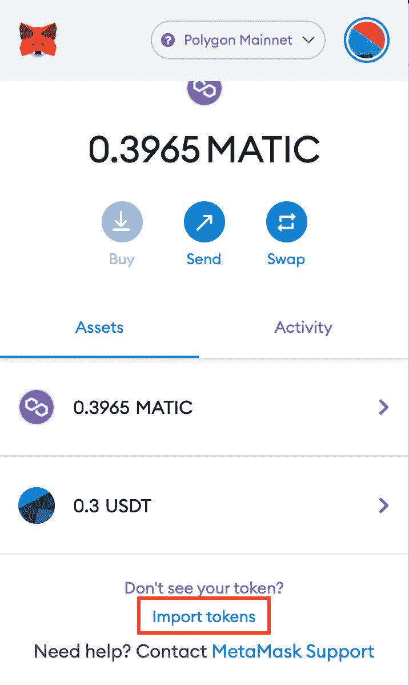
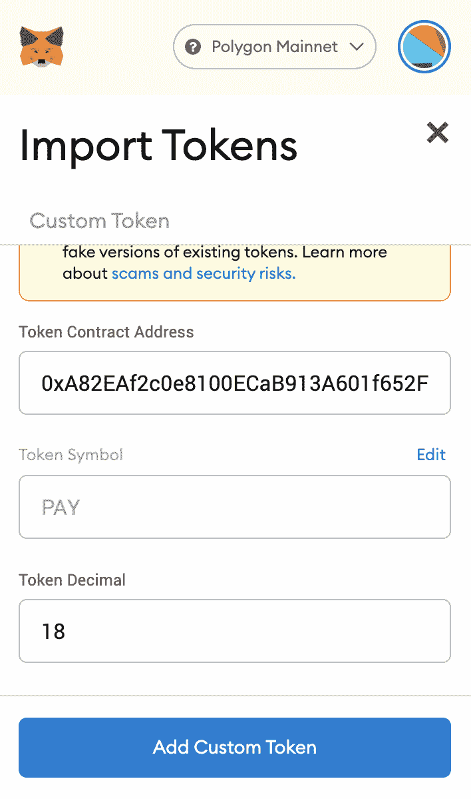
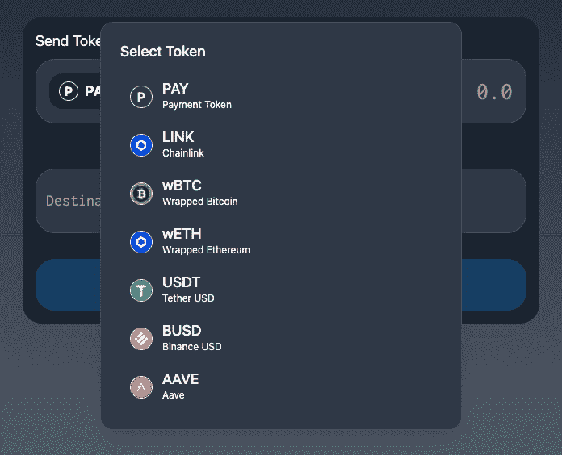

# polygon/polygon-peer-to-peer-payment-dapp-part-2

> 原文：<https://github.com/figment-networks/learn-tutorials/blob/master/polygon/polygon-peer-to-peer-payment-dapp-part-2.md>

这是关于如何创建点对点支付 dApp 的两部分教程系列的第二部分。在第一部分中，我们使用 openzappline 契约创建了一个 ERC20 令牌，并将其部署在 Polygon testnet 上。这一部分将学习如何添加其他令牌，如 USDT，BUSD 等...在多边形网络上。

在最后一部分，我们在 Polygon testnet 上部署了我们的智能契约。为了向我们的 dApp 添加更多的令牌，我们需要在 Polygon Mainnet 中提供其他可靠的令牌。因此，我们将首先将我们的支付令牌部署到 Polygon mainnet，然后在我们的 dApp 中使用 Polygon mainnet 上已经可用的其他令牌进行支付。通过这样做，我们将把 dApp 从多边形测试网转移到多边形维护网。

在开始之前，让我们看看我们的 dApp 在添加了对多个令牌的支持之后会是什么样子。

[](https://github.com/figment-networks/learn-tutorials/raw/master/assets/payment-gateway-part-2.gif)

# 先决条件

要成功完成本教程，您需要了解 ERC20 令牌、前端框架的基础知识(在我们的例子中是 NextJS)，并且您需要完成本教程的第一部分，网址为[https://learn . figment . io/tutorials/peer-to-peer-payment-on-polygon-part-1](https://learn.figment.io/tutorials/peer-to-peer-payment-on-polygon-part-1)。

# 要求

*   元掩码-您将需要一个配置了多边形 mainnet 的元掩码钱包来部署我们的智能合约并使用我们的 dApp。
*   Figment Datahub API -我们将使用 Datahub 的 Polygon Mainnet RPC URL 来部署智能合同。

# 将智能合同部署到 Polygon Mainnet

为了部署我们的契约，我们需要 Datahub 的 Polygon Mainnet RPC URL。您可以从 Datahub 的仪表板中找到所有多边形 URL。

打开`truffle-config.js`并将`mainnet`配置添加到配置的网络部分。

```js
...
networks: {
    development: {
      host: "localhost",
      port: 7545,
      network_id: "*",
    },
    matic: {
      provider: () =>
        new HDWalletProvider(
          mnemonic,
          `https://matic-mumbai--rpc.datahub.figment.io/apikey/${process.env.DATAHUB_POLYGON_API}/`
        ),
      network_id: 80001,
      confirmations: 2,
      timeoutBlocks: 200,
      skipDryRun: true,
      chainId: 80001,
    },
    mainnet: {
      provider: () =>
        new HDWalletProvider(
          mnemonic,
          `https://matic-mainnet--jsonrpc.datahub.figment.io/apikey/${process.env.DATAHUB_POLYGON_API}/`
        ),
      network_id: 137,
      confirmations: 2,
      timeoutBlocks: 200,
      skipDryRun: true,
      chainId: 137,
    },
...
```

*注意*:由于我们要部署到 mainnet，我们的账户中需要至少 0.01 MATIC token 来支付部署汽油费。这些 MATIC 令牌与我们在 testnet 上使用的令牌不同，我们无法从 Polygon 水龙头获得这些令牌。水龙头仅用于 testnet 令牌。要在 Polygon mainnet 上获得自动令牌，您需要从交易所购买令牌，并将这些令牌转移到您的元掩码钱包中。

要将协定部署到 mainnet，请运行以下命令。

```js
truffle deploy --network mainnet --reset 
```

Truffle 将在 Polygon mainnet 上部署合同，由于我们已经将`10000 PAY`令牌发送到部署合同的地址，我们应该已经在钱包中收到了`10000 PAY`令牌。

# 将支付令牌添加到元掩码

向元掩码添加自定义标记非常简单；您需要的只是令牌合同地址。支付令牌的合同地址可以从`truffle deploy`命令的输出或者从`abis/PaymentToken.json`文件的网络部分获取。

打开 Metamask，并确保连接到多边形 mainnet 网络。在“assets”部分，单击“Import tokens”按钮，粘贴您尝试添加的令牌的合同地址，在我们的示例中是支付令牌的地址。如果令牌地址正确，元掩码将自动从合同中获取令牌符号和令牌小数。

[](https://github.com/figment-networks/learn-tutorials/raw/master/assets/metamask-import-token.jpg)

[](https://github.com/figment-networks/learn-tutorials/raw/master/assets/metamask-import-token-form.png)

# 为多令牌添加逻辑

在我们开始学习上一篇教程中创建的`DataContext`之前，我们需要给我们的 NextJS 应用程序添加几个依赖项。启动终端并运行以下命令:

```js
yarn add @maticnetwork/meta @headlessui/react 
```

`@maticnetwork/meta`是 maticnetwork 团队为获取与多边形网络相关的静态内容而创建的官方包。这包括默认的 RPC URLs 和由 maticnetwork 部署的所有令牌(Polygon、ERC20、TESTERC20 等)的契约地址..)以及默认 ERC20 令牌的 ABI。由于我们在 dApp 中添加了多个 ERC20 令牌，并且通常所有的 ERC20 令牌都具有相同的 ABI，因此在进行标准呼叫(如`balanceOf`和`transfer`)时，我们可以使用`@maticnetwork/meta`包中的 ABI。

是一个无样式的、完全可访问的 UI 组件，旨在与 Tailwind CSS 集成。

先从修改`DataContext.tsx`开始。用下面的代码替换`DataContext`的导入和接口。

```js
declare let window: any;
import Network from "@maticnetwork/meta/network";
import { createContext, useContext, useState } from "react";
import Web3 from "web3";

interface DataContextProps {
  account: string;
  loading: boolean;
  loadWallet: () => Promise<void>;
  sendPayment: ({
    amount,
    toAddress,
  }: {
    amount: any;
    toAddress: any;
  }) => Promise<any>;
  balance: number;
  selectedToken: Token;
  updateSelectedToken: (token: Token) => void;
}
```

您会注意到，我们已经删除了对`PaymentToken` ABI 的导入，因为我们将对来自`@maticnetwork/meta/network`的 ERC20 令牌使用 ABI。在界面中，我们增加了两个新变量，`selectedToken`和`updateSelectedToken`。

在`useProviderData`中，用以下代码替换状态变量:

```js
  const [loading, setLoading] = useState(true);
  const [account, setAccount] = useState<string>();
  const [balance, setBalance] = useState<number>();
  const [selectedToken, setSelectedToken] = useState<Token>(tokensList[0]);
  const [erc20Abi, setErc20Abi] = useState<any>();
```

我们移除了`paymentToken`变量，并添加了两个新变量`selectedToken`和`erc20Abi`。`selectedToken`将包含用户选择进行支付的当前令牌，而`erc20Abi`将拥有标准 ERC20 令牌的 ABI json。

现在，用下面的代码更新`loadWallet`函数:

```js
  const loadWallet = async () => {
    if (window.ethereum) {
      const network = new Network("mainnet", "v1");
      const ERC20ABI = network.abi("ERC20");
      setErc20Abi(ERC20ABI);

      window.web3 = new Web3(window.ethereum);
      await window.ethereum.enable();
      const web3 = window.web3;
      window.ethereum.on("accountsChanged", function (accounts) {
        loadWallet();
      });
      var allAccounts = await web3.eth.getAccounts();
      setAccount(allAccounts[0]);

      var paymentTokenInstance = new web3.eth.Contract(
        ERC20ABI,
        "0xA82EAf2c0e8100ECaB913A601f652F7C4151c549"
      );
      var bal = await paymentTokenInstance.methods
        .balanceOf(allAccounts[0])
        .call();
      setBalance(bal);

      setLoading(false);
    } else {
      window.alert("Non-Eth browser detected. Please consider using MetaMask.");
    }
  };
```

我们创建一个`Network`的实例并从中获取 ERC20 ABI，然后设置状态变量`erc20Abi`。接下来，我们从 metamask 获取帐户，并获得该帐户的`Pay`令牌余额。为了获得余额，我们使用`ERC20ABI`和来自 Polygon mainnet 的合同地址创建了一个`paymentToken`的实例，并调用`balanceOf`方法来获得用户地址的当前余额。

我们来更新一下`sendPayment`函数。

```js
  const sendPayment = async ({ amount, toAddress }) => {
    try {
      var amountInDecimal;
      if (selectedToken.decimals === 18) {
        amountInDecimal = window.web3.utils.toWei(amount, "ether");
      } else {
        amountInDecimal = amount * Math.pow(10, selectedToken.decimals);
      }
      var tokenContract = new window.web3.eth.Contract(
        erc20Abi,
        selectedToken.address
      );

      var bal = await tokenContract.methods.balanceOf(account).call();
      if (bal < amountInDecimal) {
        return "You don't have enough balance";
      }
      const txHash = await tokenContract.methods
        .transfer(toAddress, amountInDecimal)
        .send({
          from: account,
        });
      setTimeout(async () => {
        var bal = await tokenContract.methods.balanceOf(account).call();
        setBalance(bal);
      }, 2000);
      return "Payment success";
    } catch (e) {
      return e.message;
    }
  };
```

为了进行支付，我们必须将用户输入的金额转换为各自的小数位数。我们还没有定义令牌列表和该令牌的小数位数。如果代币有 18 位小数，那么我们可以直接使用`web3.utils.toWei(amount, "ether")`来转换金额，但是在某些情况下，像只有 6 位小数的稳定币，我们就不能使用`toWei,`，我们必须手动转换金额。所以在`sendPayment`中，我们首先检查小数，然后将金额转换成小数。

接下来，我们创建所选令牌合约的实例，并检查当前帐户的余额。如果余额少于请求转账的金额，我们将返回错误字符串。如果金额有效，那么我们调用 ERC20 契约的`transfer`方法，从当前帐户向用户输入的地址进行交易。

转账完成后，我们创建一个 2 秒钟的超时，并获取所选令牌的更新余额。添加 2 秒延迟是为了补偿事务中发生的任何延迟。

在继续之前，让我们为代币创建一个界面，并创建一个代币列表，用户可以从中选择进行支付。在`DataContext.tsx`中，在`useProviderData`函数后添加以下代码。

```js
export interface Token {
  name: string;
  symbol: string;
  address: string;
  logo: string;
  decimals: number;
}

export const tokensList: Token[] = [
  {
    name: "Payment Token",
    symbol: "PAY",
    address: "0xA82EAf2c0e8100ECaB913A601f652F7C4151c549",
    logo: "",
    decimals: 18,
  },
  {
    name: "Chainlink",
    symbol: "LINK",
    address: "0x53E0bca35eC356BD5ddDFebbD1Fc0fD03FaBad39",
    logo: "https://gemini.cimg/currencies/icons/default/link.svg",
    decimals: 18,
  },
  {
    name: "Wrapped Bitcoin",
    symbol: "wBTC",
    address: "0x1BFD67037B42Cf73acF2047067bd4F2C47D9BfD6",
    logo: "https://raw.githubusercontent.com/trustwallet/assets/master/blockchains/ethereum/assets/0x2260FAC5E5542a773Aa44fBCfeDf7C193bc2C599/logo.png",
    decimals: 8,
  },
  {
    name: "Wrapped Ethereum",
    symbol: "wETH",
    address: "0x7ceB23fD6bC0adD59E62ac25578270cFf1b9f619",
    logo: "https://gemini.cimg/currencies/icons/default/link.svg",
    decimals: 18,
  },
  {
    name: "Tether USD",
    symbol: "USDT",
    address: "0xc2132D05D31c914a87C6611C10748AEb04B58e8F",
    logo: "https://raw.githubusercontent.com/Uniswap/assets/master/blockchains/ethereum/assets/0xdAC17F958D2ee523a2206206994597C13D831ec7/logo.png",
    decimals: 6,
  },
  {
    name: "Binance USD",
    symbol: "BUSD",
    address: "0xdAb529f40E671A1D4bF91361c21bf9f0C9712ab7",
    logo: "https://raw.githubusercontent.com/Uniswap/assets/master/blockchains/ethereum/assets/0x4Fabb145d64652a948d72533023f6E7A623C7C53/logo.png",
    decimals: 6,
  },
  {
    name: "Aave",
    symbol: "AAVE",
    address: "0xD6DF932A45C0f255f85145f286eA0b292B21C90B",
    logo: "https://gemini.cimg/currencies/icons/default/aave.svg",
    decimals: 18,
  },
];
```

我们已经创建了一个名为`Token`的接口，其中包含了名称、符号、地址、徽标图像 URL 和该令牌的小数位数。接下来，我们创建了`tokenList`，它包含了多边形 mainnet 网络上的一些标准令牌。您可以从[多边形令牌映射器](https://mapper.matic.today/)站点获得所有令牌的合同地址和基本信息。

在`DataContext`中要做的最后一件事是创建一个函数来更新`selectedToken`。在`useProviderData`中添加以下代码:

```js
  const updateSelectedToken = async (token: Token) => {
    var tokenContract = new window.web3.eth.Contract(erc20Abi, token.address);
    var bal = await tokenContract.methods.balanceOf(account).call();
    setBalance(bal);
    setSelectedToken(token);
  };
```

当用户从 UI 更改令牌时，我们需要获取该令牌的余额，并设置余额来更新 UI。

# 更新用户界面

我们将为令牌选择 UI 创建一个模型，用户可以使用它在令牌之间快速切换。为了创建 UI，我们将使用`@headlessui/react`。在 components 文件夹中创建一个文件`TokenModal.tsx`，并粘贴下面的代码。

```js
import { Dialog, Transition } from "@headlessui/react";
import React, { Fragment } from "react";
import { tokensList, useData } from "../contexts/DataContext";

interface TokensModalProps {
  isOpen: boolean;
  closeModal: () => void;
  openModal: () => void;
}

const TokensModal: React.FC<TokensModalProps> = ({
  children,
  closeModal,
  isOpen,
}) => {
  const { updateSelectedToken } = useData();
  return (
    <>
      {children}
      <Transition appear show={isOpen} as={Fragment}>
        <Dialog
          as="div"
          className="fixed inset-0 z-10 overflow-y-auto"
          onClose={closeModal}
        >
          <div className="min-h-screen px-4 text-center">
            <Transition.Child
              as={Fragment}
              enter="ease-out duration-300"
              enterFrom="opacity-0"
              enterTo="opacity-100"
              leave="ease-in duration-200"
              leaveFrom="opacity-100"
              leaveTo="opacity-0"
            >
              <Dialog.Overlay className="fixed inset-0" />
            </Transition.Child>

            {/* This element is to trick the browser into centering the modal contents. */}
            <span
              className="inline-block h-screen align-middle"
              aria-hidden="true"
            >
              &#8203;
            </span>
            <Transition.Child
              as={Fragment}
              enter="ease-out duration-300"
              enterFrom="opacity-0 scale-95"
              enterTo="opacity-100 scale-100"
              leave="ease-in duration-200"
              leaveFrom="opacity-100 scale-100"
              leaveTo="opacity-0 scale-95"
            >
              <div className="inline-block w-full max-w-md p-6 my-8 overflow-hidden text-left align-middle transition-all transform bg-gray-700 border border-gray-600 shadow-xl rounded-2xl">
                <Dialog.Title
                  as="h3"
                  className="text-lg font-medium leading-6 text-white"
                >
                  Select Token
                </Dialog.Title>
                <div className="flex flex-col mt-4 space-y-1">
                  {tokensList.map((item) => {
                    return (
                      <div
                        className="flex flex-row items-center space-x-3 hover:bg-gray-600 py-2 px-3 rounded-2xl cursor-pointer"
                        onClick={() => {
                          updateSelectedToken(item);
                          closeModal();
                        }}
                      >
                        {item.logo ? (
                          
                        ) : (
                          <div className="w-7 h-7 border rounded-full text-white flex justify-center items-center font-bold">
                            {item.symbol[0]}
                          </div>
                        )}
                        <div className="flex flex-col">
                          <span className="text-lg leading-5 font-medium text-white">
                            {item.symbol}
                          </span>
                          <span className="text-xs leading-5 text-white">
                            {item.name}
                          </span>
                        </div>
                      </div>
                    );
                  })}
                </div>
              </div>
            </Transition.Child>
          </div>
        </Dialog>
      </Transition>
    </>
  );
};

export default TokensModal;
```

我们正在迭代`tokenList`并创建一个令牌列表供用户选择。当用户点击任何令牌时，我们将从`useData`上下文中调用`updateSelectedToken`并传入用户点击的令牌，然后关闭模态。你可以参考[这个网站](https://headlessui.dev/react/dialog)来了解更多关于 headlessUI 的情态动词。

这是模态的样子:

[](https://github.com/figment-networks/learn-tutorials/raw/master/assets/tokens-modal.png)

现在我们已经完成了模态按钮，让我们更新我们的`index.tsx`来用模态按钮替换**支付令牌**。

在`index.tsx`中，替换为:

```js
<div className="px-3 py-2 bg-gray-800 rounded-2xl flex flex-row items-center">
  <span className="text-white text-lg font-bold">
    PAY Token
  </span>
</div>
```

有了这个:

```js
<TokensModal
closeModal={closeModal}
isOpen={isOpen}
openModal={openModal}
>
  <div
    className="px-3 py-2 bg-gray-800 rounded-2xl flex flex-row items-center cursor-pointer"
    onClick={openModal}
  >
    {selectedToken.logo ? (
      
    ) : (
      <div className="w-6 h-6 border rounded-full text-white flex justify-center items-center font-bold">
        {selectedToken.symbol[0]}
      </div>
    )}
    <span className="text-white text-lg font-bold mx-2">
      {selectedToken.symbol}
    </span>
    <svg
      xmlns="http://www.w3.org/2000/svg"
      className="h-5 w-5"
      viewBox="0 0 20 20"
      fill="white"
    >
      <path
        fillRule="evenodd"
        d="M5.293 7.293a1 1 0 011.414 0L10 10.586l3.293-3.293a1 1 0 111.414 1.414l-4 4a1 1 0 01-1.414 0l-4-4a1 1 0 010-1.414z"
        clipRule="evenodd"
      />
    </svg>
  </div>
</TokensModal>
```

这里没有显示按钮，而是创建了一个打开模态的按钮。在按钮上，我们正在显示选定的令牌符号和令牌徽标。如果令牌徽标不可用，我们将显示第一个令牌字母作为占位符。

现在我们需要更新显示平衡的方式。之前，我们只显示支付令牌余额，它有 18 位小数，我们可以轻松地使用`Web3.utils.fromWei`来显示余额，但现在我们有了一些具有不同十进制值的令牌，我们需要更新代码。

替换此代码:

```js
{balance &&
  `Balance: ${Web3.utils.fromWei(
 balance.toString(),
 "ether"
 )} PAY`}
```

有了这个:

```js
{balance &&
  `Balance: ${
 selectedToken.decimals === 18
 ? Web3.utils.fromWei(balance.toString(), "ether")
 : balance / Math.pow(10, selectedToken.decimals)
 } ${selectedToken.symbol}`}
```

现在剩下的最后一件事是打开和关闭模态的方法。在`Home`组件中创建以下状态变量和函数。

```js
  let [isOpen, setIsOpen] = useState(false);

  function closeModal() {
    setIsOpen(false);
  }

  function openModal() {
    setIsOpen(true);
  }
```

源代码可在[这里](https://github.com/viral-sangani/polygon-peer-to-peer-payment)获得。

# 结论

祝贺你完成了本教程的第 2 部分。感谢您抽出时间来完成它。在本教程中，我们学习了如何在我们的支付 dApp 中添加多令牌支持。

继续在 Web3 上构建。

# 关于作者

我是 Viral Sangani，一个致力于区块链项目的技术爱好者&热爱 Web3 社区。请随时在 [Github](https://github.com/viral-sangani) 上与我联系。