# solana/How-to-build-unique-generative-NFTs-on-Solana

> 原文：<https://github.com/figment-networks/learn-tutorials/blob/master/solana/How-to-build-unique-generative-NFTs-on-Solana.md>

生成 NFT 是密码领域蓬勃发展的趋势之一。艺术家或对这一新趋势充满热情的人正在创造他们的生殖 NFT 系列。生成式 NFT 的集合是由算法创建的一组 NFT。该系列中的每一款 NFT 都由不同的组件组合而成。Creator 为算法设计并提供这些组件。

在本教程中，您将学习在索拉纳区块链上创建创成式 NFT 集合和铸造机器。

首先，您将使用算法生成您的 NFT 收藏，然后使用 metaplex 将它们上传到 arweave，最后，您将为用户创建一个市场来铸造您的 NFT。可以参考 [pixelape.art](https://pixelape.art/#/) 作为最终结果的例子。

# 先决条件

基本熟悉 JavaScript 和 JSON。

# 要求

*   GitHub 的一个账户
*   建议使用代码编辑器 [VS 代码](https://code.visualstudio.com/Download)
*   你需要安装 git
*   你需要安装 Solana CLI
*   您需要安装 [NodeJS(v14.18.1+)](https://nodejs.org/en/download/)
*   您将需要安装[终端服务节点](https://www.npmjs.com/package/ts-node#installation)
*   你需要安装[纱线](https://classic.yarnpkg.com/en/docs/install)
*   您将需要安装[虚拟扩展](https://phantom.app/)

# 准备工具

要在 Solana 上成功发布您的系列，您需要经历三个步骤:

1.  使用 hashlips art 引擎生成您的独特 NFT 集合
2.  使用 megaplex 将该系列上传至 airweave
3.  使用 Metaplex“糖果机”为该系列创建商店

我们将在教程的后面更详细地介绍这些工具。首先，您需要在桌面上创建一个空文件夹来包含项目文件。然后将这些存储库克隆到该项目文件夹中(在本教程末尾的参考资料部分也提供了链接)。

在你的桌面上打开一个终端。然后运行下面的命令创建一个文件夹:

```js
mkdir my-generative-nfts 
```

并通过运行`cd my-generative-nfts`将当前工作目录导航到该文件夹。

现在对克隆存储库分别运行以下命令:

```js
git clone https://github.com/HashLips/hashlips_art_engine
git clone https://github.com/metaplex-foundation/metaplex 
```

# 设置 Solana CLI

要确保安装了 Solana CLI，请在终端中运行命令`solana --version`。如果它显示版本，则说明安装了 Solana CLI。否则，你需要[使用 Solana 提供的安装工具](https://docs.solana.com/cli/install-solana-cli-tools#use-solanas-install-tool)。

```js
$ solana --version
solana-cli <version installed in your machine> 
```

要查看 Solana CLI 使用的当前配置细节，您可以在终端中运行命令`solana config get`:

```js
$ solana config get
Config File: /home/<your username>/.config/solana/cli/config.yml
RPC URL: https://api.mainnet-beta.solana.com
WebSocket URL: wss://api.mainnet-beta.solana.com/ (computed)
Keypair Path: /home/<your username>/.config/solana/id.json
Commitment: confirmed 
```

 **<您的用户名>** 将是您本地机器上当前登录用户的用户名。在以下所有输出和命令中，您应该看到或使用您自己的用户名。
如果你不知道自己的用户名，运行`whoami`命令查看。

要将默认网络更改为 **devnet** ，请使用`solana config set --url devnet`:

```js
$ solana config set --url devnet
Config File: /home/<your username>/.config/solana/cli/config.yml
RPC URL: https://api.devnet.solana.com
WebSocket URL: wss://api.devnet.solana.com/ (computed)
Keypair Path: /home/<your username>/.config/solana/id.json
Commitment: confirmed 
```

然后通过运行以下命令创建一个钱包:

```js
solana-keygen new --outfile ~/.config/solana/devnet.json 
```

终端提示信息如下:

```js
$ solana-keygen new --outfile ~/.config/solana/devnet.json
Generating a new keypair

For added security, enter a BIP39 passphrase

NOTE! This passphrase improves security of the recovery seed phrase NOT the
keypair file itself, which is stored as insecure plain text

BIP39 Passphrase (empty for none): 
```

您可以输入密码，但请确保将输入的密码保存在安全的地方，因为如果您忘记了密码，您将无法恢复您的钱包。

```js
Wrote new keypair to /home/<your username>/.config/solana/temp.json
===================================================================
pubkey: dgFgNJo6ietb5Vm7XKbjuPj3LtxRMCuHgUM39zL6xDt
===================================================================
Save this seed phrase and your BIP39 passphrase to recover your new keypair:
<here will be your 12 word seed phrase you can recover your wallet with>
=================================================================== 
```

在任何情况下，您都不应该共享您的种子短语。

然后在 Solana CLI 中将此新钱包设置为默认钱包:

```js
solana config set --keypair /home/<your username>/.config/solana/devnet.json 
```

```js
$ solana config set --keypair /home/<your username>/.config/solana/devnet.json
Config File: /home/<your username>/.config/solana/cli/config.yml
RPC URL: https://api.devnet.solana.com
WebSocket URL: wss://api.devnet.solana.com/ (computed)
Keypair Path: /home/<your username>/.config/solana/devnet.json
Commitment: confirmed 
```

最后，空投一些溶胶到你的新钱包里:`solana airdrop 5`

```js
$ solana airdrop 5
Requesting airdrop of 5 SOL

Signature: <transaction signature>

5 SOL 
```

并检查是否成功:`solana balance`

```js
$ solana balance
5 SOL 
```

## 将新钱包添加到虚拟

在教程的后面，你将连接幻影到你的 NFT 铸造 dApp 来铸造一些 NFT。让我们将您刚刚为 devnet 创建的钱包添加到 Phantom 中。我们可以通过运行`solana config get`来查看钱包的路径:

```js
$ solana config get
Config File: /home/<your username>/.config/solana/cli/config.yml
RPC URL: https://api.devnet.solana.com
WebSocket URL: wss://api.devnet.solana.com/ (computed)
Keypair Path: /home/<your username>/.config/solana/devnet.json
Commitment: confirmed 
```

复制终端中显示的 Keypair 路径:"/home/ <your username="">/。config/solana/devnet.json "</your>

接下来，运行下面的命令在您的终端中打印`devnet.json`文件的内容——这将是一个数组:

```js
$ cat /home/<your username>/.config/solana/devnet.json 
```

现在，您需要在浏览器中打开 Phantom wallet 扩展。从左侧的汉堡菜单中，点击“添加/连接钱包”:

[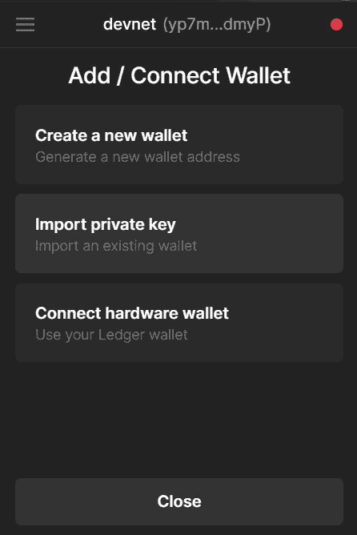](https://raw.githubusercontent.com/figment-networks/learn-tutorials/master/assets/import_private_key_in_phantom_screen_shot.jpg?raw=true)

然后选择一个名称并复制粘贴私钥:

[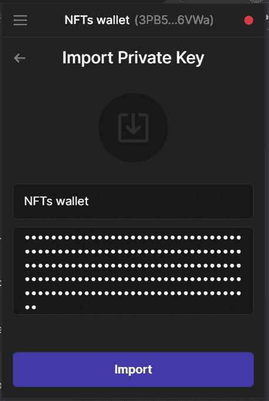](https://raw.githubusercontent.com/figment-networks/learn-tutorials/master/assets/linking_NFTs_wallet_in_phantom_screenshot.jpg?raw=true)

由于您将使用 **devnet** ，您需要在虚拟钱包设置中将网络设置为 **devnet** 。单击齿轮图标，然后单击“更改网络”，然后单击“发展网络”:

[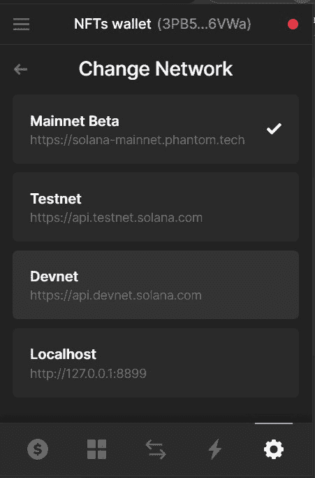](https://raw.githubusercontent.com/figment-networks/learn-tutorials/master/assets/changing_the_network_from_mainnet_to_devnet_screenshot.jpg?raw=true)

# 生成 NFT

创成式 NFT 收藏中的每个 NFT 都是不同层的组合。每一层定义了 NFT 的一部分。例如，如果我们的系列是关于人脸的，那么层可以是:

*   发型
*   毛色
*   眼睛颜色
*   眼睛大小
*   背景

对于每一层，集合的创建者可以设计不同的变体。例如对于背景，创建者可以提供不同的颜色作为背景。

当创建像 10，000 个 NFT 那样大的 NFT 集合时，期望集合的创建者像在小集合中那样创建所有这些独特的 NFT 是没有效率的。

这就是我们需要一个算法，使用提供的层，并创建独特的 NFT 资产。Hash lips art engine 就是为此而打造的开源引擎。如果我们为我们的集合提供唯一的分类层，引擎保证 NFT 是唯一的。

在本教程中，我们将创建一个非常简单的层集，给你一个关于它们的想法。您可能希望在这一步花费更多时间，并在图层中提供更多细节。

## 创建层

你可以使用任何工具，比如 photoshop 或者类似的工具来创建你的图层，但是要确保将要放在其他图层上面的图层有一个透明的背景。这里有一些我用画图软件创建的简单图层！

背景:

[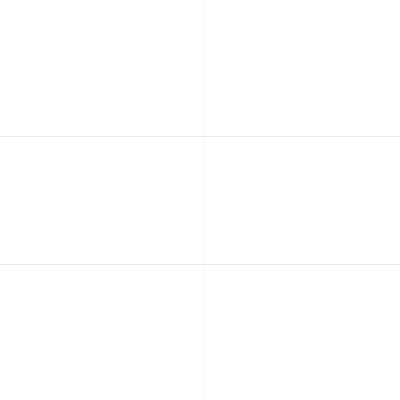](https://raw.githubusercontent.com/figment-networks/learn-tutorials/master/assets/background1.png?raw=true)

[](https://raw.githubusercontent.com/figment-networks/learn-tutorials/master/assets/background2.png?raw=true)

圆圈:

[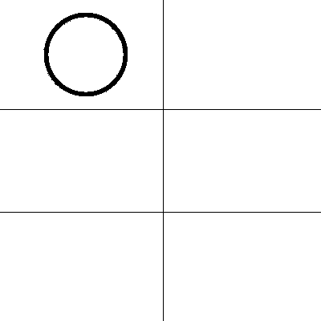](https://raw.githubusercontent.com/figment-networks/learn-tutorials/master/assets/circle1.png?raw=true)

[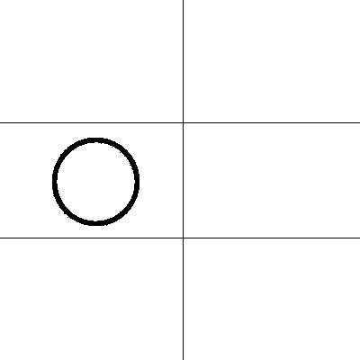](https://raw.githubusercontent.com/figment-networks/learn-tutorials/master/assets/circle2.png?raw=true)

[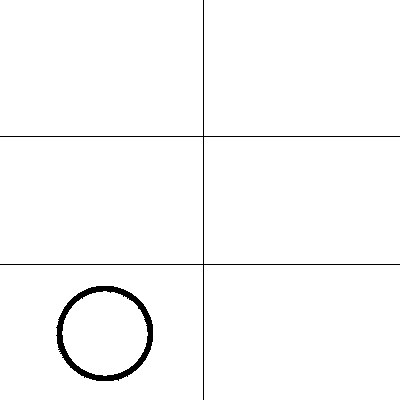](https://raw.githubusercontent.com/figment-networks/learn-tutorials/master/assets/circle3.png?raw=true)

三角形:

[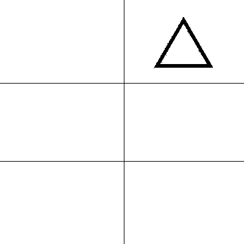](https://raw.githubusercontent.com/figment-networks/learn-tutorials/master/assets/triangle1.png?raw=true)

[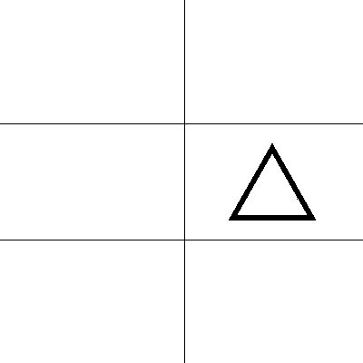](https://raw.githubusercontent.com/figment-networks/learn-tutorials/master/assets/triangle2.png?raw=true)

[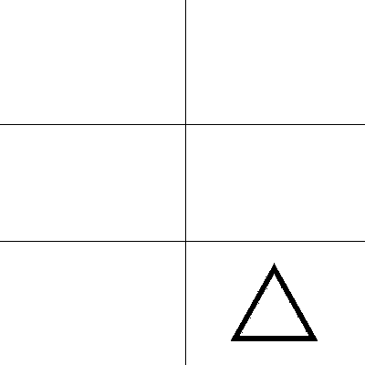](https://raw.githubusercontent.com/figment-networks/learn-tutorials/master/assets/triangle3.png?raw=true)

所以现在我有 3 层，总共 8 个特征。您可以从本教程末尾参考资料部分的链接中下载这些图层。

## 组织图层

在 hashlips 引擎中，我们可以指定一个特征在一组特征中的稀有性。为此，我们在资产文件名的末尾添加一个`#`和一个百分比。例如，如果我们想让**background2.png**出现 80%的时间，我们会将其重命名为`background2#80.png`。对于另一个背景，它将出现 20%的时间(80 + 20 = 100)，所以我们将它重命名为`background1#20.png`。

因此，对于每一层(背景、三角形或圆形)，我们指定特征的稀有程度。稀有百分比的总和应始终等于 100。这里有一个例子:

*   背景

    *   `background1#50.png`
    *   `background2#50.png`
*   三角形

    *   `triangle1#30.png`
    *   `triangle2#40.png`
    *   `triangle3#30.png`
*   环

    *   `circle1#30.png`
    *   `circle2#40.png`
    *   `circle3#30.png`

下一步是将我们的图层放到**图层**文件夹中。导航到我们在本教程开始时克隆的 hashlips 子模块中的 layers 目录，然后删除现有的文件夹及其内容:

```js
cd hashlips_art_engine/layers
rm -rf * 
```

完成后，创建三个新文件夹，以我们将要使用的图层命名:背景、圆形和三角形(确保第一个字母大写！).接下来，将图像复制到它们各自的目录中，并重命名文件以包含稀有百分比(如果您还没有这么做的话)。

## 设置发动机

我们需要设置与我们的集合相关的元数据，比如集合的所有者或集合的名称。为此，我们需要打开`hashlips_art_engine/src/config.js`文件。让我们一步一步地浏览这个文件中的代码，并配置我们的 NFT 集合。

这部分代码导入了一些内部变量和模块，你不需要去碰它。

```js
const basePath = process.cwd();
const { MODE } = require(`${basePath}/constants/blend_mode.js`);
const { NETWORK } = require(`${basePath}/constants/network.js`);
```

**网络**:要部署到 Solana，我们必须将目标网络从 eth 更改为 sol:

```js
const network = NETWORK.sol;
```

在这里你可以为你的收藏指定名称和描述——忽略以太坊的注释。您也可以忽略 baseUri。

```js
// General metadata for Ethereum
const namePrefix = "Triangle and Circle";
const description = "Unique combinatons of a Circle and a Triangle with two backgrounds";
const baseUri = "ipfs://NewUriToReplace";
```

在这里，我们设置了特定于 Solana NFTs 的元数据。

**符号**:在符号中，您可以设置收藏名称的缩写。我选择了名字中单词的第一个字母。

**seller_fee_basis_points** :该参数指定创作者希望从其 NFTs 的未来销售中获得的份额。每个点是 0.01%，所以如果一个创作者想从他们收藏的未来交易中赚取 1%，他们应该把它设置为 100 点。该参数也称为版税百分比。

**external_url** :如果收藏有网站或者 YouTube 频道或者相关的链接，可以放在这里。

**创造者**:在此字段，您可以指定创造者之间的利润分成。如果只有一个创建者，那么您可以将他们的公钥放在**地址**字段中，并将**份额**字段设置为 100(代表 100%)。

如果集合中有多个创建者，您可以在所有其他创建者的 **creators** 数组中添加一个类似的对象，并设置他们的份额和 Solana 地址。对于此集合，我们是唯一的创建者，因此将份额设置为 100，并将我们的 Solana 地址作为地址。

作为提醒，您可以在 Phantom wallet 中查看您的 Solana 地址。

```js
const solanaMetadata = {
  symbol: "TAC",
  seller_fee_basis_points: 100, // Define how much % you want from secondary market sales 1000 = 10%
  external_url: "",
  creators: [
    {
      address: "<your solana address>",
      share: 100,
    },
		/* you can add new creators like this
 {
 address: "creator's solana address",
 share: creator's share out of 100,
 },
 */
  ],
};
```

**growEditionSizeTo** :在这部分代码中，我们指定了想要生成的 NFT 的数量。这里要考虑的一个重要因素是我们可以期望从我们提供的层中获得的最大唯一 NFT。我们有 3 个圆形，3 个三角形和 2 个背景，所以唯一的 NFT 的最大数量是 3 x 3 x 2 = 18。给定使用的层数，您可以输入等于或小于唯一 NFT 的最大可能数量的任何数字。对于本教程，1-18 之间的数字就可以了。

**层顺序**:在这个字段中，我们指定我们希望各层之间的排列顺序。因为背景是最底层，我们把它放在第一层，然后是另外两层。

```js
// If you have selected Solana then the collection starts from 0 automatically
const layerConfigurations = [
  {
    growEditionSizeTo: 5,
    layersOrder: [
      { name: "Background" },
      { name: "Circle" },
      { name: "Triangle" },
    ],
  },
];
```

我们已经完成了集合的配置，但是对于高级配置，您可以遵循下一章。

## 高级配置(可选)

**shuffler layers configuration s**:该字段用于当我们有多个层配置时。可以是真的也可以是假的。这里有一个例子:

```js
const layerConfigurations = [
	// we want 5 images with this configuration
  {
    growEditionSizeTo: 5,
    layersOrder: [
      { name: "Background" },
      { name: "Circle" },
      { name: "Triangle" },
    ],
  },

// and we want 10 images with this configuration
{
    growEditionSizeTo: 10,
    layersOrder: [
      { name: "Circle" },
      { name: "Triangle" },
      { name: "Background" },
    ],
  },
];
```

在上面的例子中，我们有两种配置。如果我们将 shuffleLayersConfigurations 字段设置为 true，引擎将不会遵循我们的配置顺序。例如，1 号图像可以由这些配置中的任何一个来创建。默认情况下，Shuffling 为 false，将按数字顺序保存所有图像(前 5 个图像使用第一个配置，然后 10 个图像使用第二个配置)。

**debugLogs** :如果您想要调试日志并查看生成图像时发生了什么，您可以将变量`debugLogs`设置为 true。默认情况下，它是 false，因此您将只能看到常规日志。

```js
const shuffleLayerConfigurations = false;

const debugLogs = false;
```

在这一部分中，您可以指定输出图像的宽度和高度，以像素为单位

```js
const format = {
  width: 512,
  height: 512,
  smoothing: false,
};
```

如果你愿意。gif 输出，可以设置`export`为 true，`repeat`为每一个中的循环数。gif 动画。

`repeat: -1`将产生一次性渲染，`repeat: 0`将永远循环。

您可以指定 gif 动画的质量。质量越高意味着文件越大。您可以在. gif 文件中指定动画开始前的延迟时间(以毫秒为单位)

```js
const gif = {
  export: false,
  repeat: 0,
  quality: 100,
  delay: 500,
};
```

如果你想改变像素的比率，你可以更新比率属性。左边的数字越小，图像的像素化程度越高。

```js
const pixelFormat = {
  ratio: 2 / 128,
};
```

如果你想添加额外的元数据到你的集合中，你可以把它放在`extraMetadata`对象中。例如:

```js
const extraMetadata = {
	creator: "<Put creator's name>"
};
```

## 生成图像

首先，您需要为这个引擎安装依赖项。打开一个终端，确保你在 **hashlips_art_engine** 目录下并运行`yarn install`。

首先，您需要安装 hashlips 引擎的依赖项。打开一个终端，确保你在`hashlips_art_engine`目录下并运行`yarn install`。

要使用您设置的层和元数据生成图像，请运行`yarn run generate`:

```js
hashlips_art_engine-main$ yarn run generate
yarn run v1.22.17
warning ../../../../../../package.json: No license field
$ node index.js
Created edition: 0, with DNA: 327303194f43b8111321be04af9aefa991021daf
Created edition: 1, with DNA: 830a7d0d732f8b676ff6349659409b5efc171513
Created edition: 2, with DNA: 2aed7015b3023e509c46dd1fb870cf40d3c8ea59
Created edition: 3, with DNA: 63c561781f810ddbecce9ca086b1c7b2dcc1a589
Created edition: 4, with DNA: 35742657abda4d22190a0761df5d0426da72ece5 
```

厉害！现在，您的图像在`hashlips_art_engine/build/images`文件夹中，它们的元数据在`hashlips_art_engine/build/json`文件夹中。看看他们！以下是我总共生成的 5 张图片:

[](https://raw.githubusercontent.com/figment-networks/learn-tutorials/master/assets/preview.png?raw=true)

在下一节中，我们将把我们的资产上传到 Arweave，我们将创建一个糖果机来铸造我们的 NFT。

# 糖果机 CLI

我们将使用 candy-machine-cli 将我们的图像上传到 Arweave，并为我们的 NFT 创建一个造币机。

## 什么是糖果机 CLI？

Candy Machine 是 Metaplex 和 Solana 开发的一个工具，用于将 NFT 资产上传到 arweave，并在 Solana 上为 NFTs 开发一个造币机程序。

在本教程中，我们将使用它来上传资产，并为我们的 NFTs 创建一个造币机。

## 什么是 Arweave？

如果你打开 Arweave 的网站，你会发现这个定义:

> Arweave 是一种新的存储类型，它以可持续和永久的天赋支持数据，允许用户和开发人员第一次真正永久地存储数据。
> 
> 作为一个永远不会忘记的集体拥有的硬盘，Arweave 允许我们无限期地记住和保存有价值的信息、应用程序和历史。通过保存历史，它防止其他人重写历史。

简而言之，Arweave 使您能够永久存储文档和应用程序。糖果机 CLI 默认上传我们的资产到 Arweave。

## 准备上传资产

首先，我们需要在之前克隆的`metaplex-master`存储库中创建一个`assets`文件夹。从`hashlips_art_engine/build/images`目录中复制所有图像并粘贴到`metaplex-master/assets`文件夹中。对来自`hashlips_art_engine/build/json`的元数据文件做同样的事情，除了`_metadata.json`文件。现在，在您的资产文件夹中，您应该有图像和元数据文件，如下所示:

*   资产
    *   0.json
    *   0.png
    *   1.json
    *   1.png
    *   2.json
    *   2.png
    *   3.json
    *   3.png
    *   4.json
    *   4.png

## 安装糖果机命令行界面

在使用 candy-machine-cli 之前，我们需要安装它的依赖项并构建一个可执行版本。为此，在`metaplex-master/js`目录中打开一个终端。要安装依赖项，请运行`yarn install`。这可能需要一些时间。您已经完成了 candy-machine-cli 的安装，可以使用`cd ..`返回 Metaplex 项目目录

# 上传到 Arweave

要将我们的资产上传到 Arweave 并创建我们的糖果机，首先我们需要配置我们想要创建的糖果机。

## 配置糖果机

要配置糖果机，您需要在 metaplex 目录中创建`config.json`文件。在这个文件中，我们可以设置和定制我们的糖果机。最简单的设置可以是:

```js
{
  "price": "<price for minting>",
  "number": "<number of NFT in the Collection to be minted>",
  "gatekeeper": null,
  "solTreasuryAccount": "<your solana address>",
  "splTokenAccount": null,
  "splToken": null,
  "goLiveDate": "1 JAN 2022 00:00:00 GMT",
  "endSettings": null,
  "whitelistMintSettings": null,
  "hiddenSettings": null,
  "storage": "arweave",
  "ipfsInfuraProjectId": null,
  "ipfsInfuraSecret": null,
  "awsS3Bucket": null,
  "noRetainAuthority": false,
  "noMutable": false
}

```

在你的`config.json`中包含上面所有的变量是很重要的，因为如果你删除了一个带有`null`值的变量，你会在创建你的糖果机时得到一个错误。

`price`:指定铸造每个 NFT 的价格，单位为＄SOL`number`:集合中要铸造的 NFT 数量`gateKeeper`:由于糖果机容易受到机器人攻击，您可以设置此字段，要求用户在铸造 NFT 之前解决验证码。

```js
"gatekeeper": {
    "gatekeeperNetwork" : "ignREusXmGrscGNUesoU9mxfds9AiYTezUKex2PsZV6",
    "expireOnUse" : true
}
```

`solTreasuryAccount`:接收诉讼 SOL 付款的 SOL 钱包

`goLiveDate`:允许铸造时的时间戳

上面解释的参数是创建简单糖果机需要理解的基本参数，但这并不总是用例。也许你在期待某个特性，或者你想为你的发布设定一个结束日期，或者别的什么。为此，在这里有一份详细的文档，说明在`config.json` [中使用的不同可用变量。](https://docs.metaplex.com/candy-machine-v2/configuration)

## 上传资产并创建糖果机

在 candy machine 版本 1 中，您需要在两个独立的 cli 命令中上传资产和创建 candy machine。但是在 candy machine 版本 2 中，您可以使用以下命令来完成这两项操作:

```js
ts-node js/packages/cli/src/candy-machine-v2-cli.ts upload \
    -e devnet \
    -k /home/<your username>/.config/solana/devnet.json \
    -cp config.json \
    -c temp \
    ./assets 
```

你正在使用的环境。这里我们使用 devnet `-k`:指定到 keypair 的路径，key pair 将支付上传费用。这里我们使用在教程开始时生成的密钥对。`-cp`:糖果机配置文件`config.json` `-c`路径:缓存文件后缀。这是一个后缀，它将被添加到一个缓存文件中，该缓存文件是在创建 candy machine 并保存相关信息后生成的。`./assets`:收藏资产的文件夹路径。

在您的终端中，确保您位于 metaplex-master 目录中，然后运行命令。现在，您的糖果机创建完毕，您可以在**中创建的文件中找到关于它的所有信息和细节。缓存**文件夹。根据你选择的创建糖果机的网络，文件名会有所不同——例如，如果你已经部署在 devnet 上，文件名会是`devnet-temp`。

**<您将收藏部署到的网络名称> -temp**

例如，如果您已经在 devnet 上部署了，那么它将是 **devnet-temp** 。

```js
{
  "program": {
    "uuid": <your uuid>,
    "candyMachine": <public key for the candy machine>,
  },
  "items": {
    /*
    here you find information about each NFT item inside your 
    collection with this structure:
    // for NFT number "i" in the NFT collection

    "i" : {
      "link": <a link to the asset on the arweave>,
      "imageLink": <a link to image of the NFT on arweave>,
      "name": <name of the NFT>,
      "onChain": <true or false>
  	},
    */
  },
  "env": <network the collection is on>,
  "cacheName": <suffix has been used in filename>,
} 
```

稍后在配置糖果机 dApp 时，您将需要这些信息。让我们构建一个连接到糖果机的前端，以便用户可以铸造我们的 NFT。

# 构建前端

要为你的糖果机建立一个铸造网站，你可以使用像 react 这样的前端框架，从头开始构建一切。但是有社区锅炉板项目，提供所有的基本部分，如连接到索拉纳，连接钱包等。还有一个类似的项目“fair-launch”由 Metaplex 打造。它附带了您克隆的 Metaplex 存储库。它位于`js/packages/fair-launch`。这个项目给了我们一个基本的用户界面，我们只需要自定义它。

首先，您需要安装这个项目的所有依赖项。运行`npm install`。在启动前端本地主机之前，您需要配置项目。我们在项目目录中有一个`.env`文件，内容如下:

```js
REACT_APP_CANDY_MACHINE_ID=<your candyMachine address>
REACT_APP_SOLANA_NETWORK=devnet
REACT_APP_SOLANA_RPC_HOST=https://api.devnet.solana.com
REACT_APP_FAIR_LAUNCH_ID= 
```

*   `REACT_APP_CANDY_MACHINE_ID`这需要您的`candyMachineAddress`，从 devnet-temp.json 中复制它
*   记住取消对行`REACT_APP_SOLANA_NETWORK=devnet`和`REACT_APP_SOLANA_RPC_HOST=https://api.devnet.solana.com`的注释
*   还要注释掉行`REACT_APP_SOLANA_NETWORK=mainnet-beta`和`REACT_APP_SOLANA_RPC_HOST=https://trashpandas.rpcpool.com`，因为我们没有部署到 Mainnet-beta！
*   `REACT_APP_FAIR_LAUNCH_ID=`用于公平发布的第一阶段

要配置这个文件，我们需要使用`devnet-temp.json`文件。

在 localhost:3000 上运行我们的 dApp。

[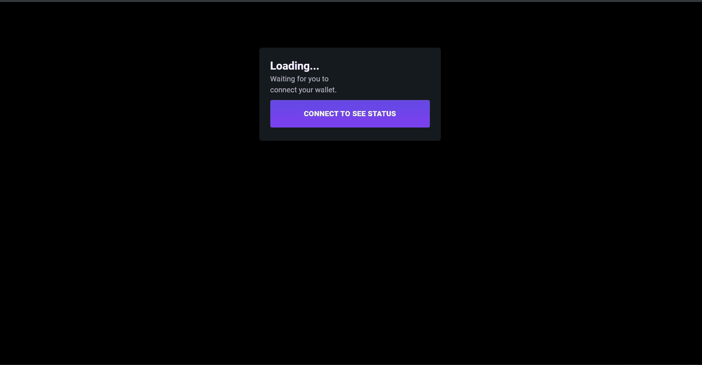](https://raw.githubusercontent.com/figment-networks/learn-tutorials/master/assets/initial_state_of_dapp_screenshot.jpg?raw=true)

你可能会问为什么我们在 devnet 上发布它，而不是在 mainnet-beta 上？！有两个原因:

1.  你可以估算在 mainnet-beta 上发布的成本
2.  您可以确保在这个过程中没有任何错误阻止您

从用户界面的角度来看，我们的应用并不是那么好。因此，让我们在下一节中为我们的应用程序添加一些样式。

# 前端造型

要定制前端，你可以随心所欲。下面是一个简单的例子，告诉你如何定制它:

用下图所示的 CSS 替换`candy-machine-mint/src/index.css`中的 CSS。这给我们的应用程序添加了一个很好的渐变背景。

```js
body {
  margin: 0;
  font-family: -apple-system, BlinkMacSystemFont, 'Segoe UI', 'Roboto', 'Oxygen',
    'Ubuntu', 'Cantarell', 'Fira Sans', 'Droid Sans', 'Helvetica Neue',
    sans-serif;
  -webkit-font-smoothing: antialiased;
  -moz-osx-font-smoothing: grayscale;
  background-color: #303030;
  color: #FFFFFF;
  background: rgb(2, 0, 36);
  background: linear-gradient(
    90deg,
    rgba(2, 0, 36, 1) 0%,
    rgba(9, 9, 121, 1) 35%,
    rgba(0, 212, 255, 1) 100%
  );
}

code {
  font-family: source-code-pro, Menlo, Monaco, Consolas, 'Courier New',
    monospace;
}
```

从资产文件夹复制粘贴`0.png`到`fair-launch/src`文件夹。

在`PhaseHeader.tsx`中首先导入您刚刚添加的`0.png`文件:

```js
import previewNFT from "./0.png"
```

然后在`Header`组件的定义中，用现有的代码替换下面的代码。这将移除状态徽章，并包含对我们 NFT 系列的描述:

```js
const { phaseName, desc, date, status } = props;
  return (
    <Grid container justifyContent="center">
      <Grid xs={12} justifyContent="center" direction="column">
        <Typography
          variant="h5"
          style={{
            fontWeight: 600,
            textAlign: 'center',
            paddingBottom: '10px',
            fontSize: '30px',
          }}
        >
          {phaseName}
        </Typography>
        <Typography variant="body1" color="textSecondary">
          {desc}
        </Typography>
      </Grid>
      <Grid xs={12} justifyContent="center" direction="column">
        <Typography
          color="textSecondary"
          style={{ padding: '1rem 0', fontSize: '20px' }}
        >
          This is a collection of 5 NFTs. Each NFT is a combination of a circle
          and a triangle with a background either red or white.
        </Typography>

        
      </Grid>
    </Grid>
  );
```

在`PhaseHeader`组件定义中，找到`phase === Phase.Unknown && !candyMachine`部分并用下面的代码替换它的代码。这将删除描述，因为您在上面的代码中添加了它，并在用户尚未连接其钱包时为该案例添加了标题。

```js
{phase === Phase.Unknown && !candyMachine && (
  <Header phaseName={'Welcome!'} desc={''} date={undefined} />
)}
```

找到`phase === Phase.Phase4`并用下面的代码替换它的代码。它指定了要在`Header`组件中使用的标题。

```js
{phase === Phase.Phase4 && (
  <Header
    phaseName="Circlangle Collection!"
    desc={''}
    date={candyMachine?.state.goLiveDate}
    status="LIVE"
  />
)}
```

现在让我们在我们好看的应用程序中创造一个 NFT 吧！

[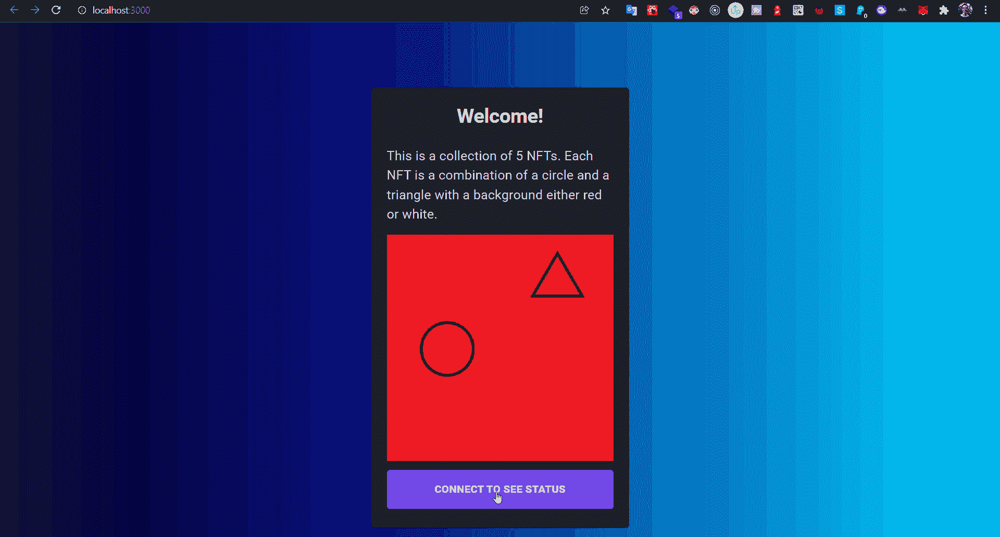](https://raw.githubusercontent.com/figment-networks/learn-tutorials/master/assets/minting_nft_on_dapp_gif.gif?raw=true)

耶，我们做到了！让我们看看我们钱包里新铸造的 NFT:

[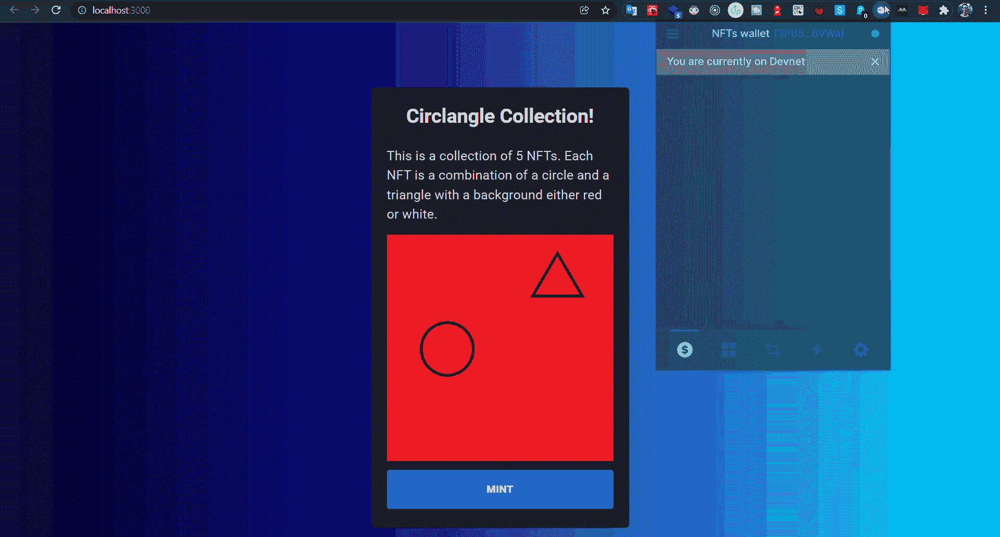](https://raw.githubusercontent.com/figment-networks/learn-tutorials/master/assets/checking_nft_in_phantom_wallet.gif?raw=true)

你可以将这个项目部署到你最喜欢的托管服务上，比如 Firebase、Vercel 或其他任何提供商。我把它部署到了 Firebase，你可以在这里查看一下，如果还有剩余的话，你可以打造自己的 NFT<g-emoji class="g-emoji" alias="wink" fallback-src="https://github.githubassets.cimg/icons/emoji/unicode/1f609.png">😉</g-emoji>。

# 启动 Mainnet-beta

您已经成功地在 devnet 上发布了您的集合，现在您已经准备好部署到 mainnet-beta 了。部署到 devnet 和 mainnet-beta 没有任何显著的区别。您需要通过运行`solana config set --url mainnet-beta`切换回 mainnet-beta。这次我们需要用真正的溶胶装满我们的钱包。你可以很容易地从像 FTX T2 这样的交易所买到一些。

生成资产的过程是一样的，因为它与您正在使用的 Solana 网络无关。

在创建糖果机并上传资产的教程中，您需要在命令中将`-e devnet`改为`-e mainnet-beta`。

为了澄清，当部署到 mainnet-beta 时，该命令看起来像这样:

```js
ts-node js/packages/cli/src/candy-machine-v2-cli.ts upload \
    -e mainnet-beta \
    -k /home/<your username>/.config/solana/devnet.json \
    -cp config.json \
    -c temp \
    ./assets 
```

很简单！

在你配置公平启动 dApp 的教程中，这一次在`.cache`文件夹中我们将有`mainnet-beta-temp`而不是`devnet-temp`，但是这两个文件的结构是相同的。因为这次我们是在 mainnet-beta 上启动，我们需要在`fair-launch`文件夹中设置`.env`文件，如下所示:

```js
REACT_APP_CANDY_MACHINE_ID=<put the candyMachineAddress here>
REACT_APP_SOLANA_NETWORK=mainnet-beta
REACT_APP_SOLANA_RPC_HOST=https://trashpandas.rpcpool.com
REACT_APP_FAIR_LAUNCH_ID= 
```

*   `REACT_APP_CANDY_MACHINE_ID`这需要你的`candyMachineAddress`，从 mainnet-beta-temp.json 复制过来
*   记住取消对行`REACT_APP_SOLANA_NETWORK=mainnet-beta`和`REACT_APP_SOLANA_RPC_HOST=https://trashpandas.rpcpool.com`的注释
*   还要注释掉行`REACT_APP_SOLANA_NETWORK=devnet`和`REACT_APP_SOLANA_RPC_HOST=https://api.devnet.solana.com`，因为我们没有部署到 devnet！
*   `REACT_APP_FAIR_LAUNCH_ID=`用于公平发布的第一阶段

这就是你在 **mainnet-beta** 上启动你的 minting dApp 需要做的所有调整。

# 结论

在本教程中，我们学习了如何创建一个独特的创成式 NFT 集合，然后为它们创建一个铸造 dApp。我们经历了以下步骤:

1.  我们设置了索拉纳 CLI。
2.  我们为 NFT 系列设计了图层。
3.  我们使用 **Hashlips 艺术引擎**从我们的层创建 NFT 资产。
4.  我们使用 Metaplex“糖果机”将 NFT 资产上传到 Arweave
5.  我们使用“公平启动”React 项目为 Metaplex“糖果机”应用程序构建了一个前端。

# 关于作者

我是网络开发人员 Mahdi Mostafavi，我正在了解 Solana。我的 GitHub:[@ mmostafi](https://github.com/mmostafavi)

如果你发现文章中有任何错误信息或者有任何改进教程的建议，你可以在 Twitter 上给我发消息: [@mahdi_ftp](http://twitter.com/mahdi_ftp) 。

# 参考

hashlips 艺术引擎:[https://github.com/HashLips/hashlips_art_engine](https://github.com/HashLips/hashlips_art_engine)

变形糖果机 V2:[(https://docs.metaplex.com/candy-machine-v2](https://docs.metaplex.com/candy-machine-v2)

https://bit.ly/3EYmc5X NFT 收藏资产: