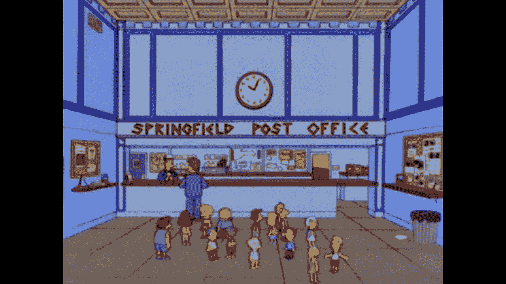
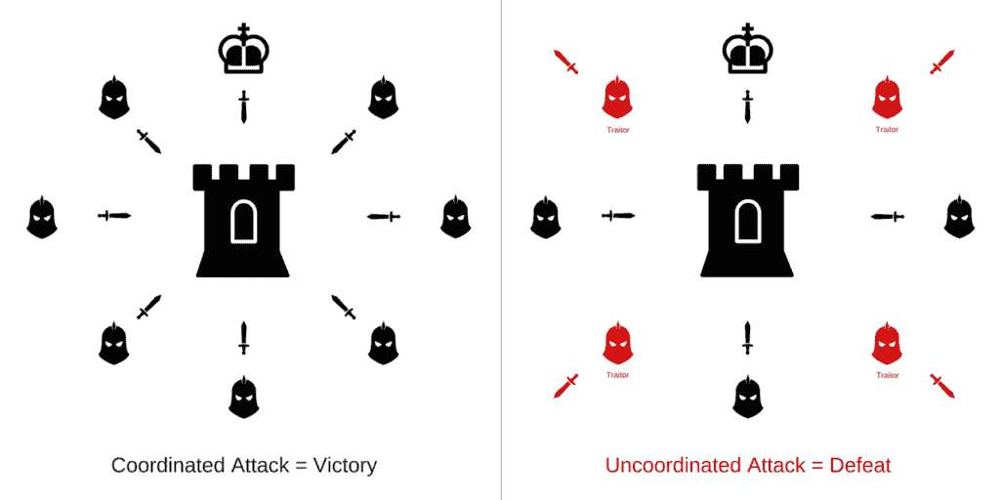
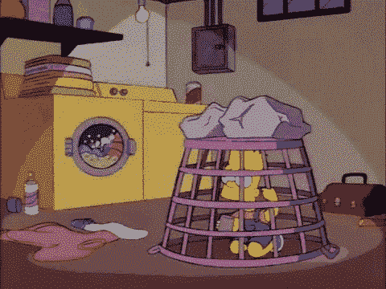
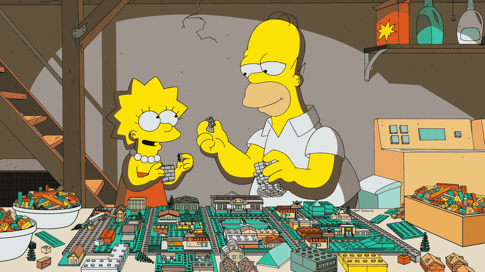
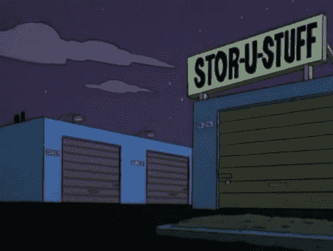

# solana/explaining-blockchain-and-solana-innovation-with-the-simpsons

> 原文：<https://github.com/figment-networks/learn-tutorials/blob/master/solana/explaining-blockchain-and-solana-innovation-with-the-simpsons.md>

# 介绍

如果你已经过了 30 岁，我打赌你一定很熟悉《辛普森一家》这部情景喜剧，对吗？

荷马，玛姬，巴特，丽莎和玛姬。

你能相信我可以用这些角色作为例子教你区块链原理和索拉纳斯的创新吗？

我们开始吧，然后你可以稍后再来评判我。

在我们进入索拉纳的八项创新之前，让我们先慢下来，了解三个核心概念，它们将帮助我们为本文打下基础。

**区块链、交易和共识。**

这个“插曲”的名字是:*“给爷爷寄信！”*

巴特、丽莎和玛吉正在给爷爷辛普森写信。他们每个人都需要在信封上写下通常的信息:寄件人，收件人，以及信封里面的内容，对吗？很简单。

像任何非匿名的普通信件一样，巴特、丽莎和麦琪需要添加两件东西。

他们需要在信上签名，然后盖章。

与普通邮票不同，这些邮票是从信件中的信息衍生而来的，因此对每个信件来说都是独一无二的。如果信件中的任何信息发生变化，戳记也会发生变化。在区块链的交易中，这个“戳”被称为散列。

这个高层次的类比解释了区块链上的**交易**。每封“信”都是一个**事务**，其中包含关于发送者、接收者、内容、签名(由您的私钥生成)、哈希(这是我们的《辛普森一家》剧集的时间戳)和一些有用的附加元数据的数据。

让我们一起继续看《辛普森一家》？

写完后，Bart、Lisa 和 Maggie 需要把他们的信寄给他们的父母(验证者)。

Homer 和 Marge 是信件(交易)的**验证者**，他们的工作是验证并同意这些信件应该有的一些要求。

如果这封信没有通过他们的确认，这封信根本不会被发送到信箱里。

验证之后，他们现在需要将信件(交易)发送到连锁邮局。

当信件(交易)到达邮局连锁店(区块链)时，邮局有许多包装工(矿工或伪造者)相互竞争将这些信件存放在自己的箱子里。

当他们的盒子装满后，他们现在需要决定将谁的盒子(在区块链中称为 block)包含到链中。这是**的概念*共识方法*T3。**

目前，我们有三种在区块链广泛使用的主要共识方法。

工作证明、利益证明和利益委托证明。

在这篇文章中，我们将探讨前两个。

在**工作证明**中，包装工被称为矿工，他们将相互竞争解决一个难题。谁先解决它，谁就有权利把他们的盒子(方块)加到链子上。

在**利害关系证明**中，包装者被称为伪造者，竞争以金钱为基础。他们将不得不把他们的硬币投进一个*“罐子”*。他们会比较谁的硬币多，那些硬币在罐子里有多长时间，以及其他一些属性。还有一个随机因素来选择其中一个，允许所有包装者(伪造者)添加它的盒子。

在这两种方法中，每个盒子(块)都必须有一个指向前一个盒子(块)的指针、一个由其内容导出的标记(散列)以及一些有用的附加元数据，才能包含到链中。

**简而言之，块是一组经过验证的事务。**

每一个新的盒子(块)都与前一个相连接。这形成了一系列盒子(块)。

这个高级类比解释了区块链中的 ***事务验证*** 和 ***共识方法*** 。

这一集教给你重要的区块链概念，比如什么是区块链，什么是交易，以及共识方法是如何工作的。

# 索拉纳的创新

## 简报

**SOLANA** 生态系统已经席卷了区块链世界，带来了一些惊人的创新，使 SOLANA 能够实现前所未有的性能和安全性。

SOLANA 还解决了区块链的三难困境:去中心化、可伸缩性和安全性。

索拉纳的创新方法分为八大支柱，我们将按照下面几页的描述来学习。

1.  历史的证明
2.  BFT 塔
3.  涡轮
4.  湾流
5.  海平面
6.  管道铺设
7.  云破
8.  档案

现在我们来看另一集。让我们直接进入索拉纳的八大创新。

## 第一次创新:历史的证明

我们已经了解了区块链现在使用的两种共识方法，对吗？在索拉纳的区块链中，我们使用利害关系证明，因为这种方法为验证者提供了一种比工作证明更民主、更公平的方式。

不幸的是，这两种方法都有一个共同的瓶颈。达成共识时验证者之间的时间同步。

索拉纳用一种预先达成共识的方法解决了这个问题，这种方法被称为历史证明。

让我们参观斯普林菲尔德并了解它。

假设 Marge 需要带 Bart 去看医生。在去特定的医疗机构之前，Marge 需要使用所有医疗机构通用的通用取号系统来证明她在特定的时间点安排了预约。

由于 Marge 现在有了一张有她号码的机票，她打电话给呼叫中心，并被告知开车到医疗机构“A”。然后她开车十分钟，直到她到达那里。

当她到达时，她注意到等候室里已经多了两个人。尽管这两个人早到了，接待员还是打电话给 Marge，要她出示预约证明(注明签发时间)。

一旦玛吉出示它，接待员允许巴特和玛吉立即进入诊所。

该系统允许所有患者按照他们的时间戳排序，而不管他们在不同时间到达医疗机构的时间。它还允许基于每个机构处理哪些患者的票的知识将他们重定向到下一个医疗机构，从而避免不必要的等待时间。

这是索拉纳的区块链的历史证明。这是一种避免不必要的等待外部参与者确认以达成共识的方式，因为有一个分散的时钟来保证事件的排序。

历史证明表示由 VDF(可验证的延迟函数)生成的唯一加密时间戳附加到交易中，这意味着每个交易本身都携带一个时间记录，记录该交易发生在特定的时间点，因此很容易验证并能够订购。

当这个交易到达验证器时，验证器不需要与任何外部源通信来知道交易何时发生，他只需要查看时间戳并订购交易，就像接待员在 Springfield 订购病人一样。每个验证器都有自己的内部“时钟”，因此避免了对外部确认的依赖。

索拉纳利害关系证明的另一个巨大优势是基于领导人选举的确定性方法。所有的验证者事先都知道谁是下一个领导者验证者。

## 第二项创新:BFT 塔

在谈到塔 BFT(又名。塔式拜占庭容错)，我们来做个快速类比，解释一下它解决的问题。

拜占庭将军的问题。

当两个以上的将军必须就进攻还是撤退达成一致意见，但只能通过派遣可能永远不会到达的信使进行沟通时，拜占庭将军问题就开始出现了。

一些将军也可能是叛徒，并试图向其他将军传播不同的信息，导致灾难性的失败。

为了避免故障或无法正常通信影响整个区块链的功能，需要实施容错系统。

塔式 BFT(塔式拜占庭容错)确保即使 1/3 的节点出现故障，区块链也能保持正常运行。

即使有 1/3 的将军妥协了，战争策略也成功地执行了，从而给军队带来了胜利。

为了避免沟通瓶颈，一旦“将军”(节点/验证者)投票支持计划“A”，他承诺至少在两轮内不会投票支持任何不是从计划“A”派生的其他计划。

每当将军们对 A 计划的衍生计划进行投票时，A 计划的权重就会翻倍，这意味着很难撤销。

但是，我们如何保证所有的将军都活着，并适当地派遣使者呢？我们如何确保他们正在转发正确的信息？

将军们发送的每一张选票都带有一小段可验证的信息，这些信息会在每次投票时更新(增加)，这意味着如果信使发送的选票缺少任何信息，该选票将被丢弃。

## 第三项创新:涡轮机

使用 Simpsons 类比，想象一下如果斯普林菲尔德邮局不是只有 5 个包装工(在链条上添加一个盒子(块))，而是有 100 个包装工，通信会被延迟。

他们需要相互沟通，将盒子(块)的副本发送给每个包装商。但有些人之间的沟通渠道可能更有限。如果他们住得很远，他们之间交流和发送副本的时间会大大增加。

这种对他们沟通渠道的限制叫做带宽。

当一个包装者关闭一个装有字母的盒子并添加到链条上时，他需要将该盒子(块)的副本发送给所有其他包装者。他们都需要有相同的结构(链)，因为下一次他们中的一个可能会被选中(领导者)来添加一个盒子(伪造块并添加到区块链)，并且因为没有盒子可以进入链而不与前一个链接，所以所有的验证器都需要在同一个页面上。

这叫做块传播。

现在，想象一下领头的打包者需要将他的盒子(块)发送给所有其他的打包者(验证者)。假设每个箱子重 128 公斤，领头的包装商将投入大量资源(时间和精力)来发送 128 公斤乘以所有包装商。这是一吨的工作！

取而代之的是，领头的包装商找到了一种方法，将一个大盒子分成 640 克的小盒子，然后将小盒子发送给他最接近的包装商(验证商)。

因为每个包装者会有一些小盒子，但不是全部，他们还需要复制他们刚刚收到的小盒子，然后重新发送/重新发送给他们最接近的包装者。这样，所有的包装工人将继续收到小盒子，就像一个难题，直到他们收到所有必要的盒子来重建大盒子。

这被称为 **Turbine** ，是将一个 128MB 的块分割成 64kb 的小数据包，并将它们发送到领导者节点的邻居(最近的验证器)的方法。这些节点还需要将这些小的包重新发送到它们的邻居，直到所有的验证器都收到了重新创建该块所需的所有包。

然而，这种方法有一个缺点。如果一个恶意的邻居(辛普森一家类比中的弗兰克·格莱姆斯。你记得他吗？)不转发一些小包裹给他邻居？如果他改变了内容呢？

在这种情况下，每个小包装都附有一个加密的“构建块用户手册”，允许重新创建丢失的块。

这被称为擦除代码。

这个高层次的类比解释了在索拉纳的区块链中使用涡轮技术和**纠删码**的**块传播。**

## 第四项创新:湾流

在解释**墨西哥湾流**之前，我们先说说 **mempool** 。

你可以把 mempool 想象成一个等待区块链的队列。用斯普林菲尔德的比喻来说，这就是斯普林菲尔德邮局的等候队列。mempool 是一组已经提交但尚未被网络处理的有效事务。

问题是“等待队列”的大小会随着交易(信件)数量和验证者(包装者)数量之间的供需平衡的变化而显著变化。如果事务(信件)的数量急剧增加，验证器(打包器)就会过载，从而降低性能，增加内存池。

**那么，索拉纳如何做得更好呢？**

在索拉纳区块链中，每个验证者都知道即将到来的领导者的顺序。然后，Solana 将事务转发给即将到来的领导者，而不是停止事务来等待可用的验证器，从而允许他们提前执行事务，减少确认时间，更快地切换领导者，并减少来自未确认事务池的验证器的内存压力。

而不是发送到斯普林菲尔德邮局的信件必须等待当前的盒子被关闭并添加到链中，因此下一个包装商之一的可用性，等等。他们可以将信件组织到下一个信箱中，只等领导就位，关闭信箱并加盖印章，然后将其添加到链中。

## 第五项创新:海平面

你还记得荷马曾经“工作”过的春田核电站吗？

我们将在这项创新的类比中使用它。但是，在解释**海平面**的含义之前，我们需要澄清两个在以太坊生态系统中特别流行的术语:

智能合同和 EVM。

区块链中的智能合约(Smart-contracts)只是由程序员开发的程序(代码),部署在区块链，供区块链内的任何人使用(调用)。收到了吗？

EVM(以太坊虚拟机)是这些代码运行的地方。这就像一个执行智能合同的魔术箱。

回到核电厂，想象一下，为了防止霍默犯任何愚蠢的错误，炸掉这个地方，用穿孔卡片编写了一堆程序，供他用来执行某些任务。

因为穿孔卡片是用金属制成的，这意味着它不能更新/改变。如果你需要改变什么，你需要创建一个新版本的穿孔卡。

这些穿孔卡是我们的智能合同。

为了执行任务，Homer 需要将这些穿孔卡片插入执行盒中。只有通过这些盒子，登记在穿孔卡上的任务才能执行。

这些盒子是 EVM。

**回到 SOLANA** ，一个普通的 EVM 有单线程处理的限制，这意味着他们一次只能执行一个智能合同。索拉纳实现了一个叫做**海平面**的东西，它允许智能合同并行执行。

他们是怎么做到的？

每个智能合同都通过事务读取和/或写入数据。因为 SOLANA 智能契约描述了哪些数据(我们称之为状态)将在运行时被读/写，SOLANA 确保了不会操纵(写)相同状态的智能契约之间的并行处理，从而避免了写并发。

运行只读事务的智能契约也是并行运行的。

## 第六项创新:流水线

让我们用一个比喻来解释流水线。

有洗衣机、烘干机和折叠机。你猜怎么着？！依次洗涤/烘干/折叠几批衣物。洗涤必须在干燥前进行，干燥必须在折叠前进行，但这三项操作都由单独的单元进行。

为了最大限度地提高效率，人们创造了阶段流水线。我们称洗衣机为第一阶段，烘干机为第二阶段，折叠过程为第三阶段。为了运行管道，在将第一批衣物加入烘干机之后，将第二批衣物加入洗衣机。同样，在第二批衣物放入烘干机，第一批衣物被折叠后，第三批衣物被加入洗衣机。通过这种方式，人们可以同时处理三批衣物。给定无限的加载，流水线将始终以流水线中最慢阶段的速率完成加载。

因此，当输入数据流需要通过一系列步骤进行处理，并且每一步都有不同的硬件负责时，流水线操作是一个合适的过程。

## 第七项创新:CLOUDBREAK

简单地说，Cloudbreak 就是 SOLANA 如何以一种特定的结构组织其数据，从而以一种最佳的方式实现并发读写操作。

想象一下 Lisa 要求全家人和她一起组装一个华盛顿乐高城市复制品。推迟了一段时间后，他们最终决定做这件事。在他们接受任务之前，霍默要求巴特、丽莎和玛吉按照颜色和形状来组织所有的作品。

这是一个顺序书写的例子。

现在，他们不再看一堆混杂的碎片，而是有了小玻璃罐，可以轻松挑选所需的尺寸和颜色。

尽管 Bart、Lisa 和 Margie 可以在罐子之间以随机的方式访问所需的 Lego 块(读)，但他们总是使用上面解释的分离方法存储(写)，最终形成一个有序的组织。

这种方法的另一个好处是，Homer 家里有不同的书架(存储类型，即 RAM、SSD 等。)来存放这些罐子。每个书架都可以离孩子的宿舍或近或远，这可以让他们在以后需要时更快或更慢地拿到这些物品。

Homer 知道 Bart 通常会比其他人更频繁地访问一组具有特定形状和颜色的乐高积木，然后将它们放在 Bart 房间旁边的架子(RAM)上。

如果这些部分没有按顺序组织，没有按重要性划分，这是不可能实现的。

这类似于 SOLANA 如何组织帐户数据库(更重要的乐高积木),使得并发读写成为可能。

## 第八项创新:归档器

可以想象，随着区块链使用量的增加，会创建越来越多的数据，因此节点存储的分类帐会变得越来越大。

为了解决这个问题，SOLANA 实现了一个叫做 Archivers 的东西。

假设您必须存储一堆文档。你去一个仓库，向所有单位的所有者提出一个协议。如果他们有可用的空间，他们需要与您联系，然后您会以连续的方式向他们的单位发送文件，直到他们达到最大容量。

有时，设备所有者(归档者)会被要求证明他们正在存储我们的文档(数据)，此时他们必须完成一份存储证明(SOLANA 称之为复制证明(PoRep))。

这使得验证者没有义务存储完整的分类帐，而是只保留它的一部分，从而使用“较轻的分类帐”。

这是归档器节点在 SOLANA 生态系统中工作的高级方式。

# 关于作者

嘿，我叫乔纳森·费雷拉，我是一名不断进化的软件开发人员，寻求知识的获取和分享。学习和应用区块链技术，对茄果类生态系统特别感兴趣。

我的 GitHub:[https://github.com/Jonathansoufer](https://github.com/Jonathansoufer)

如果你发现文章中有任何错误信息，或者有任何改进文章的建议，请发表评论，或者你可以在 Twitter 上找到我: [@JSoufer](https://twitter.com/JSoufer) 。

# 参考

Solana 的介质: [7 项创新，maskes Solana 第一个 Web 规模的区块链——介质！](https://medium.com/solana-labs/7-innovations-that-make-solana-the-first-web-scale-blockchain-ddc50b1defda)

Bitcoin mempool : [Blockchain Mempool!](https://www.blockchain.com/charts/mempool-size)

索拉纳人的推特:[https://twitter.com/solanians_](https://twitter.com/solanians_)

索拉纳培养基:[索拉纳的文档！](https://2501babe.github.io/posts/solana101.html)