# 介绍

> 原文:[https://github . com/fig ment-networks/learn-tutorials/blob/master/Solana/explaining-Solana-without-congonal . MD](https://github.com/figment-networks/learn-tutorials/blob/master/solana/explaining-solana-without-jargon.md)

想象一下这样一个世界，人们可以在没有银行或第三方服务的帮助下互相支付。用户的数据不会被出售用于商业目的。分散市场存在于用户和生产者互动并进行 P2P 支付而没有不公平的市场所有者佣金的地方。

这只是对金融乌托邦的一瞥。去中心化金融和“Web 3 ”(用户拥有自己的数据)的概念很吸引人——但是是什么让区块链成为构建下一代应用的合适平台呢？

嗯，应该是:

*   快的
*   安全的
*   可攀登的
*   负担得起的
*   抵制审查

在区块链目前的环境下，很难找到一个具备以上所有条件的人。一些可能提供快速交易，另一个提供廉价交易，但很少有人能声称他们提供了上述所有功能。

索拉纳是一个具备上述所有条件的区块链。这使得它成为一个吸引各种分散应用的平台。

Solana 在高峰时每秒处理 65，000 个事务，T2 阻塞时间为 400 毫秒——这几乎是 T4 每秒 3 个阻塞！

索拉纳上的交易相当实惠。**交易的平均成本为 0.00025 美元**。

**支持智能合约**。开发者可以将他们的应用程序部署到 Solana，并利用它的特性。

所有这些功能都令人兴奋不已<g-emoji class="g-emoji" alias="exploding_head" fallback-src="https://github.githubassets.cimg/icons/emoji/unicode/1f92f.png">🤯</g-emoji>！我相信你一定很好奇所有这些是如何在没有权衡或痛点的情况下成为可能的。别担心，我们会检查你的问题的答案<g-emoji class="g-emoji" alias="sweat_smile" fallback-src="https://github.githubassets.cimg/icons/emoji/unicode/1f605.png">😅</g-emoji>！

索拉纳给区块链世界带来了几项关键的创新。这些创新是:

1.  历史的证明
2.  BFT 塔
3.  涡轮
4.  湾流
5.  档案
6.  海平面
7.  管道铺设
8.  云破

# 历史的证明

历史的证明(PoH)是索拉纳的核心创新。为了使区块链工作，参与节点需要按时达成协议。传统的区块链像比特币一样通过工作证明发挥作用。索拉纳彻底改变了他们的共识模型，称为 PoH。

PoH 是一个可验证的延迟函数。这个函数从一个输入产生唯一的输出。它使用哈希算法 SHA-256，所以不能反转函数，从输出计算输入。可验证延迟函数的性质使得在 Solana 上进行快速验证成为可能。

[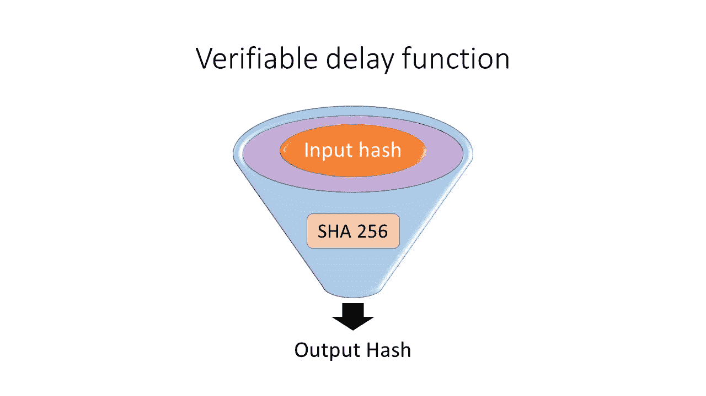](https://github.com/figment-networks/learn-tutorials/raw/master/assets/vdf.jpg)

其背后的整个哲学是:

*   运行该功能需要一些时间
*   运行函数是产生输出的唯一方法
*   有了函数的已知输入和输出，评估输出的唯一方法是用提供的输入重新执行函数

这保证了当一个输出对一个输入有效时，产生该输出已经过了一段时间。这就是索拉纳证明历史背后的魔力！

索拉纳的账本是一串积木。每个块包含一定数量的事务，大小为 10MB。

[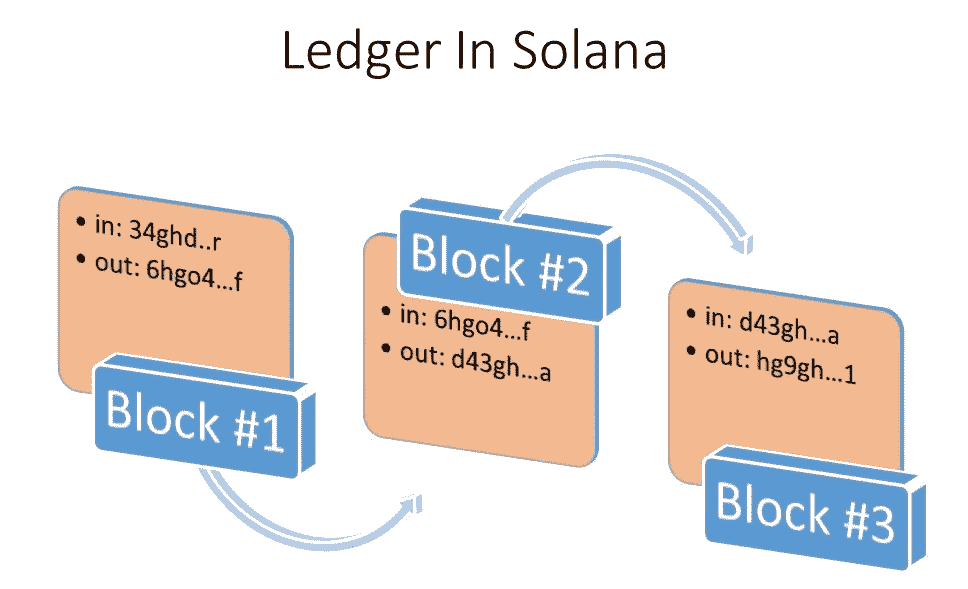](https://github.com/figment-networks/learn-tutorials/raw/master/assets/solanaLedger.jpg)

除了输入和输出散列之外，每个块还附加了一些其他元数据，比如它包含的事务和事件的数量。当一个节点声明它已经创建了一个新的块来添加到分类帐时，该声明可以被其他节点验证。生成块的节点被称为**领导者**，执行验证的其他节点被称为**验证者**。

验证器针对块中存在的事务数量运行可验证延迟函数(VDF ),并将这些输出与领导者节点提供的输出进行比较。

当提议新的块时，节点可以引用分类帐中最近确认的散列之一。通过这种方式，他们证明了他们的块是在引用的散列之后生成的。

**好吧，听起来有点抽象！下面是一个例子:**

想象你已经穿越到 2200 年了！你告诉人们你来自过去，但他们只是笑着说你是个骗子。你生气的样子<g-emoji class="g-emoji" alias="rage" fallback-src="https://github.githubassets.cimg/icons/emoji/unicode/1f621.png">😡但是突然一个想法进入你的大脑。</g-emoji>

你给他们看你钱包里一张 2000 年铸造的 100 美元钞票。首先，他们怀疑这是一张假钞，于是开始在实验室里分析。在他们通过仔细分析确定你说的是实话后，他们会拥抱你，信任你！

诚然，这是一个可爱的故事，但让我们将它的元素映射到 PoH:

*   故事中的时间旅行者是产生新区块的领导节点
*   来自过去的说法等同于新生成的区块
*   100 美元的钞票相当于从分类帐中引用的散列
*   在实验室中分析钞票相当于验证器节点验证该块

# BFT 塔

拜占庭将军是一个老问题，讨论的是如何决定一个问题的解决方案，这个问题有不止一个解决方案或者每个解决方案有不同票数的提议。

BFT 塔是 Solana 的实用拜占庭容错(PBFT)的定制实现，它利用 PoH 作为全局时钟来减少消息开销和延迟。该实现使用历史证明作为可靠的时间源，并使用指数增长的超时来选择最有效的分叉。

在下面的图表中，我们看到了散列值 4 的冲突。两个散列都声称是散列号 3 的有效子散列，但只能接受一个。

[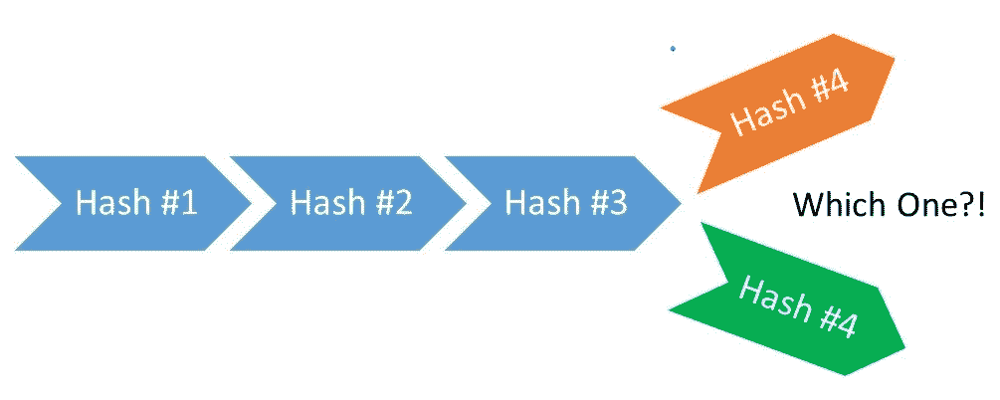](https://github.com/figment-networks/learn-tutorials/raw/master/assets/Slide2.jpg)

在执行块的验证之后，验证者提交他们对该块的投票(称为散列)。

对于分类帐中的每个散列，验证者可以在专用于它的投票堆栈中提交他们对该特定散列的投票。在上面的例子中，两个散列都试图得到确认并成为散列#4。他们两个都有投票堆栈。最终，拥有最多票数的人将赢得这场比赛，为获胜者投票的验证者将获得奖励。

这种在正确散列上投票的奖励机制鼓励验证器在投票栈最大的分叉上投票，因为它更有可能是有效的。

该槽是表示大约 400 毫秒的散列的数量。每 400 毫秒，网络都有一个潜在的回滚阶段。考虑到每一次投票，随后的每一次投票都会使网络需要等待从投票堆栈中展开的实时时间加倍。

我们喜欢例子，所以让我们用一个例子来检验这个规则:

假设验证器开始验证上图中的橙色散列，并且已经创建了如下投票堆栈:

[](https://github.com/figment-networks/learn-tutorials/raw/master/assets/vote_stack_at_0.jpg)

它看起来像一个金字塔，因为投票根据它们进入堆栈的顺序而不同。

我们用投票栈的时隙来度量时间。让我们假设第一次投票是由一个验证器在时间 1 提交给堆栈的。那么投票堆栈将如下所示:

[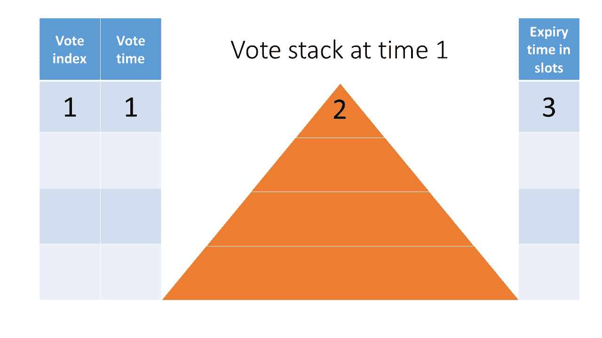](https://github.com/figment-networks/learn-tutorials/raw/master/assets/vote_stack_at_1.jpg)

到期时间是提交的投票以及在此之后提交的所有投票从堆栈中弹出的时间(即，高于弹出投票的投票具有更高的投票指数)。

投票的到期时间由“**投票时间+堆栈中的当前锁定时间**”计算得出。

1 个时间段(~ 400 毫秒)后，提交了另一个投票，因此新的投票堆栈将为:

[](https://github.com/figment-networks/learn-tutorials/raw/master/assets/vote_stack_at_2.jpg)

现在我们熟悉了投票的数学和逻辑。投票在时间 5 提交。在时间 5，投票号 2 过期并弹出堆栈。所以现在，投票堆栈应该是:

[](https://github.com/figment-networks/learn-tutorials/raw/master/assets/vote_stack_at_5.jpg)

虽然新的投票被提交到堆栈，但它不会使投票 1 的锁定时间加倍，因为只有当投票需要移动到金字塔中更大的位置时，锁定时间才会加倍。

在时间 6，投票 1 过期，并与在它之后提交的所有投票(包括投票 3)一起弹出。所以我们的投票栈又空了。

现在我们已经熟悉了它的逻辑，让我们回到 18 岁，看看投票堆栈:

[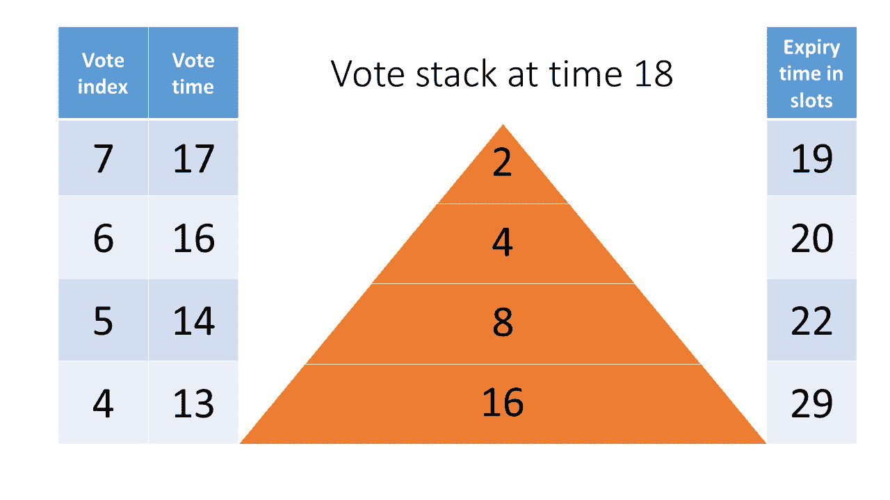](https://github.com/figment-networks/learn-tutorials/raw/master/assets/vote_stack_at_18.jpg)

在 19，我们堆栈中有 4 票，第 7 票即将过期，但另一票已提交:

[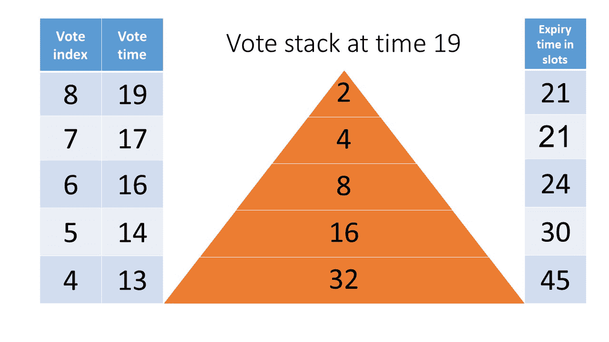](https://github.com/figment-networks/learn-tutorials/raw/master/assets/vote_stack_at_19.jpg)

随着验证者提交的投票越来越多，堆栈的大小也会增加，旧投票的过期时间也会增加。当堆栈大小达到 32 时，最老投票的锁定号码是 2^32 插槽，大约是 54 年！几乎可以肯定的是，这一票很有可能永远不会被收回。

为了奖励在正确的散列上投票的验证者，当一个新的投票被提交到一个有 32 票的堆栈时，最老的一个将从堆栈中排队(即先进先出)，并且它的验证者接收奖励。

这种机制听起来类似于其他区块链上的股份证明，但它们在一个重要方面是不同的:在 BFT 塔中，当 2/3 的验证者对 PoH 哈希进行投票时，它将被视为已确认，并且不能回滚。

这种方法的另一个优点是，网络中的每个参与者都可以计算每个其他参与者的超时，而无需任何 P2P 通信。这使得塔 BFT 异步。

# 涡轮

[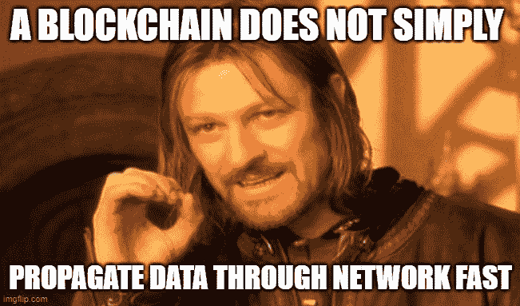](https://github.com/figment-networks/learn-tutorials/raw/master/assets/turbine.jpg) 是只有我还是这个人看起来像索拉纳·阿纳托利·亚科文科的首席执行官<g-emoji class="g-emoji" alias="joy" fallback-src="https://github.githubassets.cimg/icons/emoji/unicode/1f602.png">😂</g-emoji>

可扩展性是一个很难解决的问题，因为增加网络中节点的数量会导致节点之间需要更多的时间来传播数据。

假设一个领导者试图与其他 20，000 个验证者共享 64MB 的数据(大约 250，000 个事务，假设每个事务大约 256 字节)。这种非常幼稚的方法需要领导者通过 P2P 通信将数据发送给网络中的所有其他节点。这仅仅意味着领导者应该与每一个验证器有一个唯一的连接，并分别向每一个验证器发送 64MB 的数据。

那既不快又没效率！这就是为什么索拉纳想出涡轮来解决这个问题。Turbine 是 Solana 使用的一种协议，用于通过网络快速安全地传播数据块。

当一个领导节点向网络中的其他节点传输数据时，Turbine 通过网络为每个数据包建立一个随机路径。

领导者将块分割成最大 64KB 的包。对于 64MB 的块(考虑到每个事务大约 256 字节，大约 250，000 个事务)，领导者产生 1，000 个 64KB 的分组，并将每个分组发送到不同的验证器。

[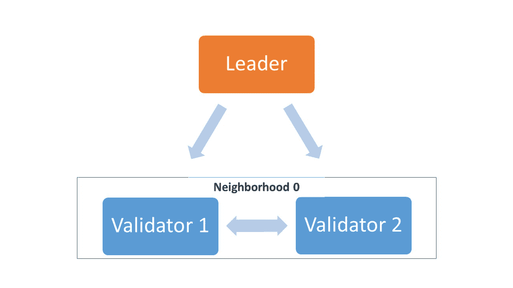](https://github.com/figment-networks/learn-tutorials/raw/master/assets/turbine_1.jpg)

反过来，每个验证器节点将数据包重新传输给一组称为**邻域**的对等节点。您可以将网络想象成一棵邻域树，它允许网络增长超过 1000 个验证器:

[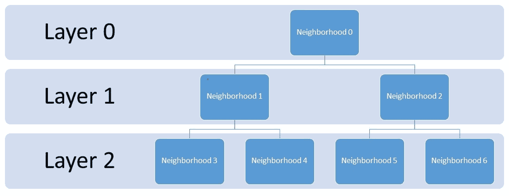](https://github.com/figment-networks/learn-tutorials/raw/master/assets/neighborhood_tree.jpg)

邻域中的每个节点负责将其接收的数据传输到其邻域中的其他节点，从而将其数据的一部分传播到其他邻域中的一小组节点。

[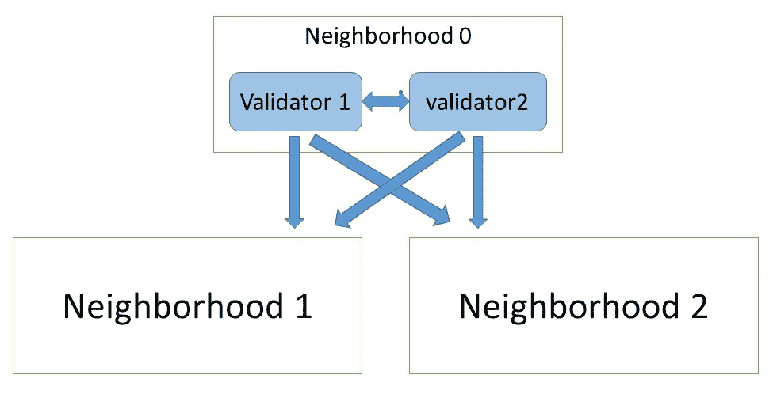](https://github.com/figment-networks/learn-tutorials/raw/master/assets/neighborhood_interaction.jpg)

为简单起见，上图假设每个邻域包含 2 个节点。在 Turbine 中有一个名为`DATA_PLANE_FANOUT`的参数，它指定了任何邻域中节点的最大数量。也就是说，到目前为止我们已经看到了带有`DATA_PLANE_FANOUT = 2`的图。这个参数也决定了树的形状。

考虑以下伪代码来帮助您思考网络树的创建:

```
LAYER = 0
NEIGHBORHOOD = 0
// Run until all nodes are allocated to a layer and neighborhood 
While ( NODES_IN_NETWORK > 0 ) {

  // If maximum amount of neighborhoods in a layer is reached, moves to next layer
  If ( NEIGHBORHOOD+1 > DATA_PLANE_FANOUT^LAYER ) {
    LAYER = LAYER + 1
  }

  // If there were equal or more nodes than DATA_PLANE_FANOUT the create a full neighborhood
  If (NODES_IN_NETWORK > DATA_PLANE_FANOUT ) {    
    NODES_IN_NETWORK = NODES_IN_NETWORK - DATA_PLANE_FANOUT
    Create the Neighborhood number [NEIGHBORHOOD] at layer [LAYER] with [DATA_PLANE_FANOUT] nodes
    NEIGHBORHOOD = NEIGHBORHOOD + 1
  }

  // If there were less nodes than DATA_PLANE_OUT create the last neighborhood with remaining nodes
  Else {
    NODES_IN_NETWORK = 0
    Create the Neighborhood number [NEIGHBORHOOD] at layer [LAYER] with [NODES_IN_NETWORK] nodes
  }
} 
```

所以对于`DATA_PLANE_FANOUT = 3`，`NODES_IN_NETWORK = 39`树如下:

[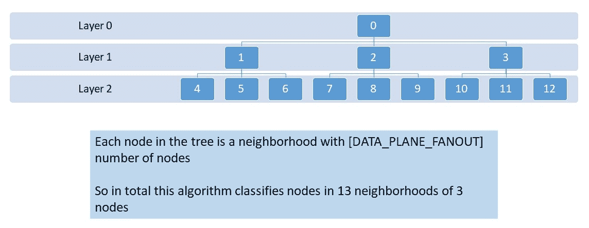](https://github.com/figment-networks/learn-tutorials/raw/master/assets/tree_creation.jpg)

在 DATA_PLANE_FANOUT = 200 的网络中，在树的 2 次跳跃中，顶部的领导者可以达到多达 40，000 (200*200)个验证器。这需要 200 毫秒，假设网络内部的每个链路平均在 100 毫秒内解析。

随着数据的快速传播，安全问题也随之而来。恶意节点可能选择不转播它接收的数据，或者甚至向其他节点转播不正确的数据。为了解决这个问题，领导者创造了里德-所罗门擦除代码。擦除码允许每个验证器在没有接收到所有分组的情况下重建整个块。

如果领导者发送 30%的包作为擦除码，那么网络可以丢弃任何 30%的包而不丢失块。领导甚至可以根据网络情况调整这个数字。这些调整是由领导者从先前块中观察到的分组丢弃率做出的。

[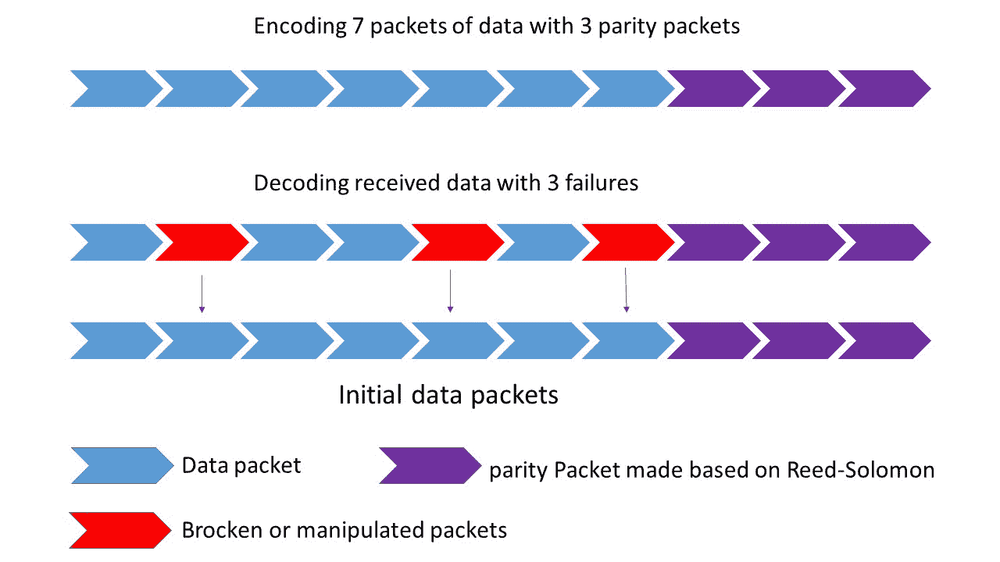](https://github.com/figment-networks/learn-tutorials/raw/master/assets/turbine_-_erasure_codes.jpg)

# 湾流

Gulf stream 是 Solana 的内存池管理解决方案。mempool(即内存池)是一组尚未在区块链中处理的事务，正在等待网络的拾取。

例如，你可以看看比特币的 mempool(本文末尾的参考资料部分提供了链接)。

[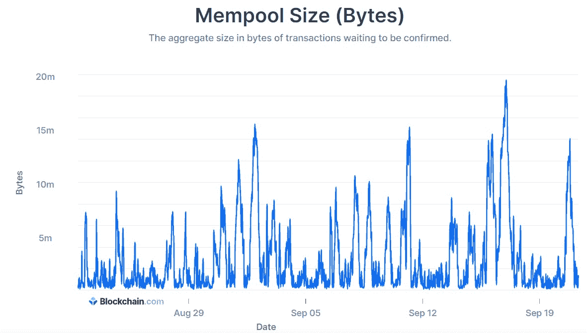](https://github.com/figment-networks/learn-tutorials/raw/master/assets/bitcoin_mempool.jpg)

在撰写本教程时，2021 年 9 月 21 日，比特币内存池的大小为 1.362 兆字节，这表明了等待比特币矿工处理的交易数量。内存池的大小取决于块空间的供给和需求。需求增长得越多，提交的事务就越多，在供应大致相同的情况下，内存池的大小也会增长。

随着内存池大小的增加，处理一个事务所需的时间(平均)也会增加，用户会说“这个区块链太慢了！”。对此，最简单的解决方案可能是通过扩展网络和利用更强的硬件来增加网络的吞吐量。但是这需要花费大量的资源，并且使得网络更难管理和保持安全。

索拉纳用一种他们称之为湾流的技术解决了这个问题。假设 Solana network 的吞吐量为 50，000，它可以在几秒钟内处理 100，000 个内存池。

由于 Solana 的架构，每个验证器都知道即将到来的领导者的顺序。因此，客户和验证者在成为网络中的领导者之前，会将交易转发给即将到来的领导者。这允许验证器提前开始处理事务。这导致验证器内存中缓存的事务更少，确认速度更快。你可以在 solanabeach(参考资料部分有一个链接)上看看领导人轮换和 Solana network 的其他细节。

[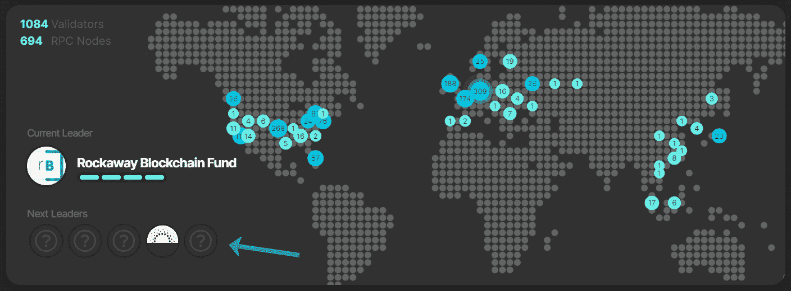](https://github.com/figment-networks/learn-tutorials/raw/master/assets/leader_rotation.gif)

客户端(如钱包)对引用特定块哈希的事务进行签名。客户端选择已经被网络完全确认的大致最近的块散列。从塔 BFT 部分，我们知道了一个块如何在网络中得到确认和最终确定。提议的区块需要 2 个时隙或大约 800 毫秒。正如我们在 BFT 塔一节中所看到的，在 32 个后续区块之后，提议的区块要么失败，要么得到确认。

一旦交易被转发给任何验证者，该验证者就将交易转发给即将到来的领导者之一。一旦网络移过回滚点，使得所引用的块散列已经过期，客户端就可以保证事务现在是无效的，并且永远不会在链上执行。

总而言之，索拉纳在繁重的事务处理下的速度与众不同之处是什么？！<g-emoji class="g-emoji" alias="thinking" fallback-src="https://github.githubassets.cimg/icons/emoji/unicode/1f914.png">🤔</g-emoji>利用墨西哥湾流可获得 Solana 网络的两项特权。

1.  在负载下，验证器可以提前处理事务，并丢弃任何失败的事务。
2.  领导者可以基于转发事务的验证器在网络树中的位置来区分执行事务的优先级(这意味着从层 n 中的验证器转发的事务优先于从层 n+1 转发的另一个事务)

这两个特权一起帮助网络降级，即使在巨大的 DoS 攻击下也能保持工作。

# 档案

当满负荷运行时，索拉纳每秒将产生 1 千兆比特。仅在 1024 秒内(约 17 分钟)，产生的数据将为 1 万亿比特，在一年内将达到 4pb(32 万亿比特)。大量的数据需要存储！

[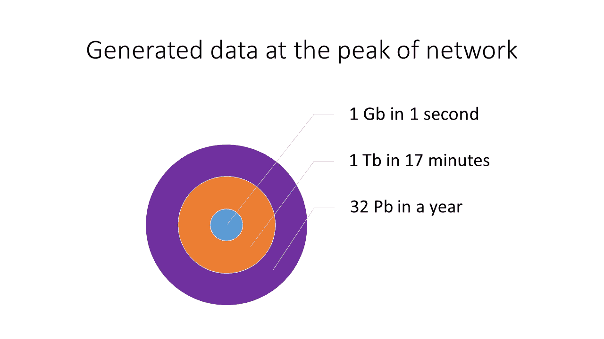](https://github.com/figment-networks/learn-tutorials/raw/master/assets/generated_data.jpg)

如果网络中的每个节点都需要存储这么多数据，那么有限的一组能够负担得起并管理这种存储的参与者就可以加入网络，这就使网络集中化。

为了避免这种情况，并以分散的方式进行，Solana 团队构建了他们的 PoRep 版本。PoRep 代表 proof of replication，它是由 Filecoin 最初引入的一个系统，在该系统中，证明者为一个公开可验证的声明进行辩护，该声明称它将专用于存储数据文件的一个或多个可检索副本的唯一资源。Solana 的 PoRep 版本利用 PoH 技术快速验证复制证据。

负责存储分类帐的节点是归档器。他们不参与共识，对硬件的要求低于验证者和领导者。总的来说，复制器的工作方式如下:

[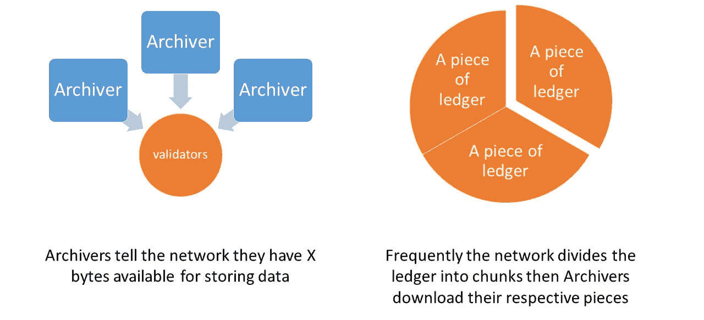](https://github.com/figment-networks/learn-tutorials/raw/master/assets/data_storage.jpg)

归档程序向网络发出信号，表示它们有 X 字节的空间可用于存储数据。通常，网络会将分类帐历史记录分成多个块，以便以一定的复制速率向归档程序发送分类帐历史记录。然后，归档程序从网络下载各自的数据。

有时，网络会要求/挑战归档程序证明它们正在完成存储数据的工作，此时，归档程序应该完成 PoRep。为了奖励存档者，他们将获得 3%的通货膨胀。

# 海平面

Sealevel 是 Solana 的智能合约运行时。并行运行智能合约并有效使用验证器的所有可用计算资源，使得 Sealevel 成为 Solana 的核心创新之一。

Sealevel 比单线程运行时更高效、更快，比如以太坊的 EVM 或 EOS 的 EOS-VM。原因是单线程运行时可以一次运行一个契约，但是使用 Sealevel，可以使用验证机的所有可用内核并行运行数万个事务。

[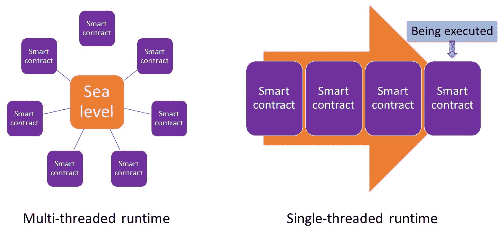](https://github.com/figment-networks/learn-tutorials/raw/master/assets/runtimes.jpg)

索拉纳交易由指令组成。每条指令都包含它调用的程序 ID、程序指令和事务需要写入或读取的帐户列表。

[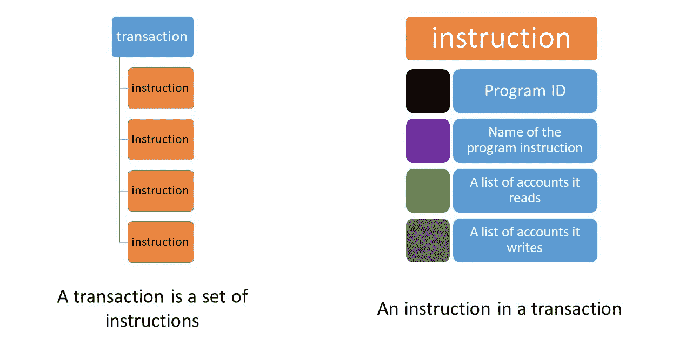](https://github.com/figment-networks/learn-tutorials/raw/master/assets/transaction_anatomy.jpg)

这使得 Sealevel 能够按照从账户中读取相同数据的交易或可以不重叠处理的交易(即不同时覆盖相同的状态)对交易进行排序和分类。

[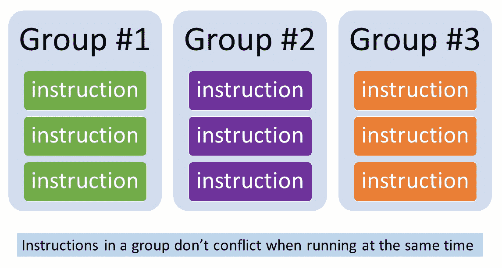](https://github.com/figment-networks/learn-tutorials/raw/master/assets/grouped_transactions.jpg)

每条指令都提前告诉虚拟机它想要读写哪些帐户。因此，虚拟机会预取并准备这些数据。这是 Sealevel 通过组织事务进行的第一次优化，但是一般的优化发生在硬件级。

假设大量的事务已经被组织和分类到不同的组中，并且来自程序的相同指令(也称为智能合同)被 1000 个不同的事务调用。我们如何利用 CPU 和 GPU 架构在这些多数据流上运行指令？

[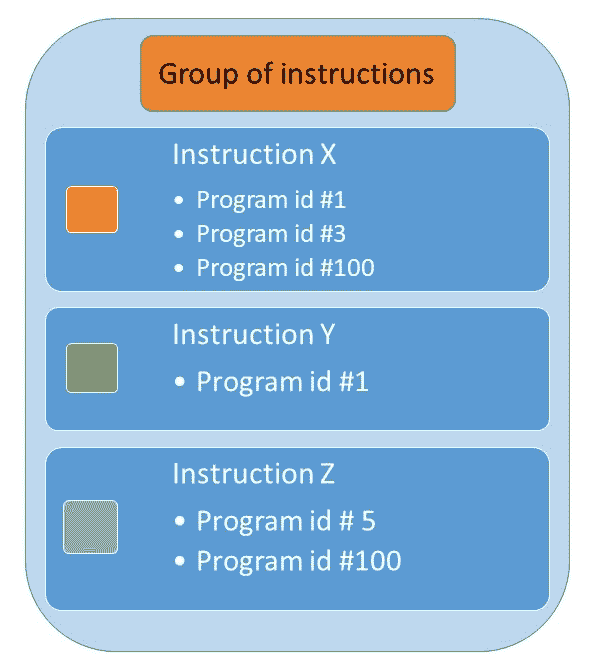](https://github.com/figment-networks/learn-tutorials/raw/master/assets/sorted_by_id.jpg)

一个 SIMD CPU(单指令，多数据)可以在多个数据源上运行一条指令，因此 Sealevel 通过按程序 ID 对一个组中的所有指令进行排序来进行下一次优化，然后在 CPU 中所有内核可用的情况下在所有数据流上运行程序。

[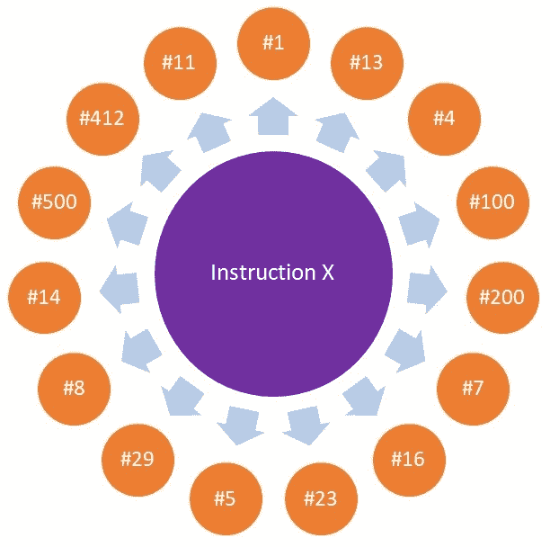](https://github.com/figment-networks/learn-tutorials/raw/master/assets/parallel_execution.jpg)

同样的 SIMD 实现也存在于 GPU 中，Solana 节点也使用 GPU。现代 Nvidia GPU 有 4000 个内核和大约 50 个多处理器。一个多处理器一次只能执行一条程序指令，但可以并行执行 80 多条不同的输入，因为它可以使用 4000 / 50 = 80 个内核。

现在考虑前面的步骤，其中 Sealevel 通过程序 ID 对指令进行分类，这个 GPU 可以同时在指令指定的所有数据流上运行程序。为了使 SIMD 优化成为可能，对指令结构的权衡是必要的。指令应该由少量分支组成，并且应该都采用相同的分支。

Sealevel 做了大量令人印象深刻的优化，与其他单线程运行时(如以太坊)的区块链相比，它再次将 Solana 推向了首位。

# 管道铺设

为了处理事务，已经设计了一种优化系统，其使得验证器或领导者节点能够继续处理传入的事务，而无需等待先前的事务被完全处理。

这种技术被称为流水线技术，在有一系列条目和连续处理步骤的系统中很常见。想象一下一家受欢迎的餐馆里的厨房。由于餐厅顾客源源不断，厨房总是忙于尽快为顾客提供食物。食物准备的整体流程如下图。

*   清洗和清洁原材料
*   烹饪食物
*   食物的电镀
*   向顾客提供食物

为了获得最高效率，厨房员工的工作方式如下:

首先，一些原材料(如胡萝卜<g-emoji class="g-emoji" alias="carrot" fallback-src="https://github.githubassets.cimg/icons/emoji/unicode/1f955.png">🥕</g-emoji>，洋葱<g-emoji class="g-emoji" alias="onion" fallback-src="https://github.githubassets.cimg/icons/emoji/unicode/1f9c5.png">，🧅</g-emoji> ，鱼<g-emoji class="g-emoji" alias="fish" fallback-src="https://github.githubassets.cimg/icons/emoji/unicode/1f41f.png">🐟</g-emoji>等。)进入清洗部分。工人做好自己的工作，把结果传给下一个部分，也就是烹饪。现在，清洗部分可以开始处理下一组材料。在两个部分(洗涤和烹饪)完成他们的工作后，他们可以将结果传递给下一个部分。所以现在烹饪部分可以在第二组清洗部分上工作，而设计部分在第一组配料上工作。现在，清洗部分可以开始处理第三组配料了。下面的动画展示了这一过程的工作原理。

[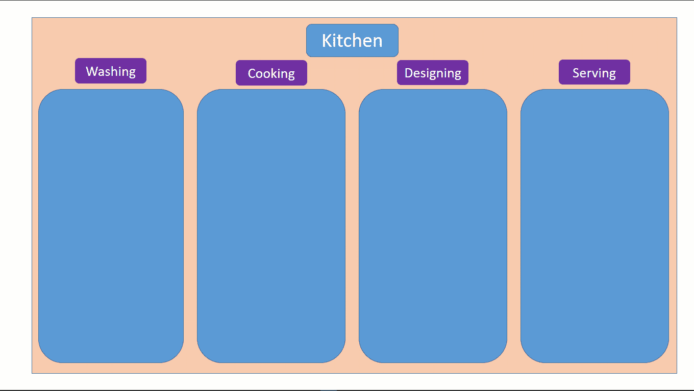](https://github.com/figment-networks/learn-tutorials/raw/master/assets/kitchen.gif)

索拉纳也实施了同样的模式。交易的处理和验证由不同的阶段组成。对于要由领导者节点处理的事务，有四个步骤:

[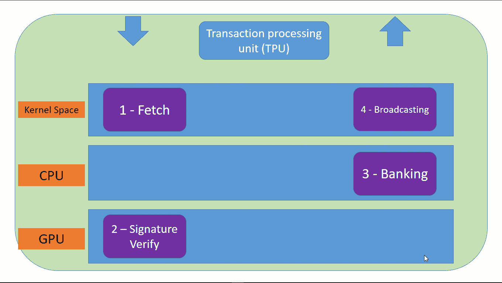](https://github.com/figment-networks/learn-tutorials/raw/master/assets/TPU.gif)

让我们来看看每个部分是做什么的:

*   抓取:抓取类似于厨房示例中的清洗部分。它获取客户端创建的交易(例如 CLI 客户端、基于 web 的钱包等。)并将它们传递到下一部分。

*   签名验证:这一部分类似于厨房示例中的烹饪食物部分。它验证发送交易的帐户(或公钥)是否已经签名。

*   银行业:这一部分类似于厨房示例的电镀部分。它在与交易相关联的帐户之间转移信用，并将最近创建的散列从 PoH 附加到交易。

*   广播:这一部分类似于厨房示例的上菜部分。它将已处理的事务块广播给其他节点进行验证。

为了快速处理事务，每个阶段由不同的处理单元处理。内核空间处理获取和广播。CPU 处理银行业务，GPU 处理签名验证。

在厨房的例子中，烹饪可能是最慢的步骤，并且在交易处理中，签名验证需要最多的计算和时间。这就是为什么签名验证由 GPU 处理。

Solana 网络中的一个节点运行两个流水线进程，一个是作为领导者的事务处理单元(TPU ),另一个是作为验证者的事务验证单元(TVU)。用于进程和网络输入和输出的硬件是相同的，但是每个管道中发生的进程是不同的。

# 云破裂

一些像以太坊这样的区块链使用分片技术来扩展网络，这意味着区块链的数据库会被分割。通过这种方式，事务负载分散在这些较小的链(碎片)上。

Cloud Break 是一种数据结构，可以同时读写数据库。它使用内存映射文件，可以处理 32 个线程之间的并发读写，支持现代固态硬盘。

# 结论

索拉纳是一个革命性的区块链与上述基本创新。它具备成为杰出区块链的所有条件。

那不仅仅是我的想法！很多开发者在 Solana 上搭建了各种项目和 dapp:Serum，一个去中心化的交易所；音乐流媒体平台 AudiusNFT 市场 Metaplex 和链环，仅举几个例子。你可以在 Solana 网站的生态系统部分找到更多的细节和应用。

[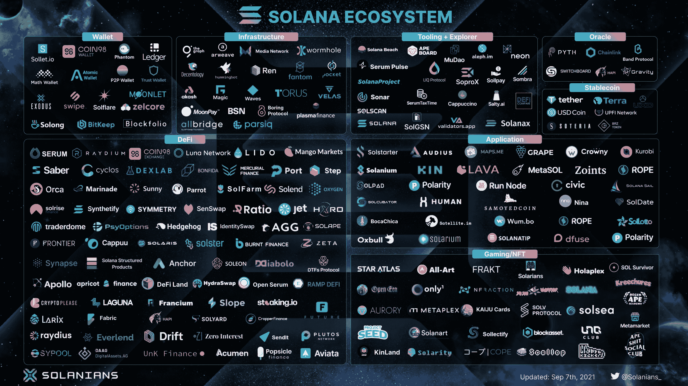](https://github.com/figment-networks/learn-tutorials/raw/master/assets/solana_ecosystem.jpeg)

作为我的结束语，我想说“索拉纳是未来”。感谢你阅读我的文章，我希望它能对你可能难以理解的部分有所启发。

# 关于作者

我是 Mahdi Mostafavi，一名网络开发人员，我正在学习 Solana，这样我就可以在它上面建立一个我脑海中的惊人项目。我的 github:[@ mmostafi](https://github.com/mmostafavi)

如果你发现文章中有任何错误信息，或者有任何改进文章的建议，请发表评论，或者你可以在 Twitter 上找到我: [@mahdi_ftp](http://twitter.com/mahdi_ftp) 。

# 参考

Bitcoin mempool : [https://www.blockchain.com/charts/mempool-size](https://www.blockchain.com/charts/mempool-size)

Solanabeach 网址: [https://solanabeach.io](https://solanabeach.io)

官网索拉纳生态系统概述:[https://solana.com/ecosystem](https://solana.com/ecosystem)

索拉纳人的推特:[https://twitter.com/solanians_](https://twitter.com/solanians_)