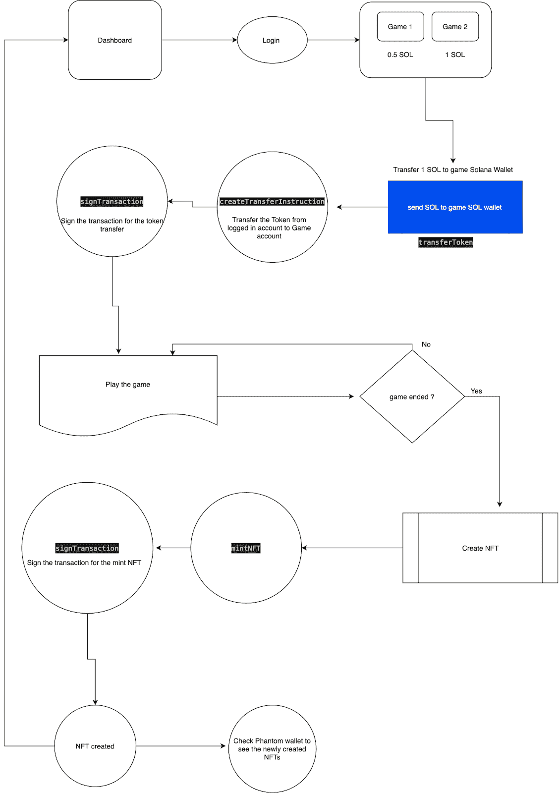

# 介绍

> 原文:[https://github . com/fig ment-networks/learn-tutorials/blob/master/Solana/gaming-on-Solana . MD](https://github.com/figment-networks/learn-tutorials/blob/master/solana/gaming-on-solana.md)

区块链在每个版本中都在不断发展，现在有许多第 1 层区块链正在解决现实世界中的问题。索拉纳是每秒交易速率最快的区块链之一，而且交易费用很低。这些特性使 Solana 成为构建应用程序的完美区块链，这些应用程序可以在流量方面扩大规模，同时使最终用户能够负担得起交易。

考虑到这些因素，我们将建立一个分散的游戏平台，用户将能够通过向钱包支付索尔来玩游戏，并将能够为他们的游戏分数创建一个不可替代的令牌(NFT)。

本教程不涉及任何实际的游戏，它的重点是创建一个 React 应用程序，要求用户在使用应用程序之前使用 Solana 的 Phantom wallet 进行支付。

# 先决条件

尽管本教程不要求您了解 Solana 的所有知识，也不要求您是一名有经验的开发人员，但是掌握一些 JavaScript、React、Web3.js 和 Solana 区块链的基础知识将会很有用。

# 要求

*   像 Visual Studio Code (VSCode)这样的代码编辑器
*   从 [https://phantom.app](https://phantom.app) 安装幻影钱包浏览器扩展

# 特征

分散应用程序(DApp)将包括以下功能:

1.  虚拟钱包连接
2.  解决钱包交易
3.  玩游戏(我们将能够选择任何开源游戏，并复制代码)
4.  NFT 为游戏创作打高分

# 文件夹结构

本教程的完整代码可以在 https://github.com/solanauniversity/solana-games 找到

在本教程中，我们的应用程序名为“solana-games”。如果您希望克隆存储库并从那里开始工作，可以运行以下终端命令:

```
git clone https://github.com/solanauniversity/solana-games 
```

这会将项目下载到您的本地驱动器上，并允许您修改和运行 DApp。

**React 应用程序运行本教程所需的文件夹结构**:

*   `solana-games`
    *   节点 _ 模块
    *   公众的
    *   科学研究委员会
        *   资产
            *   形象
                *   stack.png 文件
        *   比赛
            *   堆
                *   Stack.jsx 档案
                *   样式. css
        *   页
            *   CreateNFT.jsx
        *   utils
            *   transferToken.js(传输令牌. js)
            *   nftCreation.js
            *   sleepUtil.js
            *   walletUtils.js
            *   programIds.js
        *   App.js
        *   App.css
        *   索引. js
    *   package.json

# DApp 的流程图

[](https://raw.githubusercontent.com/figment-networks/learn-tutorials/master/assets/Solana_Games.png?raw=true)

记住这一点，我们将检查代码的细节以及它是如何操作的:

# 接受来自游戏玩家的费用

我们正在构建的 DApp(去中心化应用)接受 SOL 令牌形式的支付，并让用户在支付后玩游戏。我们收到的代币可以解释为游戏费。同样的模式可以适用于任何收到付款后还能提供服务的 DApp。为了使支付到 DApp 成为可能，我们将首先集成幻影钱包，这将使用户能够发送付款。

## 连接到虚拟钱包

要将 SOL 从您的钱包转移到游戏的钱包，您首先需要连接到钱包。没有连接，您将无法转移 SOL 并继续前进。这在文件`src/App.js`中完成。

*   首先，我们需要从 window 对象中获取“solana”变量，如果 solana 变量存在，这意味着幻影钱包是作为浏览器扩展安装的。
*   一旦我们有了提供者，我们就调用“连接”函数来连接虚拟钱包。它将打开一个弹出窗口，要求用户输入他们的虚拟密码。一旦他们提供了正确的密码，它就会将钱包连接到应用程序。
*   Phantom 提供了一种方法，通过使用像“connect”和“disconnect”这样的钩子来监听连接或断开的事件。一旦幻影成功授权，它将触发“连接”方法，我们可以使用此方法来启动我们的 DApp 功能

```
// src/App.js

// ...

/** 
 * React will call this useEffect everytime there is an update in the provider variable.
 * Phantom provider provides 2 methods to listen on
 * 1\. connect -> This method gets triggered when the wallet connection is successful
 * 2\. disconnect -> This callback method gets triggered when the wallet gets disconnected from the application
 */

 useEffect(() => {
   if (provider) {
       provider.on("connect", async() => {
         console.log("wallet got connected", provider.publicKey)
         setProviderPub(provider.publicKey)

       });
       provider.on("disconnect", () => {
         console.log("Disconnected from wallet");
       });
   }
 }, [provider]);

 /**
 * React will call this useEffect only one time after page the loads
 * We will check if the browser has Phantom wallet installed or not.
 * If a phantom wallet is installed then it provides a "solana" variable on the window object.
 */
 useEffect(() => {
   if ("solana" in window && !provider) {
     console.log("Phantom wallet present")
     setProvider(window.solana)
   }
 },[])
```

既然已经设置了`provider`,我们可以将`provider`实例用于所有后续事务。当用户连接他们的钱包时，分配可以在整个 DApp 使用的`provider`来签署交易变得很重要。

## 签署交易

**一旦我们准备好发送一个交易，它必须被签名**—`@solana/web3.js`中的 signTransaction 函数被使用。

```
// src/utils/transferToken.js

// ...

const createTransferTransaction = async (
  ownerPubkey,
  connection,
  fromTokenAccountPubkey,
  toTokenAccountPubkey,
  tokenToTransferLamports
) => {
  let transaction = new Transaction().add(
    SystemProgram.transfer({
      fromPubkey: fromTokenAccountPubkey,
      toPubkey: toTokenAccountPubkey,
      lamports: tokenToTransferLamports,
    })
  );
  transaction.feePayer = ownerPubkey;
  console.log("Getting recent blockhash");
  transaction.recentBlockhash = (
    await connection.getRecentBlockhash()
  ).blockhash;
  return transaction;
};
```

在上面的代码中，我们准备将事务对象签名并添加到索拉纳区块链中。为了使交易有效，需要以下几个重要属性:

*   **transaction . recent Blockhash**:由于 solana 正在处理**的历史证明**，因此 solana 区块链中的每个事务都需要最新的 block hash 来与新事务相关联。如果没有 getRecentBlockhash，验证器将无法验证事务。

*   **transaction.feePayer** :该变量表示交易的费用支付方，该费用支付方将支付签署交易并发送交易进行验证的费用。

**历史的证明**:历史的证明是一系列的计算，可以提供一种方法来加密验证两个事件之间的时间流逝。验证器节点用密码证明“时间戳”块，该密码证明自最后一次证明以来已经过去了一段时间。被散列到证明中的所有数据几乎肯定是在生成证明之前发生的。然后，该节点与验证器节点共享新块，验证器节点能够验证这些证明。这些块可以以任何顺序到达验证器，甚至可以在几年后重放。有了这样可靠的同步保证，Solana 能够将块分成更小的事务批次，称为*条目*。在任何块共识的概念之前，条目被实时流式传输到验证器。这与**工作证明**模型非常不同且高效，在该模型中，能耗很高，因为区块链中的每个节点都必须执行操作来验证事务。获胜者得到奖励，但是其他验证者的工作在这个过程中被浪费了。

## 虚拟钱包的连接提供者

在下面的实用程序功能中，如果钱包尚未连接，我们将尝试连接到钱包。如果不存在作为浏览器扩展的虚拟钱包，该功能将提醒用户。

幻影钱包浏览器扩展在浏览器的全局窗口对象中注入`solana`属性。我们通过检查窗口对象上 solana 属性的存在来检查钱包的存在。

```
// src/utils/nftCreation.js

/**
* Helper function to detect whether Phantom wallet extension is installed or not
* @param {*} connectToWallet
* @returns
*/
export const connectOrGetPhantomProvider = (connectToWallet) => {
   if ("solana" in window) {
     const provider = window.solana;
     if (connectToWallet && !window.solana.isConnected) {
           window.solana.connect();
       }
       if (provider.isPhantom) {
           return provider;
       }
   } else if (connectToWallet) {
     alert(`Please install the Phantom wallet from https://phantom.app/`);
   }
};
```

## 将 SOL 从用户钱包转移到游戏钱包

为了将 SOL 从用户的钱包转移到我们的游戏钱包，我们需要创建一个新的交易，该交易将包含 SOL 发送者、SOL 接收者和 SOL 金额的信息。

一旦我们有了这些信息，我们就必须使用上面的`createTransferTransaction`函数签署交易。

作为安全检查，我们还添加了`if`条件，在 SOL 金额小于 0 的情况下，该条件不会让交易进行。

```
// src/utils/transferToken.js

/**
* This utility function will transfer the token from one user wallet to another user's wallet
* @param {*} provider : provider of the Phantom wallet
* @param {*} connection : connection to the Solana cluster
* @param {*} tokenToTransfer : tokens to be transferred in lamports
* @param {*} fromTokenAccountPubkey : sender of the token
* @param {*} toTokenAccountPubkey : receiver of the token
* @return {object} 
* { status: true, signature: "transaction signature hash"} in case of success
* { status: false, error: "error message"} in case of failure
*/

export const transferCustomToken = async (provider, connection, tokenToTransfer, fromTokenAccountPubkey, toTokenAccountPubkey) => {

 if (tokenToTransfer <= 0) {
   return { status: false, error: "You can not transfer, Token to transfer should be greater than 0." }
 }
 const tokenToTransferLamports = tokenToTransfer * 1000000000
 const transaction = await createTransferTransaction(provider.publicKey, connection, fromTokenAccountPubkey, toTokenAccountPubkey, tokenToTransferLamports);

 if (transaction) {
   try {
     let signed = await provider.signTransaction(transaction);
     console.log('Got signature, submitting transaction');

     let signature = await connection.sendRawTransaction(signed.serialize());
     console.log('Submitted transaction ' + signature + ', awaiting confirmation');

     await connection.confirmTransaction(signature);
     console.log('Transaction ' + signature + ' confirmed');

     return { status: true, signature }

   } catch (e) {
     console.warn(e);
     console.log('Error: ' + e.message);
     return { status: false, error: e.message }
   }
 }
 return {
   status: false,
   error: "No transaction found"
 }
}
```

*   **provider.publicKey** 将使用虚拟钱包中当前所选账户的公钥。

# 如何创建索拉纳上的 NFT

不可替代令牌(NFT)是存储在区块链(一种数字分类账形式)上的唯一且不可互换的数据单位。因此，通过拥有我们游戏中唯一的记分卡来让我们感到自豪，我们将把我们的分数转换成 NFT。一旦我们将其转换为 NFT，那么我们就可以在玩游戏时获得最高分。

让我们深入了解索拉纳的 NFT 创作过程。

## 创建 NFT 效用函数

NFT 代表不可替代令牌，这基本上意味着它是一种独一无二的数字资产，只属于你一个人。目前最流行的非功能性传播包括艺术品和音乐，但也可以包括视频甚至推特。

NFT 元数据可以包括到图像/视频/音频文件的链接。所有元数据都需要存储在互联网上的某个地方，通常 NFT 元数据会包含指向上传文件的链接，而不是将文件存储在区块链上。这是因为在区块链上存储大量数据的计算成本很高。为 URL 存储几个字节比存储整个 JPEG 要容易得多。因此，使用 Arweave 或 IPFS 等持久文件存储来维护 NFT 的元数据文件非常重要。

我们将使用 Arweave，这是一个基于区块链的数据托管服务，它是分散的，分布在整个网络中。

在这段代码中，我们将研究使用 SPL 令牌所需的不同库。

```
// src/utils/nftCreation.js

import { BinaryReader, BinaryWriter } from 'borsh';
import base58 from 'bs58';
import * as splToken from '@solana/spl-token'
import crypto from 'crypto';
import BN from 'bn.js';
import { serialize } from 'borsh';
import {
   Keypair,
     PublicKey,
     Transaction,
     clusterApiUrl,
     SystemProgram,
     SYSVAR_RENT_PUBKEY,
     TransactionInstruction
   } from "@solana/web3.js";

export const TOKEN_PROGRAM_ID = new PublicKey(
 'TokenkegQfeZyiNwAJbNbGKPFXCWuBvf9Ss623VQ5DA',
);
const SPL_ASSOCIATED_TOKEN_ACCOUNT_PROGRAM_ID = new PublicKey(
 'ATokenGPvbdGVxr1b2hvZbsiqW5xWH25efTNsLJA8knL',
);

const METADATA_PROGRAM_ID =
   'metaqbxxUerdq28cj1RbAWkYQm3ybzjb6a8bt518x1s';

const MEMO_ID = new PublicKey(
 'MemoSq4gqABAXKb96qnH8TysNcWxMyWCqXgDLGmfcHr',
);

const programIds = {
 token: TOKEN_PROGRAM_ID,
 associatedToken: SPL_ASSOCIATED_TOKEN_ACCOUNT_PROGRAM_ID,
 metadata: METADATA_PROGRAM_ID,
 memo: MEMO_ID,
}

const sleepUtil = (ms) => {
   return new Promise(resolve => setTimeout(resolve, ms));
 }
export const NETWORK = clusterApiUrl("devnet");
export const AR_SOL_HOLDER_ID = new PublicKey(
   'HvwC9QSAzvGXhhVrgPmauVwFWcYZhne3hVot9EbHuFTm',
);
export const METADATA_PREFIX = 'metadata';
export const EDITION = 'edition';
export const EDITION_MARKER_BIT_SIZE = 248;
export const DEFAULT_TIMEOUT = 15000;
export const RESERVED_TXN_MANIFEST = 'manifest.json';
export const MetadataKey = {
   Uninitialized : 0,
   MetadataV1 : 4,
   EditionV1 : 1,
   MasterEditionV1 : 2,
   MasterEditionV2 : 6,
   EditionMarker : 7,
}
export const TOKEN_PROGRAM_ID = programIds.token
```

*   borsh: 这是一个为我们提供数据序列化或反序列化功能的库。
*   bs58: 它有助于将字符串编码为 base 58 编码。
*   这是一个包含所有实用函数的库，用于在 solana 区块链上创建令牌。
*   **crypto:** 是执行数据加密和解密的算法。
*   **bn.js:**JavaScript 中用大数计算的 bn . js 库。
*   **@solana/web3.js:** 这个 JavaScript API 有助于为在 solana 上进行的交易准备指令。
*   **sleepUtil:** 这个函数将帮助 setTimeOut 作为一个同步函数工作。在这个函数的帮助下，我们可以在代码中的任何地方同步等待。
*   **网络:**该参数表示应用程序将连接到哪个 Solana 集群。

提到的其他变量是 Metaplex 的预定义标准，它在内部使用一个链上程序来存储 NFT 的所有元数据和工件。您可以在 [Metaplex 文档](https://docs.metaplex.com/)中找到更多信息。

# 链上程序的数据结构

用 Rust 编写的链上程序希望传递给它们的数据是“结构”格式的。需要创建该类以在 Web3 (JavaScript)中使用，但要通过事务发送它，首先需要将“类”数据结构转换为“结构”数据结构，然后通过 borsh 序列化程序序列化(以便可以通过网络发送)。

序列化很重要，因为没有它，用 Rust 编写的链上程序将无法反序列化指令数据，并且会返回致命错误。

*   **CreateMetadataArgs:** 这定义了 Metaplex 链上程序执行 NFT 创建操作所需的数据结构。

*   **UpdateMetadataArgs:** 这定义了更新 NFT 元数据的数据结构，没有它我们无法更新 NFT 的元数据。

*   **CreateMasterEditionArgs:** 定义了需要创建 NFT 主版本的数据的结构，该数据将来可以被创建到其他 NFT 中。用户可以为可铸造的主版本设置最大供应量。

*   **创建者**:为 NFT 的创建者定义数据的结构。这些信息将被注入每一个在区块链铸造的 NFT。

*   **元数据:**这定义了将与区块链上铸造的每个 NFT 相关联的元数据数据的结构。在元数据中，我们可以存储 NFT 上的图像和视频，这些图像和视频可以在 NFT 的市场上出售。

```
// src/utils/nftCreation.js

/**
* Classes to be used to create the NFT
*/

class CreateMetadataArgs {
  instruction = 0;
  data;
  isMutable;
  constructor(args) {
    this.data = args.data;
    this.isMutable = args.isMutable;
  }
}

class UpdateMetadataArgs {
  instruction = 1;
  data;
  // Not used by this app, just required for instruction
  updateAuthority;
  primarySaleHappened;
  constructor(args) {
    this.data = args.data ? args.data : null;
    this.updateAuthority = args.updateAuthority ? args.updateAuthority : null;
    this.primarySaleHappened = args.primarySaleHappened;
  }
}

class CreateMasterEditionArgs {
  instruction = 10;
  maxSupply;
  constructor(args) {
    this.maxSupply = args.maxSupply;
  }
}

class Edition {
  key;
  /// Points at MasterEdition struct
  parent;
  /// Starting at 0 for master record, this is incremented for each edition minted.
  edition;
  constructor(args) {
    this.key = MetadataKey.EditionV1;
    this.parent = args.parent;
    this.edition = args.edition;
  }
}

export class Creator {
  address;
  verified;
  share;
  constructor(args) {
    this.address = args.address;
    this.verified = args.verified;
    this.share = args.share;
  }
}

class Data {
  name;
  symbol;
  uri;
  sellerFeeBasisPoints;
  creators;
  constructor(args) {
    this.name = args.name;
    this.symbol = args.symbol;
    this.uri = args.uri;
    this.sellerFeeBasisPoints = args.sellerFeeBasisPoints;
    this.creators = args.creators;
  }
}

class Metadata {
  key;
  updateAuthority;
  mint;
  data;
  primarySaleHappened;
  isMutable;
  editionNonce;
  // set lazy
  masterEdition;
  edition;
  constructor(args) {
    this.key = MetadataKey.MetadataV1;
    this.updateAuthority = args.updateAuthority;
    this.mint = args.mint;
    this.data = args.data;
    this.primarySaleHappened = args.primarySaleHappened;
    this.isMutable = args.isMutable;
    this.editionNonce = args.editionNonce;
  }
  async init() {
    const edition = await getEdition(this.mint);
    this.edition = edition;
    this.masterEdition = edition;
  }
}

class MintPrintingTokensArgs {
  instruction9;
  supply;
  constructor(args) {
    this.supply = args.supply;
  }
}
```

## HTML DOM 到图像实用函数

要创建一个可以将图像作为元数据保存的 NFT，我们需要以 base64 编码字符串的形式提供图像，并从 base64 到 file 对象，最终上传到 Arweave。

为了准备图像的文件对象，我们编写了自定义函数，该函数可以将任何 DOM 元素转换为 base64 字符串，然后将 base64 转换为文件对象:

```
// src/utils/nftCreation.js

/**
 * Helper function to convert base64 to file object
 * @param {*} dataurl
 * @param {*} filename
 * @returns {File} File object.
 */
export const dataURLtoFile = (dataurl, filename) => {
  let arr = dataurl.split(","),
    mime = arr[0].match(/:(.*?);/)[1],
    bstr = atob(arr[1]),
    n = bstr.length,
    u8arr = new Uint8Array(n);
  while (n--) {
    u8arr[n] = bstr.charCodeAt(n);
  }
  return new File([u8arr], filename, { type: mime });
};
```

## Borsh 扩展功能

该功能是由 Metaplex 团队提供的，他们在 BinaryReader 中添加了一个额外的 util 函数，以实现与 Metaplex 链上程序的无缝通信。

如果没有适当的序列化，NFT 创建将无法工作，因为链上程序将无法正确地反序列化事务。

```
// src/utils/nftCreation.js

/**
 * Utility to add functionality to BinaryReader
 */
export const extendBorsh = () => {
  BinaryReader.prototype.readPubkey = function () {
    const reader = this;
    const array = reader.readFixedArray(32);
    return new PublicKey(array);
  };

  BinaryWriter.prototype.writePubkey = function (value) {
    const writer = this;
    writer.writeFixedArray(value.toBuffer());
  };

  BinaryReader.prototype.readPubkeyAsString = function () {
    const reader = this;
    const array = reader.readFixedArray(32);
    return base58.encode(array);
  };

  BinaryWriter.prototype.writePubkeyAsString = function (value) {
    const writer = this;
    writer.writeFixedArray(base58.decode(value));
  };
};
extendBorsh();
```

*   mintNFT: 这是一个实用的包装函数，它期望不同的参数来创建 NFT 进程。所有必需的参数解释如下。

*   **createMint:** 用需要的参数创建 NFT 的造币地址。

1.  **指令**:包含所有与创建 mint、创建关联账户、上传元数据相关的指令。
2.  **付款方**:此参数定义交易的付款方。
3.  **mintRentExempt** :该参数是启用索拉纳区块链免租金账户所必需的。
4.  **小数**:该参数需要告诉薄荷键将放置多少个小数。在 NFT 的情况下，最大供应量只需要为 1，那么它将作为 0 传递。
5.  **所有者**:该参数告诉钱包的所有者以及将被铸造/创建的 NFT 的所有者。
6.  **冻结权限**:此参数告诉谁可以冻结已创建的 NFT 的权限。冻结权限是拥有者的超级集合，可以覆盖拥有者的行动。
7.  **签名者**:该参数告诉交易的签名者，当然在创建 NFT 时，连接的钱包将充当签名者。

```
// src/utils/nftCreation.js

export const mintNFT = async function (
  connection,
  provider,
  env,
  files,
  metadata
) {
  const wallet = provider;
  const metadataContent = {
    name: metadata.name,
    symbol: metadata.symbol,
    description: metadata.description,
    seller_fee_basis_points: metadata.sellerFeeBasisPoints,
    image: metadata.image,
    animation_url: metadata.animation_url,
    external_url: metadata.external_url,
    properties: {
      ...metadata.properties,
      creators: metadata.creators.map((creator) => {
        return {
          address: creator.address,
          share: creator.share,
        };
      }),
    },
  };
  const realFiles = [
    ...files,
    new File([JSON.stringify(metadataContent)], "metadata.json"),
  ];

  const { instructions: pushInstructions, signers: pushSigners } =
    await prepPayForFilesTxn(wallet, realFiles, metadata);

  // Allocate memory for the account
  const mintRent = await connection.getMinimumBalanceForRentExemption(
    splToken.MintLayout.span
  );

  const payerPublicKey = wallet.publicKey.toBase58();
  const instructions = [...pushInstructions];
  const signers = [...pushSigners];

  // This is only temporarily owned by wallet - transferred to program by createMasterEdition below
  const mintKey = createMint(
    instructions,
    wallet.publicKey,
    mintRent,
    0,
    // Some weird bug with Phantom where its public key doesn't mesh with data encode well
    new PublicKey(payerPublicKey),
    new PublicKey(payerPublicKey),
    signers
  ).toBase58();

  const recipientKey = (
    await findProgramAddress(
      [
        wallet.publicKey.toBuffer(),
        programIds.token.toBuffer(),
        new PublicKey(mintKey).toBuffer(),
      ],
      programIds.associatedToken
    )
  )[0];

  createAssociatedTokenAccountInstruction(
    instructions,
    new PublicKey(recipientKey),
    wallet.publicKey,
    wallet.publicKey,
    new PublicKey(mintKey)
  );
  const classData = new Data({
    symbol: metadata.symbol,
    name: metadata.name,
    uri: " ".repeat(64), // size of url for arweave
    sellerFeeBasisPoints: metadata.sellerFeeBasisPoints,
    creators: metadata.creators,
  });
  const metadataAccount = await createMetadata(
    classData,
    payerPublicKey,
    mintKey,
    payerPublicKey,
    instructions,
    wallet.publicKey.toBase58()
  );
  const { txid } = await sendTransactionWithRetry(
    connection,
    wallet,
    instructions,
    signers
  );
  try {
    // return
    await connection.confirmTransaction(txid, "max");
  } catch {
    // ignore
  }

  await connection.getParsedConfirmedTransaction(txid, "confirmed");

  const data = new FormData();

  const tags = realFiles.reduce((acc, f) => {
    acc[f.name] = [{ name: "mint", value: mintKey }];
    return acc;
  }, {});
  data.append("tags", JSON.stringify(tags));
  data.append("transaction", txid);
  realFiles.map((f) => data.append("file[]", f));

  const result = await (
    await fetch(
      "https://us-central1-principal-lane-200702.cloudfunctions.net/uploadFile2",
      {
        method: "POST",
        body: data,
      }
    )
  ).json();

  const metadataFile = result.messages?.find(
    (m) => m.filename === RESERVED_TXN_MANIFEST
  );
  let arweaveLink = "";
  if (metadataFile?.transactionId) {
    const updateInstructions = [];
    const updateSigners = [];
    arweaveLink = `https://arweave.net/${metadataFile.transactionId}`;
    await updateMetadata(
      new Data({
        name: metadata.name,
        symbol: metadata.symbol,
        uri: arweaveLink,
        creators: metadata.creators,
        sellerFeeBasisPoints: metadata.sellerFeeBasisPoints,
      }),
      undefined,
      undefined,
      mintKey,
      payerPublicKey,
      updateInstructions,
      metadataAccount
    );

    updateInstructions.push(
      splToken.Token.createMintToInstruction(
        TOKEN_PROGRAM_ID,
        new PublicKey(mintKey),
        new PublicKey(recipientKey),
        new PublicKey(payerPublicKey),
        [],
        1
      )
    );

    await createMasterEdition(
      new BN(1),
      mintKey,
      payerPublicKey,
      payerPublicKey,
      payerPublicKey,
      updateInstructions
    );

    await sendTransactionWithRetry(
      connection,
      wallet,
      updateInstructions,
      updateSigners
    );
  }
  return { metadataAccount, arweaveLink, mintKey, account: recipientKey };
};
```

*   **prepPayForFilesTxn:** 用于计算需要上传到 arweave 的文件的费用。arweave 文档中提到你需要令牌来上传到 arweave 平台。有几种存储类型可用于上传图像和元数据。使用 Metaplex 和 Arweave 时最常见的两种方法是

1.  “arweave-sol”:上传到 arweave，但只接受 sol 付款，只在 mainnet 工作。
2.  “arweave”:通过 Metaplex 谷歌云功能上传到 arweave。最好在 devnet 和 mainnet 中使用。

*   **findProgramAddress:** 根据提供的程序 id 和种子找到账户地址。这是一个确定性函数，因此它将始终为相同的种子和相同的程序 id 提供地址。

需要确定性函数，因为它将有助于对具有相同 mintKey 的任何关联帐户进行重复数据删除。

```
// src/utils/nftCreation.js

const prepPayForFilesTxn = async (wallet, files, metadata) => {
  const memo = programIds.memo;
  const instructions = [];
  const signers = [];
  if (wallet.publicKey)
    instructions.push(
      SystemProgram.transfer({
        fromPubkey: wallet.publicKey,
        toPubkey: AR_SOL_HOLDER_ID,
        lamports: 100000000,
      })
    );
  //Already uploading files on IPFS, hence no files to be transacted here
  for (let i = 0; i < files.length; i++) {
    const hashSum = crypto.createHash("sha256");
    hashSum.update(await files[i].text());
    const hex = hashSum.digest("hex");
    instructions.push(
      new TransactionInstruction({
        keys: [],
        programId: memo,
        data: Buffer.from(hex),
      })
    );
  }
  return {
    instructions,
    signers,
  };
};

const findProgramAddress = async (seeds, programId) => {
  const result = await PublicKey.findProgramAddress(seeds, programId);
  return [result[0].toBase58(), result[1]];
};

function createMint(
  instructions,
  payer,
  mintRentExempt,
  decimals,
  owner,
  freezeAuthority,
  signers
) {
  const account = createUninitializedMint(
    instructions,
    payer,
    mintRentExempt,
    signers
  );
  instructions.push(
    splToken.Token.createInitMintInstruction(
      TOKEN_PROGRAM_ID,
      account,
      decimals,
      owner,
      freezeAuthority
    )
  );
  return account;
}

const createTokenAccount = (
  instructions,
  payer,
  accountRentExempt,
  mint,
  owner,
  signers
) => {
  const account = createUninitializedAccount(
    instructions,
    payer,
    accountRentExempt,
    signers
  );
  instructions.push(
    splToken.Token.createInitAccountInstruction(
      TOKEN_PROGRAM_ID,
      mint,
      account,
      owner
    )
  );
  return account;
};

function createUninitializedMint(instructions, payer, amount, signers) {
  const account = Keypair.generate();
  instructions.push(
    SystemProgram.createAccount({
      fromPubkey: payer,
      newAccountPubkey: account.publicKey,
      lamports: amount,
      space: splToken.MintLayout.span,
      programId: TOKEN_PROGRAM_ID,
    })
  );
  signers.push(account);
  return account.publicKey;
}

function createUninitializedAccount(instructions, payer, amount, signers) {
  const account = Keypair.generate();
  instructions.push(
    SystemProgram.createAccount({
      fromPubkey: payer,
      newAccountPubkey: account.publicKey,
      lamports: amount,
      space: splToken.AccountLayout.span,
      programId: TOKEN_PROGRAM_ID,
    })
  );
  signers.push(account);
  return account.publicKey;
}
```

*   **createUninitializedMint:** 创建基本 Mint 账户，用于存放未初始化的令牌。刚刚生成但没有提供任何值的令牌。在将令牌的供应增加到 1 之前，需要将元数据附加到令牌。

*   **createUninitializedAccount:**用于创建关联账户，以持有将成为 NFT 的 SPL 令牌。

*   **createassociatedtokenaccount instruction:**用于创建关联令牌指令，这将有助于创建可持有 NFT 的关联账户。

```
// src/utils/nftCreation.js

function createAssociatedTokenAccountInstruction(
  instructions,
  associatedTokenAddress,
  payer,
  walletAddress,
  splTokenMintAddress
) {
  const keys = [
    {
      pubkey: payer,
      isSigner: true,
      isWritable: true,
    },
    {
      pubkey: associatedTokenAddress,
      isSigner: false,
      isWritable: true,
    },
    {
      pubkey: walletAddress,
      isSigner: false,
      isWritable: false,
    },
    {
      pubkey: splTokenMintAddress,
      isSigner: false,
      isWritable: false,
    },
    {
      pubkey: SystemProgram.programId,
      isSigner: false,
      isWritable: false,
    },
    {
      pubkey: programIds.token,
      isSigner: false,
      isWritable: false,
    },
    {
      pubkey: SYSVAR_RENT_PUBKEY,
      isSigner: false,
      isWritable: false,
    },
  ];
  instructions.push(
    new TransactionInstruction({
      keys,
      programId: programIds.associatedToken,
      data: Buffer.from([]),
    })
  );
}
```

# 需要签名的交易

*   **sendTransactionWithRetry:**用于失败时重试交易。在区块链上执行任何事务时，总是有事务失败的可能性，如果一开始就失败，可能会导致糟糕的用户体验。因此，该功能有助于在失败时重新启动交易。

*   **getUnixTs:** 帮助获取以毫秒为单位的正确的 Unix 时间戳。

*   **awaitTransactionSignatureConfirmation:**它等待事务的签名。

*   **sendSignedTransaction:** 用于将已签名的交易发送给索拉纳区块链，最终将数据指令写入索拉纳区块链。

*   **createMetadata:** 帮助创建 NFT 的元数据。元数据可以包含图像、gif、URL 或任何代码。因此，在不同的用例中合理地使用它可以达到很多目的。

在这一步中，我们将经历签署交易的流程。为了完成造币过程，我们需要将我们的区块写入索拉纳区块链。要在区块链上进行此交易，需要钱包所有者的签名并发送进行验证。

上述函数中使用的几个关键变量:

*   **transaction . recent Blockhash**:由于 solana 正在处理**的历史证明**，因此 solana 区块链中的每个事务都需要最新的 block hash 来与新事务相关联。如果没有 getRecentBlockhash，验证器将无法验证事务。**历史的证明**:历史的证明是一系列的计算，可以提供一种方法来加密验证两个事件之间的时间流逝。验证器节点用密码证明“时间戳”块，该密码证明自最后一次证明以来已经过去了一段时间。被散列到证明中的所有数据几乎肯定是在生成证明之前发生的。然后，该节点与验证器节点共享新块，验证器节点能够验证这些证明。这些块可以以任何顺序到达验证器，甚至可以在几年后重放。有了这样可靠的同步保证，Solana 能够将块分成更小的事务批次，称为*条目*。在任何块共识的概念之前，条目被实时流式传输到验证器。这与**工作证明**或**利害关系证明**非常不同且高效，在后两种情况下，能耗很高，因为区块链中的每个节点都必须执行验证节点的操作。获胜者得到奖励，但是其他验证者的工作在这个过程中被浪费了。

*   **wallet.publicKey** :每笔交易都需要向促成交易的电脑支付费用。这个参数告诉 Solana 谁将支付这笔交易的费用。`wallet.publicKey = provider.publicKey`

*   **signers.map** :将用于签署正在进行的交易的账户列表，由该签名者列表定义。如果要对该帐户采取任何操作，都需要使用该帐户的私钥进行签名。这确保了程序不会在未经帐户所有者允许的情况下更新用户的帐户。

*   **transaction.serialize()** :所有的数据都必须存储在区块链上。为了保持内容格式与所使用的编程语言无关，数据在存储前被序列化。

*   **skip reflight**:布尔数据类型

    *   真:跳过预检事务检查
    *   false:(默认值) :事务在发送事务之前检查可用的方法，这涉及很少的延迟。

```
// src/utils/nftCreation.js

const sendTransactionWithRetry = async (
  connection,
  wallet,
  instructions,
  signers,
  commitment = "singleGossip",
  includesFeePayer = false,
  block,
  beforeSend
) => {
  let transaction = new Transaction();
  instructions.forEach((instruction) => transaction.add(instruction));
  transaction.recentBlockhash = (
    block || (await connection.getRecentBlockhash(commitment))
  ).blockhash;
  if (includesFeePayer) {
    transaction.setSigners(...signers.map((s) => s.publicKey));
  } else {
    transaction.setSigners(
      // fee payed by the wallet owner
      wallet.publicKey,
      ...signers.map((s) => s.publicKey)
    );
  }
  if (signers.length > 0) {
    transaction.partialSign(...signers);
  }
  if (!includesFeePayer) {
    transaction = await wallet.signTransaction(transaction);
  }
  if (beforeSend) {
    beforeSend();
  }
  const { txid, slot } = await sendSignedTransaction({
    connection,
    signedTransaction: transaction,
  });
  return { txid, slot };
};
const getUnixTs = () => {
  return new Date().getTime() / 1000;
};

async function awaitTransactionSignatureConfirmation(
  txid,
  timeout,
  connection,
  commitment = "recent",
  queryStatus = false
) {
  let done = false;
  let status = {
    slot: 0,
    confirmations: 0,
    err: null,
  };
  let subId = 0;
  status = await new Promise(async (resolve, reject) => {
    setTimeout(() => {
      if (done) {
        return;
      }
      done = true;
      console.log("Rejecting for timeout...");
      reject({ timeout: true });
    }, timeout);
    try {
      subId = connection.onSignature(
        txid,
        (result, context) => {
          done = true;
          status = {
            err: result.err,
            slot: context.slot,
            confirmations: 0,
          };
          if (result.err) {
            console.log("Rejected via websocket", result.err);
            reject(status);
          } else {
            console.log("Resolved via websocket", result);
            resolve(status);
          }
        },
        commitment
      );
    } catch (e) {
      done = true;
      console.error("WS error in setup", txid, e);
    }
    while (!done && queryStatus) {
      // eslint-disable-next-line no-loop-func
      (async () => {
        try {
          const signatureStatuses = await connection.getSignatureStatuses([
            txid,
          ]);
          status = signatureStatuses && signatureStatuses.value[0];
          if (!done) {
            if (!status) {
              console.log("REST null result for", txid, status);
            } else if (status.err) {
              console.log("REST error for", txid, status);
              done = true;
              reject(status.err);
            } else if (!status.confirmations) {
              console.log("REST no confirmations for", txid, status);
            } else {
              console.log("REST confirmation for", txid, status);
              done = true;
              resolve(status);
            }
          }
        } catch (e) {
          if (!done) {
            console.log("REST connection error: txid", txid, e);
          }
        }
      })();
      await sleepUtil(1000);
    }
  });
  //@ts-ignore
  if (connection._signatureSubscriptions[subId])
    connection.removeSignatureListener(subId);
  done = true;
  console.log("Returning status", status);
  return status;
}

async function sendSignedTransaction({
  signedTransaction,
  connection,
  timeout = DEFAULT_TIMEOUT,
}) {
  const rawTransaction = signedTransaction.serialize();
  const startTime = getUnixTs();
  let slot = 0;
  const txid = await connection.sendRawTransaction(rawTransaction, {
    skipPreflight: true,
  });
  console.log("Started awaiting confirmation for", txid);
  let done = false;
  (async () => {
    while (!done && getUnixTs() - startTime < timeout) {
      connection.sendRawTransaction(rawTransaction, {
        skipPreflight: true,
      });
      await sleepUtil(500);
    }
  })();
  try {
    const confirmation = await awaitTransactionSignatureConfirmation(
      txid,
      timeout,
      connection,
      "recent",
      true
    );
    if (!confirmation)
      throw new Error("Timed out awaiting confirmation on transaction");
    if (confirmation.err) {
      console.error(confirmation.err);
      throw new Error("Transaction failed: Custom instruction error");
    }
    slot = confirmation?.slot || 0;
  } catch (err) {
  } finally {
    done = true;
  }
  console.log("Latency", txid, getUnixTs() - startTime);
  return { txid, slot };
}
```

*   **getEdition:** 根据传递的参数，帮助查找 NFT 的正确版本。

*   **findProgramAddress:** 该实用程序方法用于查找与 mintkey 和元数据帐户相关联的地址。

需要关联的令牌地址来铸造新令牌并将元数据添加到令牌。

```
// src/utils/nftCreation.js

async function getEdition(tokenMint) {
  return (
    await findProgramAddress(
      [
        Buffer.from(METADATA_PREFIX),
        new PublicKey(programIds.metadata).toBuffer(),
        new PublicKey(tokenMint).toBuffer(),
        Buffer.from(EDITION),
      ],
      new PublicKey(programIds.metadata)
    )
  )[0];
}
```

# 所需类的模式映射

对于 Solana 程序，Rust 只支持 struct 数据结构，因此需要将“类”转换为“结构”来执行有效的序列化和反序列化。

```
const METADATA_SCHEMA = new Map([
  [
    CreateMetadataArgs,
    {
      kind: "struct",
      fields: [
        ["instruction", "u8"],
        ["data", Data],
        ["isMutable", "u8"], // bool
      ],
    },
  ],
  [
    UpdateMetadataArgs,
    {
      kind: "struct",
      fields: [
        ["instruction", "u8"],
        ["data", { kind: "option", type: Data }],
        ["updateAuthority", { kind: "option", type: "pubkeyAsString" }],
        ["primarySaleHappened", { kind: "option", type: "u8" }],
      ],
    },
  ],
  [
    CreateMasterEditionArgs,
    {
      kind: "struct",
      fields: [
        ["instruction", "u8"],
        ["maxSupply", { kind: "option", type: "u64" }],
      ],
    },
  ],
  [
    MintPrintingTokensArgs,
    {
      kind: "struct",
      fields: [
        ["instruction", "u8"],
        ["supply", "u64"],
      ],
    },
  ],
  [
    MasterEditionV1,
    {
      kind: "struct",
      fields: [
        ["key", "u8"],
        ["supply", "u64"],
        ["maxSupply", { kind: "option", type: "u64" }],
        ["printingMint", "pubkeyAsString"],
        ["oneTimePrintingAuthorizationMint", "pubkeyAsString"],
      ],
    },
  ],
  [
    MasterEditionV2,
    {
      kind: "struct",
      fields: [
        ["key", "u8"],
        ["supply", "u64"],
        ["maxSupply", { kind: "option", type: "u64" }],
      ],
    },
  ],
  [
    Edition,
    {
      kind: "struct",
      fields: [
        ["key", "u8"],
        ["parent", "pubkeyAsString"],
        ["edition", "u64"],
      ],
    },
  ],
  [
    Data,
    {
      kind: "struct",
      fields: [
        ["name", "string"],
        ["symbol", "string"],
        ["uri", "string"],
        ["sellerFeeBasisPoints", "u16"],
        ["creators", { kind: "option", type: [Creator] }],
      ],
    },
  ],
  [
    Creator,
    {
      kind: "struct",
      fields: [
        ["address", "pubkeyAsString"],
        ["verified", "u8"],
        ["share", "u8"],
      ],
    },
  ],
  [
    Metadata,
    {
      kind: "struct",
      fields: [
        ["key", "u8"],
        ["updateAuthority", "pubkeyAsString"],
        ["mint", "pubkeyAsString"],
        ["data", Data],
        ["primarySaleHappened", "u8"], // bool
        ["isMutable", "u8"], // bool
      ],
    },
  ],
  [
    EditionMarker,
    {
      kind: "struct",
      fields: [
        ["key", "u8"],
        ["ledger", [31]],
      ],
    },
  ],
]);
```

**createMetadata** :在下面的 util 函数中，我们试图为之前创建的 mint 令牌创建元数据。元数据将存储来自 NFT 的工件，可以是图像/gif/视频的形式。

```
// src/utils/nftCreation.js

async function createMetadata(
  data,
  updateAuthority,
  mintKey,
  mintAuthorityKey,
  instructions,
  payer
) {
  const metadataProgramId = programIds.metadata;
  const metadataAccount = (
    await findProgramAddress(
      [
        Buffer.from("metadata"),
        new PublicKey(metadataProgramId).toBuffer(),
        new PublicKey(mintKey).toBuffer(),
      ],
      new PublicKey(metadataProgramId)
    )
  )[0];

  const value = new CreateMetadataArgs({ data, isMutable: true });

  let txnData = Buffer.from(serialize(METADATA_SCHEMA, value));
  const keys = [
    {
      pubkey: new PublicKey(metadataAccount),
      isSigner: false,
      isWritable: true,
    },
    {
      pubkey: new PublicKey(mintKey),
      isSigner: false,
      isWritable: false,
    },
    {
      pubkey: new PublicKey(mintAuthorityKey),
      isSigner: true,
      isWritable: false,
    },
    {
      pubkey: new PublicKey(payer),
      isSigner: true,
      isWritable: false,
    },
    {
      pubkey: new PublicKey(updateAuthority),
      isSigner: false,
      isWritable: false,
    },
    {
      pubkey: SystemProgram.programId,
      isSigner: false,
      isWritable: false,
    },
    {
      pubkey: SYSVAR_RENT_PUBKEY,
      isSigner: false,
      isWritable: false,
    },
  ];
  instructions.push(
    new TransactionInstruction({
      keys,
      programId: new PublicKey(metadataProgramId),
      data: txnData,
    })
  );
  return metadataAccount;
}

async function updateMetadata(
  data,
  newUpdateAuthority,
  primarySaleHappened,
  mintKey,
  updateAuthority,
  instructions,
  metadataAccount
) {
  const metadataProgramId = programIds.metadata;
  metadataAccount =
    metadataAccount ||
    (
      await findProgramAddress(
        [
          Buffer.from("metadata"),
          new PublicKey(metadataProgramId).toBuffer(),
          new PublicKey(mintKey).toBuffer(),
        ],
        new PublicKey(metadataProgramId)
      )
    )[0];

  const value = new UpdateMetadataArgs({
    data,
    updateAuthority: !newUpdateAuthority ? undefined : newUpdateAuthority,
    primarySaleHappened:
      primarySaleHappened === null || primarySaleHappened === undefined
        ? null
        : primarySaleHappened,
  });
  const txnData = Buffer.from(serialize(METADATA_SCHEMA, value));
  const keys = [
    {
      pubkey: new PublicKey(metadataAccount),
      isSigner: false,
      isWritable: true,
    },
    {
      pubkey: new PublicKey(updateAuthority),
      isSigner: true,
      isWritable: false,
    },
  ];
  instructions.push(
    new TransactionInstruction({
      keys,
      programId: new PublicKey(metadataProgramId),
      data: txnData,
    })
  );
  return metadataAccount;
}						
```

在`src/index.js`中定义了路线和每条路线要显示的组件:

```
// src/index.js

import React from 'react';
import ReactDOM from 'react-dom';
import { BrowserRouter as Router, Route, Switch } from "react-router-dom";
import './index.css';
import App from './App';
import StackIt from './games/stack/Stack'
import CreateNFT from './pages/CreateNFT';
import reportWebVitals from './reportWebVitals';

ReactDOM.render(
 <React.StrictMode>
    <Router>
    <Switch>
       <Route exact path="/">
         <App />
       </Route>
       <Route exact path="/stack">
         <StackIt />
       </Route>
       <Route path="/createNFT">
         <CreateNFT />
       </Route>
    </Switch>
    </Router>
 </React.StrictMode>,
 document.getElementById('root')
);
reportWebVitals();
```

2.  现在我们将添加仪表板屏幕的代码。下面的代码将作为游戏的首页，我们可以根据不同的条件将用户重定向到主游戏，例如:

*   如果用户有足够的资金玩游戏，那么重定向用户到游戏
*   如果用户没有足够的资金，则提示他们向钱包注资

游戏的代码可以放在任何文件夹中，重定向应该是正确的。

```
// src/App.js

import { useEffect, useState } from "react";
import stack from "./asseimg/stack.png";
import "./App.css";
import { useHistory } from "react-router";
import {
  clusterApiUrl,
  Connection,
  LAMPORTS_PER_SOL,
  PublicKey,
} from "@solana/web3.js";
import { transferCustomToken } from "./utils/transferToken";
const NETWORK = clusterApiUrl("devnet");
let lamportsRequiredToPlay = 0.1 * LAMPORTS_PER_SOL;
const gameWalletPublicKey = new PublicKey(
  "62AtDMhgaW1YQZCxv7hGBE7HDTU67L71vs4VQrRVBq3p"
);

function App() {
  const [provider, setProvider] = useState();
  const [providerPubKey, setProviderPub] = useState();
  const history = useHistory();
  /**
 *
 * Connection to the Solana cluster
 */
  const connection = new Connection(NETWORK);

  const playStack = async () => {
    /**
 * Flow to play the game
 * 1\. Check if the user is logged in
 * 2\. Check the wallet has SOL in it
 * 3\. If no SOL then ask him to fund the wallet first
 * 4\. If required SOL present the, proceed with the transaction
 */

    // Check if the user is logged in
    if (!providerPubKey) {
      alert("Ooops... Please login via wallet");
      return;
    }

    // Check if the user has SOL in his wallet
    const accountBalance = await connection.getBalance(providerPubKey);
    const balanceInLamports = accountBalance ? parseInt(accountBalance) : 0;
    if (balanceInLamports < lamportsRequiredToPlay) {
      alert("Not enough balance, please fund your wallet");
      return;
    }

    // If user has required SOL in the wallet, then deduct the amount
    lamportsRequiredToPlay = lamportsRequiredToPlay / LAMPORTS_PER_SOL;
    const result = await transferCustomToken(
      provider,
      connection,
      lamportsRequiredToPlay,
      providerPubKey,
      gameWalletPublicKey
    );

    if (!result.status) {
      alert("Error in sending the SOL tokens, Please try again!!!");
      return;
    }

    // If the status is true, that means transaction was successful and we can proceed
    history.push("/stack");
  };

  const loginHandler = () => {
    if (!provider && window.solana) {
      setProvider(window.solana);
    } else if (!provider) {
      console.log("No provider found");
      return;
    } else if (provider && !provider.isConnected) {
      provider.connect();
    }
  };

  useEffect(() => {
    if (provider) {
      provider.on("connect", async () => {
        console.log("wallet got connected", provider.publicKey);
        setProviderPub(provider.publicKey);
      });
      provider.on("disconnect", () => {
        console.log("Disconnected from wallet");
      });
    }
  }, [provider]);

  useEffect(() => {
    if ("solana" in window && !provider) {
      console.log("Phantom wallet present");
      setProvider(window.solana);
    }
  }, []);

  return (
    <div className="App">
      <header>
        <h2 className="gameHeader">Stack game on Solana</h2>
        {!providerPubKey && (
          <button className="loginButton" onClick={() => loginHandler()}>
            {" "}
            Login
          </button>
        )}
        {providerPubKey && <span>{providerPubKey.toBase58()}</span>}
      </header>
      <div className="gameThumbnail">
        
        <button className="playButton" onClick={() => playStack()}>
          Play Stack
        </button>
      </div>
    </div>
  );
}

export default App;
```

3.  添加您想要与此应用程序集成的游戏的源代码。

## 设置虚拟钱包

1.  如果你还没有安装，请安装来自 [https://phantom.app](https://phantom.app) 的 Phantom wallet 扩展——它支持 Chrome、Brave、Firefox 和 Edge 浏览器。
2.  在 **devnet** 上的钱包中加入一些 SOL 进行测试:进入 https://www.spl-token-ui.com/#/sol-airdrop 的[，点击菜单栏右上角的下拉菜单切换到 devnet(默认会显示 **Mainnet-beta** )。您可以粘贴您的虚拟钱包地址，并将金额更改为 2 索尔以接收 airdrop。尽管网站上说你每次申请最多可以收到 10 个索尔，但试图一次收到 2 个以上是行不通的，所以不要浪费时间。](https://www.spl-token-ui.com/#/sol-airdrop)

# 结论

在本教程中，我们了解了:

1.  如何用幻影钱包构建 Web3 应用
2.  如何集成幻影钱包来签署交易
3.  Solana 的 Web3.js 使用多个内置函数，如 signTransaction
4.  如何将 SOL 从一个钱包转移到另一个钱包
5.  签署交易的重要性
6.  什么是元数据帐户
7.  什么是链上程序
8.  什么是 NFT，它与普通代币有何不同

# 下一步是什么

*   一旦你完成这个教程，你就可以在 Solana 上建立一个按使用付费的游戏平台。
*   你可以提供服务，并向用户收取一定的费用。
*   您可以扩展 Aolana 游戏学习，并建立自己的游戏平台。
*   你可以利用 NFT 创造的知识，建立像 OpenSea 这样的 NFT 市场。

# 关于作者

本教程由 [Sandeep Ghosh](https://github.com/blocksan) 撰写。你可以在 [LinkedIn](https://www.linkedin.com/in/ersandy/) 上和他联系。他是一名充满激情的区块链工程师，一名狂热的思想家，目前正在致力于在索拉纳生态系统中构建多种产品。

# 参考

1.  [Solgames.fun -本教程的超集](https://solgames.fun/)
2.  [索拉纳文件](https://docs.solana.com)
3.  [SPL 令牌文件](https://spl.solana.com/token)
4.  [索拉纳术语](https://docs.solana.com/terminology)
5.  [metplex 文档](https://docs.metaplex.com/)