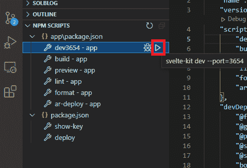
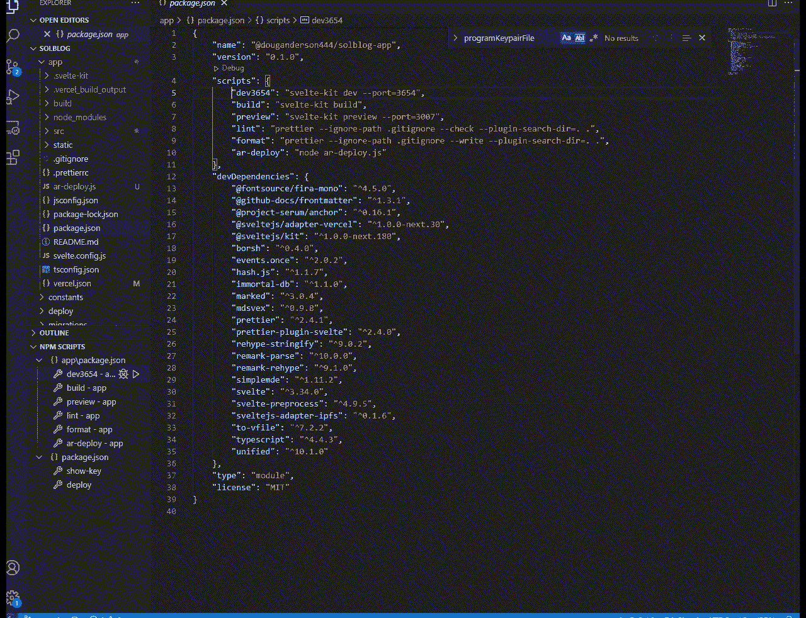

# 介绍

> 原文:[https://github . com/fig ment-networks/learn-tutorials/blob/master/Solana/sol-anchor-blog . MD](https://github.com/figment-networks/learn-tutorials/blob/master/solana/sol-anchor-blog.md)

[](https://github.com/figment-networks/learn-tutorials/raw/master/assets/solblog.svg)

一个简单的博客平台，由 Solana 开发，前端简洁。

*   茄属植物(锈病)
*   锚(Rust 宏+ IDL 生成)
*   Svelte & SvelteKit (JavaScript 前端)

YouTube 上关于建造铁锈部分的视频:

{ % embed URL = "[https://youtu.be/w-n87Aq3f8k](https://youtu.be/w-n87Aq3f8k)" caption = " sol blog-Solana 用 Anchor 搭建的博客平台" %}

在这篇文章中，我们将使用 Solana 上保存的数据创建一个简单的简短但功能齐全的博客。我们将使用 Anchor 框架来演示如何使用 Anchor。

我们正在建立一个博客发布平台，因为它是一种大多数人都熟悉的简单网络格式。博客有一个简单的数据结构:一个博客作者和他们的博客文章。这个在 Solana 网络上存储数据的例子是一个简单的学习方法。

我们将在本教程中介绍锚设置和锚程序构建，并触及 JavaScript 前端以及它如何与锚程序交互。

# 主播为你做什么

用 Rust 语言构建 Solana 程序可能很困难。每当您想要保存或检索帐户中的数据时，您都需要考虑打包/解包数据、序列化/反序列化数据和格式，这些都是真正的痛苦。

锚定抽象远离帐户的低层次结构，打包和解包，以及修改你的 Solana 程序的接口。这是通过将样板文件捆绑到 rust 宏中实现的！这给了 Anchor 的用户很多快捷方式和速度来构建 Solana 程序。

一个索拉纳应用程序总是有两个部分——*上链*程序和账户，以及与之交互的*下链*应用程序。Anchor 带来的另一个好处是这两个应用程序部分之间的交互对齐。这种对齐被称为接口描述语言 [(IDL)](https://en.wikipedia.org/wiki/Interface_description_language) 。由于离线应用程序的界面(比如说 JavaScript)必须总是与在线 Solana 程序相匹配，这是一个非常方便的特性。


# 先决条件

先验知识:

*   完整的 Solana 101 途径
*   对 Rust & Solana 有基本了解者优先。
*   基本的 JavaScript 知识
*   基本命令行界面用法

# 技术要求

我们将在整个教程中使用这些安装的工具:

*   Linux 命令行界面
*   根据下面的设置部分安装锚和铁锈
*   Phantom.app Solana Wallet，有一个你在 DevNet 上使用起来很舒服的地址(如果你喜欢，可以在 Phantom 中创建一个新地址)

## 锚点版本

重要的是要理解 Anchor 是新的，API 可能会随着开发的进行而改变。这些方向现在是有效的，但是如果/当有突破性的变化时，将来可能会不同。但是总的总体概念保持不变。

本教程我用的是 v 0.16.1。

```
anchor --version
anchor-cli 0.16.1 
```

# 设置

开始使用 Anchor 相当简单，你可以按照 Anchor 网站上的[设置说明进行操作。](https://project-serum.github.io/anchor/getting-started/installation.html)

对于测试环境，您可以选择[安装一个本地验证器](https://docs.solana.com/developing/test-validator)或者使用 [Devnet online](https://explorer.solana.com/?cluster=devnet) 。我们将部署到 Solana Devnet，在现实生活中练习部署。俗话说，*“早部署，勤部署”*！您最不希望的事情是您的代码在开发环境中工作，而不是在生产环境中工作。

一旦你安装了所有的锚依赖，是时候启动一个项目了！

## 初始化锚定项目

启动一个项目非常简单。在命令行中——如果您使用的是 Windows，请使用 Windows Subsystem for Linux 2 (WSL2 ),因为 Solana 工具链的 Berkeley Packet Filter (BPF)编译器部分不能在常规的 Windows 中工作。

不要新建文件夹！主播会给你新建一个:)

```
anchor init solblog 
```

这将创建一个文件夹，并将锚启动器放在该目录中。从这里，我们可以建立我们的应用程序。

## 项目文件夹

我们首先最感兴趣的文件夹是:

```
|
├── programs
|   └── solblog
|        └── src
|             └── lib.rs 
```

默认情况下，Anchor 为我们提供了一些基本的启动代码。

```
// programs/solblog/src/lib.rs

use anchor_lang::prelude::*;

declare_id!("Fg6PaFpoGXkYsidMpWTK6W2BeZ7FEfcYkg476zPFsLnS");

#[program]
pub mod solblog {
    use super::*;
    pub fn initialize(ctx: Context<Initialize>) -> ProgramResult {
        Ok(())
    }
}

#[derive(Accounts)]
pub struct Initialize {}
```

让我们分解一下我们所看到的。


包含锚库后，程序公钥有如下占位符:

```
declare_id!("Fg6PaFpoGXkYsidMpWTK6W2BeZ7FEfcYkg476zPFsLnS");
```

这个默认密钥不是我们为您的版本*准备的公钥。你需要为你的程序生成它。我们一次生成它，然后包含它，并且可以在部署之前根据需要做尽可能多的更改。*

因为这不是我们的密钥，让我们现在修复它并生成我们的密钥。

运行:

```
cd solblog
anchor build 
```

随着这个过程的进行(需要一分钟)，观察你的目标文件夹，因为它现在是空的。

```
|
├── programs
|   └── solblog
|      └── src
|         └── lib.rs
├── target
|   └── rls 
```

一旦构建完成，观察目标文件夹是如何变化的，这就有点麻烦了:

```
|
├── programs
|   └── solblog
|      └── src
|         └── lib.rs
├── target
|   └── idl
|   └── deploy
|           solblog.so
|           solblog-keypair.json 
```

我们新生成的代码公钥就在那个新的`./target/deploy`文件夹中，去看看吧！

要显示我们将用作 id 的程序公钥，只需运行:

```
solana address -k ./target/deploy/solblog-keypair.json 
```

向我们展示了我们独特的钥匙:

```
BLoG9PtBTkhUbGRAYVe8jzd5ji1G2VPkzwbsRV3bnteD 
```

你的钥匙看起来会不一样，没关系。Anchor 将为每个人生成一个唯一的密钥对，这是我们能够唯一地识别彼此程序的方式。

如果你正在跟踪这个教程报告，我已经在`package.json`文件中放置了这个脚本的快捷方式，所以你可以简单地在终端中运行`npm run show-key`(只要它是 wsl 2/Linux——rust 工具链在 Windows 中不工作)。

复制并粘贴您密钥，替换默认的`declare_id`占位符:

```
declare_id!("SoMeKeyThatIsUniqueTOmyPROGRAM");
```

我们还需要在客户端的`app\src\lib\anchorClient.js`中包含相同的程序 ID

```
// app/src/lib/anchorClient.js

// programId is the program public key, SoMeKeyThatIsUniqueTOmyPROGRAM
const program = new anchor.Program(idl, programId, provider)
```

一旦我们构建了客户端，我们将会到达那个部分。此时我唯一要强调的是，javascript 中的客户端必须与 Rust 中的程序端相匹配。现在，让我们看完 Rust 代码。


在`#[program]`下面的下一个代码块是我们程序的函数，我们如何让程序做任何事情。这里的函数名是小写的 snake_case。


注意`#[derive(Accounts)]`结构与`program`中的名字相同，但是在`camelCase`中(而`snake_case`在上面的程序中使用)。

`#[derive(Accounts)]`下的下一个代码块是一个 to be 结构，它描述了帐户本身，并使我们能够从 account 结构中访问字段(此时该结构不存在)。让我们创建它:


```
#[account]
pub struct BlogAccount {
    pub authority: Pubkey,    // save the posting authority to this authority field
    pub latest_post: Vec<u8>, // <-- where the latest blog post will be stored
}
```

我们创建了第三个样式代码块，这是一个 Account 结构，它是一个保存我们数据的 Solana 帐户。我们将向该帐户保存两条数据:

1.  博客`authority`:你需要有这个密钥对才能发帖，
2.  最新的博客帖子。

现在我们有了创建博客所需的三个锚块:


但是现在我们的程序什么都不做，因为我们的程序方法是空的。

# 编写 Rust 函数

在`initialize`中，我们想要设置我们的博客账号`authority`。我们将把`authority`设置为与签署交易的密钥相同的公钥。

但是，为了访问`initialize()`中的`authority`,我们需要:

1.  BlogAccount 必须是创建的帐户
2.  博客账户必须有人支付
3.  BlogAccount 必须分配足够的空间来存储我们的数据
4.  `initialize`必须有权访问 BlogAccount 上的`authority`字段
5.  `authority`必须签署`initialize`交易请求

Anchor 使用他们的宏使这变得简单:

```
#[derive(Accounts)]
pub struct Initialize<'info> {
    #[account(
 init, // 1\. Hey Anchor, initialize an account with these details for me
 payer = authority, // 2\. See that authority Signer (pubkey) down there? They're paying for this
 space = 8 // 3.A) all accounts need 8 bytes for the account discriminator prepended to the account
 + 32 // 3.B) authority: Pubkey needs 32 bytes
 + 566 // 3.C) latest_post: post bytes could need up to 566 bytes for the memo
 // You have to do this math yourself, there's no macro for this
 )]
    pub blog_account: Account<'info, BlogAccount>, // 1\. <--- initialize this account variable & add it to Context.accounts.blog_account can now be used above in our initialize function
    pub authority: Signer<'info>, // 5\. <--- let's name the account that signs this transaction "authority" and make it mutable so we can set the value to it in `initialize` function above
    pub system_program: Program<'info, System>, // <--- Anchor boilerplate
}
```

为了在我们的`initilize`功能中使用`blog_account`和`authority`，在`#[derive(Accounts)]`中的`#[account]`宏连接了我们需要的所有连接。所以现在我们可以在函数中使用`blog_account`和`authority`:

```
#[program]
pub mod solblog {
    use super::*;
    pub fn initialize(
        ctx: Context<Initialize>, // <-- Anchor context that holds all the account data (structs) below
    ) -> ProgramResult { // <--- These functions are snake_case of the CamelCase struct below
        let b_p_a = &mut ctx.accounts.blog_account; // grab a mutable reference to our BlogAccount struct
        b_p_a.authority = *ctx.accounts.authority.key; // set the BlogAccount.authority to the pubkey of the authority
        Ok(()) // return the Result
    }
```

* * *

一旦 Anchor 帮助我们`initilize`了我们的帐户并设置了博客`authority`，现在我们实际上想要保存一些数据到我们的博客帐户。我们遵循类似的步骤:

首先，我们通过编写一个额外的`#[derive(Accounts)]`结构来创建我们的锚点。同样，我们想要访问`blog_account`,所以我们需要包含它。我们正在改变`latest_post`，所以`blog_account`需要是可变的，因此有了`#[account(mut)]`，但是我们也需要交易被博主签名，所以它也需要包含`authority`作为`Signer`。结果看起来像这样:

```
#[derive(Accounts)]
pub struct MakePost<'info> {
    #[account(
 mut, // we can make changes to this account
 has_one = authority)] // the authority has signed this post, allowing it to happen
    // this is here again because it holds that .latest_post field where our post is saved
    pub blog_account: Account<'info, BlogAccount>, // <-- enable this account to also be used in the make_post function
    // Also put authority here
    // has_one = authority ensure it was provided as a function arg
    // ensures the poster has the keys
    // has to come after the Account statement above
    // no mut this time, because we don't change authority when we post
    pub authority: Signer<'info>
}
```

既然这个锚结构已经给了我们访问这些字段的权限，我们可以在`#program`下的第一个代码块中使用它们:

```
    pub fn make_post(
        ctx: Context<MakePost>,
        new_post: Vec<u8> // <--- our blog post data
    ) -> ProgramResult {
        let post = from_utf8(&new_post) // convert the array of bytes into a string slice
            .map_err(|err| {
            msg!("Invalid UTF-8, from byte {}", err.valid_up_to());
            ProgramError::InvalidInstructionData
        })?;
        msg!(post); // msg!() is a Solana macro that prints string slices to the program log, which we can grab from the transaction block data

        let b_acc = &mut ctx.accounts.blog_account;
        b_acc.latest_post = new_post; // save the latest post in the account.
        // past posts will be saved in transaction logs

        Ok(())
    }
```

我们的`make_post`函数在这里被分解成几个步骤:

首先，我们将`new_post`作为函数的参数:

```
new_post: Vec<u8> // <--- our blog post data
```

我们的博客文章将是字符串，但我们不知道这些字符串有多长。是的，我们可以将它们填充到一定的大小，但是字符串实际上只是一个字节数组。在 Rust 中，我们可以将我们的字节数组描述为一个 u8 字节的 Rust 向量(`Vec<u8>`)，因为 UTF8 字符串基本上只是一个 u8 字节的数组[。这将使我们的 Rust 生活更容易，因为我们不必担心 Rust 中未知的长度，另外我们可以通过使用](https://doc.rust-lang.org/std/string/struct.String.html#method.from_utf8) [UInt8Array](https://developer.mozilla.org/en-US/docs/Web/JavaScript/Reference/Global_Objects/Uint8Array) 类型轻松地将 UTF8 字符串转换为 javascript 中的 u8 数组。所以是个`Vec<u8>`。

接下来，我们将`Vec<u8>`转换成一个字符串片(`&str`)，并包含一些错误处理，以防我们没有得到有效的 UTF8:

```
let post = from_utf8(&new_post) // convert the array of bytes into a string slice
	.map_err(|err| {
	msg!("Invalid UTF-8, from byte {}", err.valid_up_to());
	ProgramError::InvalidInstructionData
})?;
```

最后，我们将博客文章打印到程序日志中:

```
	msg!(post); // msg!() is a Solana macro that prints string slices to the program log, which we can grab from the transaction block data
```

我们打印到程序日志的原因是:我们的 BlogAccount 只保存最新的帖子...那么如果我们想看以前的帖子呢？我们可以简单地调出以前保存的日志，然后就可以了。或者，我们可以为每个帖子创建一个帐户，但这是一个非常“昂贵”的开销，几乎没有什么好处，而保存到程序日志是“交易定价”($0.00025)，我们只需要为一个帐户付费(这非常便宜，但为什么要支付更多？).

最后，我们从上下文(`ctx`)中获取`accounts`，并选择`blog_account`作为我们将要使用的(我们只有一个，但您可以有更多)，这样我们还可以将最近的帖子保存到帐户(`BlogAccount`):

```
	let b_acc = &mut ctx.accounts.blog_account;
	b_acc.latest_post = new_post; // save the latest post in the account.
```

我们的 Rust Solana 程序已经完成，是用 Rust 编写的！现在我们完成了，我们需要再次构建，以便 Solana 构建使用我们最新的代码:

在项目根目录中，运行:

```
anchor build 
```

确保在项目的根文件夹中运行 anchor build，anchor 会处理剩下的工作。

# 部署到 Devnet

现在我们的 Rust 程序已经在 Anchor 的帮助下编写好了，是时候部署到 Devnet 了。

要在 devnet 上部署 anchor 程序，一个小的助手脚本来设置一些键，通过 airdrop 提供资金，然后使用 anchor deploy 部署到 devnet 肯定会很棒。这包括在本教程中！

部署代码保存在`./deploy.js`。让我们浏览一下使用 anchor 部署到 Solana 的必要部分。

我们需要两个密钥对来部署:

1.  我们的项目权威密钥对，以及
2.  我们的节目关键搭档

我们可以使用 [solana-web3.js](https://solana-labs.github.io/solana-web3.js/classes/Keypair.html#generate) 库生成一个程序权限密钥对:

```
// imported by deploy.js

import { Keypair } from "@solana/web3.js"

let programAuthorityKeypair = new Keypair()
```

为了部署我们的代码，我们需要在新创建的帐户中使用加密货币 SOL。在 Devnet 上，我们可以呼叫空投来为我们的账户提供资金。

```
// imported by deploy.js

import { Connection, LAMPORTS_PER_SOL } from "@solana/web3.js"

this.connection = new Connection("https://api.devnet.solana.com", "confirmed")

const signature = await this.connection.requestAirdrop(
    programAuthorityKeypair.publicKey,
    LAMPORTS_PER_SOL * 5
)
await this.connection.confirmTransaction(signature)
```

我喜欢使用库的常量`LAMPORTS_PER_SOL`,因为这样你可以确保得到一个完整的 SOL 或 2，只需乘以你需要的数量。对于这种部署，我们应该需要 2 - 3 个溶胶，所以让我们在那里放下 5 个溶胶，以确保我们不会被空投更多的麻烦。

现在我们已经创建并资助了项目授权帐户 keypair，让我们将它保存为一个 keyfile (json 文件),以便 Anchor 可以从命令行访问它:

```
// deploy.js

// ... [snip]

const programAuthorityKeyfileName = `deploy/programauthority-keypair.json`
const programAuthorityKeypairFile = path.resolve(
    `${__dirname}${SLASH}${programAuthorityKeyfileName}`
)

// ... [snip]

fs.writeFileSync(
    programAuthorityKeypairFile,
    `[${Buffer.from(programAuthorityKeypair.secretKey.toString())}]`
)

// ... [snip]
```

我们需要的第二个密钥对是我们的程序密钥对。这是在您运行`anchor build`时为您生成的，并保存在`target/deploy/solblog-keypair.json`中。我们需要从密钥对中获取程序 Id。我们*可以*只是复制和粘贴，或者我们可以通过编程检索密钥，就像这样:

```
// deploy.js

// ...[snip]
const SLASH = path.sep

const programKeyfileName = `target/deploy/solblog-keypair.json`
const programKeypairFile = path.resolve(
    `${__dirname}${SLASH}${programKeyfileName}`
)

let programKeypair = readKeyfile(programKeypairFile)

let programId = programKeypair.publicKey.toString()
```

现在我们有了需要部署的两个密钥！

Anchor 中要部署的命令是`anchor deploy`，我们希望从我们的部署脚本中调用它。让我们使用 Nodejs 生成一个子流程，以编程方式调用它:

```
// deploy.js

let method = ["deploy"] // we are deploying for the first time, using 'deploy'

spawn.sync(
    "anchor",
    [
        ...method, // we use a variable so we when we want to upgrade, we can use 'upgrade' instead
        "--provider.cluster", // we want to specify the node cluster
        "Devnet", // the node cluster as the Devnet
        "--provider.wallet", // we need to pass in a keyfile to pay for the deployment
        `${programAuthorityKeypairFile}`, // this is the keypair file we created just a moment ago
    ],
    { stdio: "inherit" }
)
```

如果我们想在初始部署后更新我们的程序，我们可以使用`anchor upgrade`来代替。我们需要指定要升级的程序，并指定要替换的构建代码。所以我们得到:

```
// deploy.js

let method = [
    "upgrade", // we use upgrade to modify the program
    "target/deploy/solblog.so", // specify where the built code is from 'anchor build'
    "--program-id", // specify the programId
    programId,
]

spawn.sync(
        "anchor",
        [
            ...method, // use spread operator to expand our array into individual elements

// ... [snip]
// ... rest is the same
```

本教程包含完整代码的完整功能版本。

现在我们已经构建了我们的`deploy.js`脚本，我们可以使用`node`来运行该脚本，或者使用`package.json`中的快捷脚本，它可以方便地运行:

```
npm run deploy 
```

(或)

```
node ./deploy.js 
```

deploy 脚本创建一个新的 keypair 来为您支付部署费用，用一些 SOL 为它提供资金，并将其部署到 Devnet。

由于本教程是关于锚的，我将忽略掉那个`deploy.js`脚本中的一些细节，直接跳到有趣的锚点，它们是:

```
// ./deploy.js

//... [snip]

method = ["deploy"]

//... [snip]

spawn.sync(
    "anchor",
    [
        ...method,
        "--provider.cluster",
        "Devnet", // or on Figment DataHub, https://solana--devnet.datahub.figment.io/apikey/yourApiKeyHere/
        "--provider.wallet",
        `${programAuthorityKeypairFile}`,
    ],
    { stdio: "inherit" }
)
```

当选择部署时，您可以使用 Solana 的 Devnet 或者选择 Figment 的 DataHub 来部署程序。

要使用 Figment 的 Datahub，请进入[https://data hub . fig ment . io](https://datahub.figment.io)->记账(免费)- >从协议中选择 Solana->在您的仪表盘上获取 API 密钥和端点。现在，您可以在本教程中使用相同的方法，将集群设置为 Figment 的 datahub！

您可能需要考虑 Figment 端点，因为公共端点(例如本地 Devnet)有一些限制，如速率限制、延迟、每日请求。限额/配额等。然而，DataHub 解决了所有这些问题，打破了开发人员在扩展项目时遇到的障碍。我自己在使用 Devnet 时也遇到了一些这样的问题，所以这对你来说也是一个值得考虑的问题。

第一次运行时，部署脚本使用`anchor deploy`，而在*中，后续的*使用相同的程序进行部署，为了方便起见，它将使用带有所有必需标志的`anchor upgrade`:

```
// ./deploy.js

	method = [
		"upgrade",
		"target/deploy/solblog.so", // specify the .so file
		"--program-id", // specify the program to upgrade -- you must have the authority though!
		programId,
	]

	//... [snip]

    spawn.sync(
        "anchor",
        [
            ...method,

	// ... etc, same as deploy
```

这是因为在随后的部署中，我们希望 Anchor 使用相同的`programId`和程序权限来升级我们的程序，所以除了代码之外的一切都保持不变。这很重要，因为我们希望我们的程序地址保持不变，这样用户就不必在每次升级软件时都换一个新地址。

最后，`deploy.js`脚本还会将您的密钥保存为 dapp-starter 样式。json 文件，便于参考。但是您会看到，我还将密钥文件保存为`.json`字节，这样它们就可以被命令行中的 Anchor 命令使用，因为我们是通过 CLI 而不是通过编程来使用 Anchor 的。

当您运行这个`deploy.js`代码时，您可以看到结果是 Anchor 已经用所有必要的胶水填充了我们的基本起点以使 Solana 程序工作，现在它已经被编译为 149kb 大小的文件准备用于区块链，并且实际部署将花费大约 2 SOL 来部署。

```
|
├── target
|   └── deploy
|       └── solblog.so   149kb 
```

现在程序已经部署到 Solana Devnet 上，我们可以从我们的 Svelte 应用程序中的客户端代码访问它，并开始写博客。

让我们构建客户端前端来与我们的程序接口！

# 客户端设置

Anchor 与客户端和程序端一样重要。我们的程序已经完成，我们的 IDL 也已经构建好了，所以剩下的工作就是构建一个前端来使用它。

虽然我为此选择了使用 Svelte，但是任何前端都可以使用。我们将把我们的锚客户端代码放在一个名为`anchorClient.js`的文件中，它可以被任何框架或纯 JS 使用。

因此，我将直接进入`anchorClient.js`设置，然后为那些希望继续关注该部分的人介绍 SvelteKit 集成。

# 打造我们的主播客户

我们有 IDL.json，它描述了我们如何使用我们的应用程序，但是我们需要构建一些处理程序来调用远程过程调用(RPC)。

现在让我们从客户端看一下`initialize()`函数。

为了在程序中调用初始化函数，我们首先需要一个 javascript 中的等价函数。看起来是这样的:

```
// anchorClient.js
// location: app\src\lib\anchorClient.js

import * as anchor from '@project-serum/anchor'; // includes https://solana-labs.github.io/solana-web3.js/
const { SystemProgram } = anchor.web3; // Added to initialize account

// .. [snip]

async initialize() {
	// generate an address (PublciKey) for this new account
	let blogAccount = anchor.web3.Keypair.generate(); // blogAccount is type Keypair

	// Execute the RPC call
	const tx = await this.program.rpc.initialize({
		// Pass in all the accounts needed
		accounts: {
			blogAccount: blogAccount.publicKey, // publickey for our new account
			authority: this.provider.wallet.publicKey, // publickey of our anchor wallet provider
			systemProgram: SystemProgram.programId // just for Anchor reference
		},
		signers: [blogAccount] // blogAccount must sign this Tx, to prove we have the private key too
	});
	console.log(
		`Successfully intialized Blog ID: ${blogAccount.publicKey} for Blogger ${this.provider.wallet.publicKey}`
	);
	return blogAccount;
}
```

有几个对资产的引用我们还没有编码进去，比如`this.program`,但是我们会在我们的设置构造函数中进行编码。

Anchor 的 RPC 性质意味着我们所有的功能都是通过`program.rpc.<method name>`公开的。所以我们的 make_post 调用看起来非常相似:

```
// anchorClient.js
// location: app\src\lib\anchorClient.js

async makePost(post, blogAccountStr) {
	// convert our string to PublicKey type
	let blogAccount = new anchor.web3.PublicKey(blogAccountStr);

	const utf8encoded = Buffer.from(post); // anchor library doesn't like UInt8Array, so we use Nodejs buffer here

	// Execute the RPC.
	const tx = await this.program.rpc.makePost(
		// input must be compatible with UTF8 Vector in rust
		utf8encoded,
		// now pass the accounts in
		{
			accounts: {
				blogAccount: blogAccount, // needs to be the same publicKey as init, or it won't work
				authority: this.program.provider.wallet.publicKey // needs to be the same publicKey as init, or it won't work
			},
			signers: [this.program.provider.wallet.payer] // needs to be the same keyPAIR as init, or it won't work
		}
	);
	console.log(
		`Successfully posted ${post} to https://explorer.solana.com/address/${blogAccount}?cluster=devnet`
	);
	return tx;
}
```

为了让这些调用工作，我们需要这个`this.program`，你可以看到它在任何地方都被使用，所以让我们来处理它。

# 正在创建程序。*

我们通过调用类构造函数来创建`program`:

```
// anchorClient.js
// location: app\src\lib\anchorClient.js
export default class AnchorClient {
	constructor({ programId, config, keypair } = {}) {
		this.programId = programId || getDevPgmId();
		this.config = config || solConfigFile.development.config;
		this.connection = new anchor.web3.Connection(this.config.httpUri, 'confirmed');
		console.log('\n\nConnected to', this.config.httpUri);

		const wallet =
			window.solana.isConnected && window.solana?.isPhantom
				? new WalletAdaptorPhantom()
				: keypair
				? new anchor.Wallet(keypair)
				: new anchor.Wallet(anchor.web3.Keypair.generate());
		// maps anchor calls to Phantom direction
		this.provider = new anchor.Provider(this.connection, wallet, opts);
		this.program = new anchor.Program(idl, this.programId, this.provider);
	}
```

我们来剖析一下这是怎么回事。

为了启动`anchor.program`，我们需要三样东西:

1.  国际日期变更线
2.  ProgramID，以及
3.  钱包提供商

我们的`IDL` ( `json`文件)与我们的 rust 程序一起保存在:

```
|
├── target
|   └── idl
|      └── solblog.json 
```

在使用 Vite 的 SvelteKit 中，我们可以通过简单的操作将`json`导入到我们的代码中:

```
// anchorClient.js

// Read the generated IDL
import idl from "../../../target/idl/solblog.json"
```

如果您使用不同的前端框架，您可能需要改变这一点。但是对于本教程，它是有效的。

其次，我们的`programId`是我们运行`anchor build`时生成的程序密钥对的`publicKey`，还记得吗？

```
|
├── target
|   └── deploy
|           solblog-keypair.json 
```

类似于前面的`json`文件，我们可以通过导入将这个`programId`引入到我们的代码中:

```
// anchorClient.js

import solblog_keypair from "../../../target/deploy/solblog-keypair.json"

// ... [snip]

const getDevPgmId = () => {
    // get the program ID from the solblog-keyfile.json
    let pgmKeypair = anchor.web3.Keypair.fromSecretKey(
        new Uint8Array(solblog_keypair)
    )
    return new anchor.web3.PublicKey(pgmKeypair.publicKey) // Address of the deployed program
}
```

当你想在生产中使用一个`program`，而不是调用`getDevPgmId()`时，你可以简单地将`programId`传递给构造函数。

最后，我们需要一个钱包。Anchor 为我们提供了使用以下方式创建提供商的选项:

```
new anchor.Provider(connection, wallet, opts)
```

连接非常简单，我们只需使用 [Solana Web3 库](https://solana-labs.github.io/solana-web3.js/)(由 Anchor 重新导出)并传入一个 Solana 网络端点，如 devnet:

```
// anchorClient.js

connection = new anchor.web3.Connection(
    "https://api.devnet.solana.com",
    "confirmed"
)
```

对于一个`Wallet`，主播只提供一个`Nodejs`钱包。但是因为我们希望我们的代码在浏览器中运行，我们需要提供一个`keypair`或者一个到钱包提供者的映射，比如 Phantom wallet。为了简单起见，我为钱包提供者选择了 Phantom Wallet。`WalletAdaptorPhantom`简单地将幻像函数映射到锚点 loosk 的目的:

```
// WalletAdaptorPhantom
// app\src\lib\helpers\wallet-adapter-phantom.ts

export class WalletAdaptorPhantom {
    constructor() {
        if (!window.solana.isConnected)
            throw new Error("Connect to Phantom first")
        return
        this.publicKey = window.solana.publicKey
    }

    async signTransaction(tx: Transaction): Promise<Transaction> {
        const signedTransaction = await window.solana.signTransaction(tx)
        return signedTransaction
    }

    async signAllTransactions(txs: Transaction[]): Promise<Transaction[]> {
        const signedTransactions = await window.solana.signAllTransactions(
            transactions
        )
        return signedTransactions
    }

    get publicKey(): PublicKey {
        return window.solana.publicKey
    }
}
```

这意味着制作钱包本质上变成了:

```
// anchorClient.js
const wallet = new WalletAdaptorPhantom()
```

...万一幻影不是钱包的选择。用户可以选择传入一个密钥对，或者代码将生成一个随机的密钥对作为备份。在生产中，用户会希望使用一个像 Phantom 这样的钱包，但是在开发模式下，我们可以使用虚构的密钥，因为我们可以调用`airDrop(publicKey)`来为我们的帐户提供资金。

现在我们有了连接，有了钱包，我们就有了提供商，有了提供商，我们就有了 rpc 客户端，我们就可以打电话了。唷！

应用程序的其余部分集成了`initialize`和`makePost`以及`solana-web3.js`呼叫来与程序交互。

# 苗条套装

你可以在任何框架中使用 Anchor 和这些教程库，比如 React、Vue 或 Svelte。我选择用苗条的身材来展示这一点，下面是一些通过苗条的镜头使用库的前端技巧。但是它们也可以应用于任何其他框架。

在设置和关注客户端代码的 Anchor RPC 和 Solana-Web3.js 部分之后，我们可以看到一点 Svelte 设置，这在 Svelte 网站上是非常标准和容易的:

苗条的[设置](https://kit.svelte.dev/docs#introduction-getting-started)很简单:

```
npm init svelte@next ./app
cd app
npm install 
```

为安装步骤选择完整的应用默认设置。

现在我们可以添加我们的锚 javascript 代码来为我们的博客提供 Solana 数据！

为了使用 javascript 中的 anchor，我们安装了 anchor 库:

```
npm install @project-serum/anchor --save 
```

当您试图在客户端浏览器代码中使用 Solana 或 Anchor 库时，可能会遇到一些 gotchyas。

## Gotchya #1 -缓冲区未定义

由于 Anchor 使用 borsh，为了让全局变量工作，你可能需要添加一点小技巧。在 Svelte 中，如果我们在页面布局中粘贴一些东西，它将应用于所有的布局，所以我们将在这里添加我们的 hack，以便与导入的锚点库一起工作:

```
// location: app\src\routes\__layout.svelte
// Svelte layouts are code that apply to ALL pages, so we only add it once here:

import { onMount } from "svelte"

import Header from "$lib/header/Header.svelte"
import "../app.css"

onMount(async () => {
    // setup some globals
    import("buffer").then((Buffer) => {
        global.Buffer = Buffer.Buffer
    })
})
```

## Gotchya #2 -在 onMount()中导入

另一个问题是 solana / anchor 代码不是同构的，这意味着它不能在 Nodejs 和浏览器中很好地运行。强制前端框架(如 Svelte)只使用浏览器版本(并跳过整个服务器端渲染，或 SSR)的方法是在浏览器端代码中使用`import`，在 Svelte 的情况下，在 onMount()中:

```
// paste this in any file where you want solana libraries to work in the browser
// such as
// app\src\routes\blog\[slug].svelte

import { loadAnchorClient } from "$lib/helpers/utils"

onMount(async () => {
    await loadAnchorClient()
})
```

其中`loadAnchorClient()`在`utils.ts`中定义为:

```
// location: app\src\lib\helpers\utils.ts

export const loadAnchorClient = async () => {
    let AnchorBlogLibrary = await import("$lib/anchorClient")
    anchorClient.update((_) => new AnchorBlogLibrary.default()) // establish our Solana connection & load our little library helpers
}
```

将我们的锚客户端的加载嵌入到浏览器端确保了任何非同构库的浏览器版本都被加载，并且我们不会得到任何令人讨厌的错误。

# 客户地址密钥对摘要

在整个过程中使用了许多关键配对，这可能会有点令人困惑:

1.  ProgramId(保存在。/target/deploy/sol blog-key pair . JSON)
2.  程序权限:支付部署和升级程序的费用。它是钱包提供者(program.wallet.publicKey)
3.  交易费支付者(可以与计划机构相同，但也可以不同)
4.  博客发布机构(通常与付款人和机构相同)
5.  博客账号(key 仅作为地址使用，programId 实际上拥有这个账号。一旦初始化，私钥就没用了，因为帐户归 programId 所有，只有 programId 可以编辑帐户)

回想一下，ProgramId 是在第一个`anchor build`期间创建的

在`deploy.js`中的第一次部署调用`npm run deploy`期间创建并资助程序升级授权密钥

BlogAccount 密匙是在初始化过程中动态创建的，但是如果你有理由选择你的密匙，它*可以*被传入，但是这是非常额外的。

# 运行应用程序

最后，导航到`./app`并运行`npm run dev`将启动这个苗条的应用程序，并把你带到主屏幕。

```
cd ./app
npm run dev 
```

如果使用精确的教程代码库，可以使用`npm run dev3654`。

如果您使用 Visual Studio 代码作为您的 IDE，并且您想要一个快捷方式，您也可以在“npm”选项卡中单击“运行开发”。

[](https://github.com/figment-networks/learn-tutorials/raw/master/assets/ms-vs-code-npm-run.png)

打开您的浏览器到`http://localhost:3000`开始玩吧！



# 结论

恭喜你！您已经学习了如何编写一个锚程序并将其部署到 Solana Devnet，并在 JavaScript 中与它交互以发布和检索帖子。

请记住，此代码不是为生产而设计的！如果您想将它部署到 mainnet，还需要考虑一些其他的事情，比如更健壮的钱包集成和单元测试。然而，本教程已经为您提供了构建的基础！

# 后续步骤

博客程序是一个非常基本的智能合同。你能从哪些方面让它做得更多？你现在可以继续尝试添加其他功能，如个人简介或关于部分。或者，您可以尝试 next 集成 Solana 的“跨程序调用”(CPI)来让博客程序调用其他程序，也许是基于一个帖子在其他人的程序中触发一个事件(也许是一个令牌事件，比如铸造或焚烧令牌？).唯一的限制是你的想象力。下一步你会选择什么？

# 关于作者

本教程由道格·安德森撰写。道格是一名计算机工程师，也是加拿大皇家海军的退役海军工程军官。通过@DougAnderson444 在 twitter 和其他地方与道格联系

# 参考

*   Web3.js 库[https://solana-labs.github.io/solana-web3.js/](https://solana-labs.github.io/solana-web3.js/)
*   主播网站[https://project-serum.github.io/anchor/](https://project-serum.github.io/anchor/)
*   锚锈文件[https://docs.rs/anchor-lang/0.16.1/anchor_lang/](https://docs.rs/anchor-lang/0.16.1/anchor_lang/)
*   感谢 Decentology DappStarter 提出了如何以编程方式部署 Solana 程序的想法[https://dappstarter.decentology.com/](https://dappstarter.decentology.com/)
*   fig ment Solana RPC API[https://docs . fig ment . io/network-documentation/Solana/RPC-and-rest-API](https://docs.figment.io/network-documentation/solana/rpc-and-rest-api)
*   虚拟数据中心[https://datahub.figment.io/](https://datahub.figment.io/)