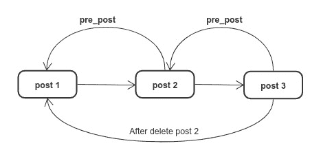

# 介绍

> 原文：<https://github.com/figment-networks/learn-tutorials/blob/master/solana/sol-blog-dapp.md>

在本教程中，我们将学习如何创建一个简单的关于索拉纳区块链的博客文章 dapp。在构建这个 dapp 时，我们将学习如何编写 Solana rust 程序，测试该程序，并最终将该程序与 React 前端集成。

**最终 Dapp**


# 先决条件

本教程假设您已经，

*   对 React.js 的基本了解
*   对铁锈的基本认识
*   完成[茄 101 途径](https://learn.figment.io/protocols/Solana)

# 要求

本教程介绍了如何在 Solana 上构建 dapp，但没有介绍各个依赖项的安装(因为它假设您已经完成了 Figment learn 上的 Solana 101 途径)。

*   **Anchor 框架-** Anchor 是一个用于 Solana dapp 开发的框架，它提供 DSL 来与 Solana 程序交互。如果你熟悉发展中的坚实，松露或安全帽，然后考虑 DSL 相当于 ABI。按照指南安装[锚](https://project-serum.github.io/anchor/getting-started/installation.html#install-rust)连同铁锈和茄碱。

*   **React.js -** 为了与我们的 Solana 程序进行交互，我们将使用 React.js 创建客户端应用程序。

*   幻影钱包- 幻影是一个数字钱包，可以让你将你的加密账户连接到任何一个建立在索拉纳区块链上的 dapp。我们将使用幻影钱包连接到我们的博客 Dapp。

*   我将推荐使用 Vs code 和 rust analyzer 扩展，因为它对 rust 语言有很好的支持。

# 索拉纳规划模型

**Program -** Solana 是一款快速且低成本的区块链，实现速度和低成本的 Solana 编程模式略有不同。Solana 使用 Rust 编程语言创建程序，因为，你注意到我们一直在说 Solana 程序，而不是 Solana 智能合同，从选择编程语言到命名概念，Solana 是不同的，在 Solana world 中，智能合同被称为 Solana 程序。

Solana 程序是无状态的，所以如果你想存储状态，你需要为它使用一个帐户，并且帐户的大小是固定的。一旦账户被初始化为这个大小，你就不能在以后改变它的大小，所以我们在设计我们的应用程序时必须记住这一点。

**租金-** 在 Solana 上，你需要定期支付租金，根据数据所需的空间在区块链上存储数据，如果帐户余额高于某个阈值(取决于其占用的空间),则可以免除租金(意味着你不必支付租金)。

# 应用设计决策

正如我们所知，我们需要一个帐户来创建我们的博客 dapp，它有一个固定的大小，所以，如果我们创建一个 X 大小的帐户，并开始在该帐户内推送帖子，最终该帐户将超过其大小限制，我们将无法创建新的帖子。如果你知道 Solidity，在 Solidity 中我们创建了一个动态数组，并向其中推送我们想要的尽可能多的项目，但在 Solana 中，我们的帐户大小是固定的，所以我们必须找到这个问题的解决方案。

*   **解决方案一-** 如果我们创建一个非常大的账户，比如千兆字节，会怎么样？在 Solana 上，我们需要根据帐户大小支付租金，因此，如果我们的帐户大小增加，帐户租金也会随之增加。

*   **解决方案二-** 如果我们创建多个账户并以某种方式将它们连接起来会怎么样？是的，这是计划。我们将为每个帖子创建一个新帐户，并创建一个接一个链接的帖子链。

链接<g-emoji class="g-emoji" alias="thinking" fallback-src="https://github.githubassets.cimg/icons/emoji/unicode/1f914.png">🤔</g-emoji>对，你猜对了。我们将使用 LinkedList 来连接所有的帖子。

# 建立地方发展

在我们开始实际开发之前。我们学习一些 Solana CLI 命令[文档](https://docs.Solana.com/cli/conventions):

要查看您当前的 Solana 配置，请使用(我假设您已经学习了 Solana 101 Pathway，并且已经完成了所有 CLI 安装):

```js
solana config get

Config File: /Users/user/.config/Solana/cli/config.yml
RPC URL: https://api.devnet.Solana.com
WebSocket URL: wss://api.devnet.Solana.com/ (computed)
Keypair Path: /home/user/.config/Solana/id.json
Commitment: confirmed 
```

您的输出可能有不同的文件路径。您可以通过以下方式查看当前钱包地址:

```js
solana address 
```

您可以查看您的钱包余额:

```js
solana balance 
```

或者，您可以向您的帐户空投代币:

```js
solana airdrop 1 <your-account-address> 
```

再次检查平衡。现在你的钱包里应该有 1 索尔的余额了。

**现在是时候在 Anchor CLI 的帮助下搭建我们的博客应用了:**

```js
anchor init blog
cd blog 
```

anchor init 命令创建以下目录:

```js
├── app
├── programs
|   └── blog
|        └── src
|             └── lib.rs
├── test 
```

在编写程序代码之前，更新 Anchor.toml

```js
wallet = "your Keypair Path from the output of solana config get" 
```

# 创建博客程序

现在我们准备开始索拉纳锈病计划。打开位于`/program/blog/src/`文件夹中的`lib.rs`文件。

```js
use anchor_lang::prelude::*;

declare_id!("Fg6PaFpoGXkYsidMpWTK6W2BeZ7FEfcYkg476zPFsLnS");

#[program]
pub mod blog {
    use super::*;
    pub fn initialize(ctx: Context<Initialize>) -> ProgramResult {
        Ok(())
    }
}

#[derive(Accounts)]
pub struct Initialize {}
```

这是一个锚索拉纳程序的基本例子。只有一个函数`initialize`，将由客户端调用。initialize 函数有一个`Initialize`结构的类型上下文参数。

另一个值得注意的是`declare_id!`，它是一个定义程序地址的宏，用于内部验证。我们不用想太多。这将由锚点 CLI 处理。

现在是时候开始声明我们博客应用的状态了。

```js
// pseudo code

blog {
 current_post_key    // latest post id so we can traverse back to other posts
 authority           // who owns the account
}

user {
 name                // store user name
 avatar              // user avatar
 authority           // owner
}

post {
 title              // post title
 content            // post descriptive content
 user               // user id
 pre_post_key       // to create LinkedList
 authority          // owner
} 
```

正如您在第一个基本示例中看到的，我们需要创建一些函数来定义我们希望在程序上执行的任务，如 init_blog、signup_user、create_post 等。

我们将从创建我们的第一个函数`init_blog`开始。

```js
 pub fn init_blog(ctx: Context<InitBlog>) -> ProgramResult {
        Ok(())
 }

 // define ctx type
  #[derive(Accounts)]
  pub struct InitBlog<'info> {
      #[account(init, payer = authority, space = 8 + 32 + 32)]
      pub blog_account: Account<'info, BlogState>,
      #[account(init, payer = authority, space = 8 + 32 + 32 + 32 + 32 + 8)]
      pub genesis_post_account: Account<'info, PostState>,
      pub authority: Signer<'info>,
      pub system_program: Program<'info, System>,
  }

  // from pseudo blog state
  #[account]
  pub struct BlogState {
      pub current_post_key: Pubkey,
      pub authority: Pubkey,
  }
```

众所周知，每个函数都需要一个类型化的上下文作为第一个参数。这里我们将`InitBlog`定义为`init_blog` ctx 的一种类型。在 ctx 类型中，我们必须定义帐户，该帐户将由客户端(函数的调用者)提供。

在`InitBlog`中有 4 个账户:

*   **博客 _ 账号**
    *   用于创建/初始化新帐户的 init 属性
    *   空间= 8 + 32 + 32。这里，我们正在创建一个新帐户，这就是为什么我们必须指定帐户大小。我们将在后面看到如何计算帐户大小。
    *   付款人=当局。权限是客户提供的账户之一。权威是 blog_account 的租金支付者。
*   **创世纪 _ 过账 _ 账户**
    *   我们还创建了这个帐户，这就是为什么有 init、payer 和 space 属性
    *   为了创建 LinkedList，我们用第一篇文章初始化博客帐户，这样我们就可以将它链接到下一篇文章。
*   权威
    *   程序签名者是博客的创建者。
*   系统 _ 程序
    *   运行时创建帐户所需的。

我们的计划是用 current_post_key 和 authority 作为博客状态来初始化博客帐户，所以让我们为此编写代码，

```js
  pub fn init_blog(ctx: Context<InitBlog>) -> ProgramResult {
      // get accounts from ctx
      let blog_account = &mut ctx.accounts.blog_account;
      let genesis_post_account = &mut ctx.accounts.genesis_post_account;
      let authority = &mut ctx.accounts.authority;

      // sets the blog state
      blog_account.authority = authority.key();
      blog_account.current_post_key = genesis_post_account.key();

      Ok(())
  }
```

使用 Anchor 框架创建一个保存一些状态数据的帐户是多么容易。

现在，我们将进入下一个功能，接下来我们可以做什么？？用户，用户注册。让我们定义注册功能，用户可以通过输入姓名和头像来创建他或她的个人资料。

```js
 pub fn signup_user(ctx: Context<SignupUser>) -> ProgramResult {
    Ok(())
 }
```

这是创建一个新功能的基本框架，但下面是我们如何从用户那里获得名字和头像？？让我们看看。

```js
 pub fn signup_user(ctx: Context<SignupUser>, name: String, avatar: String) -> ProgramResult {
    Ok(())
 }
```

我们可以接受 ctx 之后任意数量的参数，比如这里的 name 和 avatar 作为字符串(Rust 是一种静态类型化的语言，我们在定义变量的同时还要定义类型)。接下来是`SignupUser` ctx 类型和`UserState`状态。

```js
#[derive(Accounts)]
pub struct SignupUser<'info> {
    #[account(init, payer = authority, space = 8 + 40 + 120  + 32)]
    pub user_account: Account<'info, UserState>,
    pub authority: Signer<'info>,
    pub system_program: Program<'info, System>,
}

#[account]
pub struct UserState {
    pub name: String,
    pub avatar: String,
    pub authority: Pubkey,
}
```

这里，我们需要三个帐户，你已经在前面的函数中理解了所有的属性(如 init，payer，space ),所以，我在这里不再重复解释。但是我这次会给你解释一下怎么计算账户空间。为了衡量账户空间，我们需要看一下账户的状态。在 user_account 案例**中，UserState** 有 3 个值来存储姓名、头像和权限。

| 状态值 | 数据类型 | 大小(字节) |
| --- | --- | --- |
| 权威 | 公共密钥 | Thirty-two |
| 名字 | 线 | Forty |
| 阿凡达 | 线 | One hundred and twenty |

**Pubkey:** Pubkey 总是 32 字节，String 的大小是可变的，这取决于您的使用情况。

String: String 是一个字符数组，每个字符占用 rust 中的 4 个字节。

**账户鉴别器:**所有用锚创建的账户需要 8 个字节

接下来，让我们完成剩下的注册功能

```js
    pub fn signup_user(ctx: Context<SignupUser>, name: String, avatar: String) -> ProgramResult {
        let user_account = &mut ctx.accounts.user_account;
        let authority = &mut ctx.accounts.authority;

        user_account.name = name;
        user_account.avatar = avatar;
        user_account.authority = authority.key();

        Ok(())
    }
```

到目前为止，我们已经用名字和头像创建了 2 个函数`init_blog`和`signup_user`。具体来说，`signup_user`提出了两个论点。如果用户误发了错误的名字，用户想更新怎么办？？你猜对了。我们将创建一个功能，允许用户更新其帐户的名称和头像。

```js
  pub fn update_user(ctx: Context<UpdateUser>, name: String, avatar: String) -> ProgramResult {
      let user_account = &mut ctx.accounts.user_account;

      user_account.name = name;
      user_account.avatar = avatar;

      Ok(())
  }

 #[derive(Accounts)]
  pub struct UpdateUser<'info> {
      #[account(
 mut,
 has_one = authority,
 )]
      pub user_account: Account<'info, UserState>,
      pub authority: Signer<'info>,
  }
```

新属性:

*   **mut:** 如果我们想要更改/更新账户状态/数据，我们必须指定 mut 属性
*   **has_one:** has_one 检查 user_account.authority 等于 authority accounts key ie。user_account 的所有者是 update_user 函数的签署者(调用方)

我们的博客初始化了，用户创建了，现在还剩下什么？？邮报的垃圾。在下一节中，我们将研究 post 实体的 CRUD。如果你感到不知所措，休息一下或者复习一下我们到目前为止所学的内容。

现在，让我们来看看帖子的内容吧！！CRUD 代表创建读取更新删除。

```js
   pub fn create_post(ctx: Context<CreatePost>, title: String, content: String) -> ProgramResult {
        Ok(())
    }

    #[derive(Accounts)]
    pub struct CreatePost<'info> {
        #[account(init, payer = authority, space = 8 + 50 + 500 + 32 + 32 + 32)]
        pub post_account: Account<'info, PostState>,
        #[account(mut, has_one = authority)]
        pub user_account: Account<'info, UserState>,
        #[account(mut)]
        pub blog_account: Account<'info, BlogState>,
        pub authority: Signer<'info>,
        pub system_program: Program<'info, System>,
    }

    #[account]
    pub struct PostState {
        title: String,
        content: String,
        user: Pubkey,
        pub pre_post_key: Pubkey,
        pub authority: Pubkey,
    }
```

你怎么想呢?为什么我们这里需要 **blog_account** 作为 mut？你还记得**博客状态**中的**当前 _ 发布 _ 密钥**字段吗？再来看函数体。

```js
    pub fn create_post(ctx: Context<CreatePost>, title: String, content: String) -> ProgramResult {
        let blog_account = &mut ctx.accounts.blog_account;
        let post_account = &mut ctx.accounts.post_account;
        let user_account = &mut ctx.accounts.user_account;
        let authority = &mut ctx.accounts.authority;

        post_account.title = title;
        post_account.content = content;
        post_account.user = user_account.key();
        post_account.authority = authority.key();
        post_account.pre_post_key = blog_account.current_post_key;

        // store created post id as current post id in blog account
        blog_account.current_post_key = post_account.key();

        Ok(())
    }
```

帖子已创建，现在我们可以让客户端知道帖子已创建。客户端可以获取文章并将其呈现到 UI 中。Anchor 提供了一个发出事件的便利特性。？是的，你没看错。我们可以发出一个类似后创建的事件。在发出事件之前，我们需要定义它。

```js
#[event]
pub struct PostEvent {
    pub label: String, // label is like 'CREATE', 'UPDATE', 'DELETE'
    pub post_id: Pubkey, // created post
    pub next_post_id: Option<Pubkey>, // for now ignore this, we will use this when we emit delete event
}
```

让我们从`post_create`函数发出一个 post created 事件

```js
    pub fn create_post(ctx: Context<CreatePost>, title: String, content: String) -> ProgramResult {
        ....

        emit!(PostEvent {
            label: "CREATE".to_string(),
            post_id: post_account.key(),
            next_post_id: None // same as null
        });

        Ok(())
    }
```

接下来，更新帖子。

```js
    pub fn update_post(ctx: Context<UpdatePost>, title: String, content: String) -> ProgramResult {
        let post_account = &mut ctx.accounts.post_account;

        post_account.title = title;
        post_account.content = content;

        emit!(PostEvent {
            label: "UPDATE".to_string(),
            post_id: post_account.key(),
            next_post_id: None // null
        });

        Ok(())
    }

    #[derive(Accounts)]
    pub struct UpdatePost<'info> {
        #[account(
 mut,
 has_one = authority,
 )]
        pub post_account: Account<'info, PostState>,
        pub authority: Signer<'info>,
    }
```

更新帖子非常简单，从用户那里获取标题和内容，然后更新 **mut post_account**

删除帖子没什么挑战性。为了存储帖子，我们使用了 LinkedList。如果你知道 LinkedList，在从 LinkedList 中删除一个节点后，我们需要链接删除一个节点的相邻节点。我们通过一个图来理解这个。



如果我们想删除第二篇文章，我们必须链接 1 -> 3。

让我们跳到代码，我知道你会很容易理解它。

```js
    // Here, We need two post account, current_post and next_post account. we get pre_post of current_post from current_post and link it to next_post

    pub fn delete_post(ctx: Context<DeletePost>) -> ProgramResult {
        let post_account = &mut ctx.accounts.post_account;
        let next_post_account = &mut ctx.accounts.next_post_account;

        next_post_account.pre_post_key = post_account.pre_post_key;

        emit!(PostEvent {
            label: "DELETE".to_string(),
            post_id: post_account.key(),
            next_post_id: Some(next_post_account.key())
        });

        Ok(())
    }

    #[derive(Accounts)]
    pub struct DeletePost<'info> {
        #[account(
 mut,
 has_one = authority,
 close = authority,
 constraint = post_account.key() == next_post_account.pre_post_key
 )]
        pub post_account: Account<'info, PostState>,
        #[account(mut)]
        pub next_post_account: Account<'info, PostState>,
        pub authority: Signer<'info>,
    }
```

**约束**属性执行简单的 if 检查。

所以要删除一个帖子，用户需要发送 post_account 和 next_post_account。但是如果没有 next_post 呢？？如果用户想删除没有下一篇帖子的最新帖子怎么办？？为了处理这种情况，我们需要创建另一个函数 **delete_latest_post**

```js
    pub fn delete_latest_post(ctx: Context<DeleteLatestPost>) -> ProgramResult {
        let post_account = &mut ctx.accounts.post_account;
        let blog_account = &mut ctx.accounts.blog_account;

        blog_account.current_post_key = post_account.pre_post_key;

        emit!(PostEvent {
            label: "DELETE".to_string(),
            post_id: post_account.key(),
            next_post_id: None
        });

        Ok(())
    }

    #[derive(Accounts)]
    pub struct DeleteLatestPost<'info> {
        #[account(
 mut,
 has_one = authority,
 close = authority
 )]
        pub post_account: Account<'info, PostState>,
        #[account(mut)]
        pub blog_account: Account<'info, BlogState>,
        pub authority: Signer<'info>,
    }
```

这是我们 Rust 程序的最后一个功能。

接下来是测试程序。别担心，我们会快进到下一部分。

# 为博客程序编写测试

在我们开始编写测试用例之前，每个测试都需要一个初始化的博客、一个全新的用户和一篇文章。为了避免重复，我们将创建 3 个简单的可重用实用函数。

*   `createBlog` -初始化新的博客账户
*   `createUser` -创建新用户
*   `createPost` -创建新帖子

**createBlog.js**

```js
const anchor = require("@project-serum/anchor");

const { SystemProgram } = anchor.web3;

// we will discus the parameters when we use it
async function createBlog(program, provider) {
  const blogAccount = anchor.web3.Keypair.generate(); // creates random keypair
  const genesisPostAccount = anchor.web3.Keypair.generate(); // creates random keypair

  await program.rpc.initBlog({
    accounts: {
      authority: provider.wallet.publicKey,
      systemProgram: SystemProgram.programId,
      blogAccount: initBlogAccount.publicKey,
      genesisPostAccount: genesisPostAccount.publicKey,
    },
    signers: [initBlogAccount, genesisPostAccount],
  });

  const blog = await program.account.blogState.fetch(initBlogAccount.publicKey);

  return { blog, blogAccount, genesisPostAccount };
}

module.exports = {
  createBlog,
};
```

**createUser.js**

```js
const anchor = require("@project-serum/anchor");
const { SystemProgram } = anchor.web3;

async function createUser(program, provider) {
  const userAccount = anchor.web3.Keypair.generate();

  const name = "user name";
  const avatar = "https://img.link";

  await program.rpc.signupUser(name, avatar, {
    accounts: {
      authority: provider.wallet.publicKey,
      userAccount: userAccount.publicKey,
      systemProgram: SystemProgram.programId,
    },
    signers: [userAccount],
  });

  const user = await program.account.userState.fetch(userAccount.publicKey);
  return { user, userAccount, name, avatar };
}

module.exports = {
  createUser,
};
```

**createPost.js**

```js
const anchor = require("@project-serum/anchor");
const { SystemProgram } = anchor.web3;

async function createPost(program, provider, blogAccount, userAccount) {
  const postAccount = anchor.web3.Keypair.generate();
  const title = "post title";
  const content = "post content";

  await program.rpc.createPost(title, content, {
    // pass arguments to the program
    accounts: {
      blogAccount: blogAccount.publicKey,
      authority: provider.wallet.publicKey,
      userAccount: userAccount.publicKey,
      postAccount: postAccount.publicKey,
      systemProgram: SystemProgram.programId,
    },
    signers: [postAccount],
  });

  const post = await program.account.postState.fetch(postAccount.publicKey);
  return { post, postAccount, title, content };
}

module.exports = {
  createPost,
};
```

现在我们已经准备好编写我们的第一个测试用例了。打开位于`/test/blog.js`目录下的测试文件。我们将在`blog.js`文件中编写所有的测试用例。

```js
const anchor = require("@project-serum/anchor");
const assert = require("assert");

describe("blog tests", () => {
  const provider = anchor.Provider.env();
  anchor.setProvider(provider);
  const program = anchor.workspace.BlogSol;

  it("initialize blog account", async () => {
    // call the utility function
    const { blog, blogAccount, genesisPostAccount } = await createBlog(
      program,
      provider
    );

    assert.equal(
      blog.currentPostKey.toString(),
      genesisPostAccount.publicKey.toString()
    );

    assert.equal(
      blog.authority.toString(),
      provider.wallet.publicKey.toString()
    );
  });
});
```

接下来，运行测试:

```js
anchor test 
```

运行`anchor test`后，您将看到 1/1 测试通过。

现在我们完成了剩余的测试，我们将在`blog.js`文件中写下前一个测试用例下面的所有测试用例。

```js
const anchor = require("@project-serum/anchor");
const assert = require("assert");

describe("blog tests", () => {
  const provider = anchor.Provider.env();
  anchor.setProvider(provider);
  const program = anchor.workspace.BlogSol;

  it("initialize blog account", async () => {
    const { blog, blogAccount, genesisPostAccount } = await createBlog(
      program,
      provider
    );

    assert.equal(
      blog.currentPostKey.toString(),
      genesisPostAccount.publicKey.toString()
    );

    assert.equal(
      blog.authority.toString(),
      provider.wallet.publicKey.toString()
    );
  });

  it("signup a new user", async () => {
    const { user, name, avatar } = await createUser(program, provider);

    assert.equal(user.name, name);
    assert.equal(user.avatar, avatar);

    assert.equal(
      user.authority.toString(),
      provider.wallet.publicKey.toString()
    );
  });

  it("creates a new post", async () => {
    const { blog, blogAccount } = await createBlog(program, provider);
    const { userAccount } = await createUser(program, provider);

    const { title, post, content } = await createPost(
      program,
      provider,
      blogAccount,
      userAccount
    );

    assert.equal(post.title, title);
    assert.equal(post.content, content);
    assert.equal(post.user.toString(), userAccount.publicKey.toString());
    assert.equal(post.prePostKey.toString(), blog.currentPostKey.toString());
    assert.equal(
      post.authority.toString(),
      provider.wallet.publicKey.toString()
    );
  });

  it("updates the post", async () => {
    const { blog, blogAccount } = await createBlog(program, provider);
    const { userAccount } = await createUser(program, provider);
    const { postAccount } = await createPost(
      program,
      provider,
      blogAccount,
      userAccount
    );

    // now update the created post
    const updateTitle = "Updated Post title";
    const updateContent = "Updated Post content";
    const tx = await program.rpc.updatePost(updateTitle, updateContent, {
      accounts: {
        authority: provider.wallet.publicKey,
        postAccount: postAccount.publicKey,
      },
    });

    const post = await program.account.postState.fetch(postAccount.publicKey);

    assert.equal(post.title, updateTitle);
    assert.equal(post.content, updateContent);
    assert.equal(post.user.toString(), userAccount.publicKey.toString());
    assert.equal(post.prePostKey.toString(), blog.currentPostKey.toString());
    assert.equal(
      post.authority.toString(),
      provider.wallet.publicKey.toString()
    );
  });

  it("deletes the post", async () => {
    const { blogAccount } = await createBlog(program, provider);
    const { userAccount } = await createUser(program, provider);
    const { postAccount: postAcc1 } = await createPost(
      program,
      provider,
      blogAccount,
      userAccount
    );

    const { post: post2, postAccount: postAcc2 } = await createPost(
      program,
      provider,
      blogAccount,
      userAccount
    );

    const {
      post: post3,
      postAccount: postAcc3,
      title,
      content,
    } = await createPost(program, provider, blogAccount, userAccount);

    assert.equal(postAcc2.publicKey.toString(), post3.prePostKey.toString());
    assert.equal(postAcc1.publicKey.toString(), post2.prePostKey.toString());

    await program.rpc.deletePost({
      accounts: {
        authority: provider.wallet.publicKey,
        postAccount: postAcc2.publicKey,
        nextPostAccount: postAcc3.publicKey,
      },
    });

    const upPost3 = await program.account.postState.fetch(postAcc3.publicKey);
    assert.equal(postAcc1.publicKey.toString(), upPost3.prePostKey.toString());

    assert.equal(upPost3.title, title);
    assert.equal(upPost3.content, content);
    assert.equal(upPost3.user.toString(), userAccount.publicKey.toString());
    assert.equal(
      upPost3.authority.toString(),
      provider.wallet.publicKey.toString()
    );
  });
});
```

再次运行:

```js
anchor test 
```

# 建筑前端

现在，我们准备构建前端。我们将在现有的应用程序目录中创建一个新的 react 应用程序。

```js
cd app
npx create-react-app . 
```

用`create-react-app`做的一个基础 React app 的目录结构:

```js
├── public
├── src
|   └── app.js
├── package.json 
```

在我们开始编写教程的前端部分之前，我们将创建一个简单的脚本，将程序 idl 文件复制到 React 应用程序。每当我们使用 anchor deploy 部署 rust 程序时，Anchor CLI 都会生成 idl 文件，其中包含与 rust 程序相关的所有元数据(这些元数据有助于构建 Rust 程序的客户端接口)。

在项目的根目录下创建`copy_idl.js`文件，并复制下面给出的代码。代码只是将 idl 文件从`/target/idl`复制到`/app/src`目录。

```js
const fs = require("fs");
const blog_idl = require("./target/idl/blog_sol.json");

fs.writeFileSync("./app/src/idl.json", JSON.stringify(blog_idl, null, 2));
```

接下来，安装依赖项。

```js
npm i @solana/wallet-adapter-react @solana/wallet-adapter-wallets @solana/web3.js 
```

接下来，打开`app/src/App.js`并用以下内容更新它:

```js
import {
  ConnectionProvider,
  WalletProvider,
} from "@solana/wallet-adapter-react";
import { getPhantomWallet } from "@solana/wallet-adapter-wallets";
import { Home } from "./home";

const wallets = [getPhantomWallet()];
const endPoint = "http://127.0.0.1:8899";

const App = () => {
  return (
    <ConnectionProvider endpoint={endPoint}>
      <WalletProvider wallets={wallets} autoConnect>
        <Home />
      </WalletProvider>
    </ConnectionProvider>
  );
};

export default App;
```

在接下来的教程中，我将解释我们的 dapp 的逻辑部分，我将把样式部分留给你。

现在，让我们从 dapp 的登录功能开始。我们需要一个按钮，处理与幻影浏览器钱包用户登录。

用这样的 onClick 处理程序在 Home.js 组件中创建按钮，

```js
<button onClick={onConnect}>Connect with Phantom</button>
```

然后创建处理连接按钮点击事件的`onConnect`函数。

```js
import { WalletName } from "@solana/wallet-adapter-wallets";
import { useWallet } from "@solana/wallet-adapter-react";

// inside react component
const { select } = useWallet();
const onConnect = () => {
  select(WalletName.Phantom);
};
```

让我们首先部署我们的 Rust 程序，然后在我们之前编写的`copy_idl.js`脚本的帮助下复制 idl 文件，

在部署之前，确保在 Anchor.toml 文件中设置了`localnet`集群。现在打开一个新的终端会话并运行`solana-test-validator`命令。这将启动一个本地的索拉纳区块链网络。

```js
solana-test-validator 
```

然后部署程序，

```js
anchor deploy 
```

如果你遇到错误，

*   确保`solana-test-validator`正在运行
*   确保您的 Solana 配置处于有效状态(我指的是 RPC url、密钥对路径等。)

一旦使用 anchor CLI 成功部署 Rust 程序，然后运行`copy_idl.js`文件，

```js
node copy_idl.js 
```

它会将 idl 文件复制到`/app/src`目录，现在你会在`/app/src`目录中看到`idl.json`文件。

## 初始化博客

现在我们将初始化博客。初始化博客是一次性的过程。让我们在`/app/src`文件夹中创建`init_blog.js`文件，并复制下面给出的代码。

```js
import { Program } from "@project-serum/anchor";
import { Keypair, PublicKey, SystemProgram } from "@solana/web3.js";
import idl from "./idl.json";

const PROGRAM_KEY = new PublicKey(idl.metadata.address);

export async function initBlog(walletKey, provider) {
  const program = new Program(idl, PROGRAM_KEY, provider);
  const blogAccount = Keypair.generate();
  const genesisPostAccount = Keypair.generate();

  await program.rpc.initBlog({
    accounts: {
      authority: walletKey,
      systemProgram: SystemProgram.programId,
      blogAccount: blogAccount.publicKey,
      genesisPostAccount: genesisPostAccount.publicKey,
    },
    signers: [blogAccount, genesisPostAccount],
  });

  console.log("Blog pubkey: ", blogAccount.publicKey.toString());
}
```

在这个`initBlog`函数中，我们导入了程序 idl，然后我们为博客帐户和初始虚拟帖子帐户生成了两个密钥对，之后我们只需调用程序的 initBlog 函数和所有必要的帐户。我们在这里创建两个新账户`blogAccount`和`genesisPostAccount`，这就是为什么我们必须作为签署者通过它。

现在 UI 部分，我们将创建一个临时按钮来调用`initBlog`函数。一旦博客初始化，我们将删除按钮，因为它将不再需要。

```js
  import {
    useAnchorWallet,
    useConnection
  } from "@solana/wallet-adapter-react";
  import idl from './idl.json'

  const PROGRAM_KEY = new PublicKey(idl.metadata.address);
  const BLOG_KEY = /* new PublicKey(blog key) */;

  // inside react component
  const { connection } = useConnection();
  const wallet = useAnchorWallet();

  const _initBlog = () => {
    const provider = new Provider(connection, wallet, {});
    initBlog(provider.wallet.publicKey, provider);
  };

  <button onClick={_initBlog}>Init blog</button>
```

`initBlog`函数将创建一个全新的博客并控制台记录它的公钥。确保您仍在另一个终端运行`solana-test-validator`，并且您的虚拟钱包已连接到本地网络(`http://localhost:8899`

如果您不知道如何将虚拟钱包连接到 Localnet，

*   转到虚拟钱包中的设置选项卡
*   向下滚动并选择**改变网络**
*   最后选择 **Localhost**

接下来，您需要 Localnet 上的帐户余额。要获得余额，您需要运行以下命令。

```js
solana airdrop 1 <your-account-address> 
```

然后使用以下命令检查您的帐户余额:

```js
solana balance <your-account-address> 
```

你会看到`1 SOL`打印在你的终端上。

一旦连接到本地主机，就可以初始化博客帐户了。用`npm run start`运行应用程序，它会在你的浏览器中打开你的 Dapp，你会看到两个按钮，一个是`connect`，另一个是`init blog`。第一步是通过点击`connect`按钮连接到虚拟钱包。一旦你连接上，然后点击`init blog`按钮。它将触发虚拟钱包确认弹出点击`Approve`。1 到 2 秒后，`initBlog`函数将控制台记录你的博客帐户的公钥，只需复制博客公钥并将其存储在`BLOG_KEY`变量中即可。我们已经成功初始化了我们的博客帐户。

```js
const BLOG_KEY = new PublicKey(your - blog - key);
```

你的博客已经初始化了，现在你可以注释掉`init blog`按钮和`_initBlog`函数。

## 注册用户

现在我们将移动到用户输入他/她的名字和头像 URL 的部分，我们将初始化他/她的帐户。

让我们创建两个输入字段，一个用于用户名，另一个用于用户头像。

```js
 <input placeholder="user name" />
 <input placeholder="user avatar" />
```

接下来将 React 状态附加到输入字段并创建`signup`按钮

```js
 const [name, setName] = useState("")
 const [avatar, setAvatar] = useState("")

 const _signup = ()=> {

 }

 <input placeholder="user name" value={name} onChange={e => setName(e.target.value)} />
 <input placeholder="user avatar" value={avatar} onChange={e => setAvatar(e.target.value)} />
 <button onClick={_signup}>Signup</button>
```

现在我们将编写`_signup`函数的功能，如果您还记得`initBlog`函数，我们已经随机生成了密钥对，但在这种情况下，我们不会随机生成密钥对，因为我们需要为所有后续登录识别用户。

`Keypair`有一个`fromSeed`函数，它接受一个`seed`参数，并根据给定的种子生成一个惟一的密钥对。

因此，我们将通过组合`PROGRAM_KEY`和用户`wallet_key`来创建一个种子，这样它将创建一个唯一的密钥对。

```js
import { Keypair, PublicKey, SystemProgram } from "@solana/web3.js";
import { Program, Provider } from "@project-serum/anchor";

const genUserKey = (PROGRAM_KEY, walletKey) => {
  const userAccount = Keypair.fromSeed(
    new TextEncoder().encode(
      `${PROGRAM_KEY.toString().slice(0, 15)}__${walletKey
 .toString()
 .slice(0, 15)}`
    )
  );

  return userAccount;
};
```

让我们完成`_signup`函数，

```js
const _signup = async () => {
  const provider = new Provider(connection, wallet, {});
  const program = new Program(idl, PROGRAM_KEY, provider);
  const userAccount = genUserKey(PROGRAM_KEY, provider.wallet.publicKey);

  await program.rpc.signupUser(name, avatar, {
    accounts: {
      authority: provider.wallet.publicKey,
      userAccount: userAccount.publicKey,
      systemProgram: SystemProgram.programId,
    },
    signers: [userAccount],
  });
};
```

现在我们已经创建了用户帐户，接下来我们将获取用户帐户，以查看用户是否已经注册。

```js
import { useEffect, useState } from "react";

// inside react component
const fetchUser = async () => {
  const provider = new Provider(connection, wallet, {});
  const program = new Program(idl, PROGRAM_KEY, provider);
  const userAccount = genUserKey(PROGRAM_KEY, provider.wallet.publicKey);

  const _user = await program.account.userState.fetch(userAccount.publicKey);

  return _user;
};

const [user, setUser] = useState();
// fetch user when wallet is connected
useEffect(() => {
  if (wallet?.publicKey) {
    fetchUser()
      .then((user) => {
        setUser(user);
      })
      .catch((e) => console.log(e));
  }
}, [wallet]);

// if the user is not undefined then show user name and user avatar in UI
// otherwise show signup form to the user

{
  user ? (
    <>
      <h1>user name: {user.name}</h1>
      <h1>user avatar: {user.avatar} </h1>
    </>
  ) : (
    <>
      <input
        placeholder="user name"
        value={name}
        onChange={(e) => setName(e.target.value)}
      />
      <input
        placeholder="user avatar"
        value={avatar}
        onChange={(e) => setAvatar(e.target.value)}
      />
      <button onClick={_signup}>Signup</button>{" "}
    </>
  );
}
```

## 创建帖子

首先，我们将创建一个表单，从用户输入中获取文章标题和文章内容。

```js
    const [title, setTitle] = useState("");
    const [content, setContent] = useState("");

     const _createPost = async ()=> {

     }

    <input
      placeholder="post title"
      value={title}
      onChange={(e) => setTitle(e.target.value)}
    />
    <input
      placeholder="post content"
      value={content}
      onChange={(e) => setContent(e.target.value)}
    />
    <button onClick={_createPost}>Create post</button>
```

现在我们可以完成`_createPost`功能了

```js
const _createPost = async () => {
  const provider = new Provider(connection, wallet, {});
  const program = new Program(idl, PROGRAM_KEY, provider);
  const postAccount = Keypair.generate();
  const userAccount = genUserKey(PROGRAM_KEY, provider.wallet.publicKey);

  await program.rpc.createPost(title, content, {
    accounts: {
      blogAccount: BLOG_KEY,
      authority: provider.wallet.publicKey,
      userAccount: userAccount.publicKey,
      postAccount: postAccount.publicKey,
      systemProgram: SystemProgram.programId,
    },
    signers: [postAccount],
  });
};
```

这里，我们传递了与初始化博客时获得的密钥相同的密钥。

现在我们将获取在我们的博客上创建的所有帖子。如果您还记得 Rust 程序，我们已经将以前的帖子 id 附加到了当前帖子，这里我们将使用以前的帖子 id 来迭代帖子列表。为此，我们将创建一个函数来查找给定帖子 id 的帖子。

```js
const getPostById = async (postId) => {
  const provider = new Provider(connection, wallet, {});
  const program = new Program(idl, PROGRAM_KEY, provider);

  try {
    const post = await program.account.postState.fetch(new PublicKey(postId));

    const userId = post.user.toString();
    if (userId === SystemProgram.programId.toString()) {
      return;
    }

    return {
      id: postId,
      title: post.title,
      content: post.content,
      userId,
      prePostId: post.prePostKey.toString(),
    };
  } catch (e) {
    console.log(e.message);
  }
};
```

为了循环所有的文章，我们需要最新的文章 id，我们可以从博客状态中找到最新的文章 id。创建`fetchAllPosts`功能为，

```js
const fetchAllPosts = async () => {
  const provider = new Provider(connection, wallet, {});
  const program = new Program(idl, PROGRAM_KEY, provider);

  // read the blog state
  const blog = await program.account.blogState.fetch(BLOG_KEY);

  const latestPostId = blog.currentPostKey.toString();
  const posts = [];

  let nextPostId = latestPostId;
  while (!!nextPostId) {
    const post = await getPostById(nextPostId, program);
    if (!post) {
      break;
    }

    posts.push(post);
    nextPostId = post.prePostId;
  }

  return posts;
};
```

现在，当用户使用虚拟钱包登录时，触发 fetchAllPosts 函数。

```js
const [posts, setPosts] = useState([]);

// fetch all the posts when wallet is connected
useEffect(() => {
  if (wallet?.publicKey) {
    fetchAllPosts()
      .then((posts) => {
        setPosts(posts);
      })
      .catch((e) => console.log(e));
  }
}, [wallet]);
```

在用户界面中显示帖子

```js
{
  posts.map(({ title, content }, i) => {
    return (
      <div key={i}>
        <h2>{title}</h2>
        <p>{content}</p>
      </div>
    );
  });
}
```

## 待办事项

到目前为止，我们已经集成了博客的初始化，用户注册，获取用户，创建帖子，获取所有帖子，还有一些部分仍然存在，

*   更新用户
*   更新帖子
*   删除帖子

如果你按照我们所学的步骤去做，你就能完成剩下的任务。

## 部署到 Devnet

部署到实时网络非常简单:

1.  将 Solana 配置设置为 devnet

```js
solana config set --url devnet 
```

2.  打开 Anchor.toml 并将集群更新到 devnet

```js
cluster = "devnet"
```

3.  构建程序

```js
anchor build 
```

4.  部署程序

```js
anchor deploy 
```

# 结论

祝贺你完成教程。在本教程中，我们已经成功地为 Solana 区块链上的博文 Dapp 创建了一个 Rust 程序。我们还在客户端集成了博客帖子 Rust 程序和 React.js。这里，我们采用了一种稍微不同的方法来存储和检索文章。索拉纳区块链仍处于测试阶段，所以不要费心去尝试。谁知道呢，你可能会从中发现一些很酷的图案。

博客 Dapp 还有改进的空间，

*   UI 改进
*   使用 Typescript 创建前端应用程序
*   获取所有文章时添加分页
*   创建用户时间表(用户创建的帖子)
*   添加 Rxjs 以获取帖子(流帖子)

# 关于作者

本教程由 [Kiran Bhalerao](https://github.com/kiran-bhalerao) 创作。对于任何建议/问题，您可以通过 [twitter](https://twitter.com/_KiranBhalerao) 与作者联系。

# 参考

[https://github.com/kiran-bhalerao/blog-dapp-Solana](https://github.com/kiran-bhalerao/blog-dapp-Solana)