# solana/sol-mint-nft

> 原文：<https://github.com/figment-networks/learn-tutorials/blob/master/solana/sol-mint-nft.md>

在本教程中，我们将使用**索拉纳**区块链创建一个市场和一个[不可替代令牌](https://www.blockchain-council.org/blockchain/a-quick-guide-to-fungible-vs-non-fungible-tokens/)，也称为 NFT。由于 NFT 可以制作成单个或多个版本，它们可以用来表示现实世界中的物体，如音乐、艺术、游戏中的物品和视频。

我们将在自己的市场上创造我们的 NFT。以我创建的这个[现有市场](https://jacobmakarsky.github.io/metaplex#/art/create)为例，用 [Metaplex](https://github.com/metaplex-foundation/metaplex) 建造。

一旦我们创造了 NFT，我们将能够在更大的市场上上市销售，如 [DigitalEyes](https://digitaleyes.market/) 或 [Solanart](https://solanart.io/) 。

注意:本教程中的要点是行动要求。

# 先决条件

*   您将需要大约 2 美元的 SOL,我们会将它发送到一个浏览器钱包中。你可以通过交易所获得一些 SOL，比如 [FTX](https://ftx.com/#a=13426316) 。
*   要在 NFT 中上传的内容，如图像、视频、音频文件或 AR/3D 文件(。glb)。
*   一个 [Github 账户](https://github.com/)
*   安装了 Git

## 创建并资助一个 SOL 钱包

我们将使用幻影钱包在 Solana 上创建一个钱包。按照 Phantom 网站上的步骤操作[如何创建浏览器钱包](https://help.phantom.app/hc/en-us/articles/4406388623251-How-to-create-a-new-wallet)。

由于在区块链铸造一个 NFT 会导致区块链的数据发生变化，我们将不得不为这笔交易付费。索拉纳使用 SOL token 来支付他们的交易，所以我们需要用 SOL token 来支付新的虚拟钱包。

按照 Phantom 网站上的步骤操作[如何存放溶胶](https://help.phantom.app/hc/en-us/articles/4406393831187-How-to-deposit-SOL)。

# 派生并克隆 Metaplex 存储库

我们将把 Metaplex 存储库分支到我们自己的 Github 帐户，这样我们就可以轻松地在 Github 页面上托管它。

*   派生[元复合存储库](https://github.com/metaplex-foundation/metaplex)

[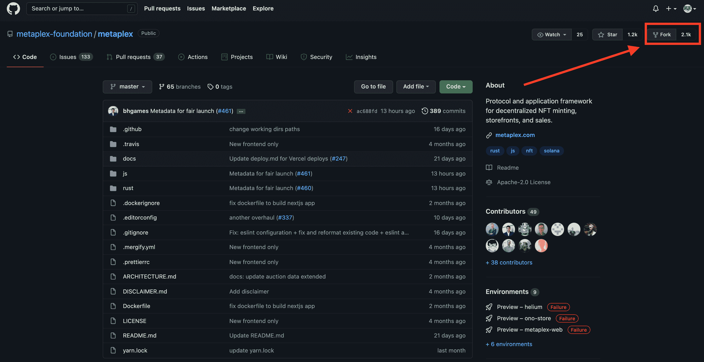](https://github.com/figment-networks/learn-tutorials/raw/master/assets/metaplexRepo.png)

现在，我们需要将所有 Metaplex 文件复制到我们的计算机上。

*   在桌面上创建一个名为“myNftMarketplace”的文件夹

*   复制文件夹的位置

*   在命令行中将目录更改为您的 marketplace 文件夹

```js
cd /Users/yourusername/Desktop/myNftMarketplace 
```

*   将存储库克隆到您的市场文件夹中

```js
git clone https://github.com/yourusername/metaplex.git 
```

Metaplex 存储库中的所有文件现在都将下载到我们的文件夹中。

# 更改默认地址

当我们部署网站时，我们希望它保存在 Github 上的 Metaplex 存储库中。这将使我们能够轻松地获得我们自己的在线市场。

*   将部署地址改为您的 Github 用户名

[](https://github.com/figment-networks/learn-tutorials/raw/master/assets/deployAddressSol.png)

注意我的名字在哪里。这应该是我们的 Github 用户名所在的位置。确保沿着图片左侧的路径找到`package.json`文件。

*   更改商店的钱包地址

[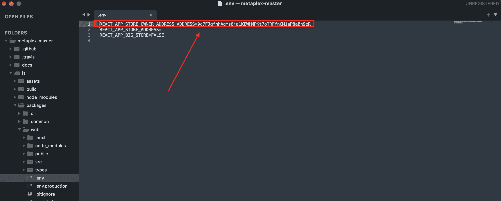](https://github.com/figment-networks/learn-tutorials/raw/master/assets/storeWalletAddress.png)

这是我们添加浏览器钱包的公共地址的地方，因此商店知道向谁授予管理访问权。确保沿着图片左侧的路径找到`.env`文件。

# 设置和部署我们的商店

我们正处于让我们的商店活起来的最后阶段！现在，我们将下载所有必要的软件包，以便部署我们的市场网站。

*   在命令行中将目录切换到`js`文件夹

```js
cd metaplex/js 
```

当我们将目录更改为 marketplace 文件夹时，我们仍然应该打开之前的终端。现在，我们将目录更改为`js`文件夹。

*   运行以下命令安装所有依赖项:

```js
yarn 
```

此命令将开始下载处理代码所需的所有依赖项。当我们克隆 Metaplex 存储库时，它没有为我们下载包，它只下载了说明需要什么包/依赖项的代码。

该命令需要一段时间来完成所有内容的下载。当它完成时，它将在最后输出`Done`。

*   运行以下命令，检查所有依赖项是否正常工作:

```js
yarn bootstrap 
```

在上传到 Github 页面之前，我们现在可以在本地测试我们的新 NFT 市场。

*   运行以下命令，检查所有依赖项是否都已就位并按预期运行:

```js
yarn start 
```

编译所有内容可能需要几分钟时间。一旦终端显示`compiled successfully`，我们就可以访问`http://localhost:3000/#/`来查看我们全新的市场！但是，这只适合四处浏览。等到我们把它放到网上，就可以连接一个钱包，制造一些东西了。

*   运行以下命令来构建项目文件:

```js
yarn build 
```

[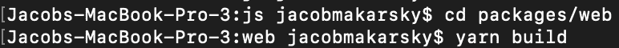](https://github.com/figment-networks/learn-tutorials/raw/master/assets/yarnBuildSol.png)

当它完成时，我们应该看到它的输出`Done`，表明构建已经完成。我们现在可以看到在`js`文件夹中创建的`build`文件夹。

*   将目录切换到`web`文件夹

```js
cd packages/web 
```

*   在`packages/web`文件夹中运行以下命令进行部署:

```js
yarn deploy 
```

一旦完成，我们应该再次看到输出`Done`，表明部署已经完成。这个命令已经将 marketplace 站点部署到我们的 Github 存储库中，这意味着...我们的市场是活的！现在我们可以去看看 Github 页面上托管的在 Solana 上运行的全新 NFT 市场。

恭喜你！我们市场的 URL 很可能位于`https://yourusername.github.io/metaplex#/`，除非您在 Github 存储库的设置中更改了您网站的 URL。例如，我的市场位于`https://jacobmakarsky.github.io/metaplex#/`。

现在，我们可以通过使用 marketplace UI 在 Solana 上创建我们自己的 NFT。

# 在市场上铸造 NFT

Solana 上有许多市场可以列出 NFT 的作品，但直到最近才出现了一个工具，它允许日常用户铸造他们自己的 NFT，名为 [Metaplex](https://www.metaplex.com/) 。

Metaplex 允许我们创建自己的 NFT 市场，但没有一个通用的 NFT 市场供所有人使用。我在 github 下做了一个 marketplace 供我们在本教程中使用。

*   转到“我的物品”选项卡

[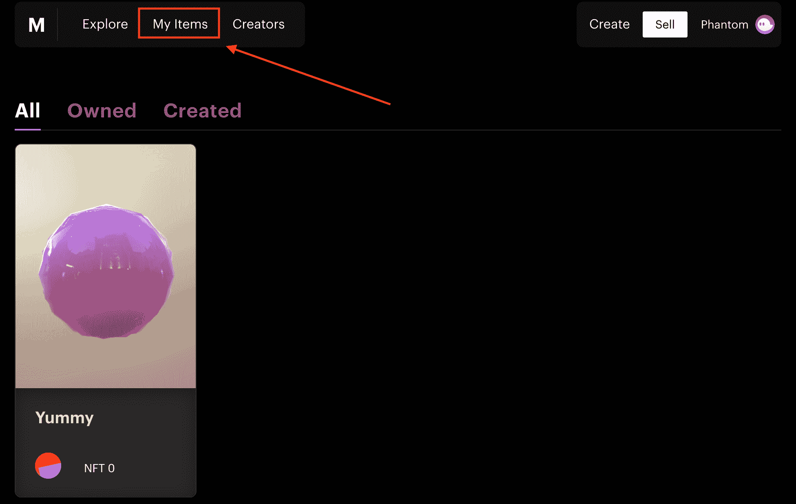](https://github.com/figment-networks/learn-tutorials/raw/master/assets/myItemsPage.png)

*   点击顶部的“创建”

[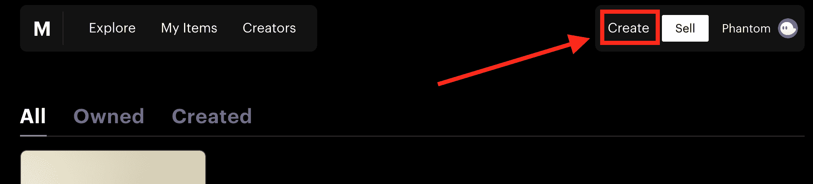](https://github.com/figment-networks/learn-tutorials/raw/master/assets/createNFTButton.png)

现在我们应该在“类别”部分。

*   选择我们正在创造的 NFT。

我创建了一个 AR 文件，人们可以在 [Vecteezy](https://www.vectary.com/3d-modeling-news/create-ar-content-ARkit-ios12/) 上与之互动。如果你走这条路是为了快速制作一些东西，确保你导出到。obj 文件类型，然后将转换后给出的 2 个文件转换为。glb [这里](https://products.aspose.app/3d/conversion/obj-to-glb)。制作一个 AR 文件让我们能够与 NFT 互动并旋转它。

*   在“上传”部分，根据您选择的 NFT 类别，按照说明上传所需内容。确保你的文件名中没有空格。T3】

*   按“继续造币”。

[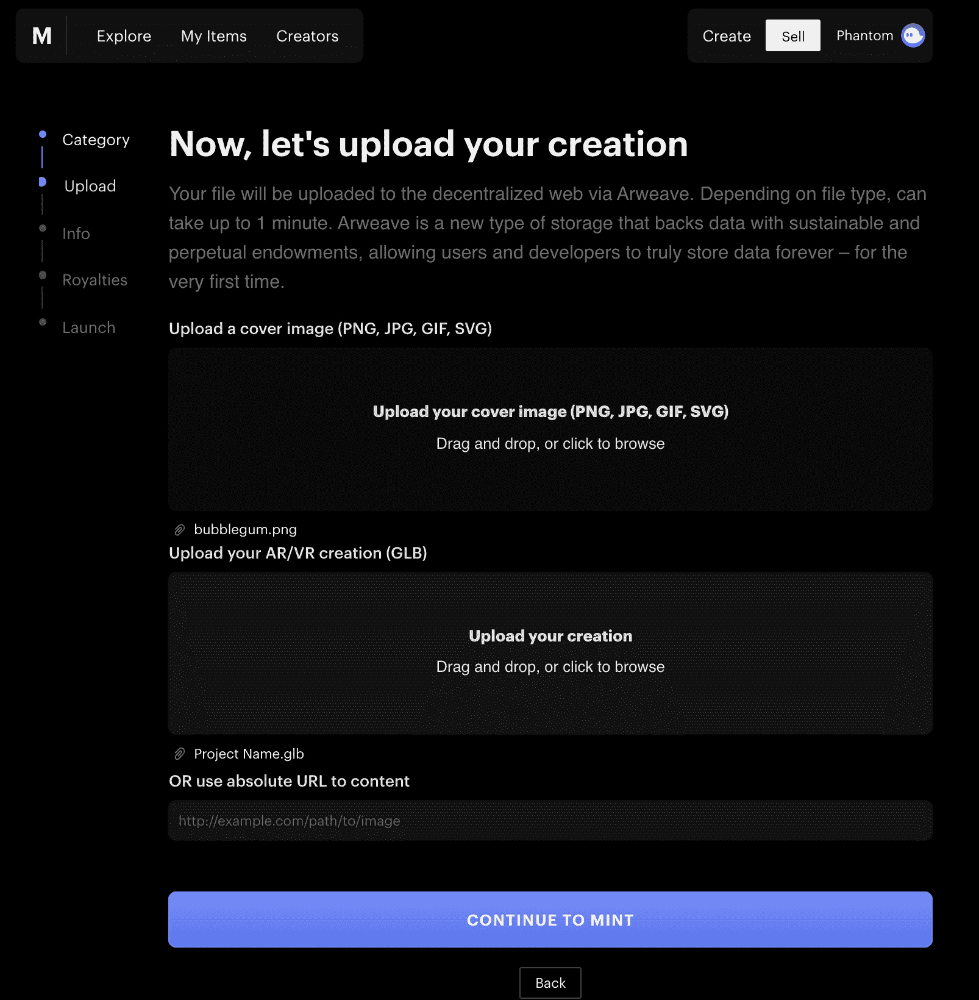](https://github.com/figment-networks/learn-tutorials/raw/master/assets/uploadNFTImages.png)

*   继续给 NFT 起一个很酷的名字，并描述一下它是什么。

请随意添加链接或任何有助于人们理解 NFT 的信息。或者，让描述变得空洞而神秘。

最大供应量是 NFT 的印刷数量，每个 NFT 都是有编号的版本。创作者可以设置母版版的“最大供应量”，就像 Solana 上的普通造币厂一样，主要区别是每张印刷品都是从中创建的编号版本。-[metplex 开发人员指南](https://docs.metaplex.com/)

例如，属性可以是“背景:蓝色”、“眼睛:闭上”、“嘴:吸烟”等。

*   按“继续版税”。

[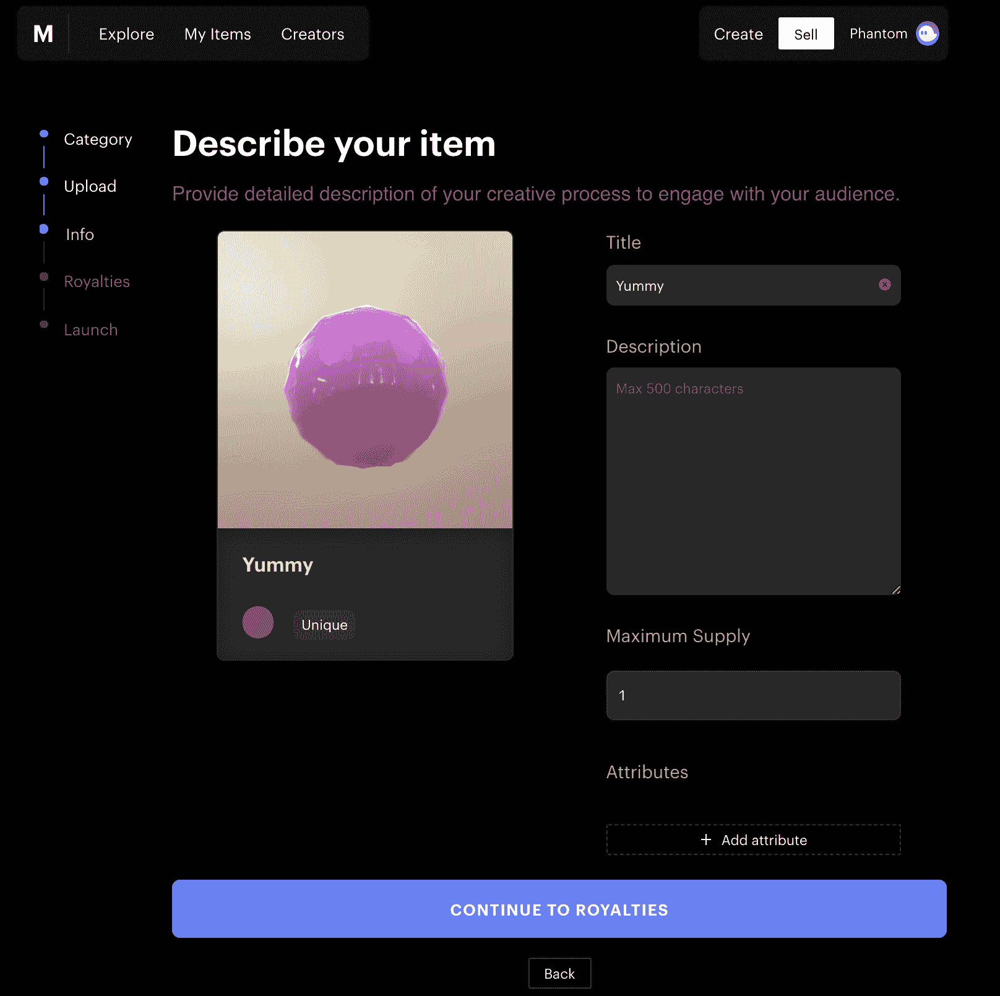](https://github.com/figment-networks/learn-tutorials/raw/master/assets/nftInfoPage.png)

Metaplex 允许我们修改版税和初始销售的分成金额。

*   设定一个版税百分比，这样创作者将从 NFT 未来的每笔销售中获得一部分。

如果有人参与了 NFT 的创建，请务必添加创建者。

[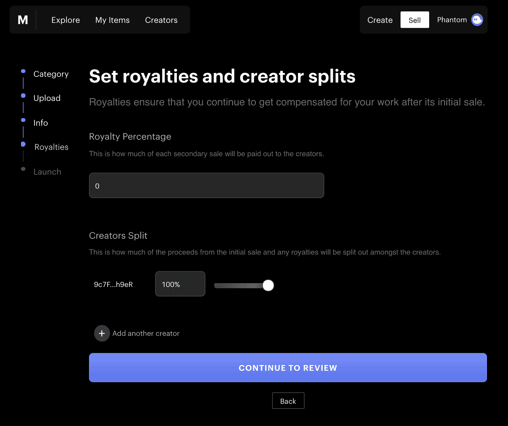](https://github.com/figment-networks/learn-tutorials/raw/master/assets/nftRoyaltiesPage.png)

是时候推出我们的 NFT 了！

*   确保您的浏览器钱包中有足够的 SOL，然后单击“用 SOL 支付”。

上传 NFT 最多需要几分钟时间，因为元数据(标题、描述、属性等。)正保存在 [Arweave](https://www.arweave.org/) 上。这是一个永久存储数据的区块链工具。在索拉纳链上存储数据本身成本太高，因此我们在索拉纳上的不可替代令牌包含一个链接，指向 NFT 信息在 Arweave 上的存储位置。

[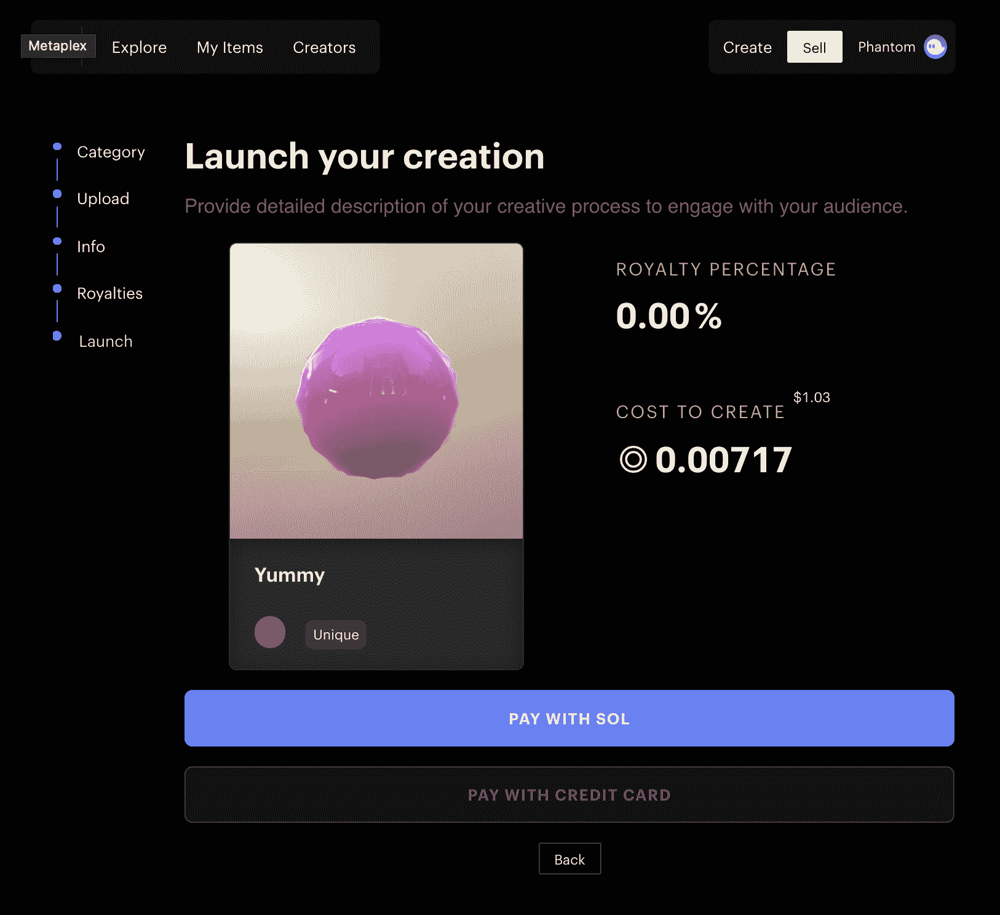](https://github.com/figment-networks/learn-tutorials/raw/master/assets/nftLaunchPage.png)

呜！你的新 NFT 应该完成铸造了。恭喜你，你现在在索拉纳网络上有一个可访问的 NFT 了。我们现在能用它做什么？

[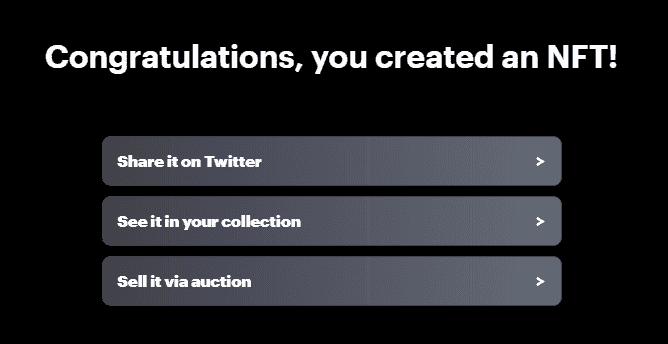](https://github.com/figment-networks/learn-tutorials/raw/master/assets/nftMintFinished.png)

*   检查 NFT 的“我的项目”选项卡

[](https://github.com/figment-networks/learn-tutorials/raw/master/assets/myItemsPage.png)

您应该可以在[我的物品](https://jacobmakarsky.github.io/metaplex#/artworks)页面上看到您的 NFT。

如果你一直在使用一个幽灵浏览器钱包，继续检查你的“收藏品”标签。你全新的 NFT 应该出现在你的钱包里！可能需要一些时间来同步图像和元数据。

[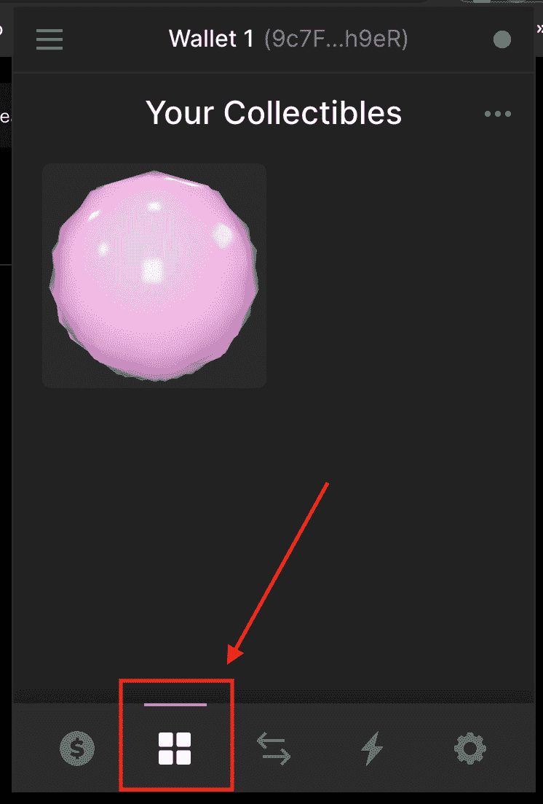](https://github.com/figment-networks/learn-tutorials/raw/master/assets/phantomCollectibles.png)

# 奖励:列出待售的 NFT

太棒了，我们现在有了自己的 NFT，可以放在钱包里看了。如果我们不想出售我们的新鲜 NFT，我们当然可以不上市，但为了教育，让我们继续尝试上市。

*   转到[数字眼](https://digitaleyes.market/)

我不建议把 NFT 放在我为我们做的市场上(尽管我确实计划在未来让它变得更酷)，所以目前 DigitalEyes 是最好的选择。

*   连接您的钱包

[](https://github.com/figment-networks/learn-tutorials/raw/master/assets/connectWalletToMarket.png)

*   转到“出售”选项卡

[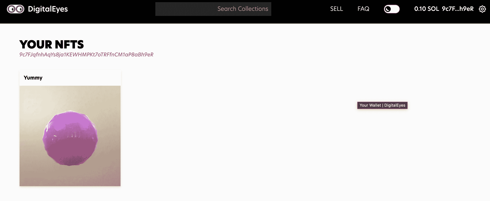](https://github.com/figment-networks/learn-tutorials/raw/master/assets/yourNFTs.png)

*   点击你想要出售的 NFT

*   选择你想卖的价格，然后列出 NFT

[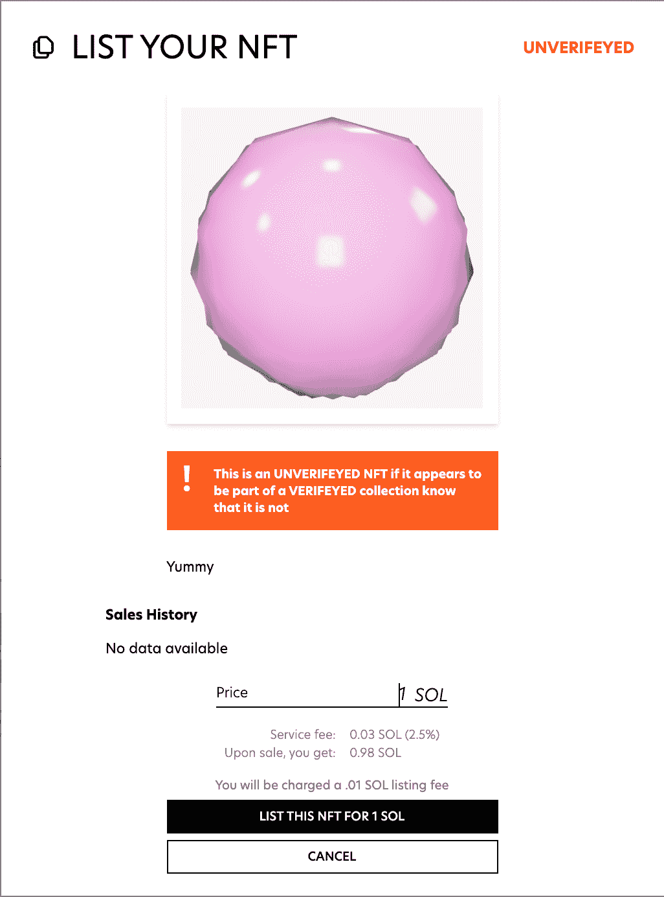](https://github.com/figment-networks/learn-tutorials/raw/master/assets/listNFTButton.png)

*   批准 NFT 上市交易

这笔交易花了我 0.1 索尔，所以请确保你的钱包里有足够的索尔来列出 NFT。

[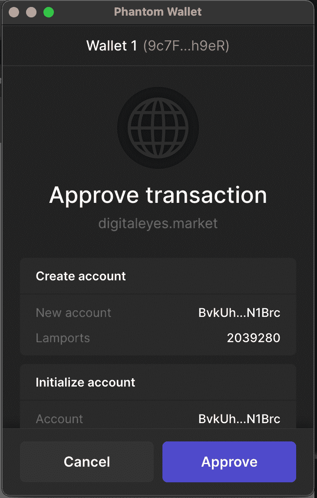](https://github.com/figment-networks/learn-tutorials/raw/master/assets/approveNFTTransaction.png)

现在我们应该可以看到我们的 NFT 上市了！在搜索栏中搜索“未验证的”收藏，并滚动到您的 NFT。市场仍在开发中，所以希望很快就能更容易地搜索到 NFT。

[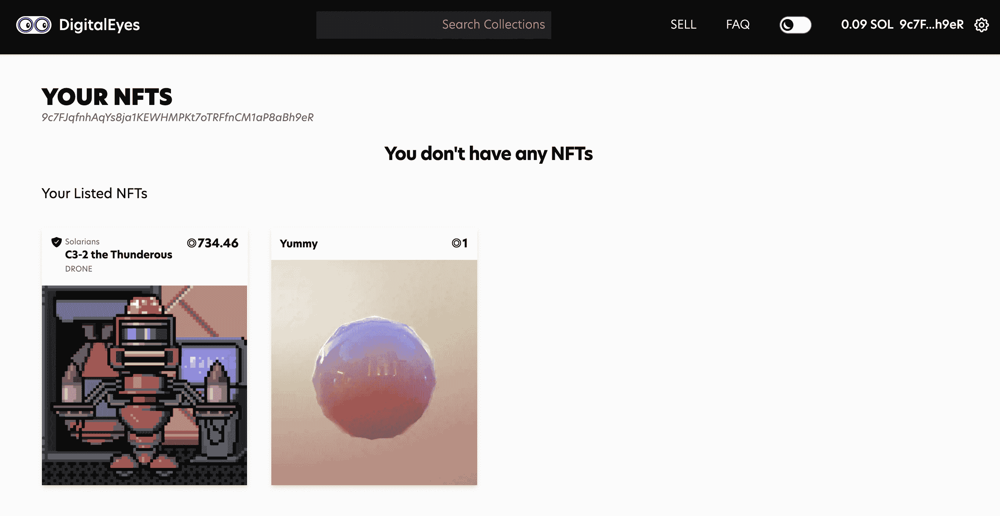](https://github.com/figment-networks/learn-tutorials/raw/master/assets/listedNFTs.png)

继续点击列出的 NFT。你会看到取消列表的选项和一些写着“未验证”的标签。这只是因为 DigitalEyes 没有验证我们的 NFT，所以他们不确定这是否是一个现有收藏的赝品。有关 DigitalEyes 的任何问题，例如验证您的 NFT，[请点击此处](https://digitaleyes.market/faq)。

# 结论

呜哇！如果你完成了所有的步骤，你就成功地创建了你自己的 NFT 市场和索拉纳区块链的 NFT。如果你完成了奖励，你现在就拥有了一个全球流行市场上的 NFT👍

# 后续步骤

在本教程中，我们创建了自己的 NFT 市场和索拉纳区块链上的 NFT，使用 Metaplex 铸造和 DigitalEyes 上市。继续尝试铸造更多的 NFT 币，在我们自己的市场上列出它们，将代币发送到其他钱包，创建一个收藏，等等。

# 关于作者

本教程由 Jacob Makarsky 创建。可以在 Github 上找到他。

# 参考

*   詹姆斯巴奇尼
*   [索拉纳的博客](https://solana.blog/solana-metaplex-tutorial-deploy-your-own-store-mint-nfts-and-setup-auctions/)