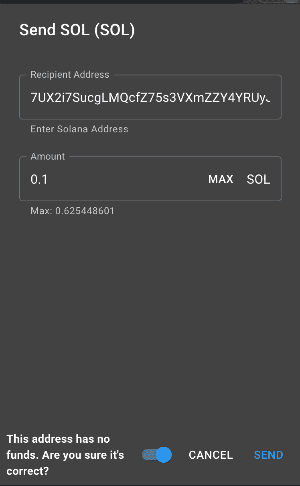
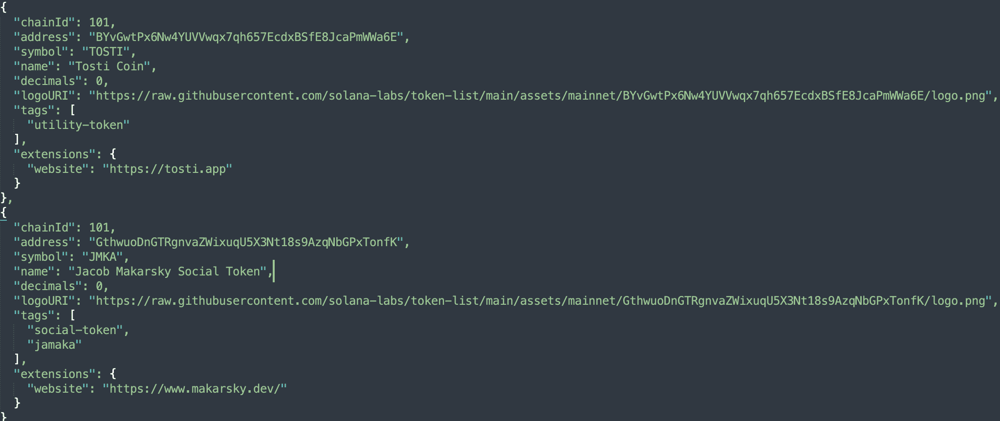
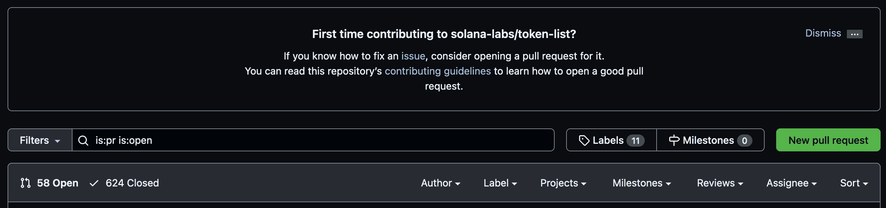
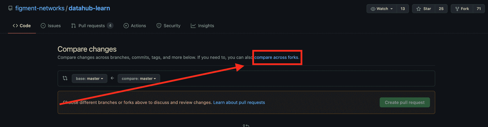
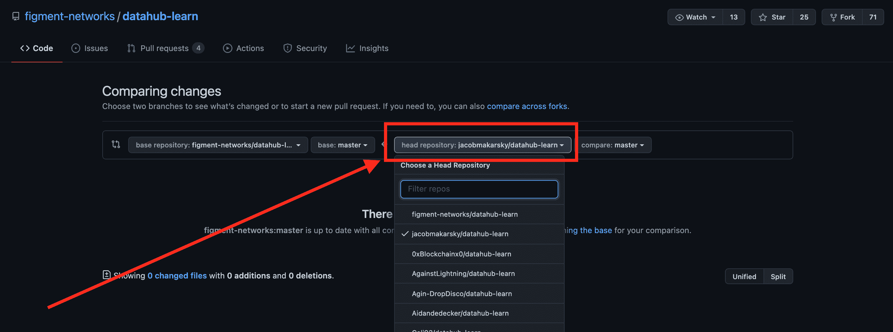

# 介绍

> 原文：<https://github.com/figment-networks/learn-tutorials/blob/master/solana/sol-mint-token.md>

在本教程中，我们将创建一个无需编码的索拉纳区块链令牌。代币有很多功能，比如一个[社交代币](https://www.nasdaq.com/articles/social-tokens%3A-get-ready-for-the-next-massive-crypto-trend-2021-04-29)，一个[实用代币](https://invao.org/token-classes-explained-coin-vs-utility-token-vs-security-token/)，或者一个[硬币](https://invao.org/token-classes-explained-coin-vs-utility-token-vs-security-token/)。

索拉纳有一个用 [Rust](https://www.rust-lang.org/) 编写的[令牌程序](https://spl.solana.com/token)，它将允许我们创建自己的令牌。我们只需要使用一个简单的命令行界面来创建和发送我们的令牌。

本教程通常会以项目符号的形式展示行动号召。请注意，如果您需要帮助或者想了解本教程中引用的任何命令的用法，请在命令后添加- help 标志。

*   例如:

```js
solana --help 
```

如果您在阅读本教程时有任何困难，或者只是想与我们讨论索拉纳技术，您可以今天就[加入我们的社区](https://discord.gg/fszyM7K)！

# 先决条件

*   基本熟悉[命令行界面](https://en.wikipedia.org/wiki/Command-line_interface)
*   基本熟悉 Git 和 GitHub
*   可获得约 1 美元的 SOL。通过交换获得索尔，比如 [FTX](https://ftx.com/#a=13426316) ，或者通过交换[血清](https://projectserum.com/#/)上的代币。
    *   **注:** FTX 和索拉纳关系密切。FTX 的姐妹公司 Alameda Research 是索拉纳的投资者，FTX 也在索拉纳区块链运营自己的分散化交易所 Serum。

# 要求

*   [GitHub 账户](https://github.com/)
*   安装了 Git
*   [锈](https://rustup.rs/)已安装
*   [安装 Solana 工具套件](https://docs.solana.com/cli/install-solana-cli-tools)

# 创建一个 SOL 钱包

首先，我们将使用命令行创建一个 SOL wallet 来处理我们的事务。

*   创建一个新的 wallet，它将返回公钥(pubkey):

```js
solana-keygen new 
```

如果您已经有了一个本地的 Solana 密钥对，但是想要为本教程生成一个新的:**在执行此步骤**之前，请确保备份任何现有的公钥&种子短语，否则您可能会无法访问 Solana 上的资产！检查`~/.config/solana/id.json`是否有公共密钥。使用`--force`标志在现有密钥对上生成:

```js
 solana-keygen new --force 
```

输出应该类似于:

```js
Generating a new keypair

For added security, enter a BIP39 passphrase

NOTE! This passphrase improves security of the recovery seed phrase NOT the
keypair file itself, which is stored as insecure plain text

BIP39 Passphrase (empty for none): 
```

您可以输入密码，也可以留空。`solana-keygen`命令现在将输出 pubkey 和 seed 短语:

```js
Wrote new keypair to /.config/solana/id.json
================================================================================
pubkey: 7UX2i7SucgLMQcfZ75s3VXmZZY4YRUyJN9X1RgfMoDUi
================================================================================
Save this seed phrase and your BIP39 passphrase to recover your new keypair:
still auto damp sphere silly remain first utility announce material luxury robe
================================================================================ 
```

创建的 JSON wallet 文件位于文件系统中的`~/.config/solana/id.json`。

将种子短语写在安全的地方！

# 充实钱包

我们现在将使用公钥(pubkey)向我们钱包提供 SOL。需要 SOL 来支付交易和我们对区块链所做的任何更改，例如，创建我们的令牌的交易。

在从 [FTX](https://ftx.com/#a=13426316) 获得索尔(或在[血清](https://projectserum.com/#/)上交换代币)后，我们需要从钱包(如 [Sollet](https://chrome.google.com/webstore/detail/sollet/fhmfendgdocmcbmfikdcogofphimnkno?hl=en) 浏览器钱包)中获得索尔。

*   向我们的命令行钱包发送 0.1 SOL

[](https://github.com/figment-networks/learn-tutorials/raw/master/assets/sendToCLIWallet.png)

*   使用此输入中的公钥检查钱包的余额，该公钥是您的钱包的公钥

```js
solana balance 7UX2i7SucgLMQcfZ75s3VXmZZY4YRUyJN9X1RgfMoDUi
```

返回的余额应该与您发送到钱包的确切金额相匹配。

# 创建令牌

*   安装 **spl-token** CLI

    ```js
    cargo install spl-token-cli
    ```

*   创建令牌，这将返回**令牌地址**

    ```js
    spl-token create-token
    ```

该命令将输出令牌的地址和交易签名:

```js
Creating token B7kRCw1kiB4KxdSKveA3GW4gUc7N4PFiBZTKGRVNXtj6

Signature: 4ELSGXv7Eh6sFnzcM7XvVLmZUZrWbCsF7DoKYpj14qmMzohh9b79AqTXnUYTaLKUuFQLASBHrPMKhEbrM7h8cjMr 
```

> 如果您的钱包中没有任何 SOL 来支付交易，您将收到一条错误消息:

```js
Creating token AQoKYV7tYpTrFZN6P5oUufbQKAUr9mNYGe1TTJC9wajM
Fee payer, 7UX2i7SucgLMQcfZ75s3VXmZZY4YRUyJN9X1RgfMoDUi,
 has insufficient balance: 0.0014716 required, 0 available 
```

在运行了上面的`create-token`之后，我们已经在 Solana 上创建了自己的令牌。你可以用它做更多的事情。

*   使用**您的**钱包的公钥来检查钱包的余额:

```js
solana balance 7UX2i7SucgLMQcfZ75s3VXmZZY4YRUyJN9X1RgfMoDUi
```

您的余额将减少，表明交易费和部署费用已经支付。
祝贺您，您的代币已正式创建<g-emoji class="g-emoji" alias="+1" fallback-src="https://github.githubassets.cimg/icons/emoji/unicode/1f44d.png">👍</g-emoji>

# 创建一个帐户来处理令牌

现在我们需要创建一个可以使用令牌的帐户。

*   创建一个帐户，该帐户将返回**帐户地址**，其中**令牌地址**是您的令牌地址:

例如:

```js
spl-token create-account AQoKYV7tYpTrFZN6P5oUufbQKAUr9mNYGe1TTJC9wajM
```

输出将再次包括地址和交易签名:

```js
Creating account 7UX2i7SucgLMQcfZ75s3VXmZZY4YRUyJN9X1RgfMoDUi
Signature: 42Sa5eK9dMEQyvD9GMHuKxXf55WLZ7tfjabUKDhNoZRAxj9MsnN7omriWMEHXLea3aYpjZ862qocRLVikvkHkyfy
```

*   使用此输入中的公钥检查钱包的余额，该公钥是您的钱包的公钥:

```js
solana balance 7UX2i7SucgLMQcfZ75s3VXmZZY4YRUyJN9X1RgfMoDUi 
```

# 铸造代币

是时候铸造一些代币并练习传递它们了。对于 **mintAmount** ，您可以指定任意数字。为什么不试试<g-emoji class="g-emoji" alias="moneybag" fallback-src="https://github.githubassets.cimg/icons/emoji/unicode/1f4b0.png">💰</g-emoji>100 万<g-emoji class="g-emoji" alias="moneybag" fallback-src="https://github.githubassets.cimg/icons/emoji/unicode/1f4b0.png">💰</g-emoji>只是为了好玩？通常情况下，这将基于一些因素，如您预计代币市场的市值有多大，以及您是否计划向用户空投任何数量的代币。

**recipientAddress** 将是您在上一步中创建的用于处理令牌的帐户。

*   铸币代币:

```js
spl-token mint tokenAddress mintAmount recipientAddress 
```

例如:

```js
spl-token mint AQoKYV7tYpTrFZN6P5oUufbQKAUr9mNYGe1TTJC9wajM 100 7UX2i7SucgLMQcfZ75s3VXmZZY4YRUyJN9X1RgfMoDUi
```

输出应该包括令牌地址、接收者地址和交易签名:

```js
Minting 100 tokens
  Token: AQoKYV7tYpTrFZN6P5oUufbQKAUr9mNYGe1TTJC9wajM
  Recipient: 7UX2i7SucgLMQcfZ75s3VXmZZY4YRUyJN9X1RgfMoDUi
Signature: 41mARH42fPkbYn1mvQ6hYLjmJtjW98NXwd6pHqEYg9p8RnuoUsMxVd16RkStDHEzcS2sfpSEpFscrJQn3HkHzLaa
```

> 请记住，如果您迷路了，或者想要探索这些命令的作用或使用方法，您总是可以在任何 Solana CLI 工具中使用`--help`标志来获得更多信息。

```js
spl-token mint --help 
```

如果你愿意，可以在交易后查看你的钱包余额。一旦代币铸造完成，就该考虑安全性了:“是什么阻止我铸造无限数量的代币？”

# 限制供给，防止无限造币

一旦创造了足够多的代币，防止无限铸造代币是至关重要的。

*   禁用铸造:

```js
spl-token authorize tokenAddress mint --disable 
```

*   检查现有帐户的代币余额:

```js
spl-token accounts 
```

输出应该类似于:

```js
Token                                         Balance
------------------------------------------------------------
AQoKYV7tYpTrFZN6P5oUufbQKAUr9mNYGe1TTJC9wajM  1000000
```

如果你愿意，也可以查看钱包余额。交易后会显示差异。

# 将令牌转移到浏览器钱包

*这一步是可选的*，但现在我们将把所有令牌从命令行创建的钱包发送到浏览器钱包。您的浏览器钱包中必须有一些 SOL，以便它可以自动添加令牌。

*   向浏览器钱包发送令牌

```js
spl-token transfer --fund-recipient tokenAddress transferAmount recipientAddress 
```

例如:

```js
spl-token transfer AQoKYV7tYpTrFZN6P5oUufbQKAUr9mNYGe1TTJC9wajM 1000000 vines1vzrYbzLMRdu58ou5XTby4qAqVRLmqo36NKPTg
```

这次，**收件人地址**应该是*你的*浏览器钱包地址。

输出应该类似于:

```js
Transfer 50 tokens
  Sender: 7UX2i7SucgLMQcfZ75s3VXmZZY4YRUyJN9X1RgfMoDUi
  Recipient: vines1vzrYbzLMRdu58ou5XTby4qAqVRLmqo36NKPTg
  Recipient associated token account: F59618aQB8r6asXeMcB9jWuY6NEx1VduT9yFo1GTi1ks

Signature: 5a3qbvoJQnTAxGPHCugibZTbSu7xuTgkxvF4EJupRjRXGgZZrnWFmKzfEzcqKF2ogCaF4QKVbAtuFx7xGwrDUcGd
```

在 Solana 集群上确认交易后，您应该会在浏览器钱包中看到您的新令牌！然而，有一个明显的问题！它没有名字...

# 向 Solana 提交 pull 请求以注册令牌

我们的令牌是在索拉纳上创建并运行的，但是还没有被官方认可。我们需要获得令牌提交所需的所有信息。

*   输入您的用户主目录，您可以在其中克隆计算机上的令牌列表。

*   克隆[索拉纳令牌列表](https://github.com/solana-labs/token-list):

```js
git clone https://github.com/solana-labs/token-list 
```

我们现在已经克隆了`token-list`,所以我们可以添加令牌的图像和信息以便上传。

*   您需要在`token-list/assets/mainnet/`中创建与**令牌地址**匹配的目录。
*   在`token-list/assets/mainnet/<mint address>/`目录中，将您的令牌的徽标复制并粘贴到克隆的`token-list`中。

继续为光栅徽标命名徽标文件`logo.png`，如果使用矢量图形，则命名为`logo.svg`。索拉纳更喜欢徽标是这些文件类型中的一种。

*   在`token-list/src/tokens/solana.tokenlist.json`处打开令牌列表文件，将您的令牌添加到列表中，如下所示:



这个示例令牌将是一个社交令牌，所以确保不要复制它，除非您的令牌也是一个社交令牌。所需的信息是:

```js
{
  "chainId": 101,
  "address": " ",
  "symbol": " ",
  "name": " ",
  "decimals": 0,
  "logoURI": "https://raw.githubusercontent.com/solana-labs/token-list/main/assets/mainnet/<ADDRESS/logo.png",
  "tags": [
    "social-token",
  ],
  "extensions": {
    "website": "https://<YOUR WEBSITE URL>.com"
  }
}
```

令牌图像的链接必须指向 GitHub 用户内容站点；只需将令牌地址更改为您的令牌地址，将徽标文件名更改为您的徽标文件名和类型。

*   保存`token-list/src/tokens/solana.tokenlist.json`文件。
*   通过按存储库页面右上角的 **Fork** 按钮，将 [token-list](https://github.com/solana-labs/token-list) 存储库分支到您自己的 GitHub 帐户。

这将把`token-list` GitHub 存储库添加到您的 GitHub 中，这将使您能够将您的更改上传到分叉的存储库，然后请求原始存储库接受您的更改。

*   仍然在命令行中的`token-list`文件夹中，将您的本地存储库的 url 设置为 GitHub 上的**您的**分叉版本:

```js
git remote set-url origin https://github.com/<YOUR GITHUB USERNAME>/token-list 
```

*   将所有文件从`token-list`添加到您的本地存储库:

```js
git add . 
```

*   提交文件:

```js
git commit -m "first commit for <YOUR TOKEN SYMBOL & NAME>" 
```

*   推动变革:

```js
git push origin main 
```

现在，您应该可以在 GitHub 上看到分叉存储库中的变化。

*   转到令牌列表[拉请求页面](https://github.com/solana-labs/token-list/pulls)
*   选择**新拉动请求**按钮



*   在**比较变化**标题下方的副标题中选择高亮显示的**跨叉比较**选项



*   从**主存储库**下拉列表中选择您的分叉存储库



您应该会看到 2 个更改的文件；您的令牌和徽标图像会发生变化。

*   确保这些细节是正确的。例如，包含徽标图像的目录应该与令牌列表中的令牌地址完全匹配。

我们现在准备创建拉取请求。

*   点击绿色的**创建拉动请求**按钮。
*   完成添加标题和填写详细信息后，再次按绿色的**创建拉动请求**按钮。

恭喜你！你的令牌现在正在成为正式的。除非我们真的可以交易代币...

# 奖励:为你的血清代币添加一个市场

你成功了！您的令牌处于活动状态，并且有一个名称。现在，它可以被四处传播，用于任何用途。但是，没有用于交易令牌的交易对。我没有为我的社交令牌做市场，因为我不希望它被交易。

注意:创建一个市场大约需要花费 **10-15 索尔**，现在大约是**350 美元**。

*   前往[血清](https://dex.projectserum.com/#/list-new-market)并在右上角连接您选择的钱包。
*   填写表格

**基本令牌造币地址**将是您的令牌地址，**报价令牌造币地址**将是您希望您的令牌配对的令牌。我会以 USDT 为例。

一旦提交，你应该有一个可以交易代币的实时市场。

# 结论

呜哇！如果您完成了所有步骤，您就成功地在索拉纳区块链上创建了自己的令牌。如果您完成了奖金，您现在就有了一个可交易的代币<g-emoji class="g-emoji" alias="+1" fallback-src="https://github.githubassets.cimg/icons/emoji/unicode/1f44d.png">👍</g-emoji>

# 后续步骤

在本教程中，我们使用 Solana 的命令行界面或“CLI”在 Solana 区块链上构建了自己的令牌。你可以继续尝试铸造更多的代币，将代币发送到其他钱包，为它创造一个市场，在 Raydium 上建立一个流动性池，等等。以后再来看看如何在索拉纳身上制作一个[不可替代令牌](https://www.blockchain-council.org/blockchain/a-quick-guide-to-fungible-vs-non-fungible-tokens/)的教程。

# 关于作者

本教程由 Jacob Makarsky 创建。可以在 Github 上找到他。

# 参考

*   [索拉纳代币计划](https://spl.solana.com/token)
*   [循环创意安迪](https://www.youtube.com/watch?v=1cn-HnG_yns)