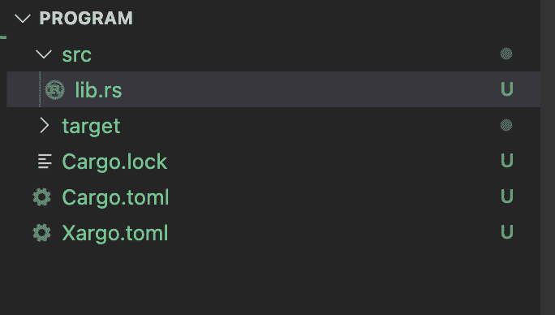
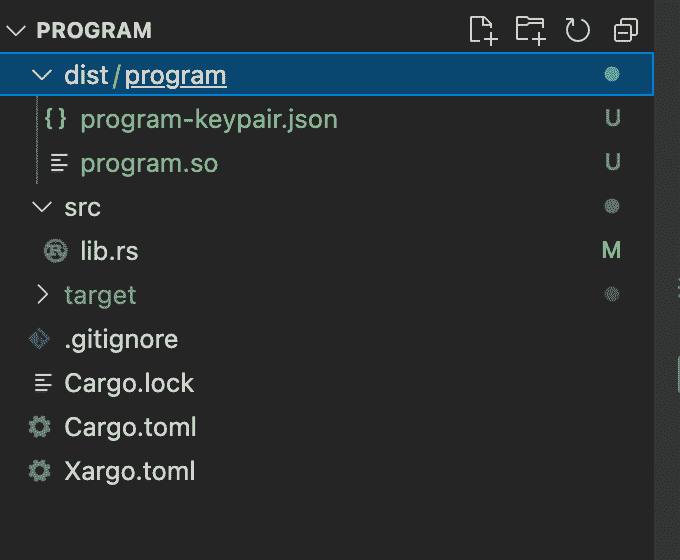
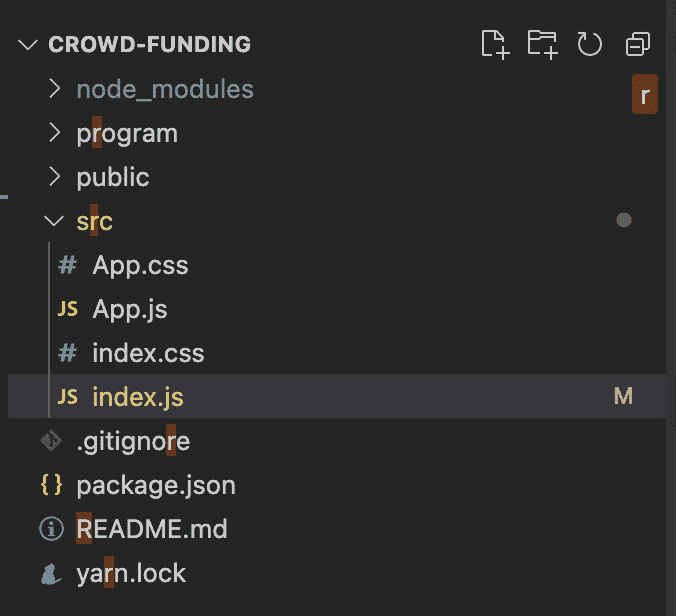
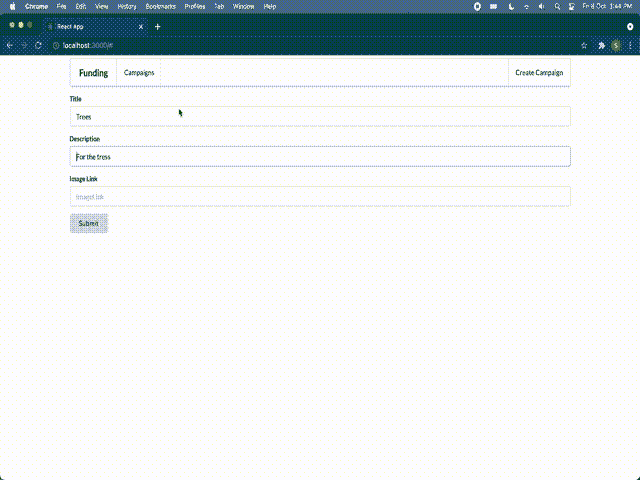

# 介绍

> 原文：<https://github.com/figment-networks/learn-tutorials/blob/master/solana/solana-crowdfund-tutorial.md>

我们准备做一个像 GoFundMe、Kickstarter、Indiegogo 这样的众筹平台。我们的 DApp 将让人们创建活动，向现有的活动捐赠 SOL，并向活动创建者付款。我们准备做一个 Solana 程序，把它和我们的前端应用程序连接起来。

# 先决条件

*   反应
*   java 描述语言

# 要求

完成本教程需要以下软件:

*   Git，从[这里](https://git-scm.com/downloads)安装。
*   Solana CLI，从[这里](https://docs.solana.com/cli/install-solana-cli-tools#use-solanas-install-tool)安装。
*   防锈工具链，从[处安装到](https://www.rust-lang.org/tools/install)处。
*   Node.js (v14.18.1+)，从[这里](https://nodejs.org/en/download/)安装。

> 如果你已经很好的掌握了 Rust 编程语言，你可以跳过`Introduction to Rust`部分。我仍然建议快速浏览所有代码块。

# 铁锈入门

Rust 是一种多范式、高级、通用的编程语言，旨在提高性能和安全性，尤其是安全并发。

Rust 代码使用 snake case 作为函数和变量名的常规样式。

## 在您的系统上安装 Rust

你可以根据你的操作系统点击这个[链接](https://doc.rust-lang.org/book/ch01-01-installation.html)。

> 注意:如果你使用的是 Visual Studio 代码(VSCode)你应该安装扩展`matklad.rust-analyzer`。我发现它在代码分析、自动完成和代码片段方面比`Rust-lang.rust`更好。

在我们开始教程之前，我们需要了解一些关于 Rust 的基础知识。如果你想阅读更多关于任何主题的内容，我已经添加了到 Rust book 页面的链接。

## Rust 中的基本数据类型

Rust 有四种主要的标量类型:整数、浮点数、布尔值和字符。整数有`u8`、`u32`、`i32`、`i64`、`usize`，这里继续列举，基本上`u`前缀表示我们有一个无符号整数，后缀数字表示位数。所以`u8`是一个无符号的 8 位数(0 到 255)。

| 长度 | 签名 | 无符号的 |
| --- | --- | --- |
| 8 位 | i8 | u8 |
| 16 位 | i16 | u16 |
| 32 位 | i32 | u32 |
| 64 位 | i64 | u64 |
| 128 位 | i128 | u128 |
| 拱门 | isize | 大小 |

对于浮点数，我们有`f32`和`f64`。`bool`为布尔型，`char`为字符型。生锈的琴弦有两种，`str`和`String`。`String`是一种可增长的、堆分配的数据结构。`str`是内存中某处不可变的定长字符串。

阅读更多关于[锈书](https://doc.rust-lang.org/book/ch03-02-data-types.html)的内容。

## 创造一个变量和可变性

我们可以用关键字`let`创建一个变量

```js
// The compiler identifies the Rvalue as i32, so it sets the type of variable to i32
let a=0;
```

我们还可以设置变量的数据类型，例如。

```js
let a :u8 = 0;
```

在 Rust 中，默认情况下所有变量都是不可变的。这意味着它们的值一旦设置就不能更改。这里是关键字`mut`。我们可以用`let mut`初始化变量，使其成为一个可变变量。例如。

```js
// This program will compile
let mut a = 0;
a=a+1;
a=100;
```

阅读更多关于[锈书](https://doc.rust-lang.org/book/ch03-01-variables-and-mutability.html)的内容。

## 控制流

我们可以像在其他语言中一样在 Rust 中使用`if` `else`语句，这里有一个小程序可以帮助我们理解语法。

```js
fn main(){
    let a=99;
    if a%2==0{
        println!("Even");
    }
    else{
        println!("Odd");
    }
}
```

我们也有锈环。我们可以用三个关键字`loop`、`for`和`while`创建一个循环。因为`for`最常见。这里有一个例子。你可以在这里查看`loop`和`while`T6 的例子。

```js
fn main() {
    for i in 0..7 { // 0..7 is range expression including 0 excluding 7.
        println!("variable `i` is : {}", i);
    }
}
```

阅读更多关于[锈书](https://doc.rust-lang.org/book/ch03-05-control-flow.html)的内容。

## 函数和宏

Rust 中的函数定义以 fn 开头，在函数名后面有一组括号。花括号告诉编译器函数体的开始和结束位置。

```js
fn main() {
    another_function(5);
    another_function_with_x_and_y(1,2);
}

fn another_function(x: i32) {// input paramter and type
    println!("The value of x is: {}", x);
}
fn another_function_with_x_and_y(x: i32,y:i32) {
    println!("The value of x is: {} {}", x, y);
}
```

对于本教程，我们可以假设宏也是函数。它们以`!`结尾，像`println!`宏、`format!`宏、`msg!`宏。

在 [Rust book](https://doc.rust-lang.org/book/ch03-03-how-functions-work.html) 上阅读更多关于函数的信息。

## 枚举和匹配语法

锈有枚举。它们不仅仅是其他语言提供的简单枚举。在 Rust 中，我们甚至可以在枚举中存储数据。下面是`Result enum`的例子。我们将在程序中使用`Result`枚举。

```js
// Here the pub keyword means it is public.
// We have used generics T and E for data and error type
pub enum Result<T, E> { 
    Ok(T), 
    Err(E),
}
```

在锈书上阅读更多关于 enums 的内容。

下面是一个枚举和匹配示例，并对每一行进行了解释:

```js
enum Coin {
    Penny,
    Nickel,
    Dime,
    Custom(i32),
}
// Creating a coin enums
// notice how some values have no parameter
// and how we can have an i32 value stored in `Custom`

let coin=Coin::Custom(30);
let coin2 =Coin::Nickel;
// We can create instances like this

let a = match coin {
        Coin::Penny => 1,
        Coin::Nickel => 5,
        Coin::Dime => 10,
        Coin::Custom(e) => e,
    };
// We can use the match syntax to know what type of coin we have 
// and set a corresponding value to the variable `a`.

assert_eq!(a,30);
// In this case a will be equal to 30 because coin is Custom with value 30.
```

在 [Rust book](https://doc.Rust-lang.org/book/ch06-02-match.html) 中阅读更多关于匹配语法的内容。

## 货物和行李

货物是锈包经理。我们用它来构建我们的程序并获得依赖关系。这也使得添加包装(板条箱)非常容易。在[锈书](https://doc.Rust-lang.org/book/ch01-03-hello-cargo.html)中阅读更多关于货物的信息

Borsh 代表用于散列的二进制对象表示串行化器。它旨在用于安全关键的项目，因为它优先考虑一致性、安全性、速度，并且有严格的规范。我们用它来进行数据序列化和反序列化。点击 [crates.io](https://crates.io/crates/borsh) 阅读更多关于点菜的信息。

这是我们开始索拉纳计划所需要的所有铁锈。

# 索拉纳计划

## 设置

1.  我们创建了一个 React 应用程序。在终端中打开项目目录并运行

```js
npx create-react-app crowd-funding 
```

这为我们创建了一个 React 应用程序。

2.  现在，我们将创建我们的程序。在项目目录中。

```js
cd crowd-funding
cargo new program --lib 
```

这将创建一个名为`program`的新目录，这是 cargo 生成的新 Rust 项目。

3.  我们稍后将讨论项目的前端。现在我们可以在 VSCode 中打开`program`文件夹。

4.  在程序目录中创建`Xargo.toml`。在你的`Xargo.toml`

```js
[target.bpfel-unknown-unknown.dependencies.std]
features = []
```

5.  更新你的`Cargo.toml`

```js
[package]
name = "program"
version = "0.1.0"
edition = "2018"

[dependencies]
solana-program = "1.7.14"
borsh = "0.9.1"
borsh-derive = "0.9.1"

[features]
no-entrypoint = []

[dev-dependencies]
solana-program-test = "1.7.14"
solana-sdk = "1.7.14"

[lib]
crate-type = ["cdylib", "lib"]
```

我们已经添加了程序需要的所有依赖项。运行`cargo check`来获取所有的依赖项。我们现在可以开始在`src/lib.rs`工作，开始为索拉纳区块链编写程序。

## 我们在我们的节目中想要什么？

在开始写代码之前，我们先讨论一下我们的众筹 app 应该有哪些切入点。

*   创建一个众筹活动。我们需要一个切入点，任何人都可以在我们的平台上创建一个众筹活动。我们可以为它设置名称、描述和管理字段。

*   退出竞选。我们只需要一个竞选管理员的入口点，这样他们就可以撤回资金。

*   向一项运动捐款。我们需要一个入口点，任何人都可以调用它来为特定的活动捐款。

这些都是我们项目需要的切入点。让我们讨论一下我们将如何创造这些。

## 我们可以在哪里存储数据？

在我们开始之前，我们必须了解 Solana 程序没有存储(`contract storage`你可能很熟悉)。那么我们应该如何以及在哪里存储我们的数据。

**程序账户**在 Solana 中，数据只能存储在账户中。所以我们可以创建程序拥有的帐户来保存数据。

> 注意:当我们创建帐户时，一个帐户可以拥有的数据的总字节数是固定的。

处理这个问题的一个方法是创建一个具有非常大的存储空间的帐户。但是，如果我们这样做，一个帐户的最大数据限制是 10 兆字节。如果我们有足够的用户，我们最终会耗尽存储空间。我们必须想办法增加我们可以使用的存储量。

我们可以创建尽可能多的程序拥有的帐户，所以这里的想法是，我们将对地图中的每个元素有一个大小限制。每当我们想要添加一个新元素，我们将创建一个新的程序拥有的帐户。项目拥有的账户也称为 PDA(项目衍生账户)。

## 编写程序

既然我们已经讨论了我们想要创建的内容。让我们开始编码。继续在 VSCode 或您喜欢的 IDE 中打开`program`文件夹。目录中的文件结构应该是这样的。【T2

继续在您的代码编辑器中打开`lib.rs`文件，让我们先添加一些样板代码。

你可以在 [github](https://github.com/SushantChandla/solana-crowd-funding/blob/main/program/src/lib.rs) 上看到完整的代码。

> 注意:在 Rust 中，我们可以用`&`传递变量作为引用，用`*`运算符获取引用的值。

```js
// First we include what we are going to need in our program. 
// This  is the Rust style of importing things.
// Remember we added the dependencies in cargo.toml
// And from the `solana_program` crate we are including  all the required things.
use solana_program::{
    account_info::{next_account_info, AccountInfo},
    entrypoint,
    entrypoint::ProgramResult,
    msg,
    program_error::ProgramError,
    pubkey::Pubkey,
    rent::Rent,
    sysvar::Sysvar,
};

// Every solana program has one entry point
// And it is a convention to name it `process_instruction`. 
// It should take in program_id, accounts, instruction_data as parameters.
fn process_instruction(
    // program id is nothing but the id of this program on the solana network.
    program_id: &Pubkey,
    // When we invoke our program we can 
    // give meta data of all the account we 
    // want to work with.
    // As you can see it is a array of AccountInfo.
    // We can provide as many as we want.
    accounts: &[AccountInfo],
    // This is the data we want to process our instruction for.
    // It is a list of 8 bitunsigned integers(0..255).
    instruction_data: &[u8],

    // Here we specify the return type.
    // If you know a little bit of typescript. 
    // This was of writing types and returns types might we familiar to you.
) -> ProgramResult {

    // And then since we can't return null in Rust we pass `Ok(())` to make it compile
    // It means the program executed successfully.
    Ok(())
}

// Then we call the entry point macro to add `process_instruction` as our entry point to our program.
entrypoint!(process_instruction);
```

> 注意:在 Rust 中，如果最后一行没有以`;`结尾，意味着我们的函数正在返回。这里的线`Ok(())`相当于`return Ok(());`

在代码中，我已经提到在 Solana 程序中只有一个入口点。但是我们想要三个，就像我们在“我们的计划中想要什么？”部分。让我们来解决这个问题。你有没有注意到 instruction_data 数组没有限制？我们将利用这一事实。我们使用数组的第一个元素来知道我们想要调用的入口点。注意，在一个程序中我们可以有 256 个这样的入口点(`u8`的值为 0)..255).实际上，如果我们希望一个项目有那么多的入口点，我们从来不这样做。最好部署更多的程序。

好吧，让我们做更多的编码...

```js
fn process_instruction(
    program_id: &Pubkey,
    accounts: &[AccountInfo],
    instruction_data: &[u8],
) -> ProgramResult {
    // We check if We have a instruction_data len greater than 0 if it is not we do not want to procced.
    // So we return Error with InvalidInstructionData message.
     if instruction_data.len() == 0 {
        return Err(ProgramError::InvalidInstructionData);
    }
    /// Now we just check and call the function for each of them.
    // I have choosen 0 for create_campaign,
    // 1 for withdraw
    // 2 for donate.
    if instruction_data[0] == 0 {
        return create_campaign(
            program_id,
            accounts,
            /// Notice we pass program_id and accounts as they where 
            // but we pass a reference to slice of [instruction_data]. 
            /// we do not want the first element in any of our functions.
            &instruction_data[1..instruction_data.len()],
        );
    } else if instruction_data[0] == 1 {
        return withdraw(
            program_id,
            accounts,
            &instruction_data[1..instruction_data.len()],
        );
    } else if instruction_data[0] == 2 {
        return donate(
            program_id,
            accounts,
            &instruction_data[1..instruction_data.len()],
        );
    }

    /// If instruction_data doesn't match we give an error.
    // Note I have used msg!() macro and passed a string here. 
    // It is good to do this as this would 
    // also get printed in the console window
    // if a program fails.
    msg!("Didn't find the entrypoint required");
    Err(ProgramError::InvalidInstructionData)
}

entrypoint!(process_instruction);

/// Here, I have created the function for every action we want to do in our program.
/// They take in the same parameters as process_intruction and also have the same return type.

fn create_campaign(
    program_id: &Pubkey,
    accounts: &[AccountInfo],
    instruction_data: &[u8],
) -> ProgramResult {
    Ok(())
}

fn withdraw(
    program_id: &Pubkey,
    accounts: &[AccountInfo],
    instruction_data: &[u8],
) -> ProgramResult {
    Ok(())
}

fn donate(
    program_id: &Pubkey, 
    accounts: &[AccountInfo], 
    _instruction_data: &[u8]
) -> ProgramResult {
    Ok(())
}
```

## 活动详细信息结构

我们将在 Rust 中创建一个结构。我们上面没有讨论过结构，所以我将在这里解释它们。在《铁锈》中，我们没有阶级。如果我们想存储一个以上的变量(组变量),我们创建一个结构。

```js
/// For an example, let us create human struct.
#[derive(Debug)]
struct Human {
    /// we can add all the fields in our struct here.
    /// we also have to specify the type of each variable.
    /// Like the [eyes_color] here is a `String` type object.
    pub eyes_color: String,
    pub name: String,
    pub height: i32,
}
```

现在你一定想知道`#[derive(Debug)]`是什么意思。有趣的是，我们可以为我们的结构派生一些特征。

特征:Rust 中的特征是为特定类型定义的一组方法。

现在让我们编写我们的`CampaignDetails`结构。我已经为我们的活动添加了名称，管理，描述，图像 _ 链接，金额 _ 捐赠字段。

```js
#[derive(BorshSerialize, BorshDeserialize, Debug)]
struct CampaignDetails {
    pub admin: Pubkey,
    pub name: String,
    pub description: String,
    pub image_link: String,
    /// we will be using this to know the total amount 
    /// donated to a campaign.
    pub amount_donated: u64,
}
```

我们需要派生 BorshSerialize 和 BorshDeserialize。BorshSerialize 用于将该结构转换为 u8 的**数组，这是我们可以存储在 Solana 帐户中的数据。它也是我们在`instruction_data`中拥有的数据，所以我们可以在`BorshDeserialize`的帮助下将其反序列化为一个结构。**

**代码**:文件顶部从`Borsh`板条箱导入`BorshSerialize`和`BorshDeserialize`。

```js
use borsh::{BorshDeserialize, BorshSerialize};
```

现在让我们添加我们的`create_campaign`函数和`CampaignDetails`结构的代码。我给代码中的每一行都添加了解释。

```js
entrypoint!(process_instruction);

/// We are creating the struct;.
#[derive(BorshSerialize, BorshDeserialize, Debug)]
struct CampaignDetails {
    pub admin: Pubkey,
    pub name: String,
    pub description: String,
    pub image_link: String,
    pub amount_donated: u64,
}
// All the fields are public, which means we can use the `.`  Operator to get/set the values of the fields.

fn create_campaign(
    program_id: &Pubkey,
    accounts: &[AccountInfo],
    instruction_data: &[u8],
) -> ProgramResult {

    /// We create a iterator on accounts
    /// accounts parameter is the array of accounts related to this entrypoint
    let accounts_iter = &mut accounts.iter();
```

我们可以使用`next_account_info`函数从数组中获取一个帐户。这个函数返回一个结果枚举。我们可以在结果枚举上使用`?`操作符来获取值。如果出现错误,`?`操作符将链接错误，我们的程序将返回与 next_account_info 相同的错误。

Solana 程序只能在程序拥有的帐户上写数据。请注意，writing_account 是程序拥有的帐户。

```js
    /// Writing account or we can call it program account.
    /// This is an account we will create in our front-end.
    /// This account should br owned by the solana program.
    let writing_account = next_account_info(accounts_iter)?;

    /// Account of the person creating the campaign.
    let creator_account = next_account_info(accounts_iter)?;

    // Now to allow transactions we want the creator account to sign the transaction.
    if !creator_account.is_signer {
        msg!("creator_account should be signer");
        return Err(ProgramError::IncorrectProgramId);
    }
    /// We want to write in this account so we want its owner by the program.
    if writing_account.owner != program_id {
        msg!("writing_account isn't owned by program");
        return Err(ProgramError::IncorrectProgramId);
    }
```

通过在我们的`CampaignDetails`结构中派生特征`BorshDeserialize`,我们添加了一个方法`try_from_slice`,它接受 u8 的参数数组，并用它创建一个 CampaignDetails 对象。它给了我们一个结果类型的枚举。我们将对结果枚举使用`expect`方法，并传入字符串，这样我们就可以在出错时看到。

```js
    let mut input_data = CampaignDetails::try_from_slice(&instruction_data)
        .expect("Instruction data serialization didn't worked");

    // Now I want that for a campaign created the only admin should be the one who created it.
    // You can add additional logical here to check things like
    // The image url should not be null
    // The name shouldn't be smaller than some specific length...
    if input_data.admin != *creator_account.key {
        msg!("Invaild instruction data");
        return Err(ProgramError::InvalidInstructionData);
    }
```

Solana 帐户可以有数据，但大小必须在创建时指定。我们需要有一个最低余额来使它免交租金。对于这个项目，我们创建一个帐户，它的余额已经等于最小余额。你可以在这里阅读更多关于索拉纳账户和免租[。](https://docs.solana.com/developing/programming-model/accounts#rent-exemption)

```js
    /// get the minimum balance we need in our program account.
    let rent_exemption = Rent::get()?.minimum_balance(writing_account.data_len());
    /// And we make sure our program account (`writing_account`) has that much lamports(balance).
    if **writing_account.lamports.borrow() < rent_exemption {
        msg!("The balance of writing_account should be more then rent_exemption");
        return Err(ProgramError::InsufficientFunds);
    }
    // Then we can set the initial amount donate to be zero.
    input_data.amount_donated=0;
```

如果一切顺利，我们将写下`writing_account`。在我们的`input_data`变量(类型为`CampaignDetails`)上，我们有一个方法 serialize。这是因为`BorshSerialize`的衍生。我们将用它将数据写入一个`writing_account`。节目最后，我们可以返回`Ok(())`。

```js
    input_data.serialize(&mut &mut writing_account.data.borrow_mut()[..])?;

    Ok(())
}
```

快点！我们已经完成了第一个`create_campaign`函数。我们继续写契约，接下来写取款函数。

## 撤回函数实现。

对于撤销函数，我们也创建了一个结构来获取输入数据。在这种情况下，输入数据只是我们想要提取的金额。

```js
#[derive(BorshSerialize, BorshDeserialize, Debug)]
struct WithdrawRequest {
    pub amount: u64,
}
```

现在让我们写函数。

```js
fn withdraw(
    program_id: &Pubkey,
    accounts: &[AccountInfo],
    instruction_data: &[u8],
) -> ProgramResult {
```

对于撤销，我们也将创建迭代器并获取`writing_account`(这是程序拥有的帐户)和`admin_account`。

```js
    let accounts_iter = &mut accounts.iter();
    let writing_account = next_account_info(accounts_iter)?;
    let admin_account = next_account_info(accounts_iter)?;

    // We check if the writing account is owned by program.
    if writing_account.owner != program_id {
        msg!("writing_account isn't owned by program");
        return Err(ProgramError::IncorrectProgramId);
    }
    // Admin account should be the signer in this trasaction.
    if !admin_account.is_signer {
        msg!("admin should be signer");
        return Err(ProgramError::IncorrectProgramId);
    }
```

现在，我们将从`writing_account`获取活动数据。请注意，我们在用`create_campaign`函数创建活动时存储了这个。

> 注意:我们目前正在考虑一个场景，其中创建了一个活动，我们想从中提取一些钱。

```js
    // Just like we used the try_from_slice for 
    // instruction_data we will use it for the 
    // writing_account's data.
    let campaign_data = CampaignDetails::try_from_slice(*writing_account.data.borrow())
        .expect("Error deserializing data");

    // Then we check if the admin_account's public key is equal to
    // the public key we have stored in our campaign_data.
    if campaign_data.admin != *admin_account.key {
        msg!("Only the account admin can withdraw");
        return Err(ProgramError::InvalidAccountData);
    }

    // Here we make use of the struct we created.
    // We will get the amount of lamports admin wants to withdraw
    let input_data = WithdrawRequest::try_from_slice(&instruction_data)
        .expect("Instruction data serialization didn't worked");
```

我们不希望该活动在退出后被删除。我们希望它总是有一个最小余额，所以我们计算`rent_exemption`并考虑它。

```js
    let rent_exemption = Rent::get()?.minimum_balance(writing_account.data_len());

    /// We check if we have enough funds
    if **writing_account.lamports.borrow() - rent_exemption < input_data.amount {
        msg!("Insufficent balance");
        return Err(ProgramError::InsufficientFunds);
    }

    /// Transfer balance
    /// We will decrease the balance of the program account, and increase the admin_account balance.
    **writing_account.try_borrow_mut_lamports()? -= input_data.amount;
    **admin_account.try_borrow_mut_lamports()? += input_data.amount;
    Ok(())
}
```

> 注意:我们只能减少计划账户的余额。

## 向一项运动捐款

我们希望向某项活动捐款，但是我们不能减少不属于我们计划的帐户余额。这意味着我们不能像在取款功能中那样转移余额。Solana policies 声明:“未分配到计划的账户不能减少余额。”

为此，我们将在前端创建一个程序拥有的帐户，然后执行 SOL 令牌事务。

```js
fn donate(
    program_id: &Pubkey,
    accounts: &[AccountInfo],
    _instruction_data: &[u8],
) -> ProgramResult {
    let accounts_iter = &mut accounts.iter();
    let writing_account = next_account_info(accounts_iter)?;
    let donator_program_account = next_account_info(accounts_iter)?;
    let donator = next_account_info(accounts_iter)?;
```

我们这里有 3 个帐户，第一个是包含我们想要捐赠的活动数据的程序拥有的帐户。然后我们有一个`donator_program_account`,它也是程序拥有的帐户，只有我们想要捐赠的 Lamport。然后我们有了`donator`的账号。

> 注意:当我们在前端创建它的时候，虽然我们不想在里面存储任何东西，但是我们会给它指定一个大小。因此，在 SOL 令牌被转移后，它会被自动删除。然后，我们希望捐赠者帐户签署这项交易。

```js
  if writing_account.owner != program_id {
        msg!("writing_account isn't owned by program");
        return Err(ProgramError::IncorrectProgramId);
    }
    if donator_program_account.owner != program_id {
        msg!("donator_program_account isn't owned by program");
        return Err(ProgramError::IncorrectProgramId);
    }
    if !donator.is_signer {
        msg!("donator should be signer");
        return Err(ProgramError::IncorrectProgramId);
    }
```

这里我们得到了`campaign_data`，我们将增加`amount_donated`，因为捐赠给这个活动的数据总量将会增加。

```js
 let mut campaign_data = CampaignDetails::try_from_slice(*writing_account.data.borrow())
        .expect("Error deserializing data");

    campaign_data.amount_donated += **donator_program_account.lamports.borrow();
```

然后我们进行实际的交易。请注意，`donator_program_account`是由 program 拥有的，因此它可以减少它的 Lamports。

```js
 **writing_account.try_borrow_mut_lamports()? += **donator_program_account.lamports.borrow();
 **donator_program_account.try_borrow_mut_lamports()? = 0;
```

然后在程序结束时，我们将把更新后的新数据写入数据字段，并返回结果 T2。

```js
    campaign_data.serialize(&mut &mut writing_account.data.borrow_mut()[..])?;

    Ok(())
}
```

万岁，我们已经完成了我们的索拉纳计划，现在我们可以继续进行部署。

## 部署索拉纳计划。

我们将在 Devnet 上部署这个程序。

索拉纳程序在 [BPF 系统](https://docs.solana.com/developing/on-chain-programs/overview#berkeley-packet-filter-bpf)上工作，所以我们将把我们的程序编译成兼容的格式。

我们可以使用方便的 package manager cargo 来做到这一点:

```js
cargo build-bpf --manifest-path=Cargo.toml --bpf-out-dir=dist/program 
```

我们可以使用这个命令来创建一个构建。在这个命令中，manifest-path 应该是您的`Cargo.toml`文件的路径。这将以共享对象格式输出编译后的程序。所以)在`dist/program`目录下。

> 如果您在`program`目录中运行这个命令，您将看到`dist/program`目录被自动创建(如果它还不存在的话)。

[](https://raw.githubusercontent.com/figment-networks/learn-tutorials/master/assets/solana-crowdfunding-program-complied-bpf.png?raw=true)

现在我们已经编译了程序，可以部署它了。

你需要安装 Solana CLI。

我们将创建一个新的 Solana 帐户来部署该计划。运行以下命令:

```js
solana-keygen new -o keypair.json 
```

该命令将提示您输入密码以保护恢复种子短语:

```js
Generating a new keypair

For added security, enter a BIP39 passphrase

NOTE! This passphrase improves security of the recovery seed phrase NOT the
keypair file itself, which is stored as insecure plain text

BIP39 Passphrase (empty for none): 
```

您可以选择一个密码或将其留空。继续将提供帐户的公钥和用于创建私钥的种子短语:

```js
Wrote new keypair to keypair.json
=====================================================================
pubkey: 7WQDnydTTtyb2DsTuuFpeu2bDxQdpZMRc4R6qja1UzP
=====================================================================
Save this seed phrase and your BIP39 passphrase to recover your new keypair:
lemon avoid all erase chair acid fire govern glue outside wheel clock
===================================================================== 
```

一旦完成，你将得到一个`keypair.json`文件，包含一个新的 Solana 账户的私有和公共密钥。保证你的密钥对的安全是很重要的。不要将此文件提交给远程代码库。最好将这个文件添加到一个`.gitignore`中，以防止这种情况发生。

现在我们将请求在 Solana Devnet 上空投 SOL 令牌。此命令将向帐户添加 1 个 SOL 令牌:

```js
solana airdrop 1 <YourPublicKey> --url https://api.devnet.solana.com 
```

例子

```js
solana airdrop 1 7WQDnydTTtyb2DsTuuFpeu2bDxQdpZMRc4R6qja1UzP --url https://api.devnet.solana.com 
```

> 如果您得到一个错误:" **RPC 请求错误**:群集版本查询失败:发送对 URL(【https://api.devnet.solana.com/】T2)的请求时出错:尝试连接时出错:dns 错误:无法查找地址信息:未提供节点名或服务名，或者未知。"-请考虑将您的主 DNS 服务器切换到 Google、DNSWatch、OpenDNS、SAFEDNS、Dyn、Yandex、AdGuard 或 Cloudflare 之一。

如果你在部署的时候发现**余额不足**，你可以重新运行命令在 Devnet 上空投资金。

现在，我们将使用以下命令进行部署。请注意，在您的情况下，`keypair.json`和`dist/program/program.so`的路径可能不同。请检查，然后运行该命令。

```js
solana deploy --keypair keypair.json dist/program/program.so --url https://api.devnet.solana.com 
```

万岁！我们已经部署了我们的程序。我们将获得程序 id 作为输出。

```js
Program Id: 286rapsUbvDe1ZgBeNhp37YHvEPwWPTr4Bkce4oMpUKT 
```

我们可以通过查看 Devnet 的 Solana Explorer 来验证这一点。。我们可以在这里搜索我们的计划 id。

万岁！我们已经完成了本教程中与 Rust 相关的所有工作，并成功部署了我们的程序。现在，让我们继续前进，构建 React 应用程序。

# 使用 Solana web3.js 的前端

我们已经创建了一个 React 应用程序，所以我们可以在代码编辑器中打开`crowd-funding`目录。这不是 React 教程，所以我们不会深入 React 的细节。但是我会解释我们要做什么。

让我们首先清理我们的项目。我们将删除`setupTests.js`、`reportWebVitals.js`、`logo.svg`和`app.test.js`。还删除了 index.js 中的`reportWebVitals.js`的用法。现在项目应该看起来像这样:

[](https://raw.githubusercontent.com/figment-networks/learn-tutorials/master/assets/solana-crowdfunding-frontend-files.png?raw=true)

我们将为应用程序创建一个基本的用户界面。我已经用 sementic-ui 做到了这一点。

如果您只想要 UI 部分并继续集成 Solana web3.js 库，您可以使用我从这个 [GitHub 分支](https://github.com/SushantChandla/solana-crowd-funding/tree/ui)为您创建的 UI 模板。

**@solana/web3.js** 让我们加上`@solana/web3.js`包。

```js
yarn add @solana/web3.js 
```

我们还将使用`@project-serum/sol-wallet-adapter`包将我们的应用程序与 sollet wallet 连接起来。

```js
yarn add @project-serum/sol-wallet-adapter 
```

我们还需要 borsh 进行序列化和反序列化。

```js
yarn add borsh 
```

让我们在我们的`crowd-funding/src`目录中创建一个名为`solana`的新目录。我们会把所有 Solana 相关的代码都写在这个文件夹里，方便参考。

在`solana`目录下创建一个新文件`index.js`，并添加以下代码:

```js
import Wallet from "@project-serum/sol-wallet-adapter";
import {
    Connection,
    SystemProgram,
    Transaction,
    PublicKey,
    TransactionInstruction
} from "@solana/web3.js";
import { deserialize, serialize } from "borsh";
```

Solana 称它的网络为集群，如果您碰巧在 testnet/mainnet 上部署了这个程序，那么您需要将集群变量改为这个集群的 URL。还要更新 programId，这应该是你部署程序后得到的公钥。

```js
const cluster = "https://api.devnet.solana.com";
const connection = new Connection(cluster, "confirmed");
const wallet = new Wallet("https://www.sollet.io", cluster);
const programId= new PublicKey(
	"286rapsUbvDe1ZgBeNhp37YHvEPwWPTr4Bkce4oMpUKT"
);
```

接下来，创建两个助手函数:`setPayerAndBlockhashTrasaction`和`signAndSendTrasaction`。`setPayerAndBlockhashTransaction`接受`instructions`作为参数。`instructions`将包含我们希望在本次交易中执行的所有指令。

> 注意:如果任何指令因程序错误而失败，则事务中的所有指令都会失败。

```js
export async function setPayerAndBlockhashTransaction(instructions) {
    const transaction = new Transaction();
    instructions.forEach(element => {
        transaction.add(element);
    });
    transaction.feePayer = wallet.publicKey;
    let hash = await connection.getRecentBlockhash();
    transaction.recentBlockhash = hash.blockhash;
    return transaction;
}
```

`setPayerAndBlockhashTransaction`返回包含指令的`transaction`对象，我们可以将它传递给`signAndSendTransaction`函数来进行交易。

```js
export async function signAndSendTransaction(transaction) {
    try {
        console.log("start signAndSendTransaction");
        let signedTrans = await wallet.signTransaction(transaction);
        console.log("signed transaction");
        let signature = await connection.sendRawTransaction(
            signedTrans.serialize()
        );
        console.log("end signAndSendTransaction");
        return signature;
    } catch (err) {
        console.log("signAndSendTransaction error", err);
        throw err;
    }
}
```

## 编写一个函数来调用 create_campaign 指令。

我们需要为 Rust 结构`CampaignDetails`编写一个 JavaScript 实现。我们已经创建了一个类，并将它命名为`CampaignDetails`。对于反序列化和序列化，我们必须为我们的类创建一个模式。我们将创建地图，并匹配每个字段的类型。注意`PubKey`类型不过是一个长度为 32 的 u8 数组。

```js
class CampaignDetails {
    constructor(properties) {
        Object.keys(properties).forEach((key) => {
            this[key] = properties[key];
        });
    }
    static schema = new Map([[CampaignDetails,
        {
            kind: 'struct',
            fields: [
                ['admin', [32]],
                ['name', 'string'],
                ['description', 'string'],
                ['image_link', 'string'],
                ['amount_donated', 'u64']]
        }]]);
}
```

现在我们可以写我们的`createCampaign`函数了。该函数以`name`、`description`和`image_link`为输入参数。

我们要做的第一件事是添加一个对`checkWallet`函数的调用。

```js
export async function createCampaign(
    name, description, image_link
) {
     await checkWallet();
```

支票钱包功能:

我们会检查钱包是否连接，如果没有连接。

```js
async function checkWallet() {
    if (!wallet.connected()) {
        await wallet.connect();
    }
}
```

我们将为我们的程序帐户创建一个公钥，其中将包含一个活动的数据，这是我们在我们的程序中使用的`writing_account`。

```js
    const SEED = "abcdef" + Math.random().toString();
    let newAccount = await PublicKey.createWithSeed(
        wallet.publicKey,
        SEED,
        programId
    );
```

现在我们已经创建了一个公钥。请注意，我们还没有给出创建帐户的指令。

让我们设置要发送到我们程序的活动详细信息。

```js
    let campaign =new CampaignDetails({
        name: name,
        description: description,
        image_link: image_link,
        admin: wallet.publicKey.toBuffer(),
        amount_donated: 0
    })
```

将数据转换为`Uint8Array`。注意，所有的程序都有`instruction_data`数据类型，一个 u8 数组。在我们发送这个数据之前，请记住，我们希望指令数据中的第一个元素是(0，1，2)，用于调用不同的入口点。我们将把它设置为 0。就像我们要调用`create_campaign`指令一样。

```js
    let data = serialize(CampaignDetails.schema, campaign);
    let data_to_send = new Uint8Array([0, ...data]);
```

现在我们有了要发送给程序的数据。

我们将为它提供所需的最少数量的港口，使其免租。所以我们这样计算所需的端口。

```js
    const lamports =
        (await connection.getMinimumBalanceForRentExemption(data.length));
```

在这里，我们创建创建帐户的指令，我们将传入 pub 密钥、它需要存储的数据大小、初始 lamports 和其他参数。这是我们将创建的第一条指令。

> 注意:只有系统程序可以创建帐户。我们在这里写系统程序的指令，而不是我们部署的程序。

```js
    const createProgramAccount = SystemProgram.createAccountWithSeed({
        fromPubkey: wallet.publicKey,
        basePubkey: wallet.publicKey,
        seed: SEED,
        newAccountPubkey: newAccount,
        lamports: lamports,
        space: data.length,
        programId: programId,
    });
```

现在我们可以创建第二条指令。我们调用我们的程序，该程序将数据写入我们在上面的指令中刚刚创建的程序帐户。

在 keys 参数中，我们将传递我们想要发送的所有帐户，在我们想要发送的数据中(对于我们的程序为`instruction_data`),我们将传递我们想要调用的 programId。注意，我们已经在这个文件中创建了 programId 全局变量。

```js
    const instructionTOOurProgram = new TransactionInstruction({
         keys: [
            { pubkey: newAccount, isSigner: false, isWritable: true },
            { pubkey: wallet.publicKey, isSigner: true, isWritable: false },
        ],
        programId: programId,
        data: data_to_send,
    });
```

现在我们已经创建了我们想要的指令。我们将把它们传递给我们的助手函数`setPayerAndBlockhashTransaction`，它将为我们的`instructions`创建一个实例`Transaction`，然后我们可以把它传递给`signAndSendTransaction`。

```js
    const trans = await setPayerAndBlockhashTransaction(
        [createProgramAccount,
            instructionTOOurProgram]
    );
    const signature = await signAndSendTransaction(trans);
```

现在已经完成了，我们可以通过在`confirmTransaction`函数中传递`signature`来确认我们的事务。

```js
    const result = await connection.confirmTransaction(signature);
    console.log("end sendMessage", result);
}
```

现在，我们可以将这个函数连接到我们的表单前端。

所以在我们的`form.js`中，我们可以有一个提交。调用这个函数时，我们会看到一个 sollet 对话框。会要求我们签署交易。

```js
  const onSubmit = async (e) => {
        e.preventDefault();
        await createCampaign(name, description, image);
        setRoute(0);// we are updated this to change the ui.
    }
```

参见最后的 [`form.js`](https://github.com/SushantChandla/solana-crowd-funding/blob/main/src/components/Form.js) 文件以供参考。现在我们可以添加活动。

## 获取所有活动

我们已经实现了一个功能来添加活动，但我们没有任何功能来获取所有的活动。让我们做那个。

我们知道我们已经添加了程序帐户中的所有数据，所以我们可以通过使用 connection 上的`getProgramAccounts`来获取所有程序帐户。这将返回给我们一个帐户及其公钥的列表。现在，我们可以通过使用 borsh 包反序列化帐户的数据，并将数据转换为所需的列表并返回它。

```js
export async function getAllCampaigns() {
    let accounts = await connection.getProgramAccounts(programId);
    let campaigns = []
    accounts.forEach((e) => {
        try {
            let campData = deserialize(CampaignDetails.schema, CampaignDetails, e.account.data);
            campaigns.push({
                pubId: e.pubkey,
                name: campData.name,
                description: campData.description,
                image_link: campData.image_link,
                amount_donated: campData.amount_donated,
                admin: campData.admin,
            });
        } catch (err) {
            console.log(err);
        }
    });
    return campaigns;
}
```

然后我们可以在`app.js`中使用这个，我们可以用这个数据渲染卡片。将此代码添加到`app.js`:

```js
useEffect(() => {
    getAllCampaigns().then((val) => {
      setCards(val);
      console.log(val);
    });
  }, []);
```

参见最后的 [`app.js`](https://github.com/SushantChandla/solana-crowd-funding/blob/main/src/App.js) 文件以供参考。

[](https://camo.githubusercontent.com/c450c341ffd4bf62ca8241773068410ef8b47f71ba572a7841b0b0f3b1f01890/68747470733a2f2f692e696d6775722e636f6d2f776a46564161432e676966)

## 捐赠功能

对于捐赠，我们将再次创建一个计划帐户，我们将用我们希望捐赠的金额资助它。正如我们在编写程序时所讨论的，不可能减少不属于我们程序的账户余额。

我们的函数将接受`campaignPubKey`和`amount`作为参数。

*   `amount`:我们要捐的索拉纳代币的数量。
*   `campaignPubKey`:我们要向其发送令牌的账户的公钥。这是存储与此活动相关的数据的同一帐户。

```js
export async function donateToCampaign(
    campaignPubKey, amount
) {
    await checkWallet();

    const SEED = "abcdef" + Math.random().toString();
    let newAccount = await PublicKey.createWithSeed(
        wallet.publicKey,
        SEED,
        programId
    );

    const createProgramAccount = SystemProgram.createAccountWithSeed({
        fromPubkey: wallet.publicKey,
        basePubkey: wallet.publicKey,
        seed: SEED,
        newAccountPubkey: newAccount,
        lamports: amount,
        space: 1,
        programId: programId,
    });
```

这类似于`createCampaign`功能。在这里，我将空间设置为`1`，因为我希望当帐户余额变为零时，帐户被删除。我们将初始端口设置为等于我们想要捐赠的索拉纳令牌的数量。

然后，我们将传递 3 个键(帐户)，因为我们的程序需要 3 个帐户(参见程序中的`donate`函数实现)。

我们以数组[2]的形式发送数据，因为我们希望在程序中调用捐赠函数，并且我们已经将它映射到数组`instruction_data`中第一个元素的 2 值。

```js
   const instructionTOOurProgram = new TransactionInstruction({
        keys: [
            { pubkey: campaignPubKey, isSigner: false, isWritable: true },
            { pubkey: newAccount, isSigner: false, },
            { pubkey: wallet.publicKey, isSigner: true, }
        ],
        programId: programId,
        data:new Uint8Array([2])
    });

    const trans = await setPayerAndBlockhashTransaction(
        [createProgramAccount, instructionTOOurProgram]
    );
    const signature = await signAndSendTransaction(trans);
    const result = await connection.confirmTransaction(signature);
    console.log("end sendMessage", result);
}
```

我们已经为程序创建了指令，然后调用`setPayerAndBlockhashTransaction`、`signAndSendTransaction`和`confirmTransaction`来发送和确认交易，就像我们在`createCampaign`函数中所做的一样。

我们可以把这个功能和 UI 连接起来。在`card.js`中，更新`onDonate`功能:

```js
   const onDonate = async (e) => {
        e.preventDefault();
        await donateToCampaign(data.id, amount);
        let newCards = await getAllCampaigns();
        setCards(newCards);
    }
```

参见最后的 [`card.js`](https://github.com/SushantChandla/solana-crowd-funding/blob/main/src/components/Card.js) 文件以供参考。

[](https://camo.githubusercontent.com/d83b7d712e0cd7b28c67c58751ca112a23591ee6ba19600df069876a3f9b565e/68747470733a2f2f692e696d6775722e636f6d2f307961687948372e676966)

## 撤回功能

现在我们将编写取款函数。对于提现，我们不用创建程序账户，只会传递一个指令。由于我们在程序中使用了一个`WithdrawRequest`结构，我们将不得不为 borsh 序列化创建一个类和模式。现在我们来设置一下:

```js
class WithdrawRequest {
    constructor(properties) {
        Object.keys(properties).forEach((key) => {
            this[key] = properties[key];
        });
    }
    static schema = new Map([[WithdrawRequest,
        {
            kind: 'struct',
            fields: [
                ['amount', 'u64'],
            ]
        }]]);

}
```

我们已经创建了金额为`u64`的模式，这是 Rust 中变量的数据类型。现在让我们编写实际的函数。我们的函数将接受参数`campaignPubKey`和我们想要撤回的`amount`。然后我们将序列化数据。首先，我们将创建`WithdrawRequest`对象，然后在模式的帮助下，我们在`WithdrawRequest`类中创建一个静态成员。

```js
export async function withdraw(
    campaignPubKey, amount
) {
    await checkWallet();

 let withdrawRequest = new WithdrawRequest({ amount: amount });
    let data = serialize(WithdrawRequest.schema, withdrawRequest);
    let data_to_send = new Uint8Array([1, ...data]);
```

然后我们将创建指令并传递数据。注意，我们在发送之前将`1`插入到我们的`data_to_send`中。

```js
    const instructionTOOurProgram = new TransactionInstruction({
        keys: [
            { pubkey: campaignPubKey, isSigner: false, isWritable: true },
            { pubkey: wallet.publicKey, isSigner: true, }
        ],
        programId: programId,
        data: data_to_send
    });
```

这部分代码与`donate`和`createCampaign`功能相同。

```js
    const trans = await setPayerAndBlockhashTransaction(
        [instructionTOOurProgram]
    );
    const signature = await signAndSendTransaction(trans);
    const result = await connection.confirmTransaction(signature);
    console.log("end sendMessage", result);
}
```

将功能与`card.js`中的 UI 连接:

```js
 const onWithdraw = async (e) => {
        e.preventDefault();
        try {
            await withdraw(data.id, amount);
            alert('Withdraw successful!');
        } catch (e) {
            console.log(e);
            alert("only admin can withdraw");
        }
        let newCards = await getAllCampaigns();
        setCards(newCards);

    }
```

参见最后的 [`card.js`](https://github.com/SushantChandla/solana-crowd-funding/blob/main/src/components/Card.js) 文件。

我们完事了。

你可以在 [github](https://github.com/SushantChandla/solana-crowd-funding) 上看到整个项目。

# 结论

在本教程中，您学习了如何在 Solana 上构建一个众筹应用程序。我们用 Rust 编程语言介绍了链上程序的代码。我们用 React 构建了用户界面。

# 关于作者

本教程由 [Sushant Chandla](https://github.com/SushantChandla) 创作。