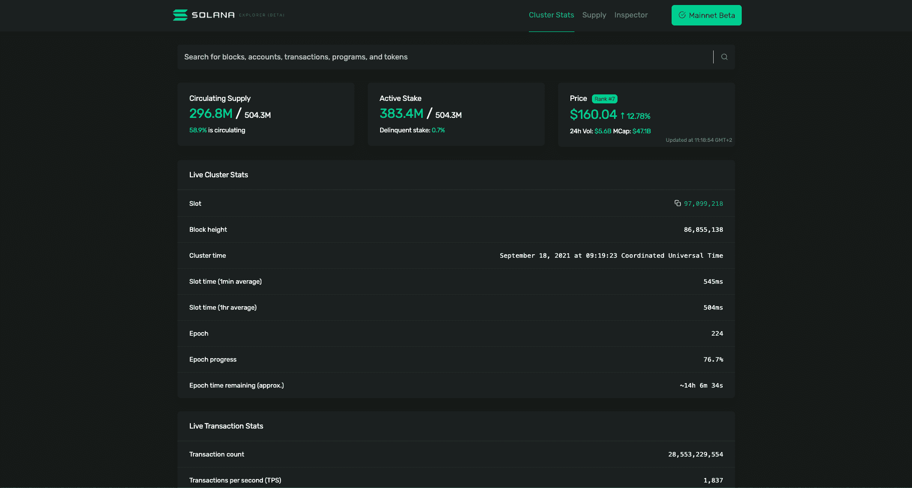
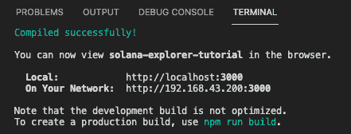
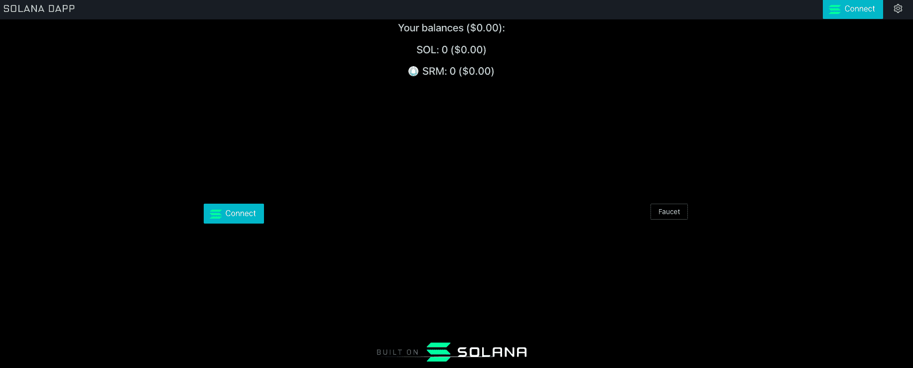
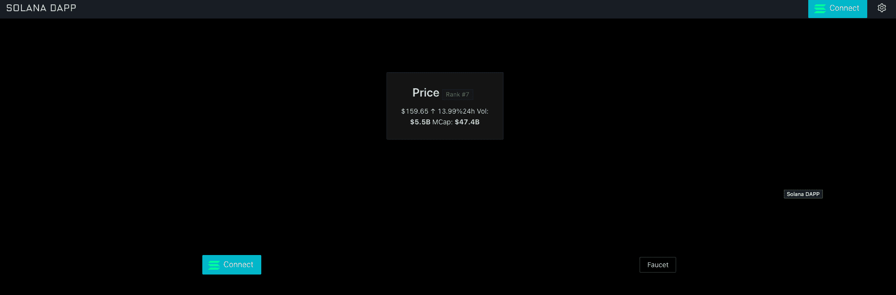
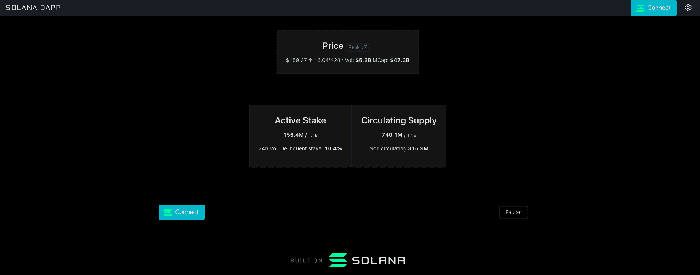
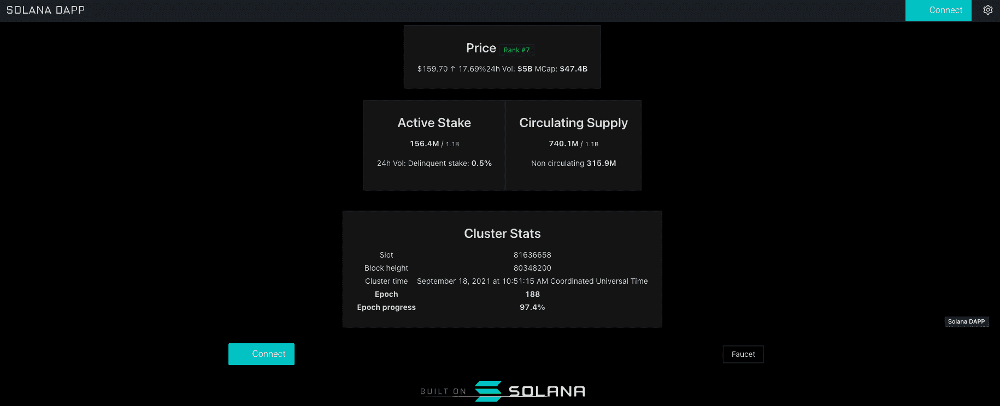
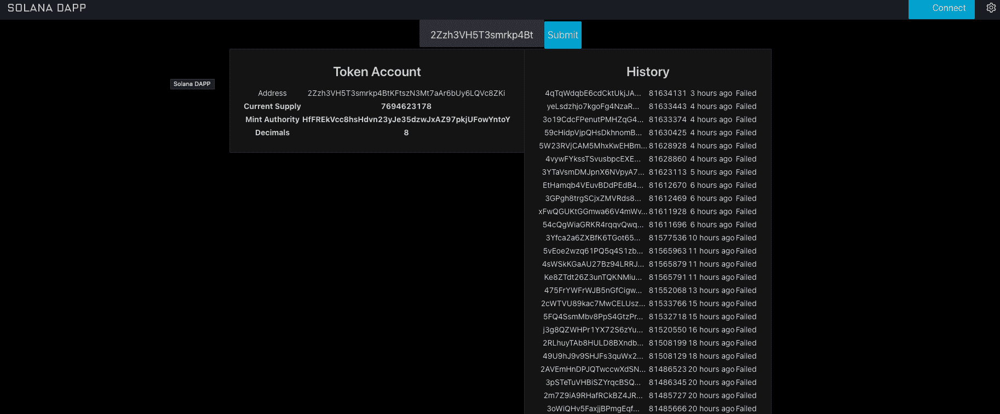

# 介绍

> 原文：<https://github.com/figment-networks/learn-tutorials/blob/master/solana/solana-explorer-tutorial.md>

索拉纳是一个公共区块链平台。它是开源的和去中心化的，使用利害关系证明和历史证明达成共识。从 Solana explorer 开始可能会让人不知所措。在本教程中，我们将使用开源的 dApp 支架来构建一个 Solana Explorer。

我们将构建一个非常简化的 Solana Explorer T1 的克隆版本。



# 先决条件

*   基本熟悉 javascript 和 reactjs。
*   完成 [Solana 101 途径](https://learn.figment.io/protocols/solana)

# 要求

*   [dApp 脚手架](https://github.com/solana-labs/dapp-scaffold)。
*   [GitHub 账户](https://github.com/)
*   安装了 Git

# 开始

1.  首先克隆 dApp 支架 repo [dapp 支架](https://github.com/solana-labs/dapp-scaffold.git)。

```js
git clone https://github.com/solana-labs/dapp-scaffold.git 
```

```js
cd dapp-scaffold 
```

2.  要安装依赖项，请运行`npm install`或`yarn`。

3.  `npm run start`或`yarn start`在本地主机上运行 dapp。



我们应该让 dapp-scaffold 在 localhost:3000 上运行。



我们将建立我们可以在[索拉纳浏览器](https://explorer.solana.com/)中看到的基本统计数据，我们将它分解成更多的基本步骤。我们将获取价格、统计数据并搜索地址。

# 获取索拉纳价格

[https://youtu.be/0ly3cU5kPns](https://youtu.be/0ly3cU5kPns)

作为第一步，我们将从 Coingecko 获得价格。在 components 下创建一个名为 PriceCard 的新文件夹，并在其中创建一个名为`index.tsx`的文件。

完整路径:`src/components/PriceCard/index.tsx`。

复制并粘贴以下代码:

```js
import { useState } from "react";
import { abbreviatedNumber } from "../../utils/utils";
import React, { useEffect } from "react";
import { Typography, Tag, Card } from "antd";
const { Title, Text } = Typography;

// Create Interfaces for Coingecko API
export interface CoinInfo {
  price: number;
  volume_24: number;
  market_cap: number;
  price_change_percentage_24h: number;
  market_cap_rank: number;
  last_updated: Date;
}

export enum CoingeckoStatus {
  Success,
  FetchFailed,
  Loading,
}

export type CoinGeckoResult = {
  coinInfo?: CoinInfo;
  status: CoingeckoStatus;
};

export interface CoinInfoResult {
  market_data: {
    current_price: {
      usd: number;
    };
    total_volume: {
      usd: number;
    };
    market_cap: {
      usd: number;
    };
    price_change_percentage_24h: number;
    market_cap_rank: number;
  };
  last_updated: string;
}

export default function PriceCard() {
  const [coinInfo, setCoinInfo] = useState<CoinGeckoResult>();

  const coinId = "solana";
  useEffect(() => {
    getPrice();
  }, []);

  // Use Coingecko API
  function getPrice() {
    fetch(`https://api.coingecko.com/api/v3/coins/${coinId}`)
      .then((res) => res.json())
      .then((info: CoinInfoResult) => {
        setCoinInfo({
          coinInfo: {
            price: info.market_data.current_price.usd,
            volume_24: info.market_data.total_volume.usd,
            market_cap: info.market_data.market_cap.usd,
            market_cap_rank: info.market_data.market_cap_rank,
            price_change_percentage_24h:
              info.market_data.price_change_percentage_24h,
            last_updated: new Date(info.last_updated),
          },
          status: CoingeckoStatus.Success,
        });
      })
      .catch((error: any) => {
        setCoinInfo({
          status: CoingeckoStatus.FetchFailed,
        });
      });
  }

  // Display Solana price
  return (
    <Card
      hoverable
      style={{
        display: "inline-flex",
        justifyContent: "center",
        alignItems: "center",
      }}
    >
      {coinInfo?.coinInfo && (
        <>
          <Title level={3}>
            Price{" "}
            <Tag color="green">Rank #{coinInfo.coinInfo.market_cap_rank}</Tag>
          </Title>
          <Text>
            ${coinInfo.coinInfo.price.toFixed(2)}{" "}
            {coinInfo.coinInfo.price_change_percentage_24h > 0 && (
              <span color="green">
                &uarr;{" "}
                {coinInfo.coinInfo.price_change_percentage_24h.toFixed(2)}%
              </span>
            )}
            {coinInfo.coinInfo.price_change_percentage_24h < 0 && (
              <span color="red">
                &darr;{" "}
                {coinInfo.coinInfo.price_change_percentage_24h.toFixed(2)}%
              </span>
            )}
            {coinInfo.coinInfo.price_change_percentage_24h === 0 && (
              <span>0%</span>
            )}
          </Text>
          <Text>
            24h Vol: <em>${abbreviatedNumber(coinInfo.coinInfo.volume_24)}</em>
            MCap: <em>${abbreviatedNumber(coinInfo.coinInfo.market_cap)}</em>
          </Text>
        </>
      )}
    </Card>
  );
}
```

这里，我们在`getPrice()`函数中从 Coingecko API 获取了价格。我们还使用了`abbreviateNumber`来显示成交量和市值。我们用`setCoinInfo`将返回值保存到状态中。如果`coinInfo`包含数据，我们在组件中显示它。

转到`utils.ts`和最后的功能`abbreviateNumber`。我们使用这个函数来显示一个用户友好的数字。

现在转到`src/views/home/index.tsx`并导入`PriceCard`

```js
import PriceCard from "../../components/PriceCard";
```

并在 return 中添加`PriceCard`来显示价格成分。

```js
return (
  <Row gutter={[16, 16]} align="middle" justify="center">
    {/* Add Solana price card to homepage */}
    <Col span={24}>
      <PriceCard />
    </Col>

    <Col span={12}>
      <WalletMultiButton type="ghost" />
    </Col>
    <Col span={12}>
      <Link to="/faucet">
        <Button>Faucet</Button>
      </Link>
    </Col>
    <Col span={24}>
      <div className="builton" />
    </Col>
  </Row>
);
```

保存所有文件。全部保存并重新加载。现在你应该能看到价格了。



# 获取供应统计

[https://youtu.be/wNgtUQqIwEk](https://youtu.be/wNgtUQqIwEk)

让我们一起深入了解 Solana web3js。`Web3js`提供一套完整的调用，让我们能够获得链上数据。你可以更深入地阅读[文档](https://solana-labs.github.io/solana-web3.js/)创建一个名为`SupplyCard`的新文件夹，里面有一个索引文件:`src/components/SupplyCard.tsx/index.tsx`。

粘贴此代码:

```js
// Import Types and Connection from web3
import {
  Supply,
  Connection,
  clusterApiUrl,
  VoteAccountStatus,
} from "@solana/web3.js";
import { useEffect, useState } from "react";

// Import formatters for better visualization
import { abbreviatedNumber, lamportsToSol } from "../../utils/utils";
import React from "react";

import { Typography, Row, Card } from "antd";
const { Title, Paragraph } = Typography;

// Convert lamports ( A fractional native token ) in more human readable format
function displayLamports(value: number) {
  return abbreviatedNumber(lamportsToSol(value));
}

export default function SupplyCard() {
  const [supply, setSupply] = useState<Supply>();
  const [voteAccounts, setVoteAccounts] = useState<VoteAccountStatus>();
  useEffect(() => {
    getSupply();
  }, []);

  // Use connection to get the supply and the number of vote accounts
  async function getSupply() {
    const url = clusterApiUrl("devnet").replace("api", "explorer-api");
    const connection = new Connection(url, "finalized");
    const supply: Supply = (await connection.getSupply()).value;
    const voteAccounts = await connection.getVoteAccounts();
    setVoteAccounts(voteAccounts);
    setSupply(supply);
  }

  // Get delinquent or inactive validators
  const delinquentStake = React.useMemo(() => {
    if (voteAccounts) {
      return voteAccounts.delinquent.reduce(
        (prev, current) => prev + current.activatedStake,
        0
      );
    }
  }, [voteAccounts]);

  // Get active validators
  const activeStake = React.useMemo(() => {
    if (voteAccounts && delinquentStake) {
      return (
        voteAccounts.current.reduce(
          (prev, current) => prev + current.activatedStake,
          0
        ) + delinquentStake
      );
    }
  }, [voteAccounts, delinquentStake]);

  // Get the percentage of stake that are in delinquent
  let delinquentStakePercentage;
  if (delinquentStake && activeStake) {
    delinquentStakePercentage = ((delinquentStake / activeStake) * 100).toFixed(
      1
    );
  }

  return (
    <Row gutter={[16, 16]} align="top" justify="center">
      {/* Show Active Stake */}
      <Card
        hoverable
        style={{
          display: "inline-flex",
          justifyContent: "center",
          alignItems: "center",
        }}
      >
        <Title level={3}>Active Stake</Title>
        {activeStake && supply && (
          <>
            <Paragraph>
              <em>{displayLamports(activeStake)}</em> /{" "}
              <small>{displayLamports(supply.total)}</small>
            </Paragraph>
            {delinquentStakePercentage && (
              <Paragraph>
                24h Vol: Delinquent stake: <em>{delinquentStakePercentage}%</em>
              </Paragraph>
            )}
          </>
        )}
      </Card>

      {/* Show Circulating Supply */}
      <Card
        hoverable
        style={{
          display: "inline-flex",
          justifyContent: "center",
          alignItems: "center",
        }}
      >
        <Title level={3}>Circulating Supply</Title>
        {activeStake && supply && (
          <>
            <Paragraph>
              <em>{displayLamports(supply.circulating)}</em> /{" "}
              <small>{displayLamports(supply.total)}</small>
            </Paragraph>
            <Paragraph>
              Non circulating <em>{displayLamports(supply.nonCirculating)}</em>
            </Paragraph>
          </>
        )}
      </Card>
    </Row>
  );
}
```

在`utils.ts`的末尾加上:

```js
// utils.ts
import { LAMPORTS_PER_SOL } from "@solana/web3.js";

export function lamportsToSol(lamports: number): number {
  return Math.abs(lamports) / LAMPORTS_PER_SOL;
}
```

将`SupplyCard`导入并添加到主屏幕`src/views/home/index.tsx`

```js
import SupplyCard from "../../components/SupplyCard";

//...

return (
  <Row gutter={[16, 16]} align="middle" justify="center">
    <Col span={24}>
      <PriceCard />
    </Col>

    {/* Add Supply data to homepage */}
    <Col span={24}>
      <SupplyCard />
    </Col>

    <Col span={12}>
      <WalletMultiButton type="ghost" />
    </Col>
    <Col span={12}>
      <Link to="/faucet">
        <Button>Faucet</Button>
      </Link>
    </Col>
    <Col span={24}>
      <div className="builton" />
    </Col>
  </Row>
);
```

让我们回到`SupplyCard.tsx`看看我们做了什么。从`web3.js`导入`Supply`和`VoteAccountStatus`类型，因为我们正在使用 typescript。我们已经用`clusterApiUrl`为 Devnet 创建了一个 URL，曾经创建了一个新的连接，最后用`getSupply()`使用该连接获取 supply，用`getVoteAccounts()`获取 vote 帐户。然后将`voteAccounts`和`Supply`设置为状态。

全部保存，让我们来研究一下。在这一点上，你应该看到前端的活跃股份和循环供应。



# 获取集群统计信息

[https://youtu.be/LlXaPZTBHc4](https://youtu.be/LlXaPZTBHc4)

为了挑战你自己，看看你是否知道如何从 web3js 获取数据，现在我们将创建另一个文件，你必须用正确的调用替换`undefined`来获取数据。创建一个包含索引文件的新文件夹`StatsCard.tsx`。

```js
import { Connection, clusterApiUrl } from "@solana/web3.js";
import React, { useEffect, useState } from "react";
import { displayTimestampUtc } from "../../utils/utils";

import { Typography, Card } from "antd";
const { Title } = Typography;

export const SAMPLE_HISTORY_HOURS = 6;

// Create type for clusterStats state
export type ClusterStats = {
  absoluteSlot: number;
  blockHeight: number | undefined;
  blockTime: number;
  currentEpoch: string;
  epochProgress: string;
};

export default function StatsCard() {
  const [clusterStats, setClusterStats] = useState<ClusterStats>();
  useEffect(() => {
    getClusterStats();
  }, []);

  // Complete the code where is marked as TODO
  async function getClusterStats() {
    const url = undefined; // TODO 1: Retrieve the RPC API URL for the devnet
    const connection = new Connection(url);

    const epochInfo = await undefined; // TODO 2: get the epoch
    const blockTime = await connection.getBlockTime(epochInfo.absoluteSlot);
    const { blockHeight, absoluteSlot } = epochInfo;
    const currentEpoch = epochInfo.epoch.toString();
    const { slotIndex, slotsInEpoch } = epochInfo;
    const epochProgress = ((100 * slotIndex) / slotsInEpoch).toFixed(1) + "%";

    // Set the state with cluster stats
    if (blockTime !== null) {
      const clusterStatsData = {
        absoluteSlot,
        blockHeight,
        blockTime: blockTime * 1000,
        currentEpoch,
        epochProgress,
      };
      setClusterStats(clusterStatsData);
    }
  }

  // Show the card with cluster stats
  return (
    <Card
      hoverable
      style={{
        display: "inline-flex",
        justifyContent: "center",
        alignItems: "center",
      }}
    >
      <Title level={3}>Cluster Stats</Title>
      {clusterStats ? (
        <table>
          <tr>
            <td>Slot</td>
            <td>{clusterStats.absoluteSlot}</td>
          </tr>
          {clusterStats.blockHeight !== undefined && (
            <tr>
              <td>Block height</td>
              <td>{clusterStats.blockHeight}</td>
            </tr>
          )}
          {clusterStats.blockTime && (
            <tr>
              <td>Cluster time</td>
              <td> {displayTimestampUtc(clusterStats.blockTime)}</td>
            </tr>
          )}
          <tr>
            <th>Epoch</th>
            <th>{clusterStats.currentEpoch}</th>
          </tr>
          <tr>
            <th>Epoch progress</th>
            <th>{clusterStats.epochProgress}</th>
          </tr>
        </table>
      ) : (
        <p>No Data</p>
      )}
    </Card>
  );
}
```

在 utils 文件中添加:

```js
// utils.ts
// Convert timestamp to human readable
export function displayTimestampUtc(
  unixTimestamp: number,
  shortTimeZoneName = false
): string {
  const expireDate = new Date(unixTimestamp);
  const dateString = new Intl.DateTimeFormat("en-US", {
    year: "numeric",
    month: "long",
    day: "numeric",
    timeZone: "UTC",
  }).format(expireDate);
  const timeString = new Intl.DateTimeFormat("en-US", {
    hour: "numeric",
    minute: "numeric",
    second: "numeric",
    timeZone: "UTC",
    timeZoneName: shortTimeZoneName ? "short" : "long",
  }).format(expireDate);
  return `${dateString} at ${timeString}`;
}
```

导入到主页。

```js
import StatsCard from "../../components/StatsCard";

// ... add the stats card inside return
<Col span={24}>
  <StatsCard />
</Col>;
```

这次在`StatsCard`里面，URL 和`epochInfo`被**省略**让你来完成它们。在本教程的最后，你会找到最终的回购，你可以在那里检查答案，或者你也可以按照视频教程。完成缺失信息后，您将看到:



# 搜索帐户和交易

[https://youtu.be/RYZRRcIBBJM](https://youtu.be/RYZRRcIBBJM)

你做得很好，现在你知道如何用 Solana `web3js`获取数据。我们将继续学习如何搜索帐户并列出历史交易，我们还将从交易中获取详细信息。为了显示安装 react `moment`所需的时间:

```js
npm i -D react-moment 
```

用一个`index.tsx`文件创建一个新文件夹`SearchCard`并粘贴:

```js
import "./style.css";
import bs58 from "bs58";
import React, { useState } from "react";

import AccountDetailsCard from "./AccountDetailsCard";
import TxDetailsCard from "./TxDetailsCard";

export type Query = { searchValue?: string; searchType?: string };

export default function SearchCard() {
  const [query, setQuery] = useState<Query>();

  // Set searched value to state
  function handleChange(event: any) {
    const { value } = event.target;
    console.log(value);
    setQuery({ searchValue: value });
  }

  // Set search type to address or signature
  function handleSubmit(event: any) {
    event.preventDefault();
    console.log(event.target);
    if (query?.searchValue !== undefined) {
      const decoded = bs58.decode(query?.searchValue);
      if (decoded.length === 32) {
        setQuery({ searchValue: query?.searchValue, searchType: "address" });
        console.log(decoded);
      } else if (decoded.length === 64) {
        setQuery({ searchValue: query?.searchValue, searchType: "signature" });
        console.log(decoded);
      } else {
        console.log("Input not correct");
      }
      event.preventDefault();
    }
  }

  // Show search input and the result
  return (
    <>
      <form onSubmit={handleSubmit}>
        <label>
          <input
            className="input"
            type="text"
            value={query?.searchValue}
            onChange={handleChange}
          />
        </label>
        <input className="submit" type="submit" value="Submit" />
      </form>

      {query?.searchType === "signature" && <TxDetailsCard query={query} />}

      {query?.searchType === "address" && <AccountDetailsCard query={query} />}
    </>
  );
}
```

在同一文件夹中创建`style.css`,并添加:

```js
.submit {
  background-color: #08d;
  border-radius: 2px;
  border: 0;
  box-sizing: border-box;
  color: #eee;
  cursor: pointer;
  font-size: 18px;
  height: 50px;
  outline: 0;
  text-align: center;
}

.submit:active {
  background-color: #06b;
}

.input {
  background-color: #303245;
  border-radius: 2px;
  border: 0;
  box-sizing: border-box;
  color: #eee;
  font-size: 18px;
  height: 50px;
  outline: 0;
  padding: 4px 20px 0;
}
```

在索引文件中，我们将输入解码为 base 58 编码。检查长度，这样我们就能知道是地址还是交易。地址在`decoded.length === 32`签名在`decoded.length === 64`可以看到。在同一个文件夹中，`SearchCard`，我们添加以下文件:`AccountDetailsCard.tsx`

```js
import { PublicKey } from "@solana/web3.js";
import { Connection, clusterApiUrl } from "@solana/web3.js";
import React, { useEffect, useState } from "react";

import HistoryCard from "./HistoryCard";

import { Typography, Card } from "antd";
const { Title } = Typography;

export type Query = { searchValue?: string; searchType?: string };

// Type for account details data
export type DataDetails = {
  program: string;
  parsed: {
    info: {
      decimals?: number;
      freezeAuthority?: string;
      isInitialized?: boolean;
      mintAuthority?: string;
      supply?: string;
      isNative?: false;
      mint?: string;
      owner?: string;
      state?: string;
      tokenAmount?: {
        amount: string;
        decimals: number;
        uiAmount: number;
        uiAmountString: string;
      };
    };
    type: string;
  };
};

export type Data = {
  pubkey: PublicKey;
  lamports: number;
  details?: {
    space: number;
    executable: boolean;
    owner: PublicKey;
    data?: DataDetails;
  };
};

export function AccountHeader({ data }: { data?: Data }) {
  const [detailsData, setDetailsData] = useState<DataDetails>();

  useEffect(() => {
    setDetailsData(data?.details?.data);
    console.log("detatailsData", detailsData);
  }, [data]);

  // Check if is token account
  const isToken =
    detailsData?.program === "spl-token" && detailsData?.parsed.type === "mint";

  // Show Token Account
  if (isToken) {
    return (
      <Card
        hoverable
        style={{
          display: "inline-flex",
          justifyContent: "center",
          alignItems: "center",
        }}
      >
        <Title level={3}>Token Account</Title>
        <table>
          <tr>
            <td>Address</td>
            <td>{data?.pubkey.toBase58()}</td>
          </tr>
          <tr>
            <th>Current Supply</th>
            <th>{detailsData?.parsed.info.supply}</th>
          </tr>
          <tr>
            <th>Mint Authority</th>
            <th>{detailsData?.parsed.info.mintAuthority}</th>
          </tr>
          <tr>
            <th>Decimals</th>
            <th>{detailsData?.parsed.info.decimals}</th>
          </tr>
        </table>
      </Card>
    );
  }

  // Show account
  return (
    <Card
      hoverable
      style={{
        display: "inline-flex",
        justifyContent: "center",
        alignItems: "center",
      }}
    >
      <Title level={3}>Account</Title>
      <table>
        <tr>
          <td>Address</td>
          <td>{data?.pubkey.toBase58()}</td>
        </tr>
        <tr>
          <th>Mint</th>
          <th>{detailsData?.parsed.info.mint}</th>
        </tr>
        <tr>
          <th>Owner</th>
          <th>{detailsData?.parsed.info.owner}</th>
        </tr>
        <tr>
          <th>State</th>
          <th>{detailsData?.parsed.info.state}</th>
        </tr>
      </table>
    </Card>
  );
}

export default function AccountDetailsCard({ query }: { query: Query }) {
  const [data, setData] = useState<Data>();
  let pubkey: PublicKey | undefined;

  useEffect(() => {
    getData();
  }, [query.searchValue]);

  async function getData() {
    // Get explorer url and connect
    const url = clusterApiUrl("devnet").replace("api", "explorer-api");
    const connection = new Connection(url, "finalized");

    try {
      if (query.searchValue !== undefined) {
        // Create public key from search string
        pubkey = new PublicKey(query.searchValue);
        // Get account data
        const result = (await undefined).value; // TODO: Get the account info

        let lamports, details;
        if (result === null) {
          lamports = 0;
        } else {
          // Get account lamports
          lamports = result.lamports;

          // Space used by account data
          let space: number;
          if (!("parsed" in result.data)) {
            space = result.data.length;
          } else {
            space = result.data.space;
          }

          // Set result data to the variable details
          let data: DataDetails | undefined;
          if ("parsed" in result.data) {
            data = {
              program: result.data.program,
              parsed: result.data.parsed,
            };
            details = {
              space,
              executable: result.executable,
              owner: result.owner,
              data,
            };
          } else {
            details = {
              space,
              executable: result.executable,
              owner: result.owner,
            };
          }
        }

        // Set all the data to the state
        setData({ pubkey, lamports, details });
        console.log("address", query.searchValue);
      }
    } catch (err) {}
  }

  // Return the account header and the component that shows the history.
  return (
    <>
      {!data?.pubkey ? (
        <p>Not valid pubkey</p>
      ) : (
        <>
          <AccountHeader data={data} />
          <HistoryCard pubkey={data.pubkey} />
        </>
      )}
    </>
  );
}
```

我们使用`clusterApiUrl`来获取 URL 和连接，通过 Pubkey 来获取数据，从而获得帐户的详细信息。在这个文件中，找出我们调用了哪个函数来获取帐户信息。用以下代码创建`HistoryCard.tsx`:

```js
import {
  Connection,
  clusterApiUrl,
  PublicKey,
  ConfirmedSignatureInfo,
} from "@solana/web3.js";
import React, { useEffect, useState } from "react";
import Moment from "react-moment";

import { Typography, Card } from "antd";
const { Title } = Typography;

export type History = {
  fetched: ConfirmedSignatureInfo[];
};

export default function HistoryCard({ pubkey }: { pubkey: PublicKey }) {
  const [history, setHistory] = useState<History>();
  useEffect(() => {
    getHistory();
  }, [pubkey]);

  async function getHistory() {
    // Get API URL and create the connection
    const url = clusterApiUrl("devnet").replace("api", "explorer-api");
    const connection = new Connection(url);

    // Limit the maximum amounts of returned signatures
    const options = {
      limit: 25,
    };
    const fetched = undefined; //TODO: Get confirmed signatures for provided address

    setHistory({ fetched });
    console.log(fetched);
  }

  // Show the history
  return (
    <Card
      hoverable
      style={{
        display: "inline-flex",
        justifyContent: "center",
        alignItems: "center",
      }}
    >
      <Title level={3}>History</Title>
      {history?.fetched ? (
        <>
          <table>
            {history.fetched.map((item, i) => (
              <tr key={i}>
                <td>{item.signature.substr(0, 20)}...</td>
                <td>{item.slot}</td>

                <td>
                  {item?.blockTime ? (
                    <Moment date={item.blockTime * 1000} fromNow />
                  ) : (
                    ""
                  )}
                </td>
                <td>{item?.err ? "Failed" : "Success"}</td>
                <td>{item?.memo ? item.memo : ""}</td>
              </tr>
            ))}
          </table>
        </>
      ) : (
        <p> No History </p>
      )}
    </Card>
  );
}
```

这里我们需要获取所提供地址的签名。我们用瞬间来表示从现在开始的时间。和交易信息的文件。`TxDetailsCard.tsx`

```js
import { Connection, clusterApiUrl } from "@solana/web3.js";
import React, { useEffect, useState } from "react";

import { Typography, Card } from "antd";
const { Title } = Typography;

// Create types for the transaction details
export type Query = { searchValue?: string; searchType?: string };

export type Confirmations = number | "max";
export type Timestamp = number | "unavailable";

export type Data = {
  signature: string;
  info: {
    slot: number;
    timestamp: Timestamp;
    confirmations: Confirmations;
    confirmationStatus: "processed" | "confirmed" | "finalized" | undefined;
    result: {
      err: string | {} | null;
    };
  } | null;
};

export default function TxDetailsCard({ query }: { query: Query }) {
  const [txData, setTxData] = useState<Data>();

  useEffect(() => {
    getData();
  }, []);

  async function getData() {
    // Get API URL and create the connection
    const url = clusterApiUrl("devnet").replace("api", "explorer-api");
    const connection = new Connection(url, "finalized");

    let data;
    try {
      // Get the signature status
      if (query.searchValue !== undefined) {
        const { value } = await connection.getSignatureStatus(
          query.searchValue,
          {
            searchTransactionHistory: true,
          }
        );

        // If status is not null. Get transaction details
        let info = null;
        if (value !== null) {
          let confirmations: Confirmations;
          if (typeof value.confirmations === "number") {
            confirmations = value.confirmations;
          } else {
            confirmations = "max";
          }

          let blockTime = null;
          try {
            blockTime = await connection.getBlockTime(value.slot);
          } catch (error) {
            console.log(error);
          }
          let timestamp: Timestamp =
            blockTime !== null ? blockTime : "unavailable";

          info = {
            slot: value.slot,
            timestamp,
            confirmations,
            confirmationStatus: value.confirmationStatus,
            result: { err: value.err },
          };
        }
        console.log("info", info);
        data = { signature: query.searchValue, info };
        setTxData(data);
      }
    } catch (error) {
      console.log(error);
    }
  }

  // Show transaction details
  return (
    <Card
      hoverable
      style={{
        display: "inline-flex",
        justifyContent: "center",
        alignItems: "center",
      }}
    >
      <Title level={3}>Transaction</Title>
      <table>
        <tr>
          <td>Signature</td>
          <td>{query.searchValue?.substr(0, 20)}...</td>
        </tr>
        <tr>
          <td>Result</td>
          <td>{txData?.info?.result.err ? "Failed" : "Success"}</td>
        </tr>
        <tr>
          <td>Timestamp</td>
          <td>
            {txData?.info?.timestamp !== "unavailable" ? (
              <p>{txData?.info?.timestamp}</p>
            ) : (
              <p>Unavailable</p>
            )}
          </td>
        </tr>
        <tr>
          <td>Confirmation Status</td>
          <td>{txData?.info?.confirmationStatus || "Unknown"}</td>
        </tr>
        <tr>
          <td>Confirmations</td>
          <td>{txData?.info?.confirmations}</td>
        </tr>
        <tr>
          <td>Block</td>
          <td>{txData?.info?.slot}</td>
        </tr>
      </table>
    </Card>
  );
}
```

我们首先使用连接来检查签名状态。如果它不为空，我们获取阻塞时间并将其全部传递给`txData`。在主页上导入组件。

```js
import SearchCard from "../../components/SearchCard";
// ...
// Add search card
<Col span={24}>
  <SearchCard />
</Col>;
```

尝试搜索一个地址，您应该看到类似这样的内容:



恭喜你！我们成功了。<g-emoji class="g-emoji" alias="+1" fallback-src="https://github.githubassets.cimg/icons/emoji/unicode/1f44d.png">👍</g-emoji>

# 结论

在本教程中，我们使用 Solana dapp-scaffold 和 Solana explorer 的主要特性构建了一个简单的区块链浏览器。我们已经学会了如何从 Coingecko 获取价格数据，使用@solana/web3.js 获取一般统计数据，从一个帐户中搜索历史交易并获取交易的详细信息。

如果您在阅读本教程时有任何困难，或者只是想与我们讨论索拉纳技术，您可以今天就[加入我们的社区](https://figment.io/devchat)！

# 后续步骤

Dapp-scaffold 允许您连接到您的钱包，您可以通过从连接的帐户获取所有数据来创建个人仪表板。

# 关于作者

本教程由 Giovanni Fu 创作。可以在 Github 上找到他。

# 参考

*   [Dapp 脚手架](https://github.com/solana-labs/dapp-scaffold)
*   [索拉纳探险家](https://github.com/solana-labs/explorer)
*   [索拉纳 web3](https://github.com/solana-labs/solana-web3.js)
*   [蚂蚁设计](https://ant.design/)

已完成的项目源

*   [结束项目](https://github.com/aeither/dapp-scaffold-explorer-tutorial)