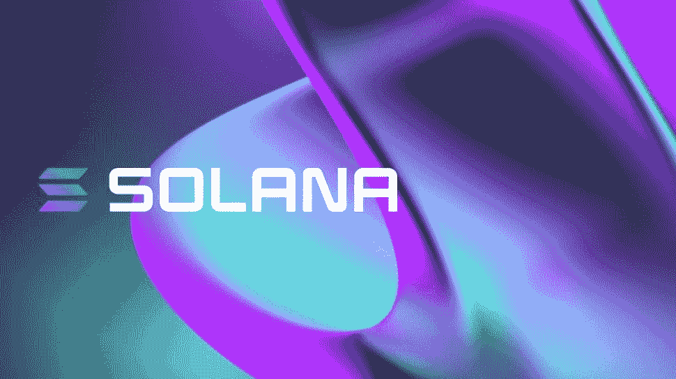
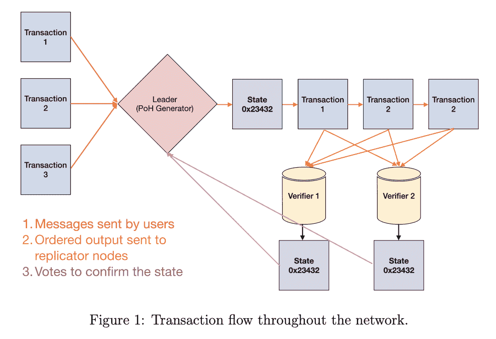
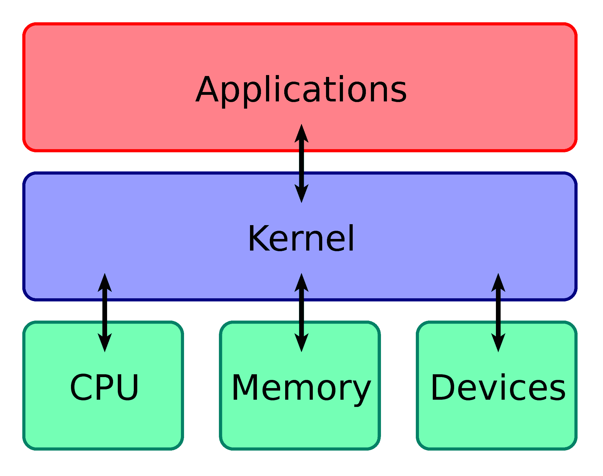
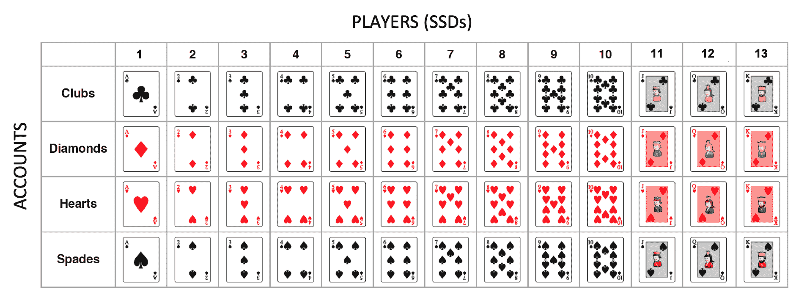

# solana/solana-jargon-free

> 原文：<https://github.com/figment-networks/learn-tutorials/blob/master/solana/solana-jargon-free.md>

索拉纳是什么？作为一个非开发人员，当由一个讲代码的工程师解释时，这可能很难理解。根据定义，Solana 是一个去中心化的区块链，旨在为全世界提供可扩展的、用户友好的应用程序。Solana 以基于 8 项核心创新而闻名，提供高吞吐量和低交易成本，为 DeFi、NFTs、Web3 等提供网络级产品。

在本教程中，我们将以适合任何人掌握的术语来回顾和讨论这些创新。如果您不是开发人员或不熟悉代码，那么您正处于了解 Solana 的合适位置，更重要的是，了解它带来了什么。

# 先决条件

*   对区块链及其使用案例的一般知识和理解

# 索拉纳的 8 大核心创新

Solana 号称拥有业界最快的速度，每秒可以处理超过 50，000 个事务(tps)。该协议做到了这一点，同时确保用户和开发人员的每笔交易成本不会超过 0.01 美元。在这种性能水平下，Solana 将比现在的以太坊快 2500 倍，便宜 559 倍！

这怎么可能？？

## 1.历史证明

这是索拉娜的秘制酱。如果你对区块链比较熟悉，你肯定听说过利益证明(PoS)和工作证明(PoW)。索拉纳采用了流行而有效的利害关系证明方法来保护他们的区块链，然后增加了一个升级— **历史证明**。这为区块链增压。

为了概念化 PoH，把区块链想象成游乐园。在这些游乐园，你必须在许多入口中的一个门口排队等候，提供你的票并被允许进入。接收公园的入口相当于处理您的交易，并将其包含在添加到链中的下一个块中。对于公园来说，最重要的是所有的入口都在同一页上，说明谁在什么时候可以进入。

为了做到这一点，以太坊等受欢迎的游乐园要求大门工作人员相互无线电联系，讨论并商定哪些人将成为下一批进入公园的人——让顾客排队盯着他们的手表。如果这是公园里忙碌的一天，你只能想象这个过程是多么的艰难和耗时。因此，队伍可能会很长，票价也会飙升。

为了避免这种情况，索拉纳找到他们的登机口操作员，给他们每人一台特殊的打印机。这种打印机记录顾客在入口处递交门票的时间，将其转换成安全字符串，并打印在门票上。这通常被称为加密时间戳。每张通过打印机的票据都会收到一个时间戳，该时间戳引用了直接印在它前面的票据，从而巩固了安全性并提高了订单确定性。如果你在地上发现了一张这样的票，你就基本上拥有了在这张票被打印出来之前，所有进入公园的游客的历史记录。这对于公园的首要任务——跟踪谁在何时被接纳——非常有用。

通过做这一点前期尽职调查，Solana gate 运营商可以让一群人先进入公园，然后就订单达成一致。当讨论事件顺序的时候，没有什么好争论的，因为没什么好争论的。闸机操作员很快按时间戳，击掌，订购收集到的门票，然后继续工作。

PoH 是用来推动索拉纳尖端创新的燃料。在接下来的章节中，你将了解到这是如何以闪电般的速度将顾客的人流高效地导入公园的关键。

## 2.BFT 塔

这是索拉纳的共识算法。它可以被最好地归类为实用拜占庭容错(pBFT)的独特版本。为了把握这一点，我们先简单描述一下两者。

**实用拜占庭容错(pBFT)** —在试图达成共识的各方中选出一名领导者。当一个请求进来时，领导者广播给组中的每个人。当收到超过三分之二(> 2/3)的群体的相同答复时，就达成共识。对区块链来说，达成共识的政党是网络中的节点，在他们当中，每轮共识都会选出一个新的领导人。

**BFT 铁塔** —利用历史证明(PoH)的 pBFT。一名领导人向所有党派广播请求，请他们就他们认为的区块链现状进行投票。除了这一次，各政党不能投票支持区块链的某个州，除非该州包括他们在前一轮协商一致投票支持的州。这是可能的，因为 PoH 将在未来的共识投票中显示他们的投票记录。这允许更快的吞吐量，在规模化应用时，支持生动性胜于确定性；每个新投票随后都会重申之前的投票，从而提供指数共识和激励，与大多数人一起投票，以获得验证区块的奖励。BFT 铁塔公司在进行下一轮投票前不需要确认一致意见，他们可以用这个系统处理连续的投票。每一轮投票都有助于前几轮的共识。

## 交易流程

如果你进一步扩展我们的游乐园类比，你会更准确地描述索拉纳到底发生了什么。允许游客进入公园的流程如下:

*   星门操作员选择一个同伴星门作为领导者
*   领导者处理每个人的票(交易)，用他们的打印机给每个人打上时间戳——这是根据时间(PoH)排序的
*   在处理每个人的门票时，领导者生成一份他们认为游乐园(区块链)现在状态的副本，并在上面签名
*   领导者将订购的票的副本及其已处理交易的签名副本发送到其余的门(广播)
*   接收门处理一系列门票(交易)，并创建他们自己的签名副本，他们认为公园的组成现在看起来像什么(确认)
*   其他盖茨的每一次公开确认都是对共识算法的投票(BFT 塔)
*   新的领导者被选出，下一批等待进入的客人重复这个过程

来源:[索拉纳白皮书](https://solana.com/solana-whitepaper.pdf)

## 优化区块链

索拉纳创新每一个任务发生在区块链，不遗余力。下面您将了解到**湾流**如何消除事务池、**海平面**如何允许智能合约并行运行、**流水线**如何优化验证。

## 3.湾流

等待加入区块链的待决/未确认交易通常位于池中。想想游乐园类比，这是进公园的线。大门操作员正在互相讨论谁在排队，下一个该让哪一组进去。线越长，公园看到的需求就越多，而没有满足的需求就越多。当索拉纳让人们进入他们的公园时，他们知道下一个大门将让下一组人进入(哪个节点将成为下一个领导者)。这使得 Solana 的工作人员能够提前指引顾客到适当的门，允许门操作员提前处理和订购交易，这样当轮到他们开门时，他们可以几乎即时地完成。因此，索拉纳在其公园没有线。

## 4.海平面

从历史上看，区块链的状态是线性变化的，一个接一个地处理交易(智能合约)。Sealevel 允许 Solana 并行处理数千份智能合同。我们回到游乐园去。

当待处理的交易到达指定的关口时，它们按照特定的交易类型被分类成行。这使得公园为即将到来的情况做好准备。使用创新的处理系统，闸门操作员可以同时处理所有不同的分拣线。此外，Sealevel 利用了 CPU 和 GPU 硬件设计，允许将单个指令同时应用于多个数据点。这意味着入口处的每一个众所周知的分类行都可以同时被处理。想象一个有 5 行的入口位置，每一行都具体到他们如何进入，每一行并排，每一行都是成批处理的。这就是效率——这就是海平面。

## 5.管道铺设

流水线是一种常用的顺序处理方法(通常在 CPU 设计中),通过同时组织多条指令的执行来提高系统吞吐量。在 Solana 网络上，这就是为验证优化而处理事务的方式。

“交易处理单元”或 TPU 分四个阶段完成，包括提取、签名验证、银行和写入。Solana 利用不同的硬件来处理过程中的不同步骤，就像制造过程中的装配线一样。这个想法是让不同的硬件，也就是机制，一直忙碌着——优化输出(验证区块和分配区块奖励)。

过程是这样的:

1.  **数据获取阶段** —查询传入的交易以收集特定的数据点，为交易执行做准备，如在医生办公室进行患者调查。

    *   使用的硬件:*内核空间* —计算机操作系统的核心，拥有完整的系统控制权，便于硬件和软件之间的交互。把这想象成机器的四分卫，接收传入的比赛呼叫并相应地分配球。

来源:维基百科

2.  **签名验证阶段** —确保传入的交易请求都是唯一合法的。

    *   使用的硬件:*图形处理单元(GPU)* -一种专门的电子电路，旨在快速操纵和更改内存，以加速在帧缓冲区中创建图像，并输出到显示设备。这个定义是合适的，因为 GPU 通常被视为用于生成图像的硬件。然而，GPU 的并行结构在通过算法并行处理大块数据方面大有裨益——Solana 的面包和黄油。
3.  **银行阶段** —交易中分发代币的实际金融部分，PoH 也在此阶段得到利用。

    *   使用的硬件:*中央处理器(CPU)* -执行计算机程序指令的主处理器
4.  **写入阶段** —在永久存储器中记录交易，并随后将其广播到下游验证器节点。

    *   使用的硬件:*内核空间*

在装配线的末端，当 TPU 向验证器广播块时，所有其他阶段都在努力获取新数据、验证签名和贷记令牌。这使得索拉纳能够像一台运转良好的机器一样处理收到的交易。

## 维护区块链

创建新块后，领导者开始将块数据传播到其余节点，以便它们更新记录，这是一个由**涡轮**优化的过程。像所有创建运行记录列表的系统一样，创建帐户数据库是最重要的。为此，索拉纳选择了一种独特的方法，这种方法被称为他们的 **Cloudbreak** 创新。最后，为了保持区块链的记录不偏不倚和冗余，索拉纳有专门用于归档区块链的节点，称为**归档器**。这当然采用了为优化流程而构建的独特解决方案，这是一个常见的主题。

## 6.涡轮

一个节点每秒只能处理这么多的传输，所以为了处理更多的传输，你需要在区块链中增加更多的节点，对吗？不幸的是，这样做增加了数据量和填充数据的位置，对区块链产生了节流效应。索拉纳用涡轮解决了这个问题。

传统上，来自通过共识创建的区块的数据将由领导者(如上所述)发送给团队的其他成员，让他们整合到他们的区块链副本中。把过程想象成这样:小组的领导者创作一幅画(一块积木)。小组中的每个人都需要这幅画的副本，所以组长单独给每个人发了一份副本。每个副本都不小，因此这需要花费大量的时间和精力。使用 Turbine，领导者将他的画切割成一堆大小相等的小块，然后随机分发出去。然后，小组中的每个成员都复制一份，并将他们的作品交给旁边的人，反之亦然，直到每个人都有了自己的完整画作。

为了增加安全性，成员被分组，称为“邻居”。那些在项目中投入最多的人被安排在离领导者最近的社区，然后按照加权等级排序。邻居负责将他们的一些作品传递给下面的邻居，等等。如果每个人都没有尽自己的职责分享画作，领导者会分发每幅作品的额外副本——增加流程的健壮性。

Turbine 为块数据实现了这种方法，使数据能够更快、更安全、更高效地传播到区块链。

## 7.云破

在分布式系统中，内存通常用于跟踪帐户。这可能导致性能瓶颈，即网络规模成为存储容量和访问速度的限制。索拉纳再次转向硬件优化。

Solana 选择将其数据库水平分布在多个存储设备上——在本例中是 SSD。数据块被分段并按顺序分布在 SSD 卡中。将进入数据库存储的数据块想象成一副未洗牌的扑克牌，牌桌上的玩家就是 SSD 卡。输入的一副牌(数据包)由要存储的四套花色(帐户)组成。牌被一张一张地分发到 13 个玩家的桌子上，当所有的牌都分发出去时，每个玩家从每套牌中得到一张牌。一副牌中的每张牌都可以看作是一段数据。最后，deck(数据包)的存储结构如下所示:

被存储的账户“俱乐部”以逻辑和连续的顺序水平分布在玩家中。因为可以同时访问每个播放器或存储设备，所以系统的总吞吐量增加了。这通常被称为数据分条。每增加一个玩家，不仅增加了存储空间，还增加了可用的并发访问源的数量。数据的顺序组织对于 CPU 的使用也是最佳的，为启动增加了另一个性能提升。

硬件再次为索拉纳赢得胜利。作为一个整体，Cloudbreak 允许区块链增加并发操作，根据摩尔定律进行扩展，并利用硬件操作的协同作用。结果呢？卓越的性能。

## 8 .档案

Archivers 指的是 Solana 的分布式分类帐，它存储了大量的数据，维护着整个区块链的记录。档案节点不参与共识。相反，他们是历史的守护者(因此得名)。

在满负荷时，该网络预计将产生 1 GB/s 的数据，相当于每年 4pb 的数据。客观地说，1 PB 的数据相当于 1，000，000 GB 的数据。例如，一个人需要 368 个足球场大小的 1GB 闪存驱动器来存储一年的索拉纳历史！这是一个无法估量的数目。现在假设网络上的每个节点都必须存储所有这些数据？这可能是第一种，也可能是第二种，导致只有少数公司实体能够支持网络，从而消除了分散化。

对于索拉纳的团队来说，这两者都是不可接受的。他们的解决方案？坚持他们的基本优化技术。与 Turbine 和 Cloudbreak 将数据打包的方法类似，Solana 将分类帐历史分成小块，分发到归档节点。它将传出历史划分成的片段数量由目标复制率(他们需要多少份分类帐副本)和所需的容错能力决定。这些指标取决于归档程序的数量以及它们表示可供存储的空间量。

似乎有点冒险，不是吗？把整个历史分发给不同的团体。Solana 非常聪明地消除了这种恐惧，确保了其“有效归档区块链”的安全。

插入**复制证明**。对索拉纳来说，这是复制的证据——你猜对了——历史的证据。PoH 在那里做它最擅长的事——*让这个过程快速进行。*简单地说，复制证明是一个系统，通过该系统，归档节点验证它不仅分配了存储区块链数据的空间，而且还存储了它承诺保留的确切数据。系统通过在存储数据时加密数据来实现这一点。然后在稍后的时间，Solana 网络可以请求存档节点证明它正在做它所说的事情——存储区块链历史。加密允许存档节点快速复制数据，并将其提供回网络，证明存档节点信守承诺。如果花的时间太长，索拉纳网络就会知道档案节点不诚实，争先恐后地复制数据并掩盖其踪迹。

然而，区块链又一次从一个威胁去中心化、可伸缩性和安全性的问题，转向一个在实现这三个方面强化他们的例外主义的解决方案。

*参见第 1 节。历史证明(PoH ),了解有关 PoH 提供的验证速度和确定性优势的更多信息。*

# 结论

当你把这 8 项创新结合起来，你就得到一个网络规模的区块链。一种高性能、安全、易于开启创新世界的产品。PoH 可以减少 Solana 机器的消息传递开销，实现亚秒级的终结时间。Solana 对优化的承诺和对硬件扩展的远见也值得一提。

说到底，对于非开发者来说，区块链都是一种创建容错复制状态机的尝试。每个参赛的区块链都用不同的方法来解决这个问题。在历史证明的支撑下，在致力于提供最好的 Web3 生态系统的团队的带领下，Solana 准备在未来几年在行业中掀起波澜。

# 关于作者

本教程由 Brandon Goss 撰写，他是一名有抱负的加密和区块链研究分析师。如果您对本指南或索拉纳有任何疑问，可以通过 twitter 联系布兰登。

# 参考

【1】[索拉纳](https://solana.com/#)

[2] [沙丘分析，天然气价格 <g-emoji class="g-emoji" alias="fuelpump" fallback-src="https://github.githubassets.cimg/icons/emoji/unicode/26fd.png">⛽️</g-emoji> 作者@alex_kroger](https://dune.xyz/kroeger0x/gas-prices)

[3] [维基百科，内核(操作系统)](https://en.wikipedia.org/wiki/Graphics_processing_unit)