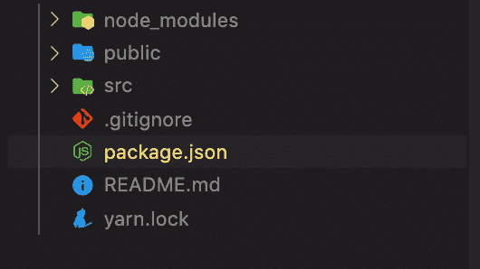
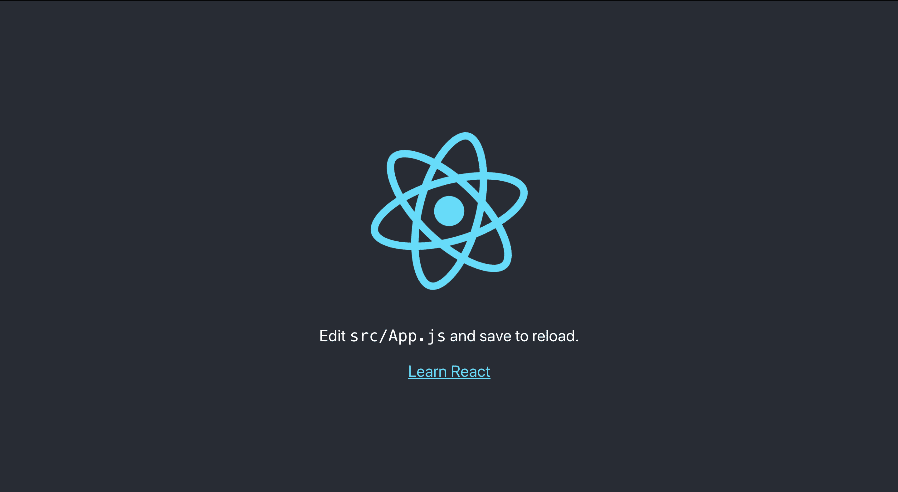
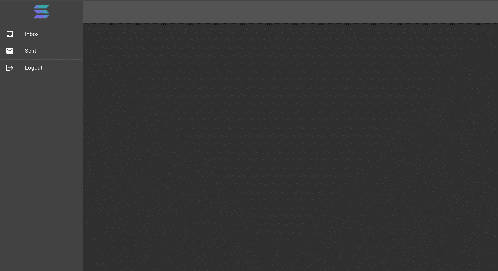
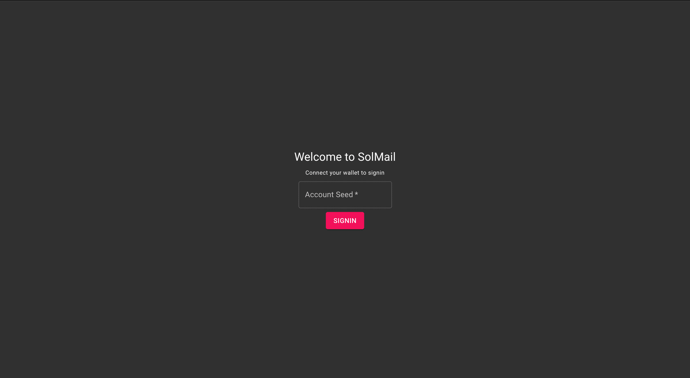
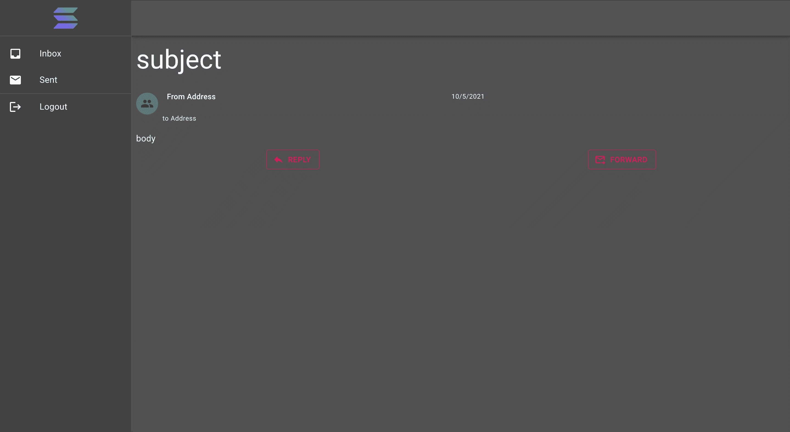

# 介绍

> 原文：<https://github.com/figment-networks/learn-tutorials/blob/master/solana/solana-mail.md>

Solana 是一个去中心化的区块链，旨在以每笔交易 0.00025 美元的平均成本为全世界提供可扩展的、用户友好的应用程序。在本教程中，我们将构建一个分散的邮件应用程序来展示索拉纳的潜力，我们将使用 [Rust](https://www.rust-lang.org/) 构建链上程序，使用 [React](https://reactjs.org/) 和 [MaterialUI](https://material-ui.com/) 构建 web UI。我们将一起检查代码，一步一步地构建程序和 web UI。

你可以在这里找到链上程序[的最终代码，在这里](https://github.com/Segun-Ogundipe/solana-mail)找到 UI

# 先决条件

对 Rust 编程语言和 React 的良好理解对于掌握本教程的内容非常重要。我建议通过“简介”一节中提供的链接来了解这两方面的内容。

# 要求

*   从[这里](https://rustup.rs/)安装铁锈
*   [Git](https://git-scm.com/downloads) 和
*   索拉纳 CLI [此处](https://docs.solana.com/cli/install-solana-cli-tools#use-solanas-install-tool)

# 构建邮件程序

# 项目设置

在 Github 上点击[这个模板](https://github.com/mvines/solana-bpf-program-template)并点击**使用这个模板**按钮，这将允许你创建一个新的库。给你的 repo 起一个新名字，选中“包含所有分支”框，然后点击**从模板创建存储库**按钮。现在用您喜欢的方法或者简单地使用`git clone https://github.com/<your Github username>/<what you named the repo>`将存储库克隆到您的本地机器上。

在您最喜欢的编辑器中打开`Cargo.toml`，并移除`[dev-dependencies]`下的板条箱。它现在应该是这样的:

```js
[package]
name = "solana-mail"
version = "0.1.0"
edition = "2018"
license = "WTFPL"
publish = false

[dependencies]
solana-program = "=1.7.10"

[features]
test-bpf = []

[lib]
crate-type = ["cdylib", "lib"]
```

# 入口点、程序和帐户

打开`src`文件夹中的`lib.rs`。它目前包含:

```js
use solana_program::{
  account_info::AccountInfo, entrypoint, entrypoint::ProgramResult, msg, pubkey::Pubkey,
};

entrypoint!(process_instruction);
fn process_instruction(
  program_id: &Pubkey,
  accounts: &[AccountInfo],
  instruction_data: &[u8],
) -> ProgramResult {
  msg!(
    "process_instruction: {}: {} accounts, data={:?}",
    program_id,
    accounts.len(),
    instruction_data
  );
  Ok(())
}

#[cfg(test)]
mod test {
  use {
    super::*,
    assert_matches::*,
    solana_program::instruction::{AccountMeta, Instruction},
    solana_program_test::*,
    solana_sdk::{signature::Signer, transaction::Transaction},
  };

  #[tokio::test]
  async fn test_transaction() {
    let program_id = Pubkey::new_unique();

    let (mut banks_client, payer, recent_blockhash) = ProgramTest::new(
      "bpf_program_template",
      program_id,
      processor!(process_instruction),
    )
    .start()
    .await;

    let mut transaction = Transaction::new_with_payer(
      &[Instruction {
        program_id,
        accounts: vec![AccountMeta::new(payer.pubkey(), false)],
        data: vec![1, 2, 3],
      }],
      Some(&payer.pubkey()),
    );
    transaction.sign(&[&payer], recent_blockhash);

    assert_matches!(banks_client.process_transaction(transaction).await, Ok(()));
  }
}
```

这个文件使用的板条箱被纳入[使用](https://doc.rust-lang.org/stable/book/ch07-04-bringing-paths-into-scope-with-the-use-keyword.html)关键字的范围。然后使用`entrypoint!` [宏](https://doc.rust-lang.org/stable/book/ch19-06-macros.html)声明`process_instruction`为程序的[入口点](https://docs.solana.com/developing/on-chain-programs/developing-rust#program-entrypoint)。顾名思义，entrypoint 是我们程序的入口点，所有对程序的调用都要经过`process_instruction`函数。

该函数有三个参数:

*   `program_id` -这是我们程序的[公钥](https://docs.solana.com/terminology#public-key-pubkey)，程序的标识符
*   Solana 程序是无状态的，程序本身不在事务之间存储数据。为了存储状态，我们使用[账户](https://docs.solana.com/developing/programming-model/accounts)
*   `instruction_data` -这是调用代码传递给程序的数据

# 代码结构

我们将使用以下格式构建代码:

```js
├─ src
│  ├─ lib.rs -> registering modules
│  ├─ entrypoint.rs -> entrypoint to the program
│  ├─ instruction.rs -> program API, (de)serializing instruction data
│  ├─ processor.rs -> program logic
│  ├─ state.rs -> program objects, (de)serializing state
│  ├─ error.rs -> program specific errors
├─ .gitignore
├─ Cargo.lock
├─ Cargo.toml
├─ Xargo.toml 
```

使用这种结构，我们的程序流程将如下所示:

1.  `entrypoint`将来电转移到`processor`
2.  `processor`使用来自`instruction.rs`的函数解码`instruction_data`
3.  解码数据后，`processor`将使用一个准备好的函数来处理请求
4.  `state.rs`包含项目中使用的数据模型。

例如，假设 Alice 在我们的程序上创建了一个帐户。这对我们来说意味着从她的钱包的公钥、种子短语和我们程序的公钥生成一个[程序派生地址(PDA)](https://docs.solana.com/developing/programming-model/calling-between-programs#program-derived-addresses) 。PDA 将作为 Alice 的帐户 id，她将使用它来发送和接收邮件。PDA 不仅是她的账号，也是她的数据仓库，她收发的所有邮件都存储在这里。

{ % hint style = " info " % } Solana 中的帐户归程序所有。一个程序只能操作它拥有的帐户中的数据，因此需要生成一个我们程序拥有的 PDA 帐户作为我们用户的帐户 id。

如果 Alice 想给 Bob 发送邮件，她将邮件数据作为请求发送给我们的程序，程序的`entrypoint`函数将请求及其所有数据转发给`processor`。然后`processor`在`instruction.rs`和`state.rs`中的解码逻辑的帮助下解码数据。最后，`processor`调用一个函数，将请求中发送的邮件数据保存到接收者帐户的收件箱中(随请求一起发送)。

在 src 文件夹中创建以下文件:

*   入口点. rs
*   错误. rs
*   指令. rs
*   处理器. rs
*   州政府

# 国家，第一部分

打开文件`lib.rs`，删除现有内容，然后添加以下代码，该代码定义了我们将使用的模块:

```js
pub mod entrypoint;
pub mod error;
pub mod instruction;
pub mod processor;
pub mod state;
```

这里我们需要做的下一件事是打开`state.rs`并声明我们的模型。在文件`state.rs`中，添加以下结构:

```js
pub struct Mail {
  pub id: String,
  pub from_address: String,
  pub to_address: String,
  pub subject: String,
  pub body: String,
  pub sent_date: String,
}
```

我们在这里所做的是声明一个表示邮件对象的结构。每个邮件对象都有一个`from_address`和`to_address`，String 类型的字段保存发送方和接收方公钥的 base58 表示。一个代表邮件主题的`subject`字段，一个代表邮件内容的`body`字段，最后是邮件发送日期`sent_Date`。我们将`String`数据类型用于`sent_date`字段，因为我们真正要保存的日期将是指定日期的字符串值。

这里需要注意的另一点是，账户中的数据是以`Uint8Array`格式存储的。这意味着，如果我们想在帐户数据中存储字符串“Solana is awesome ”,我们需要序列化该字符串。我们按照 [UTF-8](https://en.wikipedia.org/wiki/UTF-8) 格式将字符串中的每个字符转换成小数。在这种情况下，字符串“Solana is awesome”将被序列化为一个`Uint8Array`作为【83，111，108，97，110，97，32，105，115，32，97，119，101，115，111，109，101】

记住这一点，我们现在知道在将邮件数据存储到网络上之前，需要对其进行序列化。为此，我们将需要使用[博尔什](https://borsh.io/)板条箱。打开`Cargo.toml`并添加以下依赖项:

```js
...
[dependencies]
solana-program = "=1.7.10"
borsh = "0.9.1"
borsh-derive = "0.9.1"
...
```

三个点...单独在一行上表示存在其他代码，我们为了显示的目的已经对这些代码进行了剪裁。

然后将以下代码添加到`state.rs`

```js
use borsh::{BorshDeserialize, BorshSerialize};

#[derive(BorshDeserialize, BorshSerialize, Debug)]
pub struct Mail{
...
```

我们在这里所做的是使用`derive`宏为`BorshDeserialize`、`BorshSerialize`和`Debug`特征提供基本实现。`Debug`特征允许我们使用`"{:?}" debug` 格式化程序将邮件对象的内容打印到控制台。`BorshDeserialize`添加了一个名为`try_from_slice()`的关联方法，我们可以用它从对`u8`的一个片的引用中构造一个邮件对象。最后，`BorshSerialize`提供了一个名为`serialize()`的方法的基本实现，这允许我们将邮件对象的内容序列化到`u8`的片段中。

现在我们有了一个可以用来构建邮件对象的`struct`,让我们添加另一个`struct`,它将作为我们用户帐户数据的状态。这个`struct`将有两个字段，`inbox`和`sent`，这两个字段将是`Mail`的向量，表示用户帐户中的邮件列表。

仍在`state.rs`中，在邮件结构声明后添加以下内容:

```js
#[derive(BorshDeserialize, BorshSerialize, Debug)]
pub struct MailAccount {
  pub inbox: Vec<Mail>,
  pub sent: Vec<Mail>,
}
```

至此，我们暂时完成了`state.rs`。

# 入口点

在编辑器中打开文件`entrypoint.rs`并粘贴以下内容:

```js
use crate::processor::Processor;
use solana_program::{
  account_info::AccountInfo, entrypoint, entrypoint::ProgramResult, pubkey::Pubkey,
};

entrypoint!(process_instruction);
fn process_instruction(
  program_id: &Pubkey,
  accounts: &[AccountInfo],
  instruction_data: &[u8],
) -> ProgramResult {
  Processor::process(program_id, accounts, instruction_data)
}
```

这里的前两行从我们即将声明的处理器模块导入了`Processor`结构，从`solana_progam`箱导入了`AccountInfo`、`entrypoint`、`ProgramResult`和`Pubkey`。

`process_instruction()`是我们程序的入口点，发送到程序的每个请求都将由这个函数处理。该函数接受以下参数:

*   `program_id` -如前所述，这是对已部署程序的公共密钥的引用，它作为一种识别程序的方式
*   `accounts` -这是对一片`AccountInfo`的引用
*   `instruction_data` -这是对包含传递给程序进行处理的数据的`u8`片段的引用，它将包含邮件对象以及其他内容。

在`process_instruction()`函数的主体中，我们只有一行代码，从处理器模块调用`Processor`结构的一个尚未声明的函数`process()`。这个函数将处理所有进入我们程序的请求。

# 说明，第 1 部分

模块将包含我们程序的 API 定义。这里我们要定义的第一个端点是`InitAccount`端点。

```js
#[derive(Debug)]
pub enum MailInstruction {
  /// Initialize a new account
  ///
  /// Accounts expected
  ///
  /// 1\. `[writable]` The AccountInfo of the account to be initialized
  InitAccount,
}
```

`instruction`模块定义了一个枚举`MailInstruction`。此枚举当前声明了一个端点`InitAccount`。上面的注释表明它需要一个可写的`account`，这是为用户生成的 PDA。当我们开始构建 UI 时，我们将看到它是如何工作的。

```js
use crate::error::MailError::InvalidInstruction;
use solana_program::program_error::ProgramError;
...
impl MailInstruction {

  pub fn unpack(input: &[u8]) -> Result<Self, ProgramError> {
    let (tag, rest) = input.split_first().ok_or(InvalidInstruction)?;

    Ok(match tag {
      0 => Self::InitAccount,
      _ => return Err(InvalidInstruction.into()),
    })
  }
}
```

仍然在指令模块中，我们向名为`unpack()`的 MailInstruction 枚举添加了一个关联方法。该方法需要对一片`u8`的引用——这将是传递给我们的 entrypoint 函数的`instruction_data`参数。

在`unpack()`方法的第一行，我们对`u8`的切片调用 [split_first()](https://doc.rust-lang.org/std/primitive.slice.html#method.split_first) 方法。`split_first()`方法返回一个 [Option()](https://doc.rust-lang.org/std/option/enum.Option.html) enum，其中包含切片的第一个元素和所有其余元素。第一个元素作为一个标签，决定我们如何解码指令的其余部分。注意从`split_first()`调用返回的`Option()`上的 [ok_or()](https://doc.rust-lang.org/std/option/enum.Option.html#method.ok_or) 调用？您应该自己查找这些方法，以便更深入地了解调用的情况。这里最重要的是，你要明白我们提供了一个自定义的错误`InvalidInstruction`到`ok_or()`的方法，以防对`split_first()`的调用失败。

这段代码不会编译，因为我们还没有定义自定义错误。

# 错误

在`error.rs`模块中:

```js
use thiserror::Error;

#[derive(Error, Debug, Copy, Clone)]
pub enum MailError {
  /// Invalid Instruction
  #[error("Invalid Instruction")]
  InvalidInstruction,
}
```

用以下内容更新`Cargo.toml`中的依赖关系:

```js
thiserror = "1.0.24"
```

我们[在`error.rs`中定义了一个错误类型](https://doc.rust-lang.org/rust-by-example/error/multiple_error_types/define_error_type.html),然后使用 [thiserror](https://docs.rs/thiserror/latest/thiserror/) 库中的`Error`特征为我们的自定义错误实现`fmt::Display`。

这里还有一件事要做。我们还没有完全完成我们的错误模块。如果你看看我们在`instruction.rs`中的`unpack()`方法，它应该在出错时返回一个`ProgramError`，但是我们刚刚声明的错误并没有在`ProgramError`中实现。让我们来解决这个问题:

```js
use solana_program::program_error::ProgramError;

impl From<MailError> for ProgramError {
  fn from(e: MailError) -> Self {
    ProgramError::Custom(e as u32)
  }
}
```

这里，我们实现了来自特征的[,`?`操作符用它来返回一个错误。](https://doc.rust-lang.org/std/convert/trait.From.html)

现在我们有了错误、入口点和指令的基本设置，我们现在准备编码`processor.rs`

# 处理器，第 1 部分

在`processor.rs`模块中，粘贴:

```js
use crate::instruction::MailInstruction;
use solana_program::{
  account_info::AccountInfo,
  entrypoint::ProgramResult,
  msg,
  pubkey::Pubkey,
};

pub struct Processor;
impl Processor {
    pub fn process(
      program_id: &Pubkey;
      accounts: &[AccountInfo],
      instruction_data: &[u8],
    ) -> ProgramResult {
    let instruction = MailInstruction::unpack(instruction_data)?;

    match instruction {
      MailInstruction::InitAccount => {
        msg!("Instruction: InitAccount");
        Self::process_init_account(accounts, program_id)
      }
    }
  }
}
```

回到我们的`entrypoint.rs`模块，我们说过`process()`方法将处理发送给我们程序的每个请求。这是我们实现它的方式。我们将对持有`instruction_data`的片的引用从`entrypoint.rs`模块中的`process_instruction()`函数传递给`MailInstruction`的`unpack()`方法。然后，我们使用`match`来决定我们正在响应哪个请求，以及使用从对`unpack()`的调用中返回的 enum 来调用的正确方法。在`InitAccount`的情况下，我们调用`process_init_account()`函数:

```js
/// inside the Processor implementation, right after the process function
...

fn process_init_account(
    account: &AccountInfo,
    program_id: &Pubkey
  ) -> ProgramResult {

  Ok(())
}
```

这是对`process_init_account`方法的声明，它引用了一个`AccountInfo`——用户 PDA 地址的账户信息，以及一个`Pubkey`——程序 id，我们需要程序 id 的原因很快就清楚了。

为了初始化一个帐户，我们将只向该帐户发送一封欢迎邮件。这表明我们的设置是有效的。在我们实际编写邮件对象并将实例添加到用户的收件箱之前，我们需要验证帐户，以确保我们可以写入它，并且它属于这个程序。

```js
use crate::error::MailError::NotWritable;
use crate::instruction::MailInstruction;
use solana_program::{
  account_info::AccountInfo,
  entrypoint::ProgramResult,
  msg,
  program_error::ProgramError,
  pubkey::Pubkey,
};

...

fn process_init_account(
    account: &AccountInfo,
    program_id: &Pubkey
  ) -> ProgramResult {
  if !account.is_writable {
    return Err(NotWritable.into());
  }

  if account.owner != program_id {
    return Err(ProgramError::IncorrectProgramId);
  }

  Ok(())
}
```

第一个`if statement`检查帐户是否可写，如果不可写，则返回一个错误。`NotWritable`是一个自定义错误，应该添加到`error.rs`模块的`MailError`结构中。你应该在继续前进之前这样做。

第二个`if statement`确认账户所有者与程序 id 相同。如果它们不相同，它将返回一个错误。

更新`proessor.rs`中的导入部分:

```js
use crate::error::MailError::NotWritable;
use crate::instruction::MailInstruction;
use crate::state::{Mail, MailAccount};
use borsh::BorshSerialize;
use solana_program::{
  account_info::AccountInfo,
  entrypoint::ProgramResult,
  msg,
  program_error::ProgramError,
  pubkey::Pubkey,
};
```

接下来，我们编写一封欢迎邮件，并将其添加到帐户数据中。在`process_init_account`方法中，在两个 if 语句之后添加:

```js
...
let welcome_mail = Mail {
  id: String::from("00000000-0000-0000-0000-000000000000"),
  from_address: program_id.to_string(),
  to_address: account.key.to_string(),
  subject: String::from("Welcome to SolMail"),
  body: String::from("This is the start of your private messages on SolMail
 Lorem, ipsum dolor sit amet consectetur adipisicing elit. Quos ut labore, debitis assumenda, dolorem nulla facere soluta exercitationem excepturi provident ipsam reprehenderit repellat quisquam corrupti commodi fugiat iusto quae voluptates!"),
  sent_date: "9/29/2021, 3:58:02 PM"
};

let mail_account = MailAccount {
  inbox: vec![welcome_mail],
  sent: Vec::new(),
};

mail_account.serialize(&mut &mut account.data.borrow_mut()[..])?;
...
```

我们实例化了一个`Mail`结构的实例，然后为它的字段填充数据。我们还实例化了一个`MailAccount`对象，使用`vec!`宏将欢迎邮件实例添加到 inbox 字段，然后将一个空的 vector 对象分配给 sent 字段。在最后一行中，我们序列化了 mail_account 实例，然后通过调用`mail_account`实例的`serialize()`方法将序列化的数据写入用户的帐户数据，该方法使用了从用户帐户数据中可变借用的数据。

你可能会注意到这个微妙的表情。`serialize()`方法将对`u8`的可变片的引用作为参数，`borrow_mut()`方法返回一个`RefMut`。我们不能将`RefMut`传递给一个期望切片的方法，所以我们获取一个`RefMut`的可变切片，它返回一个`u8`的可变切片。Github 上的 [repo](https://github.com/Segun-Ogundipe/solana-mail) 对这里的方法进行了一些健全性测试。

我们已经完成了帐户初始化，现在我们可以继续添加逻辑来处理在两个帐户之间发送邮件的请求。

# 说明，第 2 部分

在`instruction.rs`模块中，我们停留在:

```js
impl MailInstruction {
  use crate::error::MailError::InvalidInstruction;
  use solana_program::program_error::ProgramError;

#[derive(Debug)]
pub enum MailInstruction {
  /// Initialize a new account
  ///
  /// Accounts expected
  ///
  /// 1\. `[writable]` The account to be initialized
  InitAccount,
}

impl MailInstruction {
  pub fn unpack(input: &[u8]) -> Result<Self, ProgramError> {
    let (tag, rest) = input.split_first().ok_or(InvalidInstruction)?;

    Ok(match tag {
      0 => Self::InitAccount,
      _ => return Err(InvalidInstruction.into()),
    })
  }
}
```

我们有一个端点，InitAccount 端点。我们现在需要添加另一个端点，即`SendMail`端点。这个端点将负责反序列化一个邮件实例，并将其返回给`process`方法。

将`MailInstruction`枚举声明更新为:

```js
#[derive(Debug)]
pub enum MailInstruction {
  /// Initialize a new account
  ///
  /// Accounts expected
  ///
  /// 1\. `[writable]` The AccountInfo of the account to be initialized
  InitAccount,
  /// Send a mail to an account.
  ///
  /// Accounts expected:
  ///
  /// 1\. `[writable]` The AccountInfo of the sender
  /// 2\. `[writable]` The AccountInfo of the receiver
  SendMail { mail: Mail },
}
```

我们添加了一个新的 enum`SendMail`——一个类似 enum 的结构，有一个邮件字段。端点接受两个可写的 PDA 帐户，分别是发送方和接收方的帐户。

将`unpack()`方法的`match`衰退中的代码更新为:

```js
Ok(match tag {
  0 => Self::InitAccount,
  1 => Self::SendMail {
    mail: Mail::try_from_slice(&rest)?,
  },
  _ => return Err(InvalidInstruction.into()),
})
```

这种情况与指令数据的第一个元素的值为`1`的情况相匹配。如果值是`1`，该函数返回一个`SendMail`枚举，其中包含从`data`的其余部分反序列化而来的邮件实例。

# 处理器，第 2 部分

在`process()`方法中，向匹配表达式添加另一个案例:

```js
MailInstruction::SendMail { mail } => {
  msg!("Instruction: SendMail");
  Self::process_send_mail(accounts, mail, program_id)
}
```

case 从`MailInstruction`枚举中获取邮件实例，然后调用相关的`process_send_mail()`方法。该方法负责将邮件实例写入收件人帐户数据的`inbox`字段中的收件箱邮件数组，对发件人的帐户数据执行相同的操作，但写入`sent`字段。

在`process()`方法内部，紧接在`process_init_account`方法之后，声明:

```js
fn process_send_mail(accounts: &[AccountInfo], mail: &Mail, program_id: &Pubkey) -> ProgramResult {
  Ok(())
}
```

该方法将对一个片`AccountInfo`的引用、对一个`Mail`实例的引用和 program_id 作为参数。

将它粘贴到方法体中的`Ok(())`之前:

```js
...
let sender_account = &accounts[0];

if !sender_account.is_writable {
  return Err(NotWritable.into());
}

if sender_account.owner != program_id {
  return Err(ProgramError::IncorrectProgramId);
}

let receiver_account = &accounts[1];

if !receiver_account.is_writable {
  return Err(NotWritable.into());
}

if receiver_account.owner != program_id {
  return Err(ProgramError::IncorrectProgramId);
}
...
```

正如端点在`MailInstruction`中声明的，端点将两个`AccountInfo`对象作为参数，分别是`sender`和`receiver`。

为了开始这个方法，我们验证帐户。和我们在`process_init_account()`方法开始时做的一样。接下来，更新导入部分:

```js
use crate::error::MailError::NotWritable;
use crate::instruction::MailInstruction;
use crate::state::{Mail, MailAccount};
use borsh::{BorshDeserialize, BorshSerialize};
use solana_program::{
  account_info::AccountInfo,
  entrypoint::ProgramResult,
  msg,
  program_error::ProgramError,
  pubkey::Pubkey,
}
`
```

然后，紧接在`Ok(())`之前的`process_send_mail()`方法的最后一个代码之后，添加:

```js
...
let sender_data = MailAccount::try_from_slice(&sender_account.data.borrow()[..]);
sender_data.sent.push(mail.clone());
sender_data.serialize(&mut &mut sender_account.data.borrow_mut()[..])?;

receiver_data = MailAccount::try_from_slice(&receiver_account.data.borrow()[..])?;
receiver_data.inbox.push(mail.clone());
receiver_data.serialize(&mut &mut receiver_account.data.borrow_mut()[..])?;
...
```

这里，我们使用了从在`MaiAccount`结构上实现`BorshDeSerialize`特征得到的`try_from_slice()`关联方法。`try_from_slice()`构造并返回一个对象的实例，该对象是从传递给它的序列化切片中调用的。

然后，我们将从请求数据反序列化的邮件实例添加到发送方的`MailAccount`实例的`sent`字段，序列化并将发送方的`MailAccount`实例写回他们的帐户数据。

在代码的最后一部分，我们使用与上面相同的模式将`mail`实例添加到接收者的`inbox`字段，然后将数据写回他们的帐户。

注意邮件引用上的`clone()`调用？，`mail`是对一个`mail`实例的引用，而不是实例本身。`push()`方法采用邮件实例参数，而不是对邮件实例的引用，这就是为什么我们在引用中调用了`clone()`。`clone()`方法返回邮件引用的邮件实例的副本。但是还有一个问题，我们需要为`Mail`结构实现`Clone`特征，这样我们才能进行这个调用。你应该自己想办法做这件事。

有了它，用户就可以和其他用户收发邮件了。

如果我们让`process_send_mail()`方法保持当前状态，它将会失败，原因如下:我们在`mail_account`实例上调用的`serialize()`方法是从在`MailAccount's`结构声明中实现`BorshSerialize`派生的。该方法引用一个`u8`参数的片，序列化它所调用的实例的数据(在我们的例子中是`mail_account`)，然后将序列化的数据写入调用它的片。该方法将尝试读取传递给它的切片中的所有字节。如果切片的总字节数多于对象的实际字节数，方法将无法从切片构造对象。

为了更好地理解这一点，让我们将注意力从这个项目转移到下面的例子:

```js
/// Declare a de/serializable struct with just one field
#[derive(BorshDeserialize, BorshSerialize, Debug)]
struct DataLength {
  pub length: u32,
}

/// Instantiate a DataLength instance
let data_length = DataLength {
  length: 5
};

/// Assigns a length 8 array filled with 0 to temp_slice
let temp_slice = [0; 8];
/// Serialize data_length and write it to temp_slice
data_length.serialize(&mut &mut temp_slice[..]);
/// Will print [5, 0, 0, 0, 0, 0, 0, 0]
msg!("{:?}", temp_slice);

/// The piece of code above should execute without any error.
/// On the next line, we try to deserialize a DataLength instance from temp_slice
let data_length = DataLength::try_from_slice(&temp_slice);
msg!("{:?}", data_length);
/// The above line will fail with: Err(Custom { kind: InvalidData, error: "Not all bytes read" })
/// The try_from_slice() method tried to read all 8 bytes from the slice when it only needed to read 4 bytes to construct a valid DataLength instance.
/// To fix the above bug, we need to pass a slice of the bytes try_from_slice() needs to construct a valid object as its argument.
/// Change the last line to
let data_length = DataLength::try_from_slice(&temp_slice[..4]);
msg!("{:?}", data_length);
/// What we just did is pass a reference of the first four bytes of temp_slice to try_from_slice()
/// The exact bytes that holds the serialized data for a DataLength instance.
/// With this edit, the code should print Ok(DataLength { length: 5 })
```

记住上面的例子，让我们回到我们的程序上来。我们现在知道了`process_send_mail()`方法失败的原因，我们需要将一个只保存序列化的`MailAccount` struct 实例的字节的片传递给`try_from_slice()`。为此，我们需要在用户帐户中存储`MailAccount`实例的长度。

# 国家，第二部分

我们需要向状态模块添加另一个结构:

```js
#[derive(BorshDeserialize, BorshSerialize, Debug)]
pub struct DataLength {
  pub length: u32,
}
```

这个结构有一个`u32`字段`length`。我们将使用该结构的一个实例来存储序列化的`MailAccount`实例的长度，该实例存储在每次更新数据时的用户帐户数据中

# 处理器，第 3 部分

通过添加`DataLength`结构，我们现在有了修复`process_send_mail()`中的 bug 所需的东西。将**处理器第 2 部分**部分的`process_send_mail()`方法更新为:

```js
/// Update the import
use crate::error::MailError::NotWritable;
use crate::instruction::MailInstruction;
use crate::state::{DataLength, Mail, MailAccount};
use borsh::{BorshDeserialize, BorshSerialize};
use solana_program::{
  account_info::AccountInfo, borsh::get_instance_packed_len, entrypoint::ProgramResult, msg,
  program_error::ProgramError, pubkey::Pubkey,
};
use std::convert::TryFrom;
...
fn proess_send_mail(
  accounts: &[AccountInfo],
  mail: &Mail,
  program_id: &Pubkey,
) -> ProgramResult {
  ...
  /// right after the if statements:
  let offset: usize = 4;

  let data_length = DataLength::try_from_slice(&sender_account.data.borrow()[..offset])?;

  let mut sender_data;
  if data_length.length > 0 {
    let length = usize::try_from(data_length.length + u32::try_from(offset).unwrap()).unwrap();
    sender_data = MailAccount::try_from_slice(&sender_account.data.borrow()[offset..length])?;
  } else {
    sender_data = MailAccount {
      inbox: Vec::new(),
      sent: Vec::new(),
    };
  }

  sender_data.sent.push(mail.clone());
  let data_length = DataLength {
    length: u32::try_from(get_instance_packed_len(&sender_data)?).unwrap(),
  };
  data_length.serialize(&mut &mut sender_account.data.borrow_mut()[..offset])?;
  sender_data.serialize(&mut &mut sender_account.data.borrow_mut()[offset..])?;

  let data_length = DataLength::try_from_slice(&receiver_account.data.borrow()[..offset])?;

  let mut receiver_data;
  if data_length.length > 0 {
    let length = usize::try_from(data_length.length + u32::try_from(offset).unwrap()).unwrap();
    receiver_data = MailAccount::try_from_slice(&receiver_account.data.borrow()[offset..length])?;
  } else {
    receiver_data = MailAccount {
      inbox: Vec::new(),
      sent: Vec::new(),
    }
  }
  receiver_data.inbox.push(mail.clone());

  let data_length = DataLength {
    length: u32::try_from(get_instance_packed_len(&receiver_data)?).unwrap(),
  };
  data_length.serialize(&mut &mut receiver_account.data.borrow_mut()[..offset])?;
  receiver_data.serialize(&mut &mut receiver_account.data.borrow_mut()[offset..])?;
}
```

如果您将此编辑与**流程第 2 部分**部分中的编辑进行比较，您应该会看到我们所做的更改。我们现在在用户的帐户数据中存储了两个 struct 实例，用户的`MailAccount`实例和`MailAccount`实例的`DataLength`。

用户帐户数据的状态现在看起来像这样:

```js
[data_length, mail_account, 0, 0, 0, 0, 0, ..];
```

一个`data_length`实例的长度是 4 个字节，所以`MailAccount`实例将从数组的第三个索引开始。我们用`let offset = 4`将`offset`变量初始化为`4`，我们设置了变量的类型`usize`，因为这是我们需要索引到切片中的类型。

我们从帐户数据中获取了`data_length`实例，确保只传递所需的带有`let data_length = DataLength::try_from_slice(&sender_account.data.borrow()[..offset])?;`的片段。用一个 if 语句，我们检查了数据实例的长度是否超过了`0`。如果为真，我们获得`MailAccount`实例的长度，然后从数据中反序列化它:

```js
let length = usize::try_from(data_length.length + u32::try_from(offset).unwrap()).unwrap();
sender_data = MailAccount::try_from_slice(&sender_account.data.borrow()[offset..length])?;
```

另一方面，如果长度不大于`0`，我们只实例化一个`MailAccount`对象并将其分配给`sender_data`:

```js
sender_data = MailAccount {
  inbox: Vec::new(),
  sent: Vec::new(),
};
```

接下来，我们将`mail`实例添加到发送者帐户的`MailAccount`实例中，用[get _ instance _ packed _ len()](https://docs.rs/solana-program/1.7.3/solana_program/borsh/fn.get_instance_packed_len.html)方法获得实例的序列化形式的长度，用它来实例化一个新的`DataLength`对象。然后，我们继续将两个实例序列化并写入用户数据:

```js
sender_data.sent.push(mail.clone());
let data_length = DataLength {
    length: u32::try_from(get_instance_packed_len(&sender_data)?).unwrap(),
  };
data_length.serialize(&mut &mut sender_account.data.borrow_mut()[..offset])?;
sender_data.serialize(&mut &mut sender_account.data.borrow_mut()[offset..])?;
```

我们对处理向接收者帐户添加邮件实例的逻辑做了同样的处理。

随着代码工作方式的改变，我们需要编辑我们的`process_init_account()`方法，特别是读取和写入数据的部分。在`process_init_account()`方法中，编辑:

```js
let mail_account = MailAccount {
  inbox: vec![welcome_mail],
  sent: Vec::new(),
};

mail_account.serialize(&mut &mut account.data.borrow_mut()[..])?;
```

收件人:

```js
let mail_account = MailAccount {
  inbox: vec![welcome_mail],
  sent: Vec::new(),
};

let data_length = DataLength {
  length: u32::try_from(get_instance_packed_len(&mail_account)?).unwrap(),
};

let offset: usize = 4;
data_length.serialize(&mut &mut account.data.borrow_mut()[..offset])?;
mail_account.serialize(&mut &mut account.data.borrow_mut()[offset..])?;
```

# 构建和部署程序

既然我们已经完成了链上程序的构建，我们应该构建并部署它。我们将把该程序部署到一个本地集群，因此让我们来设置它。打开您的控制台，键入:

```js
solana config set --url localhost 
```

该命令将 Solana CLI 的配置文件的 RPC URL 值设置为 localhost。执行该命令的结果应该如下所示:

```js
Config File: /Users/mac/.config/solana/cli/config.yml
RPC URL: http://localhost:8899
WebSocket URL: ws://localhost:8900/ (computed)
Keypair Path: /Users/mac/.config/solana/id.json
Commitment: confirmed 
```

接下来，执行:

```js
solana-test-validator 
```

这个命令启动一个本地 Solana 集群，我们可以用它来部署和测试我们的程序。执行该命令的结果应该如下所示:

```js
Ledger location: test-ledger
Log: test-ledger/validator.log
Identity: BzSSj1gq6MpMp32sxXb6H8jzKjAzrcLL7P9KPix3nHcp
Genesis Hash: FAsmX5bCAo9ZvAVzy33dWNeZb6p6wQrYYZKD16wyXscS
Version: 1.7.10
Shred Version: 58949
Gossip Address: 127.0.0.1:1024
TPU Address: 127.0.0.1:1027
JSON RPC URL: http://127.0.0.1:8899
⠐ 00:00:14 | Processed Slot: 27 | Confirmed Slot: 27 | Finalized Slot: 0 | Snaps 
```

现在我们有了一个可以部署程序的本地集群，我们应该构建并部署程序。打开控制台，将其目录更改为项目目录。执行:

```js
cargo build-bpf 
```

这个命令构建我们的程序，并将构建过程产生的文件保存到`target`目录。运行命令后，应该在项目的根目录下创建一个`target`目录。在`target`目录中找到`deploy`目录，该目录包含共享对象(。so)文件和链上程序的密钥对字符串。下次执行:

```js
solana program deploy target/deploy/<name-of-the-program>.so 
```

这个命令将程序部署到我们的本地集群。`deploy`命令将程序的共享目标文件的路径作为参数。运行这个命令的结果应该是已部署程序的程序 id。

注意:Github repo 中的代码不会与教程中的代码完全匹配，因为已经做了一些编辑来清理程序。最新代码请看 Github repo！

# 构建 web 用户界面

在本章中，我们将为我们的链上程序构建 web 客户端。我们将使用 React 和 MaterialUI 构建项目。

# 项目设置

安装反应与:

```js
npx create-react-app <the-name-of-the-project> 
```

这个命令在`<the-name-of-the-project>`目录中创建和配置一个基本的 react 项目。运行完命令后，使用以下命令进入终端中的目录:

```js
cd /path/to/<the-name-of-the-project> 
```

项目目录结构应该看起来像:  现在让我们看看到目前为止我们做了什么。运行:

```js
yarn start 
```

这个命令启动你的项目，然后将它加载到你最喜欢的浏览器: 

现在我们已经成功地设置了 react，让我们也来设置 MaterialUI:

```js
yarn add @mui/material @mui/icons-material @emotion/react @emotion/styled 
```

我们刚刚在这里做的是从 [npm](https://www.npmjs.com/) 向我们的项目添加三个库:

*   @mui/material - MUI 组件库
*   @ mui/icons-material-Google material icons 组件库
*   @emotion/react -简单造型库。由 MUI 要求
*   @emotion/styled -用于@emotion/react 的样式化 API

MUI 是用 Roboto 字体设计的，所以让我们添加它。打开`public`目录下的`index.html`文件，找到`<head>`标签，添加:

```js
<link
  rel="stylesheet"
  href="https://fonts.googleapis.com/css?family=Roboto:300,400,500,700&display=swap"
/>
```

MUI 允许您配置主题化系统，以适应您的用例。让我们添加一个新文件来设置我们的主题。向`src`目录添加一个新文件，并将其命名为`theme.js`，然后复制并粘贴代码:

```js
import { createTheme, responsiveFontSizes } from '@mui/material';

let theme = createTheme({
  palette: {
    mode: 'dark',
    primary: {
      main: '#3f51b5',
      light: 'rgb(101, 115, 195)',
      dark: 'rgb(44, 56, 126)',
      contrastText: '#fff',
    },
    secondary: {
      main: '#f50057',
      light: 'rgb(247, 51, 120)',
      dark: 'rgb(171, 0, 60)',
      contrastText: '#fff',
    },
    background: {
      default: '#303030',
      paper: '#424242',
    },
    text: {
      primary: '#fff',
      secondary: 'rgba(255, 255, 255, 0.7)',
      disabled: 'rgba(255, 255, 255, 0.5)',
      hint: 'rgba(255, 255, 255, 0.5)',
    },
    error: {
      main: '#f44336',
      light: '#e57373',
      dark: '#d32f2f',
      contrastText: '#fff',
    },
    warning: {
      main: '#ff9800',
      light: '#ffb74d',
      dark: '#f57c00',
      contrastText: 'rgba(0, 0, 0, 0.87)',
    },
    info: {
      main: '#2196f3',
      light: '#64b5f6',
      dark: '#1976d2',
      contrastText: '#fff',
    },
    success: {
      main: '#4caf50',
      light: '#81c784',
      dark: '#388e3c',
      contrastText: 'rgba(0, 0, 0, 0.87)',
    },
    divider: 'rgba(255, 255, 255, 0.12)',
  },
  typography: {
    fontSize: 14,
    fontWeightLight: 300,
    fontWeightRegular: 400,
    fontWeightMedium: 500,
    fontWeightBold: 700,
    htmlFontSize: 16,
  },
  spacing: 8,
});

theme = responsiveFontSizes(theme);

export default theme;
```

这里，我们从`@mui/material`导入了`createTheme`和`responsiveFontSizes`。

*   create theme——用于生成自定义主题
*   responsive fontsizes——用于生成一个带有响应式排版的主题

导入之后，我们声明了一个`theme`变量，然后使用`createTheme()`函数来配置我们的自定义主题。我们在这个文件中做的最后一件事是使用`responsiveFontSizes()`返回一个新的主题对象，然后导出主题对象。

编辑`src`目录下的`App.js`文件中的代码，以匹配:

```js
import React from 'react';
import { CssBaseline, ThemeProvider } from '@mui/material';

import theme from './theme';

function App() {
  return (
    <ThemeProvider theme={theme}>
      <CssBaseline />
    </ThemeProvider>
  );
}

export default App;
```

我们从`App.js`中导出了`App()`函数。这个函数将作为我们的主要入口点。现在，它返回了[主题提供者](https://mui.com/styles/api/#themeprovider)组件。`ThemeProvider`组件将主题对象作为道具注入到我们的应用程序中。这允许我们在任何组件中使用自定义主题。`CssBaseline`组件为项目添加了一个一致的 CSS 基线。

让我们通过删除一些不必要的文件来完成项目的设置。从`src`目录中删除`App.css`、`index.css`和`logo.svg`。最后，从`index.js`上拆下`import './index.css';`线。此外，通过将文件重命名为`App.jsx`，将`App.js`文件扩展名更改为`jsx`:

```js
mv ./src/App.js ./src/App.jsx 
```

现在我们已经完成了项目的设置，让我们开始构建页面。

# 抽屉菜单和导航栏

我们在这里要写的第一个组件是`Navbar`组件。在`src`目录中添加一个新目录，并将其命名为`components`。在`components`目录下，添加一个新文件，命名为`Navbar.jsx`。在编辑器中打开文件并粘贴:

```js
import React from 'react';
import { Box } from '@mui/material';

export function Navbar(props) {
  return <Box></Box>;
}
```

该文件从`@mui/material`组件库中导入[盒](https://mui.com/components/box/)组件，声明并导出`Navbar`函数。`Navbar`函数返回要渲染的`<Box>`组件。打开`App.jsx`文件并编辑它以匹配:

```js
import React from 'react';
import { CssBaseline, ThemeProvider } from '@mui/material';

// Import Navbar from the Navbar component
import { Navbar } from './components/Navbar';

import theme from './theme';

function App() {
  return (
    <ThemeProvider theme={theme}>
      <CssBaseline />
      {/* Render the component*/}
      <Navbar />
    </ThemeProvider>
  );
}

export default App;
```

现在，当我们编辑`Navbar`组件时，我们可以在浏览器中看到实时变化。

让我们将 MUI 组件库中的 [Appbar](https://mui.com/components/app-bar/) 组件添加到我们的项目中。编辑`Navbar.jsx`:

```js
import React, { useState } from 'react';
import { AppBar, Box, IconButton, Toolbar } from '@mui/material';
import { Menu as MenuIcon } from '@mui/icons-material';

export function Navbar(props) {
  const [mobileOpen, setMobileOpen] = useState(false);

  const handleDrawerToggle = () => {
    setMobileOpen(!mobileOpen);
  };
  return (
    <Box sx={{ display: 'flex' }}>
      <AppBar
        position='fixed'
        sx={{
          width: { sm: `calc(100% - ${drawerWidth}px)` },
          ml: { sm: `${drawerWidth}px` },
        }}
      >
        <Toolbar>
          <IconButton
            color='inherit'
            aria-label='open-drawer'
            edge='start'
            onClick={handleDrawerToggle}
            sx={{ mr: 2, display: { sm: 'none' } }}
          >
            <MenuIcon />
          </IconButton>
        </Toolbar>
      </AppBar>
    </Box>
  );
}
```

我们在这里所做的是添加 MUI 中的`Appbar`、[图标按钮](https://mui.com/components/buttons/)和[工具栏](https://mui.com/api/toolbar/)组件，然后使用这些组件来呈现预构建的`Appbar`。在`Navbar`函数中，我们声明了一个`mobileOpen`状态变量，这个状态变量将帮助我们处理小屏幕设备上侧边栏的打开和关闭。

接下来，我们将添加一个左抽屉来呈现链接。仍然在`Navbar.jsx`中，将导入部分编辑为:

```js
import React, { useState } from 'react';
import {
  AppBar,
  Box,
  Divider,
  IconButton,
  List,
  ListItemButton,
  ListItemIcon,
  ListItemText,
  Toolbar,
} from '@mui/material';
import {
  Inbox as InboxIcon,
  Logout as LogoutIcon,
  Mail as MailIcon,
  Menu as MenuIcon,
} from '@mui/icons-material';

...
```

紧接在导入部分之后，在`Navbar`函数声明开始之前，添加:

```js
...

const drawerWidth = 240;
const menuItems = [
  {
    link: '/mail/inbox',
    name: 'Inbox',
    icon: <InboxIcon />,
  },
  {
    link: '/mail/sent',
    name: 'Sent',
    icon: <MailIcon />,
  },
];

...
```

这里，我们将`drawerWidth`初始化为`240`，这将是我们抽屉的宽度。我们还声明了一个`menuItems`变量，这个变量包含两个对象的数组。菜单项是一个包含 3 个字段的对象:

*   链接-菜单链接到的路径
*   名称-将显示在菜单上的名称
*   图标-将与名称一起呈现的图标

在`Navbar`函数内部，就在`handleDrawerToggle()`函数之前，就在`useState()`声明之后，添加:

```js
...

const menu = (
  <div>
    <Toolbar
      sx={{
        display: 'flex',
        justifyContent: 'center',
        height: { sm: 64, xs: 48 },
      }}
    >
      
    </Toolbar>
    <Divider />
    <List>
      {menuItems.map((el, index) => (
        <ListItemButton>
          <ListItemIcon>{el.icon}</ListItemIcon>
          <ListItemText primary={el.name} />
        </ListItemButton>
      ))}
      <Divider />
      <ListItemButton>
        <ListItemIcon>
          <LogoutIcon />
        </ListItemIcon>
        <ListItemText primary='Logout' />
      </ListItemButton>
    </List>
  </div>
);

...
```

在这里，我们编写了呈现菜单所需的必要代码。代码呈现了我们之前声明的`menuItems`中的菜单项列表。一个图像被用作项目的徽标，确保将您想要使用的徽标添加到`public`目录中，然后编辑此行``以引用该图像。

接下来，将函数中 return 语句的内容编辑为:

```js
...
// Right before the return statement, add
const container = props.window !== undefined ? () => props.window().document.body : undefined;

return (
  <Box sx={{ display: 'flex' }}>
    <AppBar
      position='fixed'
      sx={{
        width: { sm: `calc(100% - ${drawerWidth}px)` },
        ml: { sm: `${drawerWidth}px` },
      }}
    >
      <Toolbar>
        <IconButton
          color='inherit'
          aria-label='open-drawer'
          edge='start'
          onClick={handleDrawerToggle}
          sx={{ mr: 2, display: { sm: 'none' } }}
        >
          <MenuIcon />
        </IconButton>
      </Toolbar>
    </AppBar>
    <Box
      component='nav'
      sx={{ width: { sm: drawerWidth }, flexShrink: { sm: 0 } }}
      aria-label='mailbox folders'
    >
      <Drawer
        container={container}
        variant='temporary'
        open={mobileOpen}
        onClose={handleDrawerToggle}
        ModalProps={{ keepMounted: true }}
        sx={{
          display: { xs: 'block', sm: 'none' },
          '& .MuiDrawer-paper': { boxSizing: 'border-box', width: drawerWidth },
        }}
      >
        {menu}
      </Drawer>
      <Drawer
        variant='permanent'
        sx={{
          display: { xs: 'none', sm: 'block' },
          '& .MuiDrawer-paper': { boxSizing: 'border-box', width: drawerWidth },
        }}
        open
      >
        {menu}
      </Drawer>
    </Box>
  </Box>
);
```

这里，我们使用了[抽屉](https://mui.com/components/drawers/)组件来呈现我们的侧边菜单。这段代码中添加了`Drawer`组件。我们使用其中的两个来呈现我们之前声明了两次的菜单组件，一个用于大屏幕设备，另一个用于小屏幕设备。之后，用户界面应该是这样的: 

# 登录页面

现在我们有了一个侧菜单，我们需要配置导航。让我们添加 [react-router-dom](https://reactrouter.com/web/guides/quick-start) :

```js
yarn add react-router-dom 
```

添加了`react-router-library`之后，接下来我们需要做的是用来自`react-router-dom`的`BrowserRouter`组件包装我们应用的入口点。编辑`App.jsx`文件:

```js
// Update the import sction
import React from 'react';
import { BrowserRouter as Router, Switch, Route } from 'react-router-dom';
import { CssBaseline, ThemeProvider } from '@mui/material';

import { Navbar } from './components/Navbar';
import theme from './theme';

...

// Update the return statement
return (
  <Router>
    <ThemeProvider theme={theme}>
      <CssBaseline />
      <Switch>
        <Route path='/' component={Navbar} />
      </Switch>
    </ThemeProvider>
  </Router>
);

...
```

这个文件的新更新从`react-router-dom`库中添加了新的导入。我们使用了`BrowserRouter`组件来包装我们的代码，这样`react-router-dom`就可以为我们管理导航。然后添加了`Switch`组件，将`Routes`匹配到不同的路径，并为每条路径呈现正确的组件。目前，我们只在`/`渲染`Navbar`组件。让我们改变这一点。

我们接下来要做的是添加一个登录页面。在`src`目录下新建一个目录，命名为`pages`。这将是我们页面的文件所在的位置。在`pages`目录中，添加另一个目录并命名为`loggedout`。在`loggedout`目录下，创建一个新文件，命名为`Signin.jsx`。将以下内容添加到`Signin.jsx`文件中:

```js
import React from "react";
import { Box, Stack, TextField, Typography } from "@mui/material";
import { LoadingButton } from "@mui/lab";

export function Signin(props) {

  const handleSignin = async () => {
    props.history.push('/mail/inbox');
  };

  return (
    <Box sx={{
      display: 'flex',
      justifyContent: 'center',
      alignItems: 'center',
      height: '100vh',
      }}>
      <Stack direction='column' justifyContent='center' alignItems='center' spacing={1}>
        <Typography variant='h5'>Welcome to SolMail</Typography>
        <Typography variant='caption'>Connect your wallet to signin</Typography>
        <TextField
          id='account-seed'
          label='Account Seed'
          required
        />
        <LoadingButton
          variant='contained'
          size='medium'
          color='secondary'
          onClick={handleSignin}
        >
          Signin
        </LoadingButton>
      </Stack>
    </Box>
  );
```

我们需要用户提供两件东西来注册或登录。种子短语和用户的公钥。我们将在后面的章节中编写获取他们钱包公钥的代码，现在，我们只是在他们点击`SIGNIN`按钮时将他们发送到收件箱页面。`LoadingButton`组件是`@mui/labs`库的一部分，所以一定要用:

```js
yarn add @mui/lab 
```

回到`App.jsx`文件，导入我们刚刚创建的`Signin.jsx`页面，并将`Route`声明的`component`属性的值从`Navbar`更改为`Signin`。您最终会得到:

```js
<Route path='/' component={Signin} />
```

用户界面现在应该是这样的:



# 收件箱页面

接下来，向`pages`目录添加一个新目录，并将其命名为`loggedin`。然后在`loggedin`目录下创建一个`index.jsx`文件。在`index.jsx`文件里面，添加:

```js
import React, { Fragment } from 'react';
import { Route, Switch } from 'react-router-dom';
import { Box, useTheme } from '@mui/material';

import { Navbar } from '../../components';
import { Inbox } from './Inbox';

export function Main(props) {
  const theme = useTheme();

  return (
    <Fragment>
      <Navbar />

      <Box
        sx={{
          width: { sm: 'calc(100% - 240px)' },
          mt: { sm: theme.spacing(8), xs: theme.spacing(7) },
          ml: { sm: theme.spacing(30) },
        }}
      >
        <Switch>
          <Route path='/mail/inbox' component={Inbox} />
        </Switch>
      </Box>
    </Fragment>
  );
}
```

这里，我们添加了`Main`组件，该组件将根据当前 URL 路径的值呈现不同的页面。目前，组件只呈现路径`/mail/inbox`中尚未声明的`Inbox`组件。让我们回到`App.jsx`文件，为我们的新组件添加一个路由。

在`App.jsx file, add another` 路线中`to the`开关 `component. The`开关`component should have two`路线`组件现在:

```js
<Switch>
  <Route path='/mail' component={Main} />
  <Route path='/' component={Signin} />
</Switch>
```

不要忘记导入`Main`组件。现在，让我们创建我们在`Main`组件中使用的`Inbox`组件。将`Inbox.jsx`文件添加到`loggedin`目录中，并填入:

```js
import React, { Fragment } from 'react';
import { Fab } from '@mui/material';
import { Edit as EditIcon } from '@mui/icons-material';

export function Inbox(props) {
  return (
    <Fragment>
      <Fab
        variant='extended'
        size='large'
        color='secondary'
        aria-label='compose mail'
        onClick={() => props.history.push('send')}
        sx={{
          position: 'absolute',
          bottom: 48,
          right: 16,
        }}
      >
        <EditIcon sx={{ mr: 1 }} />
        Send Mail
      </Fab>
    </Fragment>
  );
}
```

收件箱页面目前只呈现一个浮动的操作按钮。我们接下来要做的是添加一个表格来显示用户的收件箱。“已发送”页面与“收件箱”页面非常相似，所以我们不会在这里深入探讨。同样，完整的代码可以在 [Gihub repo](https://github.com/Segun-Ogundipe/solana-mail-web) 中找到。

# 导航条

在我们继续构建表格之前，让我们将导航连接到抽屉菜单中。在`Navbar`组件中，就在我们使用`List`组件呈现`menuItems`对象的地方，用来自`react-router-dom`的`Link`组件包装`ListItemButton`组件及其子组件:

```js
<List>
  {menuItems.map((el, index) => (
    <Link
      to={el.link}
      style={{ textDecoration: 'none', color: theme.palette.text.primary }}
      key={index}
      ref={(node) => (links.current[index] = node)}
    >
      <ListItemButton onClick={handleLogout}>
        <ListItemIcon>{el.icon}</ListItemIcon>
        <ListItemText primary={el.name} />
      </ListItemButton>
    </Link>
  ))}
  <Divider />
  <ListItemButton onClick={handleLogout}>
    <ListItemIcon>
      <LogoutIcon />
    </ListItemIcon>
    <ListItemText primary='Logout' />
  </ListItemButton>
</List>
```

我们还在`Divider`组件之后将`handleLogout`传递给了`ListItemButon`组件的`onClick`道具。您应该将该函数添加到`Navbar`组件中:

```js
const handleLogout = async () => {
  props.history.push('/');
};
```

目前，该功能只将用户送回登录页面。我们现在应该做的是添加一个表格组件来呈现用户收件箱中的邮件列表。

# 收件箱表格

这里我们要做的第一件事是添加一个表头组件。在`components`目录下创建一个新文件，并将其命名为`MailTableHead.jsx`。将以下代码粘贴到文件中:

```js
import React from 'react';
import { Checkbox, TableCell, TableHead, TableRow } from '@mui/material';

const headCells = [
  { id: 'sender', label: 'Sender' },
  { id: 'subject', label: 'Subject' },
];

export function MailTableHead(props) {
  const { onSelectAllClick, numSelected, rowCount } = props;

  return (
    <TableHead>
      <TableRow>
        <TableCell padding='checkbox'>
          <Checkbox
            color='primary'
            indeterminate={numSelected > 0 && numSelected < rowCount}
            checked={rowCount > 0 && numSelected === rowCount}
            onChange={onSelectAllClick}
            inputProps={{
              'aria-label': 'select all mail',
            }}
          />
        </TableCell>
        {headCells.map((headCell) => (
          <TableCell key={headCell.id} align='left' padding='normal'>
            {headCell.label}
          </TableCell>
        ))}
      </TableRow>
    </TableHead>
  );
}
```

我们声明了一个返回自定义 MUI [TableHead](https://mui.com/components/tables/) 组件的函数。`MailTableHead`组件将呈现一个带有两列的表头，`Sender`和`Subject`列。在`components`目录下添加另一个文件，命名为`MailTable.jsx`。打开`MailTable.jsx`文件并粘贴:

```js
import React, { useState } from "react";
import { Box, Checkbox, Paper, Table, TableBody, TableCell, TablePagination, TableRow, TableContainer, Typography } from "@mui/material";

import { MailTableHead, MailToolbar } from ".";

export function MailTable(props) {

  ...

  return (
    <Box sx={{ width: '100%', height: { sm: 'calc(100vh - 64px)', xs: 'calc(100vh - 56px)' } }}>
      <Paper sx={{ width: '100%' }}>
        <MailToolbar numSelected={selected.length} />
        <TableContainer sx={{ height: { sm: 'calc(100vh - 180px)', xs: 'calc(100vh - 160px)' }}}>
          <Table stickyHeader aria-label="sticky table" size='medium'>
            <MailTableHead
              numSelected={selected.length}
              onSelectAllClick={handleSelectAllClick}
              rowCount={data.length}
              rowsPerPage={rowsPerPage}
              page={page}
              handleChangePage={handleChangePage}
              handleChangeRowsPerPage={handleChangeRowsPerPage}
            />
            <TableBody>
              {data.slice(page * rowsPerPage, page * rowsPerPage + rowsPerPage).map((row, index) => {
                const isItemSelected = isSelected(row.id);
                const labelId = `enhanced-table-checkbox-${index}`;

                return (
                  <TableRow
                    hover
                    role='checkbox'
                    aria-checked={isItemSelected}
                    tabIndex={-1}
                    key={row.id}
                    selected={isItemSelected}
                  >
                    <TableCell padding='checkbox'>
                      <Checkbox
                        color="primary"
                        checked={isItemSelected}
                        inputProps={{
                          'aria-labelledby': labelId,
                        }}
                        onChange={event => handleChange(event, row.id)}
                      />
                    </TableCell>
                    <TableCell
                      component="th"
                      id={labelId}
                      scope="row"
                      padding="checkbox"
                      onClick={event => handleRowClick(row)}
                    >
                      <Typography sx={{
                        textOverflow: 'ellipsis',
                        overflow: 'hidden',
                        width: { sm: 168, xs: 100 }
                        }}
                      >
                        {row.fromAddress}
                      </Typography>
                    </TableCell>
                    <TableCell
                      onClick={event => handleRowClick(row)}
                    >
                      <Typography sx={{ width: { sm: 800, xs: 250 }, overflow: 'hidden', whiteSpace: 'nowrap', textOverflow: 'ellipsis' }}>
                        {row.subject} - {row.body.substring(0, 90)}
                      </Typography>
                    </TableCell>
                  </TableRow>
                );
              })}
              {emptyRows > 0 && (
                <TableRow
                  style={{
                    height: 53 * emptyRows,
                  }}
                >
                  <TableCell colSpan={6} />
                </TableRow>
              )}
            </TableBody>
          </Table>
        </TableContainer>
        <TablePagination
          rowsPerPageOptions={[5, 10, 25]}
          component="div"
          count={data.length}
          rowsPerPage={rowsPerPage}
          page={page}
          onPageChange={handleChangePage}
          onRowsPerPageChange={handleChangeRowsPerPage}
        />
      </Paper>
    </Box>
  );
}
```

就像我们对`MailTableHead`组件所做的一样，我们使用[表](https://mui.com/components/tables/)组件来呈现一个包含三列可变长度行的表。每行代表一个邮件对象。为了简洁起见，这里减少了该文件的内容，该文件可以在 Github repo 上找到。回到`Inbox.jsx`页面，在`Fab`组件之前添加`MailTable`组件:

```js
return (
  <Fragment>
    <MailTable data={[]} history={props.history} />
    <Fab
      variant='extended'
      size='large'
      color='secondary'
      aria-label='compose mail'
      onClick={() => props.history.push('send')}
      sx={{
        position: 'absolute',
        bottom: 48,
        right: 16,
      }}
    >
      <EditIcon sx={{ mr: 1 }} />
      Send Mail
    </Fab>
  </Fragment>
);
```

我们向`MailTable`组件的数据属性传递了一个空数组。当我们从用户的帐户中获取数据时，它将变成一个邮件对象数组。现在我们已经完成了收件箱组件，让我们为发送邮件页面添加文件。

# sendmail 页面

在`pages`目录中创建新文件并命名为`SendMail.jsx`，这将是当用户想要发送新邮件时呈现的文件。打开文件并粘贴:

```js
import React from 'react';
import { Box, Paper, TextField, useTheme } from '@mui/material';
import { Send as SendIcon } from '@mui/icons-material';
import { LoadingButton } from '@mui/lab';

export function SendMail(props) {
  const theme = useTheme();

  return (
    <Box
      component='form'
      sx={{
        display: 'flex',
        justifyContent: 'center',
        alignItems: 'center',
        height: { sm: 'calc(100vh - 64px)', xs: 'calc(100vh - 56px)' },
        '& .MuiTextField-root': { m: theme.spacing(1), width: '90%' },
      }}
      autoComplete='off'
    >
      <Paper
        sx={{
          display: 'flex',
          flexDirection: 'column',
          alignItems: 'center',
          pt: theme.spacing(1),
          width: '80%',
          height: '80%',
        }}
        elevation={3}
      >
        <TextField id='to-address' label='To' required />
        <TextField id='subject' label='Subject' />
        <TextField id='body' label='Body' multiline rows={15} required />

        <Box
          sx={{
            display: 'flex',
            width: '90%',
            justifyContent: 'flex-end',
          }}
        >
          <LoadingButton
            color='secondary'
            variant='outlined'
            type='submit'
            startIcon={<SendIcon />}
            loadingPosition='start'
          >
            Send
          </LoadingButton>
        </Box>
      </Paper>
    </Box>
  );
}
```

页面将是一个有三个字段的表单

*   to-address -用户希望将邮件发送到的邮件帐户地址。该地址必须是由 dApp 为用户生成的地址。
*   主题-邮件的主题
*   正文-邮件的内容。

我们现在应该做的是在`loggedin`目录的`index.jsx`文件中添加`SendMail`页面作为路由。打开`loggedin`目录下的`index.jsx`，将`switch`语句更新为:

```js
<Switch>
  <Route path='/mail/inbox' component={Inbox} />
  <Route path='/mail/send' component={SendMail} />
</Switch>
```

还有一件事，在收件箱部分，我说过我们不会在这里写`Sent`页面，因为它与`Inbox`页面非常相似。我们仍然需要它，所以继续添加一个`Sent.jsx`文件到`loggedin`目录，粘贴`Inbox.jsx`文件的内容到其中，并在需要的地方编辑。然后也更新`loggedin`目录的`index.jsx`中的`switch`语句，将`Sent`页面添加为路由:

```js
<Switch>
  <Route path='/mail/inbox' component={Inbox} />
  <Route path='/mail/sent' component={Inbox} />
  <Route path='/mail/send' component={SendMail} />
</Switch>
```

在我们继续将用户界面与链上程序连接之前，我们将在这里写的最后一页是`ViewMail`页。

# 查看邮件页面

向`loggedin`目录添加一个新文件，命名为`ViewMail.jsx`，打开并粘贴:

```js
import React, { useEffect } from 'react';
import {
  Avatar,
  Box,
  Button,
  List,
  ListItem,
  ListItemAvatar,
  ListItemText,
  Paper,
  Typography,
  useTheme,
} from '@mui/material';
import {
  Reply as ReplyIcon,
  ForwardToInbox as ForwardToInboxIcon,
  People as PeopleIcon,
} from '@mui/icons-material';

export function ViewMail(props) {
  const theme = useTheme();

  return (
    <Box
      sx={{
        display: 'flex',
        height: { sm: 'calc(100vh - 64px)', xs: 'calc(100vh - 56px)' },
        '& .MuiTypography-root': { m: 1, width: '90%' },
      }}
      autoComplete='off'
    >
      <Paper
        sx={{
          display: 'flex',
          flexDirection: 'column',
          alignItems: 'flex-start',
          pt: theme.spacing(1),
          width: '100%',
        }}
        elevation={3}
      >
        <Typography variant='h3'>subject</Typography>

        <List sx={{ width: '100%', p: 0 }}>
          <ListItem sx={{ p: 0, pl: 1 }}>
            <ListItemAvatar sx={{ minWidth: 40 }}>
              <Avatar>
                <PeopleIcon />
              </Avatar>
            </ListItemAvatar>
            <ListItemText
              primary={
                <Box
                  sx={{
                    display: 'flex',
                    alignItems: 'center',
                  }}
                >
                  <Typography variant='subtitle2'>From Address</Typography>
                  <Typography variant='caption'>{new Date().toLocaleDateString()}</Typography>
                </Box>
              }
              secondary={<Typography variant='caption'>to Address</Typography>}
            />
          </ListItem>
        </List>

        <Typography sx={{ textAlign: 'justify', overflowWrap: 'break-word' }}>body</Typography>

        <Box
          sx={{
            display: 'flex',
            width: '100%',
            justifyContent: 'space-around',
            mb: 1,
          }}
        >
          <Button color='secondary' variant='outlined' type='submit' startIcon={<ReplyIcon />}>
            Reply
          </Button>
          <Button color='secondary' variant='outlined' startIcon={<ForwardToInboxIcon />}>
            Forward
          </Button>
        </Box>
      </Paper>
    </Box>
  );
}
```

在这个文件中，我们使用了[排版](https://mui.com/components/typography/)组件来呈现正在查看的当前邮件的`from address`、`to address`、`subject`和`body`字段。接下来，将`loggedin`目录中`index.jsx`文件的`Switch`组件更新为:

```js
<Switch>
  <Route path='/mail/inbox' component={Inbox} />
  <Route path='/mail/sent' component={Inbox} />
  <Route path='/mail/send' component={SendMail} />
  <Route path='/mail/view/:id' component={ViewMail} />
</Switch>
```

页面应该是这样的:



现在我们已经完成了页面，让我们将用户界面与链上程序连接起来。

# Redux

要将用户界面与程序连接起来，我们必须获取程序存储在用户生成的 PDA 帐户中的数据，并向程序的端点发送事务。要发送交易，我们需要用用户的私钥对它们进行签名。为了用用户的私钥签署交易，我们需要一个钱包。对于这个项目，我们将使用 [sollet](https://www.sollet.io/) wallet 来获取用户的公钥并签署交易。为了从我们的项目连接到 sollet，我们将需要 [sol-wallet-adapter](https://github.com/project-serum/sol-wallet-adapter) 库，所以让我们添加:

```js
yarn add @project-serum/sol-wallet-adapter 
```

我们还需要索拉纳的 [web3](https://github.com/solana-labs/solana-web3.js) 库:

```js
yarn add @solana/web3.js 
```

接下来，我们添加 [redux](https://redux.js.org/) 进行状态管理:

```js
yarn add redux react-redux redux-logger redux-thunk 
```

正如在`State, part 1`一节中提到的，存储在用户帐户中的数据是序列化的，我们需要在读取数据之前对其进行反序列化。为此，我们将使用 [borsh](https://github.com/near/borsh-js) 库，所以让我们添加它:

```js
yarn add borsh 
```

# 模型

现在我们已经添加了所需的库，让我们编写模型类，我们将使用它们来表示链上程序的状态对象。在`src`目录中添加一个新目录，命名为`models`。在`models`目录下，添加一个`index.js`文件。

为了使用`borsh`反序列化存储在用户帐户中的数据，我们需要编写数据类来建模存储的数据和一个`SCHEMA`。从`models`目录中打开`index.js`文件，添加:

```js
import { deserialize, serialize } from 'borsh';

class Assignable {
  constructor(properties) {
    Object.keys(properties).forEach((key) => {
      this[key] = properties[key];
    });
  }

  encode() {
    return serialize(SCHEMA, this);
  }
}
```

在这里，我们声明了一个名为`Assignable`的类。该类有一个构造函数和一个名为`encode`的实例方法。这个类将是我们模型类的父类。我们使用它的构造函数来初始化我们的模型类，我们把它写在这里，这样我们就不必为所有的模型编写相同的构造函数。它还声明了一个实例函数`encode`，该函数立即从`borsh`库中返回对`serialize`函数的调用。`serialize`函数接受一个`SCHEMA`和要序列化的对象，然后返回一个包含序列化对象的`Uint8Array`。注意`SCHEMA variable be passed to the` serialize `函数还没有被声明，一旦我们写完模型，我们就会声明。

仍然在`index.js`文件中，添加:

```js
export class Mail extends Assignable {
  static decode(bytes) {
    return deserialize(SCHEMA, Mail, bytes);
  }
}

export class MailAccount extends Assignable {
  static decode(bytes) {
    const dataLengthBuffer = Buffer.alloc(4);
    bytes.copy(dataLengthBuffer, 0, 0, 4);

    const dataLength = DataLength.decode(dataLengthBuffer);

    const accountDataBuffer = Buffer.alloc(dataLength.length);
    bytes.copy(accountDataBuffer, 0, 4, dataLength.length);
    return deserialize(SCHEMA, MailAccount, accountDataBuffer);
  }
}

export class DataLength extends Assignable {
  static decode(bytes) {
    return deserialize(SCHEMA, DataLength, bytes);
  }
}
```

这里，我们添加了三个模型来表示链上程序的`state.rs`模块中的结构。这三个类都实现了静态方法`decode`。`decode`所做的是获取一个包含对象的序列化实例的数组，反序列化它，然后返回实例。`MailAccount`模型中的`decode`方法不像其他模型中的方法那样简单，让我们看看为什么会这样。

我们在 on-chain 一章中提到，我们在用户帐户中存储了两个对象实例，`DataLength`和`MailAccount`。为了从用户数据中反序列化一个`MailAccount`实例，我们需要首先反序列化账户的`DataLength`实例:

```js
const dataLengthBuffer = Buffer.alloc(4);
bytes.copy(dataLengthBuffer, 0, 0, 4);

const dataLength = DataLength.decode(dataLengthBuffer);
```

这就是我们对上面所做的。我们在第一行分配了一个新的 4 字节缓冲区，将序列化的`DataLength`实例从传递给方法的`bytes`参数复制到`dataLengthBuffer`变量中，然后解码并返回最后一行的实例。

```js
const accountDataBuffer = Buffer.alloc(dataLength.length);
bytes.copy(accountDataBuffer, 0, 4, dataLength.length);
return deserialize(SCHEMA, MailAccount, accountDataBuffer);
```

在该方法的最后三行中，我们使用从`dataLength`获得的值来分配一个新的可变大小的缓冲区，将`MailAccount`实例从`bytes`复制到`accountDataBuffer`，然后最终反序列化并返回该实例。

我们需要在这个文件中写的最后一件事是`SCHEMA`声明:

```js
const SCHEMA = new Map([
  [
    Mail,
    {
      kind: 'struct',
      fields: [
        ['id', 'string'],
        ['fromAddress', 'string'],
        ['toAddress', 'string'],
        ['subject', 'string'],
        ['body', 'string'],
        ['sentDate', 'string'],
      ],
    },
  ],
  [
    MailAccount,
    {
      kind: 'struct',
      fields: [
        ['inbox', [Mail]],
        ['sent', [Mail]],
      ],
    },
  ],
  [DataLength, { kind: 'struct', fields: [['length', 'u32']] }],
]);
```

`SCHEMA`声明将每个模型映射到其对应的结构及其字段。

# 动作类型

在`src`目录中添加一个新目录，命名为`store`。这个目录将包含我们状态管理的 redux 代码。在`store`目录下，再添加一个目录，命名为`action_types`，动作类型将在这个目录下定义。在`action_types`目录下添加一个新文件，命名为`accountTypes.js`，打开并粘贴:

```js
export const accountTypes = {
  CREATE_REQUEST: 'CREATE_ACCOUNT_REQUESTED',
  CREATE_SUCCESS: 'CREATE_ACCOUNT_SUCCESSFUL',
  CREATE_FAILURE: 'CREATE_ACCOUNT_FAILED',
};
```

帐户操作有三种类型:

*   CREATE_REQUEST -请求创建帐户时调度
*   CREATE_SUCCESS -当帐户创建成功时调度
*   CREATE_FAILURE -当帐户创建失败时调度

# 还原剂

在`store`目录下新建一个目录，命名为`reducers`。在`reducers`目录下，创建一个新文件，命名为`AccountReducer.js`。打开文件并粘贴:

```js
import { Keypair } from '@solana/web3.js';
import { accountTypes } from '../action_types/accountTypes';

const programSecretKeyString = '[...]';
const programSecretKey = Uint8Array.from(JSON.parse(programSecretKeyString));
const programKeypair = Keypair.fromSecretKey(programSecretKey);

const initialState = {
  loading: false,
  isError: false,
  errMsg: null,
  wallet: null,
  accountId: '',
  programId: programKeypair.publicKey,
};
```

这里，从`@solana/web3`库和我们之前声明的`accountTypes`中导入了`Keypair`。您很快就会看到，我们将需要程序的公钥，这样我们就可以向程序发送事务。为了实现这一点，我们从部署程序时生成的密钥中构造了`programKeypair`。你应该用链上程序的秘密密钥填充`programSecretKeyString`的值。你可以从第一章开始在程序的`deploy`里面找到。

`initialState`变量包含我们的`account`状态中的字段以及一些默认值。

```js
export function account(state = initialState, action) {
  switch (action.type) {
    case accountTypes.CREATE_REQUEST:
      return {
        ...state,
        isError: false,
        errMsg: null,
        loading: true,
      };
    case accountTypes.CREATE_SUCCESS:
      return {
        ...state,
        loading: false,
        wallet: action.payload.wallet,
        accountId: action.payload.derivedAddress,
      };
    case accountTypes.CREATE_FAILURE:
      return {
        ...state,
        loading: false,
        isError: true,
        errMsg: action.payload.error,
      };
    default:
      return state;
  }
}
```

account reducer 用从在`accountTypes.js`文件中声明的类型的调度动作中获得的值来更新状态。现在我们有了我们的缩减器，让我们来定义它的动作

# 行动

在`store`目录下创建一个目录，命名为`actions`。在新的`actions`目录下添加一个新文件，命名为`accountActions.js`。`accountActions`文件将包含允许我们连接到 sollet 钱包、获取用户的公钥以及签署交易的代码。

在`accountActions`文件中，粘贴:

```js
import {
  Connection,
  PublicKey,
  SystemProgram,
  Transaction,
  TransactionInstruction,
} from '@solana/web3.js';
import Wallet from '@project-serum/sol-wallet-adapter';
import { accountConstants } from '../constants';

export function connectWallet(seed) {
  return async (dispatch, getState) => {
    dispatch(request());

    try {
      const programId = getState().account.programId;
      const { derivedAddress, wallet } = await createOrGetAccount(seed, programId);

      dispatch(success({ derivedAddress, wallet }));
    } catch (error) {
      dispatch(failed({ error }));
    }
  };

  function request() {
    return { type: accountConstants.CREATE_REQUEST };
  }
  function success(payload) {
    return { type: accountConstants.CREATE_SUCCESS, payload };
  }
  function failed(payload) {
    return { type: accountConstants.CREATE_FAILURE, payload };
  }
}
```

这里，我们声明了一个名为`connectWallet`的函数。该函数接受一个参数`seed`。正如程序章节中所解释的，要创建一个用户的邮件账户，我们需要用户的公钥和一个种子短语。我们的`connectWallet`函数是一个动作创建器，它返回另一个用于执行异步调度的函数。该函数声明了三个内部函数:`request()`、`success()`和`failed()`。三个内部函数是动作创建器，用于分派在`accountTypes`文件中声明的三种动作类型。在`connectWallet`中返回函数的开始，我们调度`request()`动作创建器，从状态中获取程序 id，然后从对`createOrGetAccount()`调用的调用中获取`derivedAddress`和`wallet`。`creatOrGetAccount()`函数负责连接到用户的钱包，并向链上程序的`InitAccount`端点发送交易:

```js
const connection = new Connection('http://localhost:8899');

async function createOrGetAccount(seed, programId) {
  let providerUrl = 'https://www.sollet.io';
  let wallet = new Wallet(providerUrl);

  await wallet.connect();

  const derivedAddress = await PublicKey.createWithSeed(wallet.publicKey, seed, programId);

  const mailAccount = await connection.getAccountInfo(derivedAddress);

  if (mailAccount === null) {
    const lamports = await connection.getMinimumBalanceForRentExemption(1000000);

    const createAccountInstruction = SystemProgram.createAccountWithSeed({
      fromPubkey: wallet.publicKey,
      basePubkey: wallet.publicKey,
      seed,
      newAccountPubkey: derivedAddress,
      lamports,
      space: 1000000,
      programId: programId,
    });

    const initAccountInstruction = new TransactionInstruction({
      keys: [{ pubkey: derivedAddress, isSigner: false, isWritable: true }],
      programId,
      data: Buffer.from([0]),
    });

    const transaction = new Transaction();
    transaction.add(createAccountInstruction).add(initAccountInstruction);

    let { blockhash } = await connection.getRecentBlockhash();
    transaction.recentBlockhash = blockhash;
    transaction.feePayer = wallet.publicKey;

    let signed = await wallet.signTransaction(transaction);
    let txid = await connection.sendRawTransaction(signed.serialize());

    await connection.confirmTransaction(txid);
  }

  return {
    derivedAddress,
    wallet,
  };
}
```

就在`createOrGetAccount`函数声明之前，我们实例化了一个新的`Connection`对象。`Connection`类来自`@solana/web3`库，我们将依靠它连接到一个 Solana 集群。`createOrGetAccount`函数创建一个新账户或获取以前创建的账户的详细信息。

在`createOrGetAccount`函数中，我们首先通过以下方式连接到 sollet 钱包:

```js
let providerUrl = 'https://www.sollet.io';
let wallet = new Wallet(providerUrl);

await wallet.connect();
```

然后，我们用用户的公钥、种子和 programId 生成了一个 PDA:

```js
const derivedAddress = await PublicKey.createWithSeed(wallet.publicKey, seed, programId);
```

下一行检查生成的 PDA 是否有关联的帐户信息。如果没有，那就意味着我们必须为索拉纳创建一个新账户。为了实现这一目标，我们做到了:

```js
const lamports = await connection.getMinimumBalanceForRentExemption(1000000);

const createAccountInstruction = SystemProgram.createAccountWithSeed({
  fromPubkey: wallet.publicKey,
  basePubkey: wallet.publicKey,
  seed,
  newAccountPubkey: derivedAddress,
  lamports,
  space: 1000000,
  programId: programId,
});

const initAccountInstruction = new TransactionInstruction({
  keys: [{ pubkey: derivedAddress, isSigner: false, isWritable: true }],
  programId,
  data: Buffer.from([0]),
});

const transaction = new Transaction();
transaction.add(createAccountInstruction).add(initAccountInstruction);

let { blockhash } = await connection.getRecentBlockhash();
transaction.recentBlockhash = blockhash;
transaction.feePayer = wallet.publicKey;

let signed = await wallet.signTransaction(transaction);
let txid = await connection.sendRawTransaction(signed.serialize());

await connection.confirmTransaction(txid);
```

保留索拉纳的账户会招致索拉纳所说的“T2”租金。一个账户如果存入至少两年的租金，就可以免交租金。我们希望我们的 PDA 账户免租金，因此我们计算了在 Solana 上保持我们用户账户的`1000000`字节空间需要多少[个端口](https://docs.solana.com/terminology#lamport):

```js
const lamports = await connection.getMinimumBalanceForRentExemption(1000000);
```

接下来，我们生成一个事务指令，在 Solana 上为生成的 PDA 创建一个帐户，其内容如下:

```js
const createAccountInstruction = SystemProgram.createAccountWithSeed({
  fromPubkey: wallet.publicKey,
  basePubkey: wallet.publicKey,
  seed,
  newAccountPubkey: derivedAddress,
  lamports,
  space: 1000000,
  programId: programId,
});
```

该帐户将创建所需的灯端口，以免除该帐户的租金。请注意，端口将从用户的主帐户转移到他们生成的 PDA 帐户，所以他们必须有足够的交易，否则将失败。请记住，这只是一条指令，我们仍然需要将它添加到事务中，并发送到集群中执行。

为了完成帐户初始化，我们需要向链上程序的`InitAccount`端点发送一个事务。因此，我们生成了另一个事务:

```js
const initAccountInstruction = new TransactionInstruction({
  keys: [{ pubkey: derivedAddress, isSigner: false, isWritable: true }],
  programId,
  data: Buffer.from([0]),
});
```

`InitAccount`端点获取生成的 PDA 的公钥、程序 id 和数据，在本例中就是`0`。如果你回到我们的链上程序的`instruction.rs`文件，我们把与事务一起发送的数据的第一个字节作为端点标识符。将`0`作为数据字段的第一个字节发送意味着该事务是针对`InitAccount`端点的。

为了完成我们的帐户创建过程，我们初始化了一个新的事务对象，添加了我们生成的两条指令，对其进行了签名，并将其发送到集群，其中包含:

```js
const transaction = new Transaction();
transaction.add(createAccountInstruction).add(initAccountInstruction);

let { blockhash } = await connection.getRecentBlockhash();
transaction.recentBlockhash = blockhash;
transaction.feePayer = wallet.publicKey;

let signed = await wallet.signTransaction(transaction);
let txid = await connection.sendRawTransaction(signed.serialize());

await connection.confirmTransaction(txid);
```

现在，我们已经完成了帐户创建过程，让我们完成我们的商店，并将其与我们的项目链接。在`store`目录中创建一个新文件，并将其命名为`index.js`。打开文件并粘贴:

```js
import { applyMiddleware, createStore } from 'redux';
import { createLogger } from 'redux-logger';
import thunkMiddleware from 'redux-thunk';

import rootReducer from './reducers';

const loggerMiddleware = createLogger();

export const store = createStore(rootReducer, applyMiddleware(thunkMiddleware, loggerMiddleware));
```

这里，我们用 redux 库中的`createStore`函数创建了我们的商店。我们还添加了`redux-thunk`和`redux-logger`作为中间件。`redux-logger`将我们的状态对象记录到控制台进行调试，而`redux-thunk`允许我们使用异步操作。最后，打开`src`目录中的`App.jsx`文件，用来自`redux`的`Provider`组件包装`return`语句的主体:

```js
// Update the import statements
import { store } from './store';

...

<Provider store={store}>
  <Router>
    <ThemeProvider theme={theme}>
      <CssBaseline />
      <Switch>
        <Route path='/mail' component={Main} />
        <Route path='/' component={Signin} />
      </Switch>
    </ThemeProvider>
  </Router>
</Provider>
```

现在，我们的商店已经启动并运行，并且有了一个用于创建新帐户的操作创建器。让我们继续完成我们的登录页面。从`loggedout`目录打开`Signin.jsx`页面。通过添加以下导入来更新导入部分:

```js
import { useDispatch, useSelector } from 'react-redux';
import { connectWallet } from '../../store/actions';
```

就在`handleSignin`功能之前，粘贴:

```js
const [seed, setSeed] = useState('');

const dispatch = useDispatch();
const loading = useSelector((state) => state.account.loading);
```

`seed`状态变量将保存`account-seed` `TextField`的值。我们需要来自`redux`的`useDispatch`函数来调度`connectWallet`动作。我们还从全局状态对象中获取了`loading`。

接下来，更新`handleSignin`功能:

```js
const handleSignin = async () => {
  await dispatch(connectWallet(seed));
  props.history.push('/mail/inbox');
};
```

我们添加了一个对`dispatch`函数的调用，将我们在文件顶部导入的`connectWallet`动作作为它的参数。

将 return 语句中的`TextField`和`LoadingButton`组件更新为:

```js
<TextField
  id='account-seed'
  label='Account Seed'
  value={seed}
  onChange={event => setSeed(event.target.value)}
  required
/>
<LoadingButton
  variant='contained'
  size='medium'
  color='secondary'
  onClick={handleSignin}
  loading={loading}
>
  Signin
</LoadingButton>
```

我们将`handleSignin`函数分配给`LoadingButton`组件的`onClick`属性，并从`TextField`组件的输入值中设置`seed`状态变量的值。通过刚才对该文件所做的更改，我们的登录页面现在应该能够注册和登录以前注册的用户。

完成用户界面剩下的唯一一件事就是编写发送邮件的动作创建器。我会把这作为一项任务。如果有疑问，你可以在 Github 上查看回购协议，但我建议你不要查看回购协议。

# 结论

在本教程中，您学习了如何在 Solana 上构建邮件 dAPP。我们用 Rust 编程语言介绍了链上程序的代码。我们用 React 和 MaterialUI 构建了用户界面，然后用 Redux 将所有东西捆绑在一起。

这个项目还有很多地方要谈。例如，Solana 上的数据存储不是私有的，它可以被公众访问和读取。该项目的一个结果是，用户之间发送的邮件对公众是可见的。给双方之间发送的邮件加上端到端的加密会很好，这样用户就可以确信他们的信息只有他们自己能看到。这将是一个很好的挑战。

# 关于作者

本教程由 [Segun Ogundipe](https://www.linkedin.com/in/segun-ogundipe) 创作。你可以在 [GitHub](https://github.com/segun-ogundipe) 上与作者取得联系