# tezos/tezos-smartpy-tutorial

> 原文：<https://github.com/figment-networks/learn-tutorials/blob/master/tezos/tezos-smartpy-tutorial.md>

嘿读者！欢迎来到本教程，学习如何在 SmartPy 中的 Tezos 上编写、部署智能合同并与之交互。我们将会学到很多东西，并且一起玩得开心！您将能够理解 SmartPy 上编码的行业标准，并能够在理解代码的同时部署您自己的计算器智能合约。

*   Tezos 是一个开源的资产和应用程序区块链协议，由全球验证者、研究人员和构建者社区提供支持。Tezos 协议是安全的，可升级的，并且经久耐用。
*   SmartPy 是一个直观而强大的 Tezos 智能合约开发平台，可通过 Python 库用于构建和分析 Tezos 智能合约。

# 先决条件

要完成本教程，您需要对 Python 编程语言有一个基本的了解。其他一切都将被解释，从让 XTZ 从水龙头到编码和部署。

# 要求

您需要在浏览器中安装 Temple Wallet。从[https://templewallet.com/](https://templewallet.com/)得到它

# 智能 ide

SmartPy 是一个高级智能合同库，并以 [SmartPy.io](https://smartpy.io/) 的形式提供了相关工具，以极大地简化 Tezos 上智能合同的可访问性、可理解性和可证明性。

因此，请前往 [SmartPy.io](https://smartpy.io/) ，让我们开始用 Python 编写我们的第一个智能契约吧！

[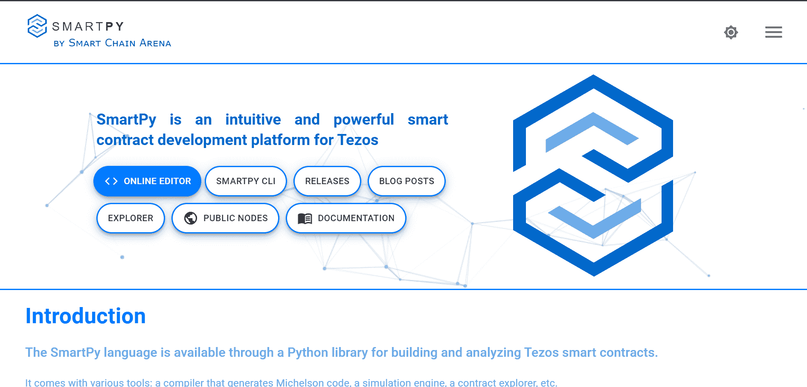](https://github.com/figment-networks/learn-tutorials/raw/master/assets/smartpy1.png)

出于我们的目的，本页上的重要链接是:

*   [在线编辑](https://smartpy.io/ide)
*   [文档](https://smartpy.io/docs/)

在线编辑器将帮助我们在区块链上部署代码之前编写、执行和测试我们的代码，文档将帮助我们处理各种数据结构、条件、数据类型等等！

单击“在线编辑器”按钮转到 IDE 页面:

[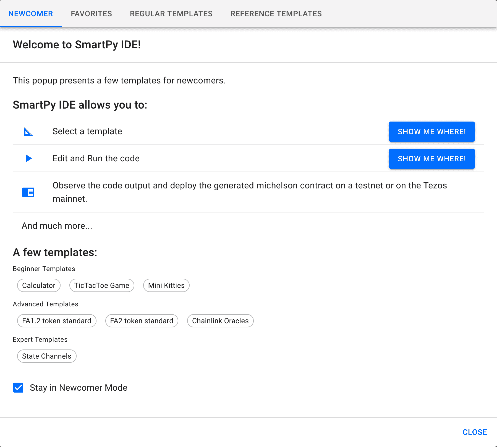](https://github.com/figment-networks/learn-tutorials/raw/master/assets/smartpy2_1.png)

在这里，SmartPy 为我们提供了各种模板和样本合同，包括游戏、代币合同和一些基本的公用事业合同。我们将编写我们自己版本的计算器契约，作为示例之一。

继续点击**关闭**按钮。

在我们开始编写智能合约本身的代码之前，我们需要了解一些基础知识:我们将导入 SmartPy 库，并在整个智能合约中使用它。

```js
import smartpy as sp
```

此后可以使用前缀`sp.`调用 SmartPy 的功能

Python 不支持将 Python 代码直接转换成 Michelson，因此我们必须使用 SmartPy 中的函数:

*   sp.if
*   sp.else
*   sp .验证
*   sp.for
*   sp .虽然

您可以在[文档](https://smartpy.io/docs/)中阅读更多关于 SmartPy 中循环和条件的用法

在 SmartPy 中，智能合同本质上是必须从`sp.Contract`继承的 Python 类。所有的类属性将作为契约存储，所有的类方法将被视为契约的入口点，我们可以从前端(客户端)调用这些入口点来改变契约的状态。

> **注意**:除非用户通过入口点调用，否则合同不会发生变化。

现在开始编写我们的合同:

创建一个继承类`sp.Contract`的 Python 类，并定义其存储:

```js
class Calculator(sp.Contract):
    def __init__(self):
        self.init(value = 0)
```

这里我们定义了一个名为 *value* 的变量，并将其初始值设为 0。

如前所述，Python 不支持将 Python 代码直接转换成 Michelson，所以我们也使用不同的数据类型。例如:

*   物种色彩
*   sp(存储处理器)。提伯尔
*   物种 TTimestamp
*   TBytes

以及 Tezos 特有的数据类型，如:

*   物种 TAddress
*   物种 TMutez
*   sp.big_map

您可以在[文档](https://smartpy.io/docs/)中阅读更多关于所有类型以及为什么 SmartPy 使用类型推断的信息

接下来，我们将定义我们的第一个方法(entrypoint)。我们必须在定义方法之前编写`@sp.entry_point`,这样编译器就知道后面的代码是入口点:

```js
@sp.entry_point
    def add(self, x, y):
        self.data.value = x + y
```

`add`函数接受两个参数 x 和 y，并将它们的和存储在我们之前定义的变量:value 中，该变量由`self.data.value`访问。

有了这些概念，我们可以创建计算器契约所需的所有入口点:

*   减去

```js
@sp.entry_point
    def subtract(self, x, y):
        self.data.value = sp.as_nat(x - y)
```

*   乘；成倍增加；（使）繁殖

```js
@sp.entry_point
    def multiply(self, x, y):
        self.data.value = x * y
```

*   划分

```js
@sp.entry_point
    def divide(self, x, y):
        self.data.value = x / y
```

现在是时候把所有的切入点放在一起，并创建我们的合同:

```js
import smartpy as sp

class Calculator(sp.Contract):
    def __init__(self):
        self.init(value = 0)

    @sp.entry_point
    def multiply(self, x, y):
        self.data.value = x * y

    @sp.entry_point
    def add(self, x, y):
        self.data.value = x + y

    @sp.entry_point
    def subtract(self, x, y):
        self.data.value = sp.as_nat(x - y)

    @sp.entry_point
    def divide(self, x, y):
        self.data.value = x // y

    @sp.entry_point
    def square(self, x):
        self.data.value = x * x

    @sp.entry_point
    def factorial(self, x):
        self.data.value = 1
        sp.for y in sp.range(1, x + 1):
            self.data.value *= y
```

您会注意到我添加了两个名为`square`和`factorial`的入口点。这些是为了演示我们如何使用 SmartPy 进行基本的 Python 操作。

# 测试场景

在我们继续在 Tezos 网络上部署我们的合同之前，我们需要首先通过测试来确保所有代码都按照我们的预期工作。一旦部署，智能合约是不可变的(我们不想浪费我们的 XTZ 令牌)。

让我们检查一下**测试场景**的概念:

测试场景是确保我们的智能合约正常工作的重要工具。

*   新测试是一种标有`@sp.add_test`的方法
*   一个新的场景由`sp.test_scenario`实例化。
*   场景描述了一系列动作:发起契约、计算表达式或调用入口点等。
*   在 SmartPy.io 的在线编辑器中，会计算场景，然后在输出面板上显示为 HTML 文档。

让我们从定义一个名为`test()`的方法开始:

```js
@sp.add_test(name = "Calculator")
    def test():
        pass
```

现在，我们需要实例化(也称为发起)我们的智能契约，并创建一个测试场景:

```js
@sp.add_test(name = "Calculator")
    def test():
        ob = Calculator()
        scenario = sp.test_scenario()
```

现在我们可以调用所有的入口点，并在输出面板中查看值是否被正确更新:

```js
@sp.add_test(name = "Calculator")
    def test():
        ob = Calculator()
        scenario = sp.test_scenario()
        scenario.h1("Calculator")
        scenario += ob
        ob.multiply(x = 4, y = 2)
        ob.add(x = 4, y = 2)
        ob.subtract(x = 11, y = 5)
        ob.divide(x = 15, y = 3)
        ob.square(x = 3)
```

既然代码已经过测试并正常工作，我们需要在 testnet 上获得一些 Tezos 令牌，这样我们就可以为部署付费了。

# 水龙头和寺庙钱包

在我们部署任何东西之前，让我们先从 Tezos 的水龙头那里得到一些测试网ꜩ。

在水龙头页面，完成验证码验证，你会得到一个水龙头密钥，看起来是这样的: [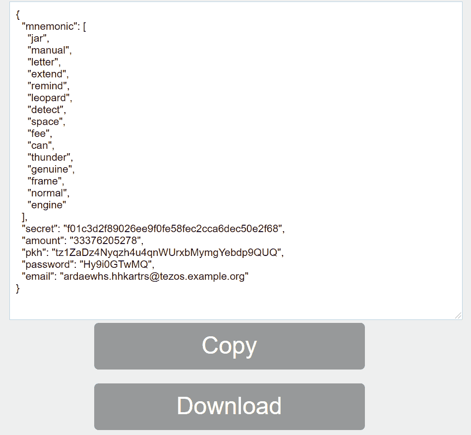](https://github.com/figment-networks/learn-tutorials/raw/master/assets/faucet1.png)

下载这个 JSON 文件并保存在一个安全的位置，因为它包含密钥和助记符，将用于部署我们创建的智能契约。

现在打开你的 Temple 钱包，点击**设置** > **导入账户**:

[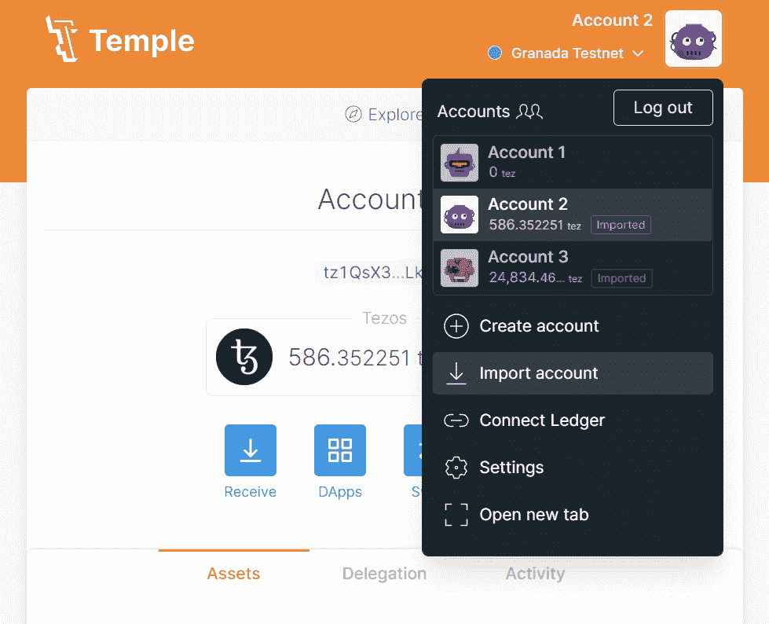](https://github.com/figment-networks/learn-tutorials/raw/master/assets/temple1.png)

现在选择水龙头文件作为源，并上传从水龙头得到的 JSON 文件:

[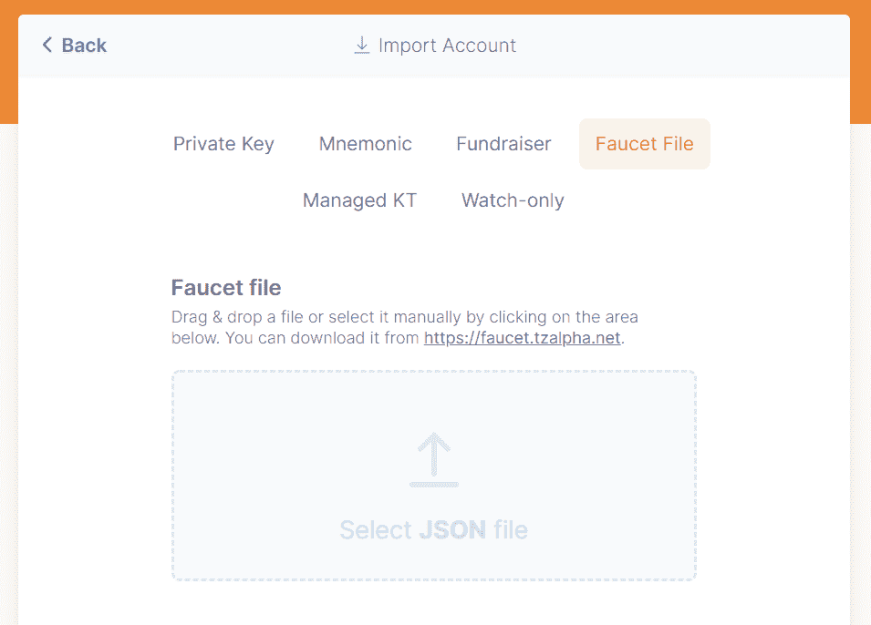](https://github.com/figment-networks/learn-tutorials/raw/master/assets/temple2.png)

现在，我们在 Tezos testnet 上有了一个基金钱包，我们可以继续部署代码了。

# 部署

回到 SmartPy.io:

```js
import smartpy as sp

class Calculator(sp.Contract):
    def __init__(self):
        self.init(value = 0)

    @sp.entry_point
    def multiply(self, x, y):
        self.data.value = x * y

    @sp.entry_point
    def add(self, x, y):
        self.data.value = x + y

    @sp.entry_point
    def subtract(self, x, y):
        self.data.value = sp.as_nat(x - y)

    @sp.entry_point
    def divide(self, x, y):
        self.data.value = x // y

    @sp.entry_point
    def square(self, x):
        self.data.value = x * x

    @sp.entry_point
    def factorial(self, x):
        self.data.value = 1
        sp.for y in sp.range(1, x + 1):
            self.data.value *= y

    @sp.add_test(name = "Calculator")
    def test():
        ob = Calculator()
        scenario = sp.test_scenario()
        scenario.h1("Calculator")
        scenario += ob
        ob.multiply(x = 4, y = 2)
        ob.add(x = 4, y = 2)
        ob.subtract(x = 11, y = 5)
        ob.divide(x = 15, y = 3)
        ob.square(3)
```

继续在 SmartPy IDE 中运行这段代码(单击左上角的“Play”按钮)，在右侧的输出面板中，您将看到选项**部署迈克尔逊合同**:

[](https://github.com/figment-networks/learn-tutorials/raw/master/assets/deploy1.png)

您将被重定向到合同的原始页面。在此页面上，我们必须选择希望在哪个节点上部署我们的合同。检查您的 Temple Wallet 和您在上一节中从水龙头获得的 JSON，并选择适当的节点。然后点击 Temple Wallet 选项，将钱包连接到 SmartPy.io:

[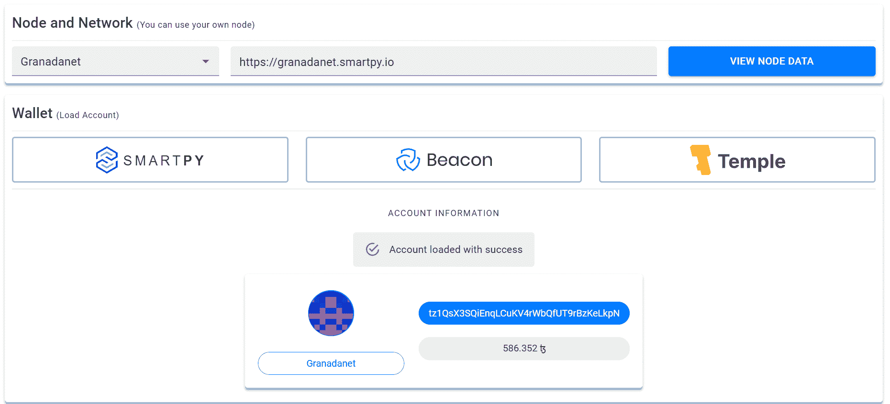](https://github.com/figment-networks/learn-tutorials/raw/master/assets/deploy2_1.png)

向下滚动并点击**从 RPC** 估算成本，然后点击**部署合同**:

[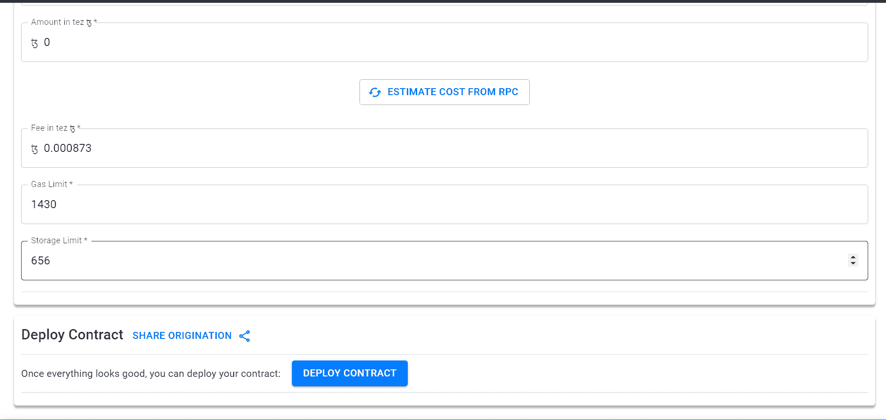](https://github.com/figment-networks/learn-tutorials/raw/master/assets/deploy3.png)

然后在出现的弹出窗口中点击**接受**，然后 Temple Wallet 将打开，您需要点击**签名**按钮。

一旦交易被确认，您的合同将被部署在 Granada testnet 上。

复制屏幕上显示的合同地址，并等待至少 3 次批量确认。

[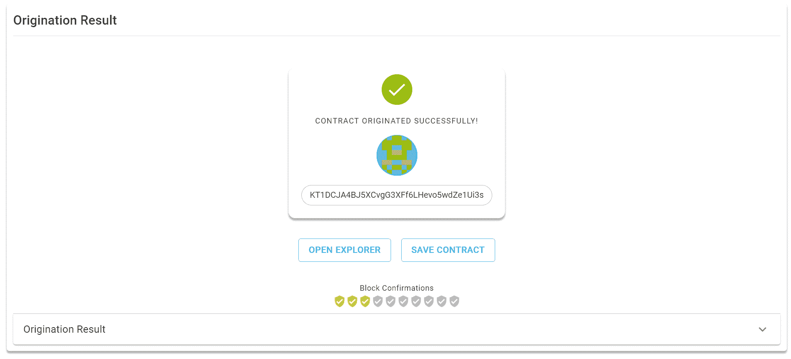](https://github.com/figment-networks/learn-tutorials/raw/master/assets/deploy4.png)

# 与合同互动

现在我们处于本教程的最后一步。我们将学习如何探索我们的合同链，以及如何与之互动。

复制你的合同地址，前往[最好打电话给 Dev](https://better-call.dev/) 。将合同地址粘贴到搜索框中，然后按 Enter。

[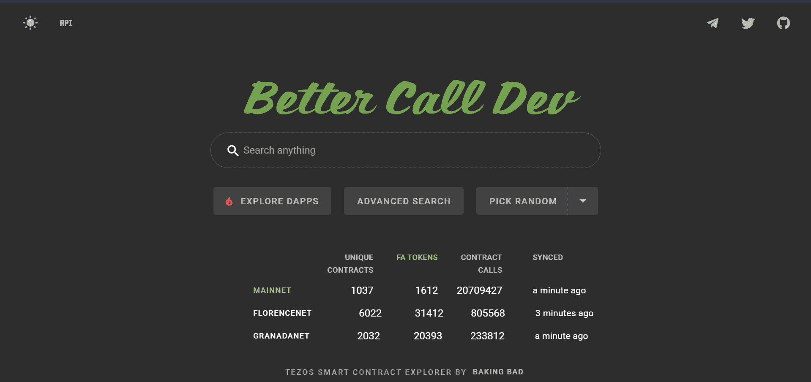](https://github.com/figment-networks/learn-tutorials/raw/master/assets/interact1.png)

您现在可以看到您的合同详情。如果它们没有出现，请等待几分钟，然后刷新页面，因为在您部署合同后，块确认需要一些时间才能到达。

[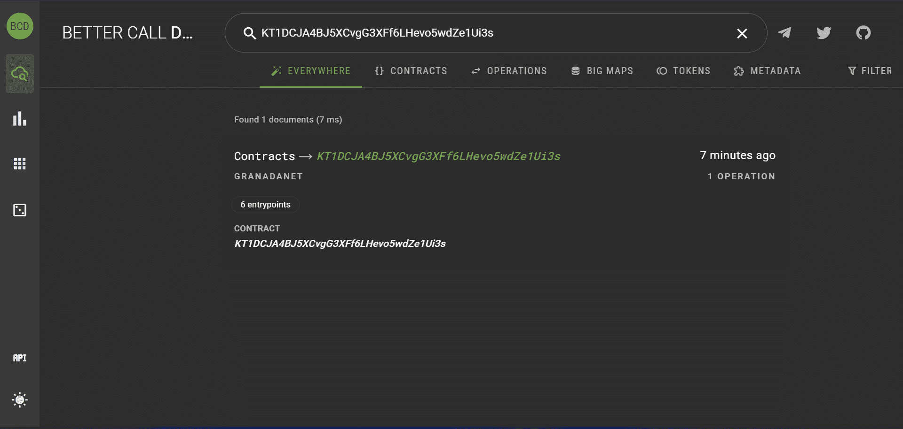](https://github.com/figment-networks/learn-tutorials/raw/master/assets/interact2.png)

在**交互**选项卡上，您将能够看到所有可用的入口点，以及我们指定的输入参数。

[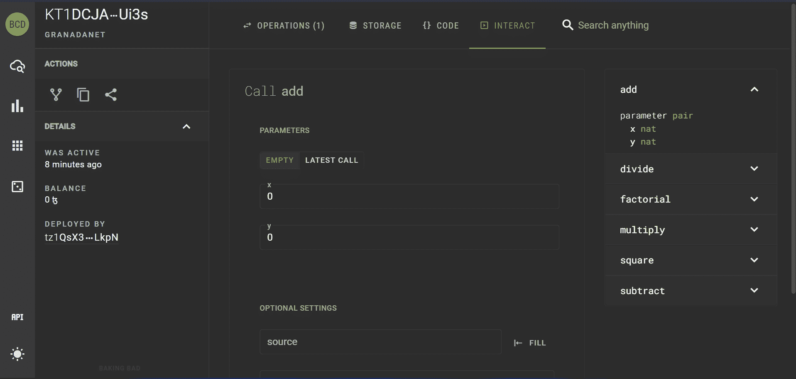](https://github.com/figment-networks/learn-tutorials/raw/master/assets/interact3.png)

现在我们将调用我们的`add`入口点！

1.  从右侧窗格(入口点列表)中选择**添加**。
2.  将整数值放入 **x** 和 **y** 字段。
3.  将您的钱包地址添加为**来源**，并将**金额**字段留空。

[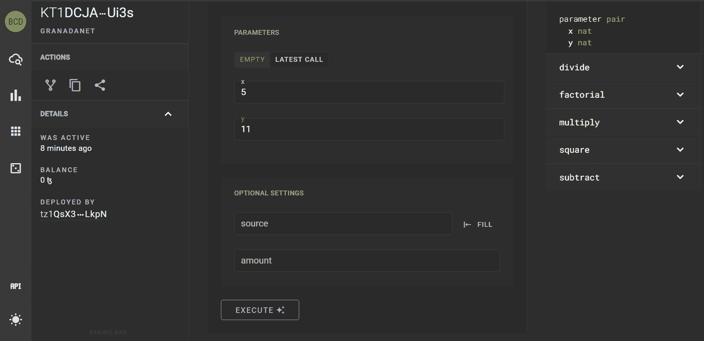](https://github.com/figment-networks/learn-tutorials/raw/master/assets/interact4.png)

Better Call Dev 的最佳特性之一是，我们可以模拟任何交易，而无需花费任何 XTZ。所以点击**执行**并选择**模拟**。BetterCallDev 将模拟该事务，并告诉我们它是有效的还是失败的，以及它将对合同的存储做出什么改变。

[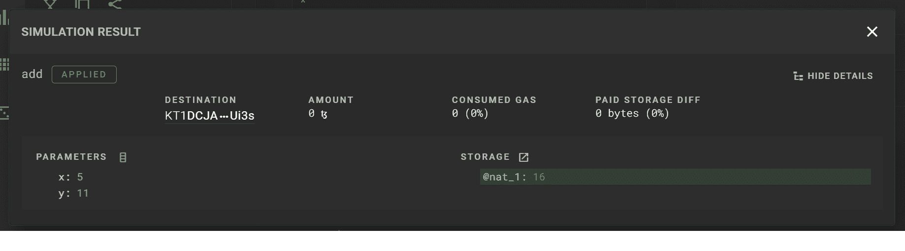](https://github.com/figment-networks/learn-tutorials/raw/master/assets/interact5.png)

现在是时候完成我们的第一次链上互动了！

这一次，点击**执行**并选择**坦普尔-泰佐斯钱包**而不是**模拟**。

它会弹出你的 Temple 钱包，要求你在交易上签字。它还会告诉您完成交易需要支付的汽油费:

[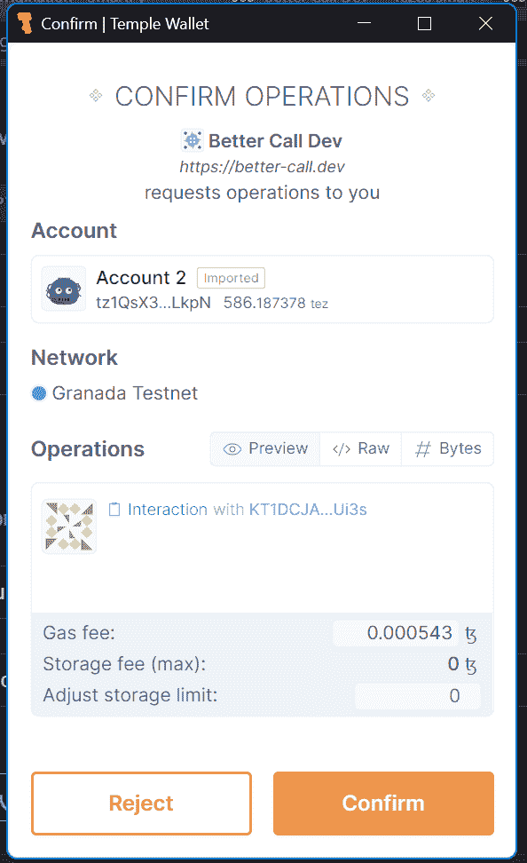](https://github.com/figment-networks/learn-tutorials/raw/master/assets/interact6.png)

最后，转到 BetterCallDev 上的 **Operations** 选项卡，您将能够看到您的交易及其所有详细信息:

[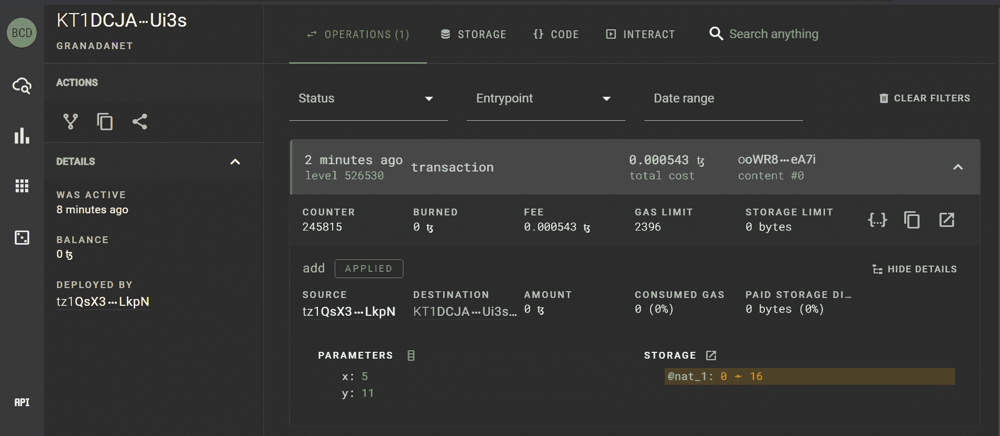](https://github.com/figment-networks/learn-tutorials/raw/master/assets/interact7.png)

我们可以看到，我们的事务将存储中的**值**更改为我们提供给`add`入口点的参数之和(即 5 + 11 = 16)。

# 结论

在本教程中，我们学习了 SmartPy 中的编码，如何从水龙头中获取 testnet XTZ，如何在区块链上部署合同，以及如何使用 block explorer 与合同进行交互。我们还看到了我们的入口点如何改变合同的存储。

# 后续步骤

我希望您尝试我们创建的所有入口点，并检查它们对存储做出了哪些更改！一旦你熟悉了这个基本的合同，你就可以着手创建更复杂的合同，NFT 代币等等。

# 关于作者

本教程由 Udit Kapoor 撰写，他是 Tezos India 2.0 研究员，也是一名区块链爱好者。他们的标志性项目是 CryptoWill，他们也喜欢涉足 Flutter！在 [GitHub](https://github.com/Udit-Kapoor) 上搜索 Udit，你可以在 Discord 上找到他们的用户 **pichkari#56** 。

# 参考

*   SmartPy.io 中的计算器示例代码
*   [OpenTezos](https://opentezos.com/)