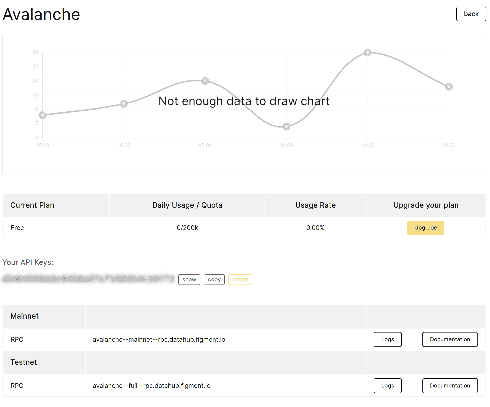
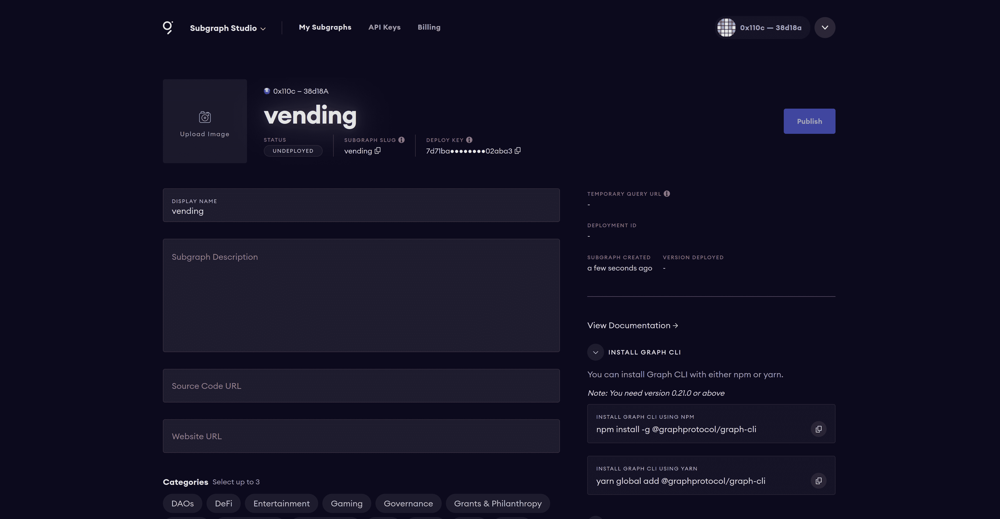

# 介绍

> 原文：<https://github.com/figment-networks/learn-tutorials/blob/master/thegraph/deploy-subgraph-using-avalanche.md>

在本教程中，您将学习如何使用 HardHat 将 Solidity smart contract 部署到 Avalanche Fuji testnet，然后创建其子图并将其部署到 Subgraph Studio。

[](https://github.com/figment-networks/learn-tutorials/raw/master/assets/graph.png)

Subgraph Studio 是您可以构建和创建子图的地方。您可以向图中添加元数据(甚至在部署子图之后)，部署子图的多个版本，以及将它们发布到分散的图浏览器。请注意，发布子图不同于部署子图。当您部署一个子图时，您可以单独访问它。但是当你发布它时，它是在链上创建的，每个人都可以访问它。

您还可以在操场上测试您的子图，在那里您可以运行 graphql 查询，而不会产生任何查询费用。在本教程中，您还将学习如何使用 Avalanche 智能契约创建子图并将其部署到 Subgraph Studio。

当您知道一个智能契约的地址时，假设该契约在 etherscan 上得到验证，您可以很容易地为它构建一个子图模式。如果没有，您可以向图形 CLI 提供应用程序二进制接口(ABI)的本地路径，以便创建子图模式。默认情况下，HardHat 不会在编译智能合约后导出 ABI。然而，在编译智能合同时，可以使用 HardHat 插件自动导出 ABI。

# 先决条件

要成功完成本教程，您需要对 Avalanche、Solidity 和 NodeJS 生态系统有一个基本的了解。

# 要求

*   您需要在浏览器中安装元掩码。你可以从 https://metamask.io/安装它
*   您需要安装 Node.js 的最新版本。为了兼容，我们建议使用 v14.17.6 LTS。

# 项目设置

运行以下命令以全局安装 yarn package manager 和 Graph Protocol CLI。这些是构建和部署子图所必需的。

```js
npm i -g yarn @graphprotocol/graph-cli 
```

然后运行以下命令创建一个名为`vending`的新目录，然后切换到该目录:

```js
mkdir vending
cd vending 
```

然后运行下面的命令在里面创建一个新的 yarn 包，然后安装 Hardhat 作为项目的开发依赖项(意味着它是一个只需要本地开发和测试的包)。

```js
yarn init --yes
yarn add --dev hardhat 
```

然后运行`npx hardhat`来初始化 Hardhat 项目。这将输出:

```js
888    888                      888 888               888
888    888                      888 888               888
888    888                      888 888               888
8888888888  8888b.  888d888 .d88888 88888b.   8888b.  888888
888    888     "88b 888P"  d88" 888 888 "88b     "88b 888
888    888 .d888888 888    888  888 888  888 .d888888 888
888    888 888  888 888    Y88b 888 888  888 888  888 Y88b.
888    888 "Y888888 888     "Y88888 888  888 "Y888888  "Y888

Welcome to Hardhat v2.6.4

? What do you want to do? …
▸ Create a basic sample project
  Create an advanced sample project
  Create an empty hardhat.config.js
  Quit 
```

使用键盘上的箭头键向下滚动菜单，然后按 Enter 键，选择“创建一个空的 hardhat.config.js”。这将在`vending`目录的根目录下创建一个`hardhat.config.js`文件，内容如下:

```js
/**
 * @type import('hardhat/config').HardhatUserConfig
 */
module.exports = {
  solidity: "0.7.3",
};
```

由于 Avalanche network 与以太坊的虚拟机(EVM)兼容，您可以使用任何可用的 HardHat 插件来编译和部署您的合同:

```js
yarn add --dev @nomiclabs/hardhat-ethers ethers @nomiclabs/hardhat-waffle 
```

# 撰写智能合同

在`vending`目录中创建一个名为`contracts`的新目录，然后在`contracts`目录中创建一个名为`vending.sol`的文件。

将该实体代码粘贴到该文件中:

```js
// SPDX-License-Identifier: MIT

pragma solidity 0.7.3;

contract VendingMachine {

    // Store the owner of this smart contract
    address owner;

    // A mapping is a key/value store. Here we store cupcake balance of this smart contract.
    mapping (address => uint) cupcakeBalances;

    // Events are necessary for The Graph to create entities
    event Refill(address owner, uint amount, uint remaining, uint timestamp, uint blockNumber);
    event Purchase(address buyer, uint amount, uint remaining, uint timestamp, uint blockNumber);

    // When 'VendingMachine' contract is deployed:
    // 1\. set the deploying address as the owner of the contract
    // 2\. set the deployed smart contract's cupcake balance to 100
    constructor() {
        owner = msg.sender;
        cupcakeBalances[address(this)] = 100;
    }

    // Allow the owner to increase the smart contract's cupcake balance
    function refill(uint amount) public onlyOwner {
        cupcakeBalances[address(this)] += amount;
        emit Refill(owner, amount, cupcakeBalances[address(this)], block.timestamp, block.number);
    }

    // Allow anyone to purchase cupcakes
    function purchase(uint amount) public payable {
        require(msg.value >= amount * 0.01 ether, "You must pay at least 0.01 ETH per cupcake");
        require(cupcakeBalances[address(this)] >= amount, "Not enough cupcakes in stock to complete this purchase");
        cupcakeBalances[address(this)] -= amount;
        cupcakeBalances[msg.sender] += amount;
        emit Purchase(msg.sender, amount, cupcakeBalances[address(this)], block.timestamp, block.number);
    }

    // Function modifiers are used to modify the behaviour of a function.
    // When "onlyOwner" modifier is added to a function, only the owner of this smart contract can execute that function.
    modifier onlyOwner {
        // Verifying that the owner is same as the one who called the function.
        require(msg.sender == owner, "Only owner callable");

        // This underscore character is called the "merge wildcard".
        // It will be replaced with the body of the function (to which we added the modifier),
        _;
    }
}
```

# 编译智能合同

我们将安装`hardhat-abi-exporter`插件，以便 HardHat 在编译后导出智能合同 ABI:

```js
yarn add --dev hardhat-abi-exporter 
```

更新您的`hardhat.config.js`文件以使用 abi 导出器:

```js
require('@nomiclabs/hardhat-waffle');
require('hardhat-abi-exporter');

module.exports = {
  solidity: '0.7.3',
  abiExporter: {
    path: './abi/',
    clear: true,
  },
};
```

*   **path** :您的 ABI 导出目录的路径(相对于 HardHat 项目的根目录)。如果该目录不存在，将会创建它。
*   **clear** :一个布尔值，决定编译时是否从指定路径删除旧文件。

HardHat 将使用 solc 的指定版本(v0.7.3)来编译您的智能合约。运行:

```js
npx hardhat compile 
```

假设没有错误或警告，这将输出:

```js
Compiling 1 file with 0.7.3
Compilation finished successfully 
```

`vending.sol`智能合同现已成功编译。ABI 将被存储在`abi/contracts/vending.sol/VendingMachine.json`中。

# 部署智能合同

虽然这一步对于创建子图不是必需的，但是您仍然可以部署您的智能契约来了解 Avalanche 网络和 DataHub。

在您的`hardhat.config.js`文件中添加常量`FUJI_PRIVATE_KEY`和`DATAHUB_API_KEY`以及一个**网络**条目:

```js
require('@nomiclabs/hardhat-waffle');
require('hardhat-abi-exporter');

// Replace this private key with your Fuji wallet private key
const FUJI_PRIVATE_KEY = 'YOUR_FUJI_PRIVATE_KEY';

// Replace this with your Datahub api key
const DATAHUB_API_KEY = 'YOUR_DATAHUB_API_KEY';

module.exports = {
  solidity: '0.7.3',
  abiExporter: {
    path: './abi/',
    clear: true,
  },
  networks: {
    fuji: {
      url: `https://avalanche--fuji--rpc.datahub.figment.io/apikey/${DATAHUB_API_KEY}/ext/bc/C/rpc`,
      accounts: [`0x${FUJI_PRIVATE_KEY}`],
    },
  },
};
```

## 获取您的 Datahub API 密钥

要获得您的`DATAHUB_API_KEY`，请前往[https://datahub.figment.io/sign_up](https://datahub.figment.io/sign_up)并创建一个免费账户。

[](https://github.com/figment-networks/learn-tutorials/raw/master/assets/datahub_signup.png)

点击您将在电子邮件中收到的验证链接。通过电子邮件验证后，您将被重定向到[https://datahub.figment.io/](https://datahub.figment.io/)。

[](https://github.com/figment-networks/learn-tutorials/raw/master/assets/datahub_avalanche.png)

点击`Avalanche`按钮查看位于[https://datahub.figment.io/services/avalanche](https://datahub.figment.io/services/avalanche)的雪崩服务仪表板。你可以点击**复制**按钮将你的 API 密匙复制到剪贴板。

[](https://github.com/figment-networks/learn-tutorials/raw/master/assets/datahub_avalanche_api.png)

## 获取元掩码私钥

您需要按照下面的说明将 Avalanche Fuji testnet 的连接添加到您的元掩码中(记住用您实际的 DataHub API 密钥替换 RPC URL 中的`<YOUR DATAHUB_API_KEY>`):

*   登录到元掩码
*   点击`Network`下拉菜单
*   选择`Custom RPC`
*   填写详细信息:
    *   **网络名**:雪崩富士 C 链
    *   **新的 RPC URL** : `https://avalanche--fuji--rpc.datahub.figment.io/apikey/<YOUR DATAHUB_API_KEY>/ext/bc/C/rpc`
    *   **ChainID** : `43113`
    *   **符号** : `AVAX`
    *   **探险家** : `https://cchain.explorer.avax-test.network`

[](https://github.com/figment-networks/learn-tutorials/raw/master/assets/avalanche_metamask.png)

你还需要在你的 Metamask 钱包里放一些富士 AVAX 代币。请遵循以下说明:

*   进入[https://水龙头. avax-test.network/](https://faucet.avax-test.network/) ，粘贴你的 Metamask 钱包地址。
*   填写验证码，然后点击请求按钮
*   一旦你的交易被挖掘，你将收到 10 富士 AVAX

要获取您的`FUJI_PRIVATE_KEY`，请打开您的浏览器并打开 Metamask。选择**雪崩富士 C 链**网络。点击账户详情，然后点击`Export Private Key`。

永远不要与任何人分享你的私人密钥！

在 HardHat 项目中创建一个名为`scripts`的子目录，将下面的代码粘贴到`scripts`目录下的一个新文件`deploy.js`中:

```js
async function main() {
  const [deployer] = await ethers.getSigners();

  console.log("Deploying contracts with the account:", deployer.address);
  console.log("Account balance:", (await deployer.getBalance()).toString());

  const VendingMachine = await ethers.getContractFactory("VendingMachine");
  const vendingMachine = await VendingMachine.deploy();

  console.log("Contract address:", vendingMachine.address);
}

main()
  .then(() => process.exit(0))
  .catch((error) => {
    console.error(error);
    process.exit(1);
  });
```

要使用 HardHat 将智能合同部署到 Fuji testnet，请运行以下命令:

```js
npx hardhat run scripts/deploy.js --network fuji 
```

这将输出:

```js
Deploying contracts with the account: <YOUR FUJI WALLET ADDRESS>
Account balance: <YOUR FUJI WALLET BALANCE>
Contract address: <YOUR FUJI SMART CONTRACT ADDRESS> 
```

恭喜你！您刚刚成功地将您的智能合同部署到 Fuji testnet！创建子图时，我们将需要合同地址，所以记得复制它。

# 创建子图

运行以下命令，通过从 Fuji testnet 下载合同 ABI 来创建子图。将创建一个名为`vending`的新目录，所有节点依赖项将自动安装。

```js
graph init \
  --contract-name VendingMachine \
  --index-events \
  --studio \
  --from-contract <YOUR FUJI SMART CONTRACT ADDRESS> \
  --abi abi/contracts/vending.sol/VendingMachine.json \
  --network fuji \
  vending 
```

从上面用您部署的自动售货机智能合同地址替换`<YOUR FUJI SMART CONTRACT ADDRESS>`。

如果您使用的是 Windows，请将上述命令中的`\`字符替换为`^`。

这将输出:

```js
✔ Subgraph slug · vending
✔ Directory to create the subgraph in · vending
✔ Ethereum network · fuji
✔ Contract address · <YOUR FUJI SMART CONTRACT ADDRESS>
✔ ABI file (path) · abi/contracts/vending.sol/VendingMachine.json
✔ Contract Name · VendingMachine
———
  Generate subgraph from ABI
  Write subgraph to directory
✔ Create subgraph scaffold
✔ Initialize subgraph repository
✔ Install dependencies with yarn
✔ Generate ABI and schema types with yarn codegen

Subgraph vending created in vending

Next steps:

  1\. Run `graph auth` to authenticate with your deploy key.

  2\. Type `cd vending` to enter the subgraph.

  3\. Run `yarn deploy` to deploy the subgraph.

Make sure to visit the documentation on https://thegraph.com/docs/ for further information. 
```

它将创建三个文件:

*   `subgraph.yaml`:这是存放[子图清单](https://thegraph.academy/developers/working-with-the-graph/)的地方
*   `schema.graphql`:这定义了要存储的数据以及如何使用 GraphQL 查询这些数据
*   `src/mapping.ts`:这个 [AssemblyScript](https://www.assemblyscript.org/) 文件定义了区块链事件到模式实体之间的映射

# 在 Subgraph Studio 中创建项目

首先，你会想去位于 https://thegraph.com/studio/的子图工作室。

[](https://github.com/figment-networks/learn-tutorials/raw/master/assets/graph_connect.png)

点击**连接钱包**按钮。选择用于登录的元掩码 wallet。一旦你被认证，你将看到下面的屏幕，在这里你可以创建你的第一个子图。

[](https://github.com/figment-networks/learn-tutorials/raw/master/assets/graph_create_subgraph.png)

接下来，你需要给你的子图取一个名字。赐名为**售货**。完成后，您将看到以下屏幕:

[](https://github.com/figment-networks/learn-tutorials/raw/master/assets/graph_subgraph_created.png)

在这个屏幕上，您可以看到关于子图的详细信息，比如您的部署键、子图 slug 和状态。

# 部署子图

在您可以部署您的子图之前，您需要从[https://thegraph.com/studio/subgraph/vending/](https://thegraph.com/studio/subgraph/vending/)获得您的部署密钥。这用于向 Subgraph Studio 验证您的帐户。

运行以下命令来设置您的部署密钥。

```js
cd vending
graph auth --studio <DEPLOY_KEY> 
```

您应该会看到以下输出:

```js
Deploy key set for https://api.studio.thegraph.com/deploy/ 
```

一旦完成，您就可以运行`yarn deploy`将子图部署到 Subgraph Studio。当系统提示您输入版本标签时，您可以选择`v1.0.0`。您应该会看到以下输出:

```js
yarn run v1.22.11
$ graph deploy --node https://api.studio.thegraph.com/deploy/ vending
✔ Version Label (e.g. v0.0.1) · 1.0.0
  Skip migration: Bump mapping apiVersion from 0.0.1 to 0.0.2
  Skip migration: Bump mapping apiVersion from 0.0.2 to 0.0.3
  Skip migration: Bump mapping apiVersion from 0.0.3 to 0.0.4
  Skip migration: Bump mapping apiVersion from 0.0.4 to 0.0.5
  Skip migration: Bump mapping specVersion from 0.0.1 to 0.0.2
✔ Apply migrations
✔ Load subgraph from subgraph.yaml
  Compile data source: VendingMachine => build/VendingMachine/VendingMachine.wasm
✔ Compile subgraph
  Copy schema file build/schema.graphql
  Write subgraph file build/VendingMachine/abis/VendingMachine.json
  Write subgraph manifest build/subgraph.yaml
✔ Write compiled subgraph to build/
  Add file to IPFS build/schema.graphql
                .. QmeSYhiAZ4m7wa5KHnyUGdTDLfha5Lknp3LhpJwbecRVGw
  Add file to IPFS build/VendingMachine/abis/VendingMachine.json
                .. QmbSWXTRVwvi9umMqhfMFT2EGUF4JPcuBfPUhMLAMpLkXn
  Add file to IPFS build/VendingMachine/VendingMachine.wasm
                .. QmYjyCCaJdrhEqc8gHPVrWPgcgsfPoULkhzcGLwXZMovCQ
✔ Upload subgraph to IPFS

Build completed: QmZMq8pfqkxvZufKKSeUYKwuNRyAbb2aGxogHPPUxBZ3XA

Deployed to https://thegraph.com/studio/subgraph/vending

Subgraph endpoints:
Queries (HTTP):     https://api.studio.thegraph.com/query/8676/vending/1.0.0
Subscriptions (WS): https://api.studio.thegraph.com/query/8676/vending/1.0.0

Done in 13.39s. 
```

您现在已经将子图部署到您的子图工作室帐户了！

# 结论

祝贺您完成本教程！您已经学习了如何使用 HardHat 将智能合约部署到 Avalanche Fuji testnet。您还学习了如何在 Subgraph Studio 上为智能契约创建和部署子图。

# 关于作者

我叫罗宾·托马斯，是一名区块链爱好者，有几年使用各种区块链协议的经验。请随时在 [GitHub](https://github.com/robin-thomas) 上与我联系。