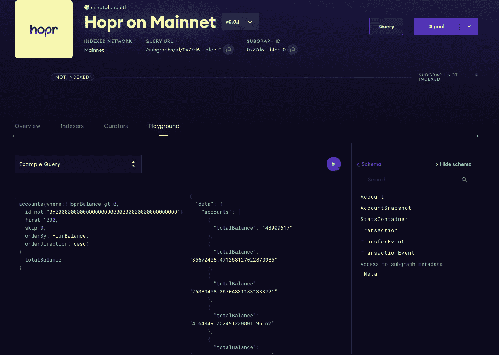
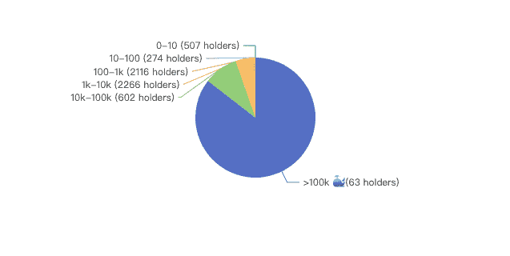

# 介绍

> 原文：<https://github.com/figment-networks/learn-tutorials/blob/master/thegraph/explore-an-existing-subgraph.md>

在本教程中，您将学习如何利用一些现有的图协议子图来创建一个简单的 React 应用程序。它包括配置 GraphQL 查询，并解释如何使用饼图执行简单的数据可视化。

# 先决条件

为了完成本教程，您需要了解一些关于 NodeJS、ECharts 库和 GraphQL 查询的基础知识。此外，熟悉现有的子图模式和图形浏览器会非常有帮助。

在本教程中，您将与`Hopr on Mainnet`子图进行交互。你可以利用这个[游乐场](https://thegraph.com/explorer/subgraph?id=0x77d63a93c90a9860ab07ee6bc7bc5becad1cbfde-0&view=Playground)去探索一下。

# 要求

你需要在你的机器上安装`Node.js >= 14.0.0`和`npm >= 5.6`。

# 项目设置

运行以下命令创建一个新项目。

```
npx create-react-app my-app
cd my-app 
```

此外，您需要安装必要的软件包，包括请求客户端、GraphQL 支持和用于可视化的 ECharts。

```
npm i @apollo/client graphql echarts-for-react echarts 
```

在本地主机上运行应用程序。

```
npm start 
```

您应该会在终端中看到类似的消息。

```
Compiled successfully!

You can now view my-app in the browser.

  Local:            http://localhost:3000
  On Your Network:  http://192.168.0.145:3000

Note that the development build is not optimized.
To create a production build, use yarn build. 
```

然后，默认情况下，您可以在 [http://localhost:3000](http://localhost:3000) 看到您的项目。

# 创建查询客户端

在`src`文件夹下创建一个名为`QueryClients.js`的新文件。添加以下脚本来配置一个查询客户端，以便与 [HOPR 子图 Mainnet](https://thegraph.com/legacy-explorer/subgraph/minatofund/hopr-subgraph-mainnet) 进行交互。您需要这个客户机向子图端点发送 GraphQL 查询。

```
import { ApolloClient, InMemoryCache, gql } from '@apollo/client'

export const hoprClient = new ApolloClient({
    uri: 'https://api.thegraph.com/subgraphs/name/minatofund/hopr-subgraph-mainnet',
    cache: new InMemoryCache()
  })
```

# 配置查询和可视化

在`src`文件夹下创建文件`HolderBalance.js`。添加以下代码:

```
import React from 'react'
import ReactECharts from 'echarts-for-react'
import { gql } from '@apollo/client'
import {hoprClient} from './QueryClients'

class HolderBalance extends React.Component {
  state = {
    loading: true,
    holderBalance: []
  }

  async fetchData() {
    const holderBalanceQuery = `
 query accounts($skip: Int!) {
 accounts(where:{HoprBalance_gt:0, id_not:"0x0000000000000000000000000000000000000000"},first:1000, skip:$skip, orderBy: HoprBalance, orderDirection: desc)
 {
 totalBalance
 }
 }
 `

    try {
      let skip = 0
      let allResults = []
      let found = false
      while (!found) {
        let result = await hoprClient.query({
          query: gql(holderBalanceQuery),
          variables: {
            skip: skip
          },
          fetchPolicy: 'cache-first',
        })
        allResults = allResults.concat(result.data.accounts)
        if (result.data.accounts.length < 1000) {
          found = true
        } else {
          skip += 1000
        }
      }

      return allResults
    } catch (e) {
      console.error(e)
    }
  }

  componentDidMount() {
    this.fetchData().then(data => {
      this.processHolderBalanceData(data)
    }).catch(e => {
      console.error(e)
    })
  }

  processHolderBalanceData(data) {
    // Sizes are sorted in descending order
    const sizes = data.map(item => (parseFloat(item.totalBalance)))
    const spliters = [10, 100, 1000, 10000, 100000]
    // Find indexes spliting the sizes by given spliters
    let spliterIndex = spliters.length - 1
    let splitingIndexes = [0]
    for (let [idx, size] of sizes.entries()) {
      while (size <= spliters[spliterIndex]) {
        splitingIndexes.push(idx)
        spliterIndex -= 1
      }
      if (spliterIndex < 0 )
        break
    }
    // Split sizes, get chunk size and calculate sum of each chunk
    const chunkNames = ['>100k 🐳', '10k-100k', '1k-10k', '100-1k', '10-100', '0-10']
    let splited = []
    for (let i = 0; i < splitingIndexes.length - 1; i++) {
      const chunk = sizes.slice(splitingIndexes[i], splitingIndexes[i + 1])
      splited.push({
        name: chunkNames[i],
        chunk: chunk
      })
    }
    splited.push({
      name: chunkNames[splitingIndexes.length - 1],
      chunk: sizes.slice(splitingIndexes[splitingIndexes.length - 1])
    })
    // Update holder balance data
    const reducer = (accumulator, currentValue) => accumulator + currentValue
    let holderBalance = splited.map((item) => {
      const length = item.chunk.length
      const noun = length === 1 ? 'holder' : 'holders'
      return ({
        name: `${item.name} (${length} ${noun})`,
        value: item.chunk.reduce(reducer)
      })
    })
    this.setState({
      loading: false,
      holderBalance: holderBalance
    })
  }

  chart() {
    if (this.state.loading) {
      return <p>Loading...</p>
    }
    const options = {
      tooltip: {
          trigger: 'item',
          formatter: '{a} <br/>{b} : {c} ({d}%)'
      },
      series: [
        {
          name: 'Holder Balance',
          type: 'pie',
          radius: '50%',
          emphasis: {
            itemStyle: {
              shadowBlur: 10,
              shadowOffsetX: 0,
              shadowColor: 'rgba(0, 0, 0, 0.5)'
            }
          },
          data: this.state.holderBalance.map((item) => {
            return {
              ...item,
              value: parseFloat(item.value.toFixed(2))
            }
          }),
        }
      ]
    }
    return <ReactECharts option={options} />;
  }

  render() {
    return (
      <div>
        {this.chart()}
      </div>
    )
  }
}

export default HolderBalance
```

让我解释一下代码每个部分的功能。

导入必要的组件。

```
import React from 'react'
import ReactECharts from 'echarts-for-react'
import { gql } from '@apollo/client'
import {hoprClient} from './QueryClients'
```

定义类和初始状态。

```
class HolderBalance extends React.Component {
  state = {
    loading: true,
    holderBalance: []
  }
```

配置您要发送的查询。将`skip`保留为变量，因为您需要在运行时调整它。这个查询意味着我们想要获得帐户的 HOPR 余额，并排除零地址(0x0)。

```
 async fetchData() {
    const holderBalanceQuery = `
 query accounts($skip: Int!) {
 accounts(where:{HoprBalance_gt:0, id_not:"0x0000000000000000000000000000000000000000"},first:1000, skip:$skip, orderBy: HoprBalance, orderDirection: desc)
 {
 totalBalance
 }
 }
 `
```

在继续之前，您可能需要检查原始数据。使用操场是一个不错的选择。您可以很容易地找到格式和检查值。

[](https://github.com/figment-networks/learn-tutorials/raw/master/assets/hopr-subgraph-playground.png)

使用 while 循环发送查询，直到结果少于 1000 条记录。这是因为单个查询最多只能返回 1000 个结果。为了得到所有数据，你需要调整`skip`变量。

```
    try {
      let skip = 0
      let allResults = []
      let found = false
      while (!found) {
        let result = await hoprClient.query({
          query: gql(holderBalanceQuery),
          variables: {
            skip: skip
          },
          fetchPolicy: 'cache-first',
        })
        allResults = allResults.concat(result.data.accounts)
        if (result.data.accounts.length < 1000) {
          found = true
        } else {
          skip += 1000
        }
      }

      return allResults
    } catch (e) {
      console.error(e)
    }
  }

  componentDidMount() {
    this.fetchData().then(data => {
      this.processHolderBalanceData(data)
    }).catch(e => {
      console.error(e)
    })
  }
```

现在你有了原始数据，接下来的部分是可视化它。在本节中，我们将根据帐户的 HOPR 令牌余额将帐户分为不同的类别。

```
  processHolderBalanceData(data) {
    // Sizes are sorted in descending order
    const sizes = data.map(item => (parseFloat(item.totalBalance)))
    const spliters = [10, 100, 1000, 10000, 100000]
    // Find indexes spliting the sizes by given spliters
    let spliterIndex = spliters.length - 1
    let splitingIndexes = [0]
    for (let [idx, size] of sizes.entries()) {
      while (size <= spliters[spliterIndex]) {
        splitingIndexes.push(idx)
        spliterIndex -= 1
      }
      if (spliterIndex < 0 )
        break
    }
```

这些类别是:

*   > 100k <g-emoji class="g-emoji" alias="whale" fallback-src="https://github.githubassets.cimg/icons/emoji/unicode/1f433.png">🐳</g-emoji>
*   ' 10k-100k '
*   1k-10k '
*   100-1k '
*   '10-100'
*   '0-10'

您需要为每个分类的块分配名称。

```
    // Split sizes, get chunk size and calculate sum of each chunk
    const chunkNames = ['>100k 🐳', '10k-100k', '1k-10k', '100-1k', '10-100', '0-10']
    let splited = []
    for (let i = 0; i < splitingIndexes.length - 1; i++) {
      const chunk = sizes.slice(splitingIndexes[i], splitingIndexes[i + 1])
      splited.push({
        name: chunkNames[i],
        chunk: chunk
      })
    }
    splited.push({
      name: chunkNames[splitingIndexes.length - 1],
      chunk: sizes.slice(splitingIndexes[splitingIndexes.length - 1])
    })
    // Update holder balance data
    const reducer = (accumulator, currentValue) => accumulator + currentValue
    let holderBalance = splited.map((item) => {
      const length = item.chunk.length
      const noun = length === 1 ? 'holder' : 'holders'
      return ({
        name: `${item.name} (${length} ${noun})`,
        value: item.chunk.reduce(reducer)
      })
    })
    this.setState({
      loading: false,
      holderBalance: holderBalance
    })
  }
```

最后，您可以生成图表并将其导出。当 app 还在取数据时，显示`Loading...`。`state.loading`变成`false`后，展示新鲜饼状图。

```
  chart() {
    if (this.state.loading) {
      return <p>Loading...</p>
    }
    const options = {
      tooltip: {
          trigger: 'item',
          formatter: '{a} <br/>{b} : {c} ({d}%)'
      },
      series: [
        {
          name: 'Holder Balance',
          type: 'pie',
          radius: '50%',
          emphasis: {
            itemStyle: {
              shadowBlur: 10,
              shadowOffsetX: 0,
              shadowColor: 'rgba(0, 0, 0, 0.5)'
            }
          },
          data: this.state.holderBalance.map((item) => {
            return {
              ...item,
              value: parseFloat(item.value.toFixed(2))
            }
          }),
        }
      ]
    }
    return <ReactECharts option={options} />;
  }

  render() {
    return (
      <div>
        {this.chart()}
      </div>
    )
  }
}

export default HolderBalance
```

现在，您可以在应用程序中显示新图表了。只需用以下代码替换 App.js 中的代码:

```
import './App.css';
import HolderBalance from './HolderBalance'

function App() {
  return (
    <div className="App">
      <HolderBalance />
    </div>
  );
}

export default App;
```

请记住保存对代码的所有更改，然后刷新 localhost 页面。您应该会看到我们刚刚创建的漂亮的饼图:

[](https://github.com/figment-networks/learn-tutorials/raw/master/assets/graph-react-app-pie-chart.png)

# 结论

恭喜你，你已经完成了教程！您已经学习了如何配置 GraphQL 查询来从现有的子图中检索数据。您还了解如何在 React 应用程序中正确地可视化数据。

# 关于作者

本教程是由米奈特基金创建的，这是一个活跃的组织，以验证者的身份帮助合并区块链的项目。我们正在积极构建和利用子图。如果您有任何问题，请随时通过以下方式联系我们:

*   不和:minatofund#1944
*   推特: [@FundMinato](https://twitter.com/FundMinato)