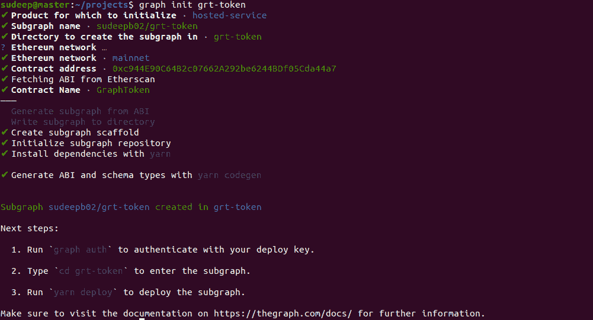
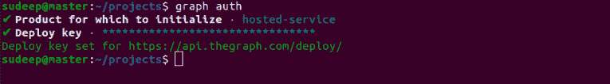
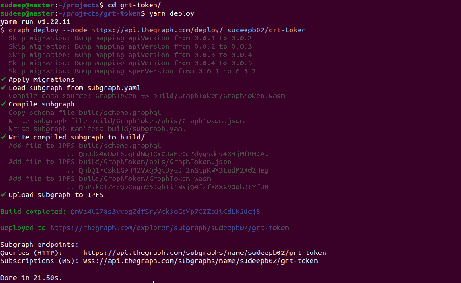
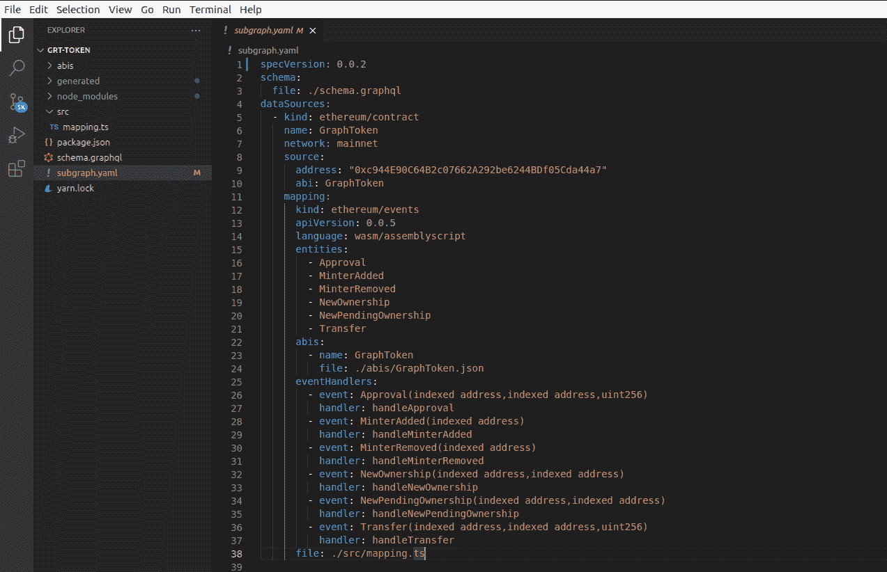
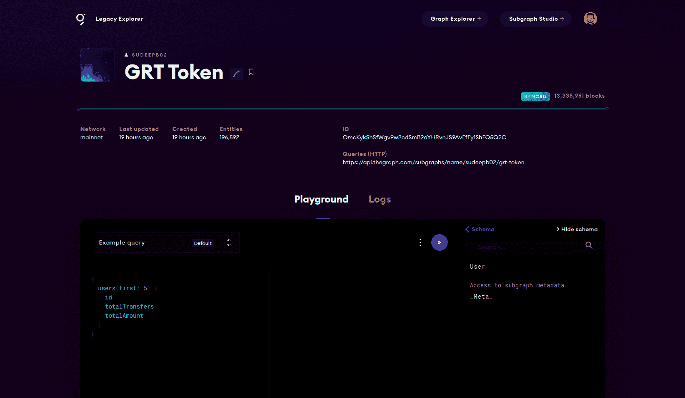
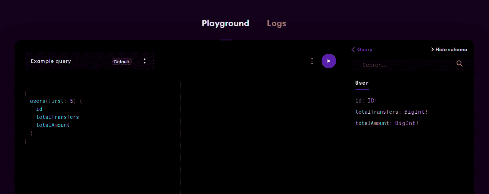
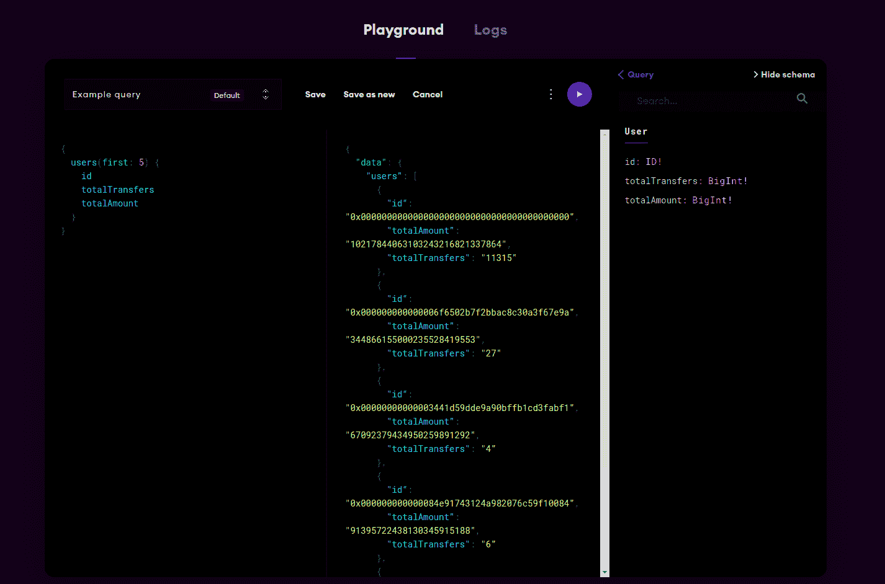
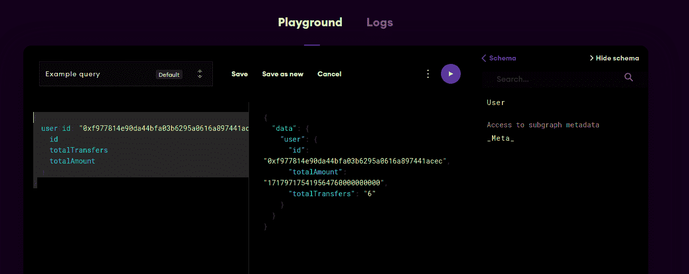
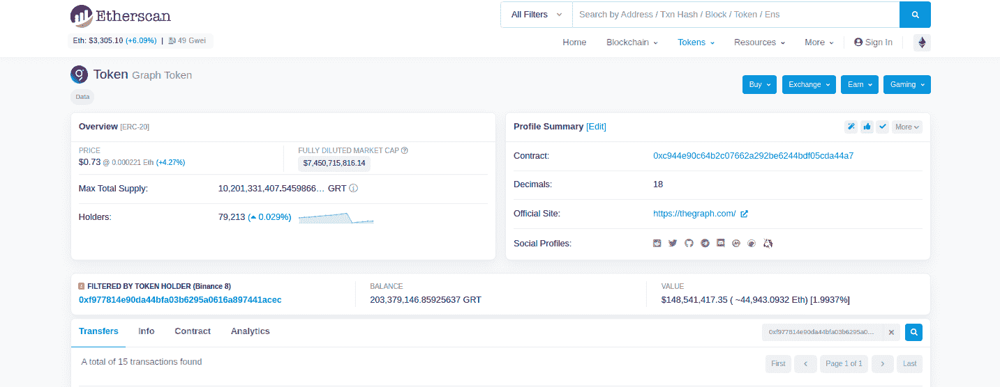

# 介绍

> 原文：<https://github.com/figment-networks/learn-tutorials/blob/master/thegraph/journey-subgraph-query.md>

在本教程中，我们将了解图形网络子图中的一切是如何工作的，从区块链上的智能合约发出事件的那一刻开始，到查询命中子图 API 端点时如何对其进行索引和检索。在这个过程中，我们还将在图的托管服务上为 ERC20 令牌——图网络的 GRT 令牌——开发和部署一个简单的子图。子图可用于检查从一个地址传输的计数和传输的令牌总数。

# 先决条件

本教程面向技术人员和非技术人员。但是，区块链领域的一些基本技术知识可能有助于轻松理解这些概念。您可以浏览本教程，并在 Graph Explorer 操场上尝试一些东西，或者按照我们在教程中进行的步骤进行操作。

# 要求

如果您想亲自完成本教程，您需要以下内容:

*   [nodejs](https://nodejs.org/en/) v14+
*   任何 IDE ( [VS 代码](https://code.visualstudio.com)推荐)

# 入门指南

曾想知道 Uniswap 如何为其分析网站 Uniswap.info 获取数据吗？显然，所有数据都可以在链上获得，但是它是如何被提取出来并显示在仪表板上的呢？类似的，像 Aave，Synthetix，Sushiswap，Pooltogether 和更多 dapps？答案是图表协议。在区块链节点上运行脚本和机器人的集中式数据聚合器已经成为过去。

图协议是 Web 3 的一个分散数据索引协议。可以把它想象成 Google for Web 3，但不是 Google 在它的专有节点上用它的算法爬行和索引所有的站点，Graph 协议是以一种分散的方式做到这一点的。这种链上数据是如何从区块链中提取出来的？该数据库过去以加密格式存储了数百万个数据块。这些数据是如何被索引、聚合、查询并显示在 Uniswap 这样的仪表板上的？这其中的关键是**事件**。让我们从事件发出的地方开始，看看子图查询的旅程。

在我们深入研究子图查询之前，让我们了解更多关于以太坊智能合约中的事件。

这些相同的概念可能也适用于其他 EVM 和非 EVM 区块链。

事件主要用于记录数据和返回值，因为事务本身不会记录方法的返回值。这些事件由 dApp 前端订阅，并更新它们的 UI，或者在感兴趣的事件发出时通知用户。

事件的另一个有趣的用例是它们可以用来在以太坊上廉价地存储数据以供离线使用。当智能合约发出事件时，参数存储在事务日志中，事务日志是区块链中的一种特殊数据结构。只要区块链是可访问的，这些日志就永远保留在事务日志中，但是不能从合同本身访问它们。

使用图协议，可以创建子图，这些子图可以从事件中获得有意义的数据，用于分析和数据可视化。尽管您可以对子图做更多的事情，但是事件在任何子图开发中都扮演着重要的角色。

在本教程中，我们将看一个来自 ERC20 合同的简单转让事件。我们使用图形网络 GRT 令牌，它部署在以太坊主网上的地址[0xc 944 e 90 c 64 B2 c 07662 a 292 be 6244 BDF 05 CDA 44 a 7](https://etherscan.io/address/0xc944E90C64B2c07662A292be6244BDf05Cda44a7)

```
event Transfer(address indexed from, address indexed to, uint256 value);
```

即使你不知道 Solidity 或者你从来没有读过 ERC20 契约代码，你仍然可以毫无困难地遵循这个教程。随着我们的进展，我们会解释一切。

每当用户向另一个地址发送一些令牌时，ERC20 契约就会发出上述传输事件。它记录正在发送的`from`地址、`to`地址和`value`。

```
emit Transfer(sender, recipient, amount);
```

一旦我们决定了需要观察和索引来自哪个契约的数据，下一步就是开发和部署子图。子图的开发人员决定从智能契约发出的不同事件中提取什么以及如何提取值。对于本教程，假设我们想知道一个地址传输了多少次令牌，传输的令牌总数是多少。

让我们从使用 Graph CLI 工具为上述契约创建一个子图开始，我们将添加实现我们目标的逻辑。使用以下命令安装 Graph CLI:

使用 npm:

```
npm install -g @graphprotocol/graph-cli 
```

使用纱线:

```
yarn global add @graphprotocol/graph-cli 
```

访问[Graph Hosted service dashboard](https://thegraph.com/legacy-explorer/dashboard)并使用您的 Github 帐户登录。点击`Add Subgraph`按钮创建一个新的子图，并将其命名为`grt-token`。您可以为子图添加其他细节，或者现在跳过它。

使用下面的命令初始化子图，并输入子图的所有细节。请参考下面的截图寻求帮助:

```
graph init grt-token 
```

[](https://github.com/figment-networks/learn-tutorials/raw/master/assets/graph_graph-init.png)

这将为我们创建一个新的子图，其中一些自动生成的代码将帮助我们引导我们的子图。

打开子图仪表板并复制访问令牌。

[](https://github.com/figment-networks/learn-tutorials/raw/master/assets/graph_access-token.png)

我们将使用这个访问令牌通过图表验证我们自己。进行身份验证的命令是`graph auth`，当出现提示时，我们需要选择托管服务选项。

```
graph auth 
```

[](https://github.com/figment-networks/learn-tutorials/raw/master/assets/graph_graph-auth.png)

现在我们需要切换到项目目录`grt-token`(使用`graph init`命令生成)并使用`yarn deploy`命令将我们的子图部署到浏览器。

```
cd grt-token
yarn deploy 
```

[](https://github.com/figment-networks/learn-tutorials/raw/master/assets/graph_graph-deploy.png)

部署完成后，您应该能够在仪表板上看到子图。该子图将处于未决状态，直到所有的块都被处理。您可以看到当前的同步状态。

图形 CLI 为我们生成了一个基本子图。让我们使用 IDE 打开代码。你可以使用任何你选择的 IDE，这里我用的是 VS 代码。

项目目录具有以下结构:

```
- abis
- generated
- node_modules
- src
    - mapping.ts
- package.json
- schema.graphql
- subgraph.yaml
- yarn.lock 
```

这里，我们有 3 个主要文件定义我们的子图- `subgraph.yaml`、`schema.graphql`和`mapping.ts`。

我们首先检查`subgraph.yaml`文件，它定义了子图的所有细节，比如源契约和事件。

[](https://github.com/figment-networks/learn-tutorials/raw/master/assets/graph_subgraphyaml.png)

数据源下定义的每个协定源都将被监视，以发现协定发出的各种事件。在 eventHandlers 下，我们可以看到由 ERC20 GRT 令牌契约发出的不同类型的事件以及该事件的相应处理程序。

如果您仍然对什么是事件处理程序感到困惑，请转到`src`目录中的`mapping.ts`文件。第一个处理程序`handleApproval`由一些示例代码和注释自动填充。为了简单起见，我们将只关注传输事件及其处理程序`handleTransfer`函数，该函数目前为空。

```
import { BigInt } from "@graphprotocol/graph-ts"
import {
  GraphToken,
  Approval,
  MinterAdded,
  MinterRemoved,
  NewOwnership,
  NewPendingOwnership,
  Transfer
} from "../generated/GraphToken/GraphToken"
import { ExampleEntity } from "../generated/schema"

export function handleApproval(event: Approval): void {
  // Entities can be loaded from the store using a string ID; this ID
  // needs to be unique across all entities of the same type
  let entity = ExampleEntity.load(event.transaction.from.toHex())

  // Entities only exist after they have been saved to the store;
  // `null` checks allow to create entities on demand
  if (!entity) {
    entity = new ExampleEntity(event.transaction.from.toHex())

    // Entity fields can be set using simple assignments
    entity.count = BigInt.fromI32(0)
  }

  // BigInt and BigDecimal math are supported
  entity.count = entity.count + BigInt.fromI32(1)

  // Entity fields can be set based on event parameters
  entity.owner = event.params.owner
  entity.spender = event.params.spender

  // Entities can be written to the store with `.save()`
  entity.save()

  // Note: If a handler doesn't require existing field values, it is faster
  // _not_ to load the entity from the store. Instead, create it fresh with
  // `new Entity(...)`, set the fields that should be updated and save the
  // entity back to the store. Fields that were not set or unset remain
  // unchanged, allowing for partial updates to be applied.

  // It is also possible to access smart contracts from mappings. For
  // example, the contract that has emitted the event can be connected to
  // with:
  //
  // let contract = Contract.bind(event.address)
  //
  // The following functions can then be called on this contract to access
  // state variables and other data:
  //
  // - contract.allowance(...)
  // - contract.approve(...)
  // - contract.balanceOf(...)
  // - contract.decimals(...)
  // - contract.decreaseAllowance(...)
  // - contract.governor(...)
  // - contract.increaseAllowance(...)
  // - contract.isMinter(...)
  // - contract.name(...)
  // - contract.nonces(...)
  // - contract.pendingGovernor(...)
  // - contract.symbol(...)
  // - contract.totalSupply(...)
  // - contract.transfer(...)
  // - contract.transferFrom(...)
}

export function handleMinterAdded(event: MinterAdded): void {}

export function handleMinterRemoved(event: MinterRemoved): void {}

export function handleNewOwnership(event: NewOwnership): void {}

export function handleNewPendingOwnership(event: NewPendingOwnership): void {}

export function handleTransfer(event: Transfer): void {}
```

简而言之，事件处理程序是一个函数或一段代码，每当该处理程序的事件被发出时，就会被执行。这正是智能契约发出事件后，子图中事件的旅程开始的地方。根据契约发出的这些不同类型的事件，由子图的开发人员从契约中提取数据。

*每当通过查询请求数据时，如何存储、处理和检索从事件中导出的数据？*

好了，**索引器**来了。索引器是图形网络中的参与者，其主要工作是提供索引和查询处理服务。这些索引器在它们的节点上运行子图，并处理和存储子图数据，以便在请求时随时可用。同一个子图可以被多个索引器索引。

注意:索引器因其对网络的服务而受到激励。[阅读更多关于索引器的信息。](https://thegraph.com/docs/indexing)

从事件中提取和导出的数据存储在**实体**中。转到`schema.graphql`文件。我们可以看到一个`ExampleEntity`已经被定义了一些属性，比如`id`、`count`、`owner`和`spender`。我们将用我们的新实体`User`替换这个实体，新实体将存储地址的数据，例如从该地址传输的`totalTransfers`和`totalAmount`令牌。

如下更新`schema.graphql`下的代码。你可以在这里的 [github 库查阅完整的代码。](https://github.com/sudeepb02/grt-token-subgraph)

```
type User @entity {
	id: ID!
	totalTransfers: BigInt!
	totalAmount: BigInt!
}
```

让我们了解一下这个 GraphQL 类型是干什么用的。我们定义了一个新的实体`User`，它将拥有类型为`ID`的属性`id`，类型为`BigInt`的属性`totalTransfers`和`totalAmount`。`ID`是一种特殊的数据类型(字符串),应该总是唯一的。我们将用户地址作为它的 ID，这样每个用户都可以通过它的以太坊地址被唯一地识别。感叹号(**！数据类型后的**)意味着值永远不会是`null`。

保存文件并打开`subgraph.yaml`。为了简单起见，我们将删除大部分自动生成的代码。我们删除了默认情况下导入的所有其他实体。除了 Transfer 事件及其 eventHandler 之外，我们还删除了所有事件及其处理程序。文件的最终内容应该如下所示:

`subgraph.yaml`

```
specVersion: 0.0.2
schema:
  file: ./schema.graphql
dataSources:
  - kind: ethereum/contract
    name: GraphToken
    network: mainnet
    source:
      address: "0xc944e90c64b2c07662a292be6244bdf05cda44a7"
      abi: GraphToken
    mapping:
      kind: ethereum/events
      apiVersion: 0.0.5
      language: wasm/assemblyscript
      entities:
        - Transfer
      abis:
        - name: GraphToken
          file: ./abis/GraphToken.json
      eventHandlers:
        - event: Transfer(indexed address,indexed address,uint256)
          handler: handleTransfer
      file: ./src/mapping.ts
```

对`subgraph.yaml`进行更改后，保存文件。接下来，打开`mapping.ts`文件，我们将在其中存储聚合用户数据的逻辑。首先，让我们通过删除自动生成的代码来进行清理。让传输处理器保持原样，导入`User`实体而不是`ExampleEntity`。最终代码应该如下所示:

`mapping.ts`

```
import { BigInt } from "@graphprotocol/graph-ts"
import { Transfer } from "../generated/GraphToken/GraphToken"
import { User } from "../generated/schema"

export function handleTransfer(event: Transfer): void { }
```

现在，我们可以构建和部署来检查一切是否按预期运行。到目前为止，子图显然不会做任何事情，但是在主要的逻辑变化之后，频繁地构建和测试代码是一个很好的实践。打开您的终端并运行命令

```
yarn codegen && yarn deploy 
```

部署完成后，您应该在图形浏览器的 Pending 下看到最新版本及其同步状态。

[](https://github.com/figment-networks/learn-tutorials/raw/master/assets/graph_graph-deploy2.png)

我们刚刚验证了代码没有问题，部署也是成功的。现在让我们从子图的主要逻辑开始——从传输事件中提取数据，并使用我们的`User`实体存储它。

转到`mapping.ts`文件。`handleTransfer`函数应该是空白的，如下所示:

```
export function handleTransfer(event: Transfer): void { }
```

该函数将`Transfer`事件作为`event`接受，我们将它导入到文件的顶部。我们可以使用此事件对象访问传输事件的所有详细信息以及事务和块中的一些状态，如事件参数、块散列、事务的天然气价格、事务散列等。对于本教程，我们将只关注`event.params`属性，因为发出的事件将为我们提供所需的所有数据:用户地址和传输的令牌数量。

让我们使用事件参数来定义我们的用户对象。如果您记得事件签名，我们可以使用`from`字段访问用户地址。以下是事件签名供参考

```
event Transfer(address indexed from, address indexed to, uint256 value);
```

但是在我们用给定的地址创建一个新的`User`对象之前，我们需要检查用户是否已经存在。我们可以在`User`实体上使用`load`方法来检查，如下所示:

```
let user = User.load(event.params.from.toHexString());
```

这里，load 方法接受实体的惟一 ID。如上所述，我们使用事件参数中的`from`字段作为`event.params.from`来访问用户地址。由于`ID`字段是一个字符串类型，我们需要使用上面的函数`toHexString()`将这个地址转换成十六进制字符串。

如果地址不存在，加载失败了怎么办？在这种情况下，它返回一个`null`值。在用户第一次转移某些 GRT 令牌的情况下，可能会发生这种情况。所以我们检查用户对象是否是`null`，如果是，我们创建一个新的`User`对象，用用户地址作为它的键值，即`ID`。

```
if (user == null) {
  user = new User(event.params.from.toHexString());
  user.totalTransfers = BigInt.fromI32(0);
  user.totalAmount = BigInt.fromI32(0);
}
```

我们还将`totalTransfers`和`totalAmount`的值设置为 0。由于这两个属性在子图模式中都被定义为大整数，我们必须使用上面的语法将它们从 32 位整数值转换为`BigInt`。

现在，无论用户是新用户还是从内存加载的现有用户，我们都需要增加`totalTransfers`的值，并将转账金额的值添加到`totalAmount`。

```
user.totalTransfers = user.totalTransfers.plus(BigInt.fromI32(1));
user.totalAmount = user.totalAmount.plus(event.params.value);
```

完成所有操作后，我们需要使用 save()方法将更新后的值保存到用户实体中。

```
user.save();
```

就是这样！你刚刚开发了你的第一个子图。`mapping.ts`中的最终代码应该如下。

```
import { BigInt } from "@graphprotocol/graph-ts"
import { Transfer } from "../generated/GraphToken/GraphToken"
import { User } from "../generated/schema"

export function handleTransfer(event: Transfer): void {
  let user = User.load(event.params.from.toHexString());
  if (user == null) {
    user = new User(event.params.from.toHexString());
    user.totalTransfers = BigInt.fromI32(0);
    user.totalAmount = BigInt.fromI32(0);
  }

  user.totalTransfers = user.totalTransfers.plus(BigInt.fromI32(1));
  user.totalAmount = user.totalAmount.plus(event.params.value);

  user.save();

}
```

这不是很简单吗？现在让我们使用命令构建和部署我们的子图

```
yarn codegen && yarn deploy 
```

部署完成后，您应该在 Pending 选项卡下看到最新版本正在同步。子图完全同步可能需要一些时间。

同步完成后，我们可以使用 Graph Explorer Playground 测试我们的子图，而不必手动使用 API 端点。这确实有助于简化测试构建周期。如果您想将这个子图集成到前端，您可以使用子图 API 端点，它位于我们的子图细节旁边的右上角。对于本教程，我们将使用图形浏览器和操场进行测试。

[](https://github.com/figment-networks/learn-tutorials/raw/master/assets/graph_graph-explorer.png)

我们终于到了教程的最后一个阶段，我们的子图接收到一个查询请求并返回请求的数据。要查看所有可查询的数据，我们可以检查子图模式，它位于子图游乐场的右侧。我们可以在 schema 下看到我们的用户实体。单击实体将向我们显示可用的属性。

如果您没有自己部署子图，您仍然可以使用我在这里部署的子图进行测试:[图标记](https://thegraph.com/legacy-explorer/subgraph/sudeepb02/grt-token)

[](https://github.com/figment-networks/learn-tutorials/raw/master/assets/graph_playground01.png)

如果您注意到上面的内容，我们已经有了一个针对操场中的子图的现有查询。从测试开始，让我们启动这个简单的查询。

```
{
  users(first: 5) {
    id
    totalTransfers
    totalAmount
  }
}
```

该查询返回前 5 个用户及其属性。点击**播放**按钮，可以看到结果

[](https://github.com/figment-networks/learn-tutorials/raw/master/assets/graph_playground02.png)

接下来，我们将获得任意账户的转账总数和金额。我们将使用 Binance8 地址[0x f 977814 e 90 da 44 BFA 03 b 6295 a 0616 a 897441 ACC](https://etherscan.io/address/0xf977814e90da44bfa03b6295a0616a897441acec)，在编写本教程时，该地址约占 GRT 令牌总量的 1.99%。请随意用您自己的地址或任何其他地址替换它。获取这些数据的查询如下所示:

```
{
  user(id: "0xf977814e90da44bfa03b6295a0616a897441acec") {
    id
    totalTransfers
    totalAmount
  }
}
```

每当 Graph Hosted service 处理一个查询时，Graph Network 团队运行的索引器就会获取请求的数据，并以 JSON 格式作为响应返回。您还可以应用多个过滤器来排序和细化这些数据。你可以阅读更多关于 [GraphQL API 查询](https://thegraph.com/docs/developer/graphql-api)的细节。

以下是针对上述查询收到的响应

```
{
  "data": {
    "user": {
      "id": "0xf977814e90da44bfa03b6295a0616a897441acec",
      "totalAmount": "171797175419564760000000000",
      "totalTransfers": "6"
    }
  }
}
```

[](https://github.com/figment-networks/learn-tutorials/raw/master/assets/graph_playground03.png)

等等，这看起来不奇怪吗？为什么币安地址总共只有 6 次转账？让我们验证我们的子图是否正在索引并返回正确的数据。为此，我们将使用 Etherscan 地址过滤器。

前往 [Etherscan](https://etherscan.io/token/0xc944e90c64b2c07662a292be6244bdf05cda44a7) 并输入 GRT 令牌地址 0xc 944 e 90 c 64 B2 c 07662 a 292 be 6244 BDF 05 CDA 44 a 7。如果您点击此链接，您应该已经在 GRT 令牌页面上了。

在转让、持有人、信息的右侧...选项卡上，在过滤器搜索框中输入 Binance8 地址。

[](https://github.com/figment-networks/learn-tutorials/raw/master/assets/graph_etherscan-filter.png)

在这里，您可以确认返回的数据确实是真实的，因为只有 8 次传输(总共 15 次)使用 Binance8 作为`from`地址。这只是一个简单的手动验证的例子，对于其他子图/地址来说可能不相关，甚至是不可能的。

您可以通过输入其他地址或执行更复杂的查询来处理子图。祝你好运！

# 结论

祝贺您完成本教程。在本教程中，我们学习了子图查询如何工作，以及如何使用事件来开发子图的过程。因此，下次当您访问由图形网络驱动的仪表板或查询子图时，请想想子图查询的旅程！

# 后续步骤

Graph Protocol 最近推出了它的分散式网络，任何人都可以通过下注一定数量的 GRT 令牌来加入成为一个**索引器**。它还引入了网络中的其他参与者以及索引器，如**策展人**、**委托人**、**询问市场**、**调解员**、**渔夫**和**仲裁人**。

这是一个很长的参与者名单，每个人在这个过程中都扮演着重要的角色。随着所有这些参与者的引入，查询之旅变得更加复杂。图网络目前正处于完全去中心化的过程中，所有子图都在从托管服务向去中心化市场迁移。我们将在下一个教程中了解更多！在此之前，您可以通过学习我们的其他教程来掌握子图开发。

# 关于作者

嘿！我是苏迪普·比斯瓦斯，我希望你喜欢这个教程。我对区块链和分散技术充满热情，目前我是一名区块链开发者。查看我的作品并随时联系: [Github](https://github.com/sudeepb02)